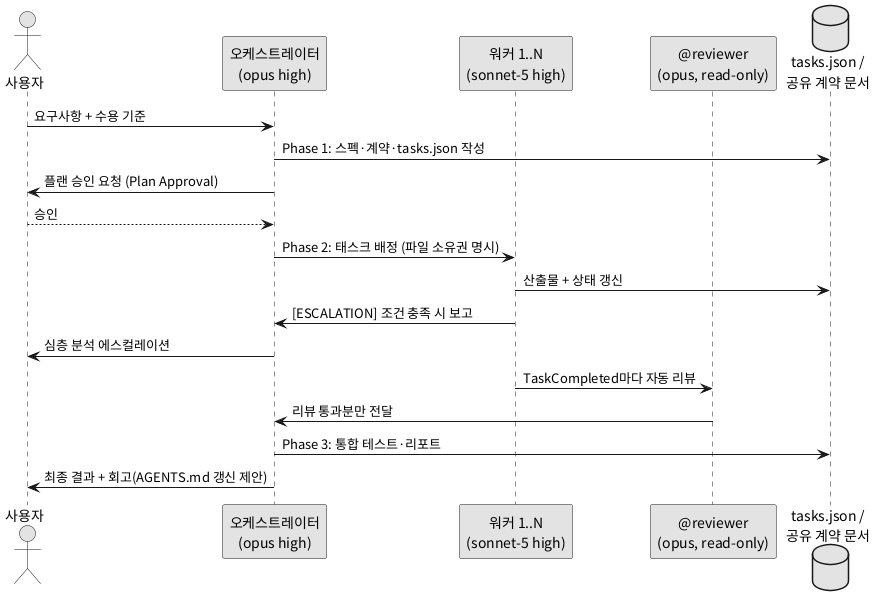

# orchestration.md — 멀티 에이전트 오케스트레이션 규칙

> 이 파일은 **어떤 프로젝트에도 그대로 복사해 쓸 수 있는 범용 오케스트레이션 규칙**이다.
> 위치: `.claude/rules/orchestration.md` (또는 CLAUDE.md에서 `@.claude/rules/orchestration.md`로 참조)
>
> 참고: `.claude/rules/`의 공식 frontmatter 필드는 `paths:` 하나뿐이다. 이 파일은 전역 적용이므로 frontmatter를 생략한다.

---

## 0. 목적

여러 에이전트(서브에이전트 / Agent Teams / Dynamic Workflows)를 띄울 때
**모델 라우팅, 작업 분해, 파일 소유권, 품질 게이트, 종료 기준**을 하나의 규칙으로 고정한다.
목표는 속도가 아니라 **검증 가능한 산출물**이다. 병목은 코드 생성이 아니라 검증(Verification)에 있다.

---

## 1. 모델·추론 정책 (MODEL ROUTING)

모든 태스크에 가장 비싼 모델을 쓰지 않는다. 역할별로 라우팅한다.

| 역할 | 모델 | effort | 비고 |
| --- | --- | --- | --- |
| 오케스트레이터(메인 세션) | opus | high | 작업 분해·결과 종합·판단 담당 |
| **ultracode / workflow로 스폰되는 워커** | **sonnet-5** | **high** | 구현·마이그레이션·테스트 작성 |
| 읽기 전용 리뷰어(@reviewer) | opus | high | lint·테스트·보안 스캔 도구만 허용 |
| 포매팅·단순 변환 | haiku | low | 기계적 작업 |

**에스컬레이션 규칙 (필수):**
- 워커(sonnet-5)가 다음 상황을 만나면 **작업을 멈추고 사용자에게 심층 분석을 에스컬레이션**한다. 임의 판단으로 진행 금지.
  1. 아키텍처/공유 계약(API 스키마·인터페이스·DB 마이그레이션) 변경이 필요할 때
  2. 동일 오류로 3회 이상 교착됐을 때
  3. 스펙과 실제 코드가 충돌해 스펙 해석이 갈릴 때
  4. 삭제·마이그레이션 등 되돌리기 어려운 변경이 필요할 때
- 에스컬레이션 보고 형식: `[ESCALATION] 무엇이 막혔나 / 시도한 것 / 선택지 A·B / 권장안과 근거`

---

## 2. 패턴 선택 — 3단 질문

병렬화 전에 반드시 이 순서로 답한다. **단일 세션이 정답인 경우가 생각보다 많다.**

```
Q1. 누가 조율하나?
    - 내가 각 대화에 머문다        → 직접 병렬 세션 (+ git worktree)
    - 던져놓고 나중에 확인          → 백그라운드 세션 (claude --bg / /bg)
    - Claude가 한 무리를 지휘       → Agent Teams
    - 조율 로직을 코드가 보유       → Dynamic Workflows (ultracode/workflow)

Q2. 작업자끼리 대화해야 하나?
    - 아니오, 보고만 받으면 됨      → 서브에이전트 (기본값)
    - 예, 발견 공유·상호 반박 필요  → Agent Teams

Q3. 같은 파일을 건드리나?
    - 예                          → worktree 격리 또는 파일 소유권 분할 (필수)
```

| 상황 | 권장 패턴 |
| --- | --- |
| 대부분의 위임 (탐색·리뷰·테스트) | 서브에이전트 — 항상 여기서 시작 |
| 수백 파일 기계적 마이그레이션 | Dynamic Workflows (`ultracode` 키워드) |
| 서로 무관한 작업 여러 개 | 백그라운드 세션 (멀티플렉싱) |
| 의존성 있는 교차 도메인 변경 | Agent Teams (`CLAUDE_CODE_EXPERIMENTAL_AGENT_TEAMS=1`) |
| 규칙 명확한 대량 변경 + 개별 PR | `/batch` (5~30 worktree 서브에이전트) |

**금지:** 순차 의존 작업의 병렬화, 같은 파일 동시 수정, 리뷰 속도를 초과하는 동시 실행.

---

## 3. 작업 분해와 파이프라인 (PHASE 설계)

의존성 분석 → 순차/병렬 구간 식별 → Phase로 변환한다.

```
Phase 1 (순차, 오케스트레이터 단독): 스펙·아키텍처 확정
    산출물: architecture.md, api-spec.yaml, tasks.json
    완료 기준: tasks.json에 모든 태스크 정의 + 수용 기준(acceptance criteria) 포함

Phase 2 (병렬, 워커 3~5개): 모듈별 구현
    각 워커 입력: tasks.json의 담당 섹션 + 공유 계약 문서만
    각 워커 산출물: 담당 디렉토리 코드 + 테스트 + 완료 보고

Phase 3 (순차, 오케스트레이터 + 리뷰어): 통합·검증
    통합 테스트, 리뷰 리포트, 문서 갱신
```

**규칙:**
- 에이전트 간 통신은 **항상 파일 기반**. 직접 메모리 공유는 없다.
- 공유 계약(API 스키마·인터페이스)은 **Phase 1에서 먼저 합의**한다. 각 워커가 따로 발명하면 통합이 실패한다.
- **파일 하나에 오너 하나.** 두 에이전트가 같은 파일을 편집하지 않는다.
- 동시 워커는 **3~5개가 최적점**. 집중된 3개가 산만한 5개보다 낫다.
- 서브에이전트는 자기 서브에이전트를 못 띄운다. 워커 `tools`에 Task(Agent)를 넣지 않는다.

**tasks.json 최소 스키마:**

```json
{
  "pipeline_id": "feature-x-2026-07-05",
  "phases": {
    "phase_2": {
      "workers": [
        {
          "agent": "backend-builder",
          "task": "src/api/ 구현",
          "owns": ["src/api/**"],
          "depends_on": ["phase_1"],
          "status": "pending",
          "acceptance": "테스트 통과 + api-spec.yaml 준수"
        }
      ]
    }
  }
}
```

[전체 파이프라인 흐름도 — 아래 PlantUML 사용]



---

## 4. 품질 게이트 (신뢰하되 검증하라)

세 가지 게이트를 모두 통과해야 완료다.

1. **플랜 승인(Plan Approval):** 워커는 코딩 전 플랜을 작성하고 오케스트레이터(위험 변경은 사용자)가 승인한다. 나쁜 플랜 수정이 나쁜 코드 수정보다 훨씬 싸다.
2. **훅(Hooks):** `TaskCompleted` 시 lint·테스트 자동 실행, 실패 시 완료 표시 차단. `TeammateIdle` 시 전체 테스트 통과 확인. 훅은 stdin JSON으로 데이터를 받고, exit 2로 차단한다.
3. **읽기 전용 리뷰어:** 빌더 3~4명당 리뷰어 1명. 리뷰어는 Read/Grep/Glob + 검사 도구만 허용, 파일 수정 금지. 오케스트레이터는 **리뷰 통과 코드만** 수신한다.

**Dynamic Workflows 주의:** 워크플로우 서브에이전트는 세션 권한 모드와 무관하게 **acceptEdits로 동작해 파일 편집이 자동 승인**된다. 대규모 실행 전 브랜치 분리 필수.

---

## 5. 루프 가드레일과 종료 기준

- `MAX_ITERATIONS=8`: 워커별 재시도 상한. 각 재시도 전 반성 프롬프트 강제 — "무엇이 실패했나? 어떤 구체적 변경이 수정을 가져오나? 같은 접근을 반복 중인가?"
- **동일 오류 3회 교착 → 종료 후 에스컬레이션** (1절 규칙). 새 에이전트 재배정은 사용자 승인 후.
- 토큰 예산: 워커별 상한 설정, 예산 85% 도달 시 자동 일시정지 + 보고.
- 항상 **피처 브랜치**에서 작업. 병합 전 인간 리뷰는 선택이 아니라 안전 시스템이다.
- 에러 유형별 처리:

| 에러 유형 | 처리 | 재시도 |
| --- | --- | --- |
| 일시적(네트워크·타임아웃) | 자동 재시도, 10초 대기 | 3회 |
| 논리적(스펙 모호) | 에스컬레이션 후 대기 | 1회 후 중단 |
| 병렬 구간 일부 실패 | 나머지 계속, tasks.json에 failed 기록 | Phase 3에서 판단 |
| 아키텍처 변경 필요 | Phase 1부터 재시작 | 사용자 결정 |

---

## 6. 복합 학습 — AGENTS.md / CLAUDE.md 규칙

- 세션에서 발견한 패턴·주의사항은 매 태스크 후 `REFLECTION.md`에 기록: "놀라웠던 것 1개 / AGENTS.md 추가 후보 1개 / 프롬프트 개선 1개".
- **에이전트가 AGENTS.md(CLAUDE.md)에 직접 쓰는 것을 금지한다.** 사람이 모든 줄을 승인 후 병합한다. LLM이 생성한 컨텍스트 파일은 성공률을 오히려 떨어뜨린다는 연구가 있다(ETH Zurich, Gloaguen et al.).
- AGENTS.md는 간결하게 4개 섹션으로 유지: `STYLE / GOTCHAS / ARCH_DECISIONS / TEST_STRATEGY`.

---

## 7. 워커 정의 템플릿

`.claude/agents/backend-builder.md` 예시 (범용 — 이름·디렉토리만 프로젝트에 맞게 수정):

```markdown
---
name: backend-builder
description: >
  오케스트레이터가 할당한 백엔드 태스크를 격리된 worktree에서 구현한다.
  tasks.json에 backend 태스크가 배정됐을 때 사용.
tools: Read, Glob, Grep, Bash, Edit, Write
model: sonnet
isolation: worktree
---

할당된 디렉토리에서만 작업한다.
공유 스키마·마이그레이션·lockfile·루트 설정은 명시 할당 없이 수정 금지.
코딩 전 플랜을 작성해 승인받는다.
완료 전 대상 테스트를 실행하고, 변경 파일·테스트 결과·미해결 리스크를 보고한다.
[ESCALATION] 조건(계약 변경 / 3회 교착 / 스펙 충돌 / 비가역 변경) 충족 시 즉시 멈추고 보고한다.
```

> 안티패턴: "developer-agent"처럼 리뷰·수정·테스트·배포를 다 하는 만능 에이전트 금지.
> **결과(outcome) 단위로 분리**하고, description에는 페르소나가 아니라 **호출 조건**을 쓴다.

---

## 8. 실행 체크리스트 (매 오케스트레이션 시작 전)

- [ ] 이 작업이 독립 조각으로 쪼개지는가? (아니면 단일 세션)
- [ ] 공유 계약을 먼저 합의했는가?
- [ ] 각 워커의 파일 소유권이 겹치지 않는가?
- [ ] 플랜 승인 게이트가 설정됐는가?
- [ ] TaskCompleted 훅(lint·테스트)이 걸려 있는가?
- [ ] 워커 모델이 sonnet-5 / effort high로 고정됐는가? (frontmatter `model:`을 repo에 커밋)
- [ ] 종료 기준(3회 교착·토큰 85%)과 에스컬레이션 경로가 명시됐는가?
- [ ] 피처 브랜치인가?

---
