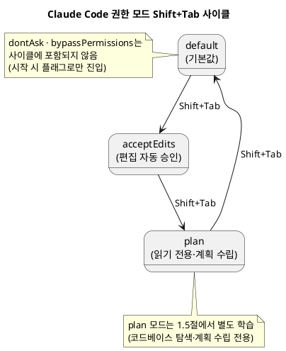
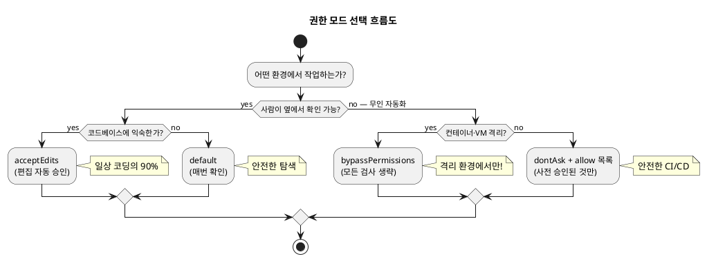
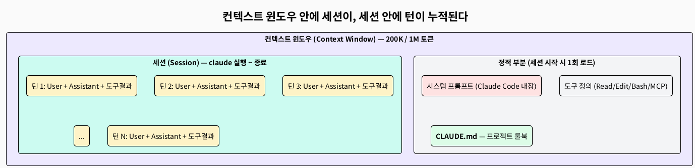
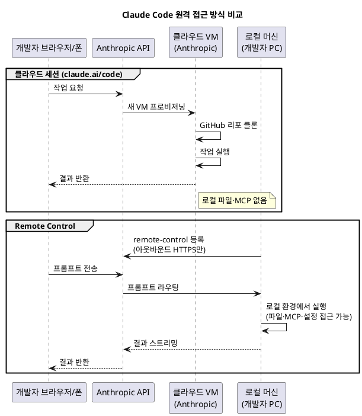

# LEVEL 1 — 환경 구축과 클로드 코드 기본 설정

> **강의 대상**: 실무 개발자 (입문 ~ 시니어)  
> **참고 리포지토리**: [github.com/claude-code-expert/inflearn-docs](https://github.com/claude-code-expert/inflearn-docs)  
> **공식 문서**: [code.claude.com/docs/en/overview](https://code.claude.com/docs/en/overview)  
> **학습 목표**: Hello World 출력까지 — Git, 터미널, Claude Code 설치, 설정 파일, 첫 세션을 한 번에 마무리

---

## 1.1 Github와 Terminal 명령어의 이해

Claude Code는 **로컬 파일시스템 + Git + 셸**을 직접 다루는 도구다. Git이 없으면 변경사항을 안전하게 되돌릴 수 없고, 터미널 사용이 익숙하지 않으면 Claude Code가 출력하는 메시지를 제대로 해석하기 어렵다. 본 절에서는 강의의 모든 실습에서 사용할 **GitHub 계정 · 터미널 · Git 명령어**의 최소 세트를 준비한다.

> **참고**: 본 강의는 개발자(입문~시니어)를 대상으로 하므로 본 절은 핵심만 다룬다. Git 심화·터미널 고급 사용법은 별도 교육자료로 제공된다.

---

### 1.1.1 Github 가입 및 Repository 개설

#### 왜 GitHub인가

| 용도 | 본 강의에서의 역할 |
|------|-----------------|
| **코드 백업·버전 관리** | Claude Code가 작업한 결과물을 안전하게 보관 |
| **Claude Code on the Web** | 클라우드 세션이 GitHub 리포지토리를 클론해 실행 (1.5.6) |
| **Code Review · Routines** | GitHub PR 단위로 Claude의 자동 리뷰·자동화 실행 |
| **협업** | settings.json, CLAUDE.md, agents/ 등을 팀과 공유 (1.4) |

#### GitHub 계정 생성

1. [github.com](https://github.com) 접속 → `Sign up` 클릭
2. 이메일 입력 → 비밀번호 설정 → 사용자명(Username) 입력
3. 이메일 인증 완료
4. (선택) 2단계 인증(2FA) 활성화 — `Settings → Password and authentication → Two-factor authentication`

> **권장**: 본 강의 리포지토리(`github.com/claude-code-expert/inflearn-docs`)를 **Star/Watch**해 두면 강의 자료 업데이트 알림을 받을 수 있다.

[스크린샷 영역: GitHub 가입 화면 — 이메일·비밀번호·사용자명 입력 폼]

#### 첫 Repository 개설

상단 우측 `+` 아이콘 → `New repository`

| 필드 | 권장 값 | 이유 |
|------|--------|------|
| Repository name | `claude-code-practice` | 강의 실습 통합 리포 |
| Description | (선택) `Claude Code 실전 마스터 클래스 실습` | 본인 참고용 |
| Public / Private | **Private** | 학습 코드는 공개하지 않는 것이 안전 |
| Add a README file | ✅ | 첫 커밋이 자동 생성됨 |
| Add .gitignore | `Node` (TypeScript 실습) | 불필요 파일 추적 방지 |
| Choose a license | (선택) `MIT` | 향후 공개 시 라이선스 명확화 |

`Create repository` 클릭 → 리포지토리 URL이 생성된다. 이 URL은 다음 절(1.1.4)에서 `git clone`할 때 사용한다.

[스크린샷 영역: New repository 생성 폼 — name/Private/README 체크 표시]

#### Personal Access Token (PAT) 발급 — HTTPS 인증용

GitHub은 2021년 8월부터 비밀번호 기반 HTTPS 푸시를 차단하므로, **Personal Access Token**을 발급받아야 한다.

1. `Settings → Developer settings → Personal access tokens → Tokens (classic)` → `Generate new token (classic)`
2. Note: `claude-code-practice`
3. Expiration: `90 days` (보안상 무한 만료는 비권장)
4. Scopes: `repo` 체크 (전체 리포 제어 권한)
5. `Generate token` 클릭 → **표시되는 토큰을 즉시 복사하여 안전한 곳에 저장** (페이지를 벗어나면 다시 볼 수 없음)

[스크린샷 영역: PAT 생성 화면 — Scopes의 repo 체크박스 강조]

> **대안: SSH 키 사용**  
> 매번 토큰을 입력하기 번거롭다면 SSH 키 방식을 권장한다. SSH 설정은 별도 교육자료(`docs/git-ssh-setup.md`)에서 다룬다.  
> 공식 가이드: [docs.github.com/authentication/connecting-to-github-with-ssh](https://docs.github.com/en/authentication/connecting-to-github-with-ssh)

---

### 1.1.2 터미널 설정 — Windows

Windows 환경에서는 두 가지 선택지가 있다.

| 옵션 | 사용 환경 | 권장 대상 |
|------|---------|---------|
| **Windows Terminal + PowerShell** | Windows 네이티브 | 빠른 시작, 일반 사용자 |
| **WSL2 + Ubuntu** | Linux 호환 환경 | macOS/Linux 호환성 중시, 본격 개발 |

> **본 강의의 기본 선택**: 두 환경 모두 Claude Code가 정상 동작한다. WSL2를 선택하면 macOS 사용자와 동일한 명령어를 쓸 수 있어 강의 진행이 매끄럽다.

#### 옵션 A — Windows Terminal 설치 (네이티브)

Windows 10 (2004 이상) 또는 Windows 11에서는 Microsoft Store에서 무료로 설치한다.

1. `Windows 키` → "Microsoft Store" 검색
2. "Windows Terminal" 검색 → 설치
3. 설치 후 `Windows 키` → "Terminal" 입력 → 실행

또는 PowerShell에서 `winget`으로 설치:

```powershell
winget install --id Microsoft.WindowsTerminal -e
```

[스크린샷 영역: Windows Terminal 첫 실행 화면 — PowerShell 탭 표시]

**기본 셸을 PowerShell 7로 변경 (권장)**

기본 PowerShell 5.1은 오래된 버전이므로 최신 PowerShell 7로 업그레이드한다.

```powershell
winget install --id Microsoft.PowerShell -e
```

Windows Terminal 상단 `∨` 아이콘 → `설정(Settings)` → `시작(Startup)` → `기본 프로필(Default profile)`을 `PowerShell`로 변경.

#### 옵션 B — WSL2 + Ubuntu 설치 (Linux 호환)

WSL2(Windows Subsystem for Linux 2)는 Windows 10/11에서 진짜 Linux 커널을 실행한다.

```powershell
# PowerShell을 관리자 권한으로 실행 후
wsl --install
```

이 명령 한 번으로:
- WSL2 활성화
- Ubuntu 22.04 LTS 자동 설치
- 재부팅 후 사용자 계정 설정

```bash
# WSL2 Ubuntu 첫 실행 후
sudo apt update && sudo apt upgrade -y
```

> WSL2 환경의 Claude Code 설치는 macOS와 동일한 절차로 진행한다 (1.2.1 참조).  
> 공식 가이드: [learn.microsoft.com/windows/wsl/install](https://learn.microsoft.com/en-us/windows/wsl/install)

#### Git for Windows 설치 (네이티브 PowerShell 사용 시 필수)

Claude Code는 **내부적으로 Git Bash를 사용하여 셸 명령을 실행**한다. WSL2를 쓰지 않는다면 반드시 Git for Windows를 설치해야 한다.

```powershell
winget install --id Git.Git -e
```

설치 옵션 중 다음을 확인한다:
- ✅ "Git from the command line and also from 3rd-party software" (PATH 등록)
- ✅ "Use Visual Studio Code as Git's default editor" (선호하는 에디터)
- ✅ "Override the default branch name for new repositories: main" (modern git default)

설치 확인:

```powershell
git --version
# git version 2.4x.x.windows.x
```

[스크린샷 영역: Git for Windows 설치 마법사 PATH 옵션 화면]

---

### 1.1.3 터미널 설정 — Mac iTerm

macOS는 기본 Terminal.app도 사용 가능하지만, 본 강의에서는 더 강력한 **iTerm2**를 권장한다.

#### iTerm2 설치

방법 1 — 공식 사이트: [iterm2.com](https://iterm2.com) → "Download" → `.zip` 압축 해제 → `/Applications`로 드래그

방법 2 — Homebrew (권장):

```bash
brew install --cask iterm2
```

> Homebrew가 설치되어 있지 않다면 다음을 먼저 실행:  
> `/bin/bash -c "$(curl -fsSL https://raw.githubusercontent.com/Homebrew/install/HEAD/install.sh)"`  
> 출처: [brew.sh/ko](https://brew.sh/ko)

#### iTerm2 권장 설정 4가지

`iTerm2 → Preferences (⌘,)` 또는 `Settings`

| 항목 | 설정 위치 | 권장 값 | 이유 |
|------|---------|--------|------|
| **무제한 스크롤백** | Profiles → Terminal | "Unlimited scrollback" 체크 | Claude Code 긴 출력 전체 확인 |
| **자연어 텍스트 편집** | Profiles → Keys → Key Mappings → Presets... → "Natural Text Editing" | 적용 | `Option+←/→` 단어 단위 이동 |
| **셸 통합** | Profiles → General → Command | "Login shell" | 환경변수 자동 로드 |
| **컬러 프리셋** | Profiles → Colors → Color Presets... | "Solarized Dark" 또는 "Tango Dark" | 가독성 향상 |

[스크린샷 영역: iTerm2 Preferences — Natural Text Editing 적용 화면]

#### 셸 확인 — zsh가 기본인지

macOS Catalina(10.15) 이후 기본 셸은 `zsh`다. 확인:

```bash
echo $SHELL
# /bin/zsh
```

bash가 출력된다면 zsh로 변경:

```bash
chsh -s /bin/zsh
```

#### tmux 설정 (선택 — 장시간 세션 보호용)

Claude Code를 장시간 실행할 때 터미널이 끊겨도 세션을 유지하려면 **tmux**를 활용한다.

```bash
# tmux 설치
brew install tmux

# 새 세션 시작
tmux new -s claude-session

# Claude Code 실행
claude

# 세션 분리 (백그라운드 유지)
Ctrl + B, D

# 세션 재연결
tmux attach -t claude-session

# 세션 목록 확인
tmux ls
```

> tmux는 옵션이다. 필수는 아니지만, 30분 이상 걸리는 자동 작업이나 SSH 환경에서 매우 유용하다.

---

### 1.1.4 터미널 명령어의 이해와 환경 설정

#### 필수 터미널 명령어 12개

Claude Code 학습 중 가장 자주 쓰는 명령들이다. macOS · Linux · WSL2 · Git Bash에서 모두 동일하다.

| 명령어 | 기능 | 예시 |
|--------|------|------|
| `pwd` | 현재 디렉토리 경로 출력 | `pwd` → `/Users/me/projects` |
| `ls -la` | 숨김 파일 포함 디렉토리 목록 | `ls -la ~/.claude` |
| `cd <경로>` | 디렉토리 이동 | `cd ~/projects/claude-code-practice` |
| `cd ..` | 상위 디렉토리 이동 | `cd ..` |
| `cd -` | 직전 디렉토리로 이동 | `cd -` |
| `mkdir <이름>` | 디렉토리 생성 | `mkdir my-project` |
| `mkdir -p <a/b/c>` | 중첩 디렉토리 한 번에 생성 | `mkdir -p .claude/agents` |
| `cp <원본> <대상>` | 파일 복사 | `cp settings.json settings.backup.json` |
| `mv <원본> <대상>` | 파일 이동/이름 변경 | `mv old.txt new.txt` |
| `rm <파일>` | 파일 삭제 (휴지통 없음, 즉시 삭제) | `rm tmp.txt` |
| `cat <파일>` | 파일 내용 출력 | `cat CLAUDE.md` |
| `echo $변수` | 환경변수 값 출력 | `echo $SHELL` |

> **주의**: `rm -rf /` 같은 명령은 **시스템 전체를 파괴**한다. Claude Code는 settings의 `deny` 규칙으로 이를 차단할 수 있다 (1.4.2 참조).

#### Git 명령어 핵심 10개

| 명령어 | 기능 |
|--------|------|
| `git init` | 현재 디렉토리를 Git 리포로 초기화 |
| `git clone <URL>` | 원격 리포지토리 복제 |
| `git status` | 변경된 파일 목록 확인 |
| `git diff` | 변경 내용(diff) 확인 |
| `git add <파일>` / `git add .` | 스테이징 |
| `git commit -m "메시지"` | 커밋 생성 |
| `git push origin main` | 원격 푸시 |
| `git pull` | 원격 변경사항 가져오기 |
| `git log --oneline` | 커밋 히스토리 한 줄 보기 |
| `git checkout -b <브랜치>` | 새 브랜치 생성 후 이동 |

#### 첫 환경 설정 — Git 사용자 정보 등록

본인 PC에서 **최초 1회만** 실행한다.

```bash
git config --global user.name "Your Name"
git config --global user.email "your-email@example.com"

# 기본 브랜치명을 main으로 설정 (modern git default)
git config --global init.defaultBranch main

# pull 시 fast-forward만 허용 (안전)
git config --global pull.ff only

# 설정 확인
git config --list --global
```

#### 첫 워크플로우 — 1.1.1에서 만든 리포지토리 클론하기

```bash
# 작업 폴더 생성
mkdir -p ~/projects
cd ~/projects

# 본인의 리포지토리 클론 (URL은 GitHub 리포지토리 페이지의 "Code" → "HTTPS"에서 복사)
git clone https://github.com/<USERNAME>/claude-code-practice.git
cd claude-code-practice

# 현재 상태 확인
git status
ls -la
```

처음 `git push`를 시도하면 사용자명과 비밀번호를 묻는다. **비밀번호 자리에 1.1.1에서 발급한 Personal Access Token을 붙여넣는다**.

```bash
# 빈 커밋으로 push 테스트
echo "# claude-code-practice" >> README.md
git add README.md
git commit -m "chore: initial commit"
git push origin main
# Username for 'https://github.com': <USERNAME>
# Password for 'https://...': <PAT 붙여넣기 — 화면에는 표시 안 됨>
```

#### 셸 환경변수 파일

Claude Code 설정을 영구적으로 적용하려면 셸 환경변수를 등록한다. 시스템별로 파일이 다르다.

| OS / 셸 | 환경변수 파일 |
|---------|-------------|
| macOS (zsh, 기본) | `~/.zshrc` |
| WSL2 / Ubuntu (bash) | `~/.bashrc` |
| Windows PowerShell | `$PROFILE` 변수가 가리키는 경로 |

```bash
# macOS / WSL2 / Linux 공통 예시
# ~/.zshrc 또는 ~/.bashrc 끝에 추가

# Claude Code 기본 모델
export ANTHROPIC_MODEL="claude-sonnet-4-6"

# 편의 alias
alias cc="claude"
alias ccp="claude -p"

# 변경 사항 즉시 반영
source ~/.zshrc   # 또는 source ~/.bashrc
```

```powershell
# Windows PowerShell — $PROFILE 편집
notepad $PROFILE

# 파일에 추가
$env:ANTHROPIC_MODEL = "claude-sonnet-4-6"
Set-Alias cc claude
```

> 환경변수 전체 목록은 1.4.3에서 다룬다.

---

## 1.2 Claude Code 개요

Claude Code는 Anthropic이 개발한 **터미널 네이티브 AI 코딩 에이전트**다. IDE 플러그인이나 브라우저 챗봇과 달리, **로컬 파일시스템 · 셸 · Git에 직접 접근**하여 실제 개발 워크플로우 안에서 동작한다.

### Claude Code의 핵심 특징

- 터미널(CLI)에서 직접 실행되며 로컬 파일을 읽고 쓴다
- VS Code, IntelliJ 등 IDE의 확장 플러그인으로도 사용 가능
- `claude.ai/code` 웹 인터페이스 및 모바일 앱과 연동 (Remote Control, 1.5.6)
- MCP(Model Context Protocol)를 통해 외부 서비스와 통합
- CLAUDE.md를 통해 프로젝트 컨텍스트를 세션 간 유지

[스크린샷 영역: Claude Code 터미널 첫 실행 화면 전체]

---

### 1.2.1 macOS 설치 (npm · Homebrew)

#### 사전 요구사항

Claude Code를 설치하기 전에 다음 두 가지를 먼저 확인한다.

```bash
node --version   # v22.x 권장 (v20 미만이면 업그레이드 필요)
git --version    # v2.5x 이상
```

Node.js가 없다면 [nodejs.org](https://nodejs.org)에서 LTS 버전을 설치한다. 설치 시 npm이 함께 설치된다.  
Git이 없다면 다음 방법으로 설치한다.

```bash
# macOS — Xcode Command Line Tools (Git 포함)
xcode-select --install

# macOS — Homebrew로 설치
brew install git
```

설치 후 Git 사용자 정보 등록은 1.1.4에서 이미 마쳤다.

#### 공식 설치 스크립트 (권장)

```bash
curl -fsSL https://claude.ai/install.sh | bash
```

이 명령은 Anthropic 공식 서버에서 설치 스크립트를 다운로드해 자동 실행한다. 설치가 완료되면 셸 설정을 다시 로드한다.

```bash
# zsh 사용자 (macOS 기본)
source ~/.zshrc

# bash 사용자
source ~/.bashrc
```

[스크린샷 영역: 설치 완료 메시지 터미널 화면]

#### Homebrew로 설치

```bash
brew install --cask claude-code
```

#### npm으로 설치 (대안)

```bash
npm install -g @anthropic-ai/claude-code
```

> **권장 순서**: 공식 설치 스크립트 > Homebrew > npm  
> 공식 스크립트는 자동 업데이트를 지원하며, Node.js 의존성이 없어 가장 안정적이다.

#### 설치 확인

```bash
claude --version
# 예시 출력: 2.1.x (Claude Code)
```

버전 번호가 출력되면 정상 설치 완료다.

---

### 1.2.2 Windows 설치 (WinGet · PowerShell)

#### 공식 설치 스크립트 (PowerShell)

PowerShell을 관리자 권한으로 실행한 뒤 다음 명령을 입력한다.

```powershell
irm https://claude.ai/install.ps1 | iex
```

[스크린샷 영역: Windows PowerShell 설치 명령 실행 화면]

설치가 완료되면 `Location` 항목에 표시된 경로(예: `C:\Users\[사용자]\.local\bin`)를 복사한다.

#### 환경 변수(Path) 설정

1. `Windows 버튼 + R` → `sysdm.cpl` 입력 → [확인]
2. [고급] 탭 → [환경 변수] 클릭
3. 사용자 변수 목록에서 `Path` 선택 → [편집]
4. [새로 만들기] → 복사한 경로 붙여넣기 → [확인]

[스크린샷 영역: Windows 환경 변수 Path 편집 화면]

#### 설치 확인

기존 PowerShell 창을 닫고 **새 PowerShell**을 열어 확인한다.

```powershell
claude --version
```

#### WinGet으로 설치

```powershell
winget install --id Anthropic.ClaudeCode -e --source winget
```

> **참고**: WinGet은 Windows 10 1709 이상에서 Microsoft Store를 통해 제공된다.  
> 출처: [code.claude.com/docs/en/setup](https://code.claude.com/docs/en/setup)

#### WSL2 환경

WSL2를 쓰는 경우 macOS와 동일한 공식 스크립트로 설치한다.

```bash
curl -fsSL https://claude.ai/install.sh | bash
source ~/.bashrc
claude --version
```

---

### 1.2.3 Opus 4.7 · Sonnet 4.6 · Haiku 4.5 비교 · 용도별 모델 선택 가이드, 요금제 비교

#### 모델 계열 개요

Anthropic의 Claude 모델은 세 계열로 구분된다.

- **Opus**: 시니어 아키텍트 — 가장 강력한 추론, 복잡한 에이전트 워크플로
- **Sonnet**: 실무 개발자 — 성능과 비용의 균형, 일상적인 개발 작업
- **Haiku**: 민첩한 팀원 — 최고 속도, 경량 모델, 서브에이전트

#### 2026년 5월 기준 최신 모델 라인업

> 출처: [platform.claude.com/docs/en/about-claude/models/overview](https://platform.claude.com/docs/en/about-claude/models/overview)

| 특성 | **Opus 4.7** | **Sonnet 4.6** | **Haiku 4.5** |
|------|-------------|---------------|--------------|
| 포지셔닝 | 최고 지능, 프리미엄 | 지능과 속도의 균형 | 초고속, 경량 |
| 모델 ID | `claude-opus-4-7` | `claude-sonnet-4-6` | `claude-haiku-4-5-20251001` |
| 최대 출력 | 128K 토큰 | 64K 토큰 | 64K 토큰 |
| 컨텍스트 | **1M 토큰** | **1M 토큰** | 200K 토큰 |
| 입력 비용 | $5 / 1M 토큰 | $3 / 1M 토큰 | $1 / 1M 토큰 |
| 출력 비용 | $25 / 1M 토큰 | $15 / 1M 토큰 | $5 / 1M 토큰 |
| 응답 속도 | 보통 | 빠름 | 가장 빠름 |

> **참고**: Opus 4.7 · Sonnet 4.6의 1M 컨텍스트는 200K 초과분에 추가 요금이 부과된다.

**모델 출시 타임라인**

```
2025-09-29  Sonnet 4.5 출시
2025-10-15  Haiku 4.5 출시
2025-11-24  Opus 4.5 출시
2026-02-05  Opus 4.6 출시 (Adaptive Thinking 최초 도입)
2026-02-17  Sonnet 4.6 출시
2026-04-16  Opus 4.7 출시 (xhigh effort, 고해상도 비전, Task Budgets)
```

**각 모델 특징**

**Opus 4.7** *(현재 최신 플래그십)*  
2026년 4월 16일 출시. SWE-bench Verified 87.6%, Terminal-Bench 2.0 69.4%로 Opus 4.6 대비 전 항목에서 향상됐다. 고해상도 이미지(2,576px / 3.75MP, 기존 대비 3.3배), `xhigh` effort 레벨 신규 추가, Extended Thinking budgets 완전 제거 후 Adaptive Thinking 단일화, 자체 출력 검증(self-verification) 동작이 특징이다. Opus 4.6과 가격 동일.

> **주의**: Opus 4.7은 `temperature`, `top_p`, `top_k` 파라미터를 제거했다 (설정 시 400 에러). API로 직접 사용하는 경우 마이그레이션 필요.

**Sonnet 4.6** *(대부분의 일상 개발 작업에 권장)*  
SWE-bench Verified 79.6%로 Opus 4.6(80.8%)과 1.2%p 차이에 불과하면서 비용은 40% 저렴하다. 1M 토큰 컨텍스트를 지원하며 Adaptive Thinking도 지원한다.

**Haiku 4.5**  
SWE-bench Verified 73.3%로 경량 모델 최고 수준의 코딩 성능을 보인다. 서브에이전트 오케스트레이션, 실시간 애플리케이션에 적합하다. 컨텍스트는 200K.

#### Claude Code 플랜별 기본 모델

| 플랜 | 기본 모델 |
|------|---------|
| Max / Team Premium | **Opus 4.7** |
| Pro / Team Standard | Sonnet 4.6 |
| Enterprise / Anthropic API | Opus 4.7 (2026-04-23 변경 적용) |
| Bedrock / Vertex / Foundry | Sonnet 4.5 |

> 출처: [code.claude.com/docs/en/model-config](https://code.claude.com/docs/en/model-config)

#### 요금제 비교

| 플랜 | 월 요금 | 특징 |
|------|--------|------|
| **Pro** | $20 | 일반적인 사용, 기본 모델 Sonnet 4.6 |
| **Max $100** | $100 | 높은 사용량, 기본 모델 Opus 4.7 |
| **Max $200** | $200 | Pro 대비 20배 사용량, 트래픽 우선 접근 |
| **Team** | $30 / 인 | 팀 협업, Standard/Premium 시트 구분 |
| **Enterprise** | 별도 문의 | SSO, 컴플라이언스, 관리형 정책 |

> 상세 요금: [claude.com/pricing/max](https://claude.com/pricing/max)

**로그인 방식 비교**

Claude Code 첫 실행 시 인증 방식을 선택한다.

| 항목 | ① Claude.ai 구독 | ② Anthropic Console (API) |
|------|-----------------|--------------------------|
| 과금 방식 | 월 정액 (사용량 포함) | 종량제 (토큰당 과금) |
| 크레딧 충전 | 불필요 | 사전 충전 필요 |
| 지원 플랜 | Pro / Max / Team / Enterprise | API Key 발급 계정 |
| 용도 | 개인·팀 구독자 | API 개발, 자동화 파이프라인 |

> AWS Bedrock, GCP Vertex AI 등 클라우드 프로바이더 인증은 7레벨에서 다룬다.  
> 출처: [code.claude.com/docs/en/authentication](https://code.claude.com/docs/en/authentication)

처음 시작하는 경우 **월 결제 Pro 플랜**으로 시작해 사용량 추이를 확인한 후 업그레이드하는 것을 권장한다.

#### 용도별 모델 선택 가이드

| 모델 | 권장 상황 | 예시 |
|------|---------|------|
| Opus 4.7 | 복잡한 설계·분석·의사 결정 | 아키텍처 설계, 대규모 리팩터링, 레거시 분석 |
| Sonnet 4.6 | 일반 개발 (기본값 권장) | 기능 구현, 버그 수정, API 설계, 테스트 작성 |
| Haiku 4.5 | 빠른 프로토타입·간단한 작업 | 간단한 수정, 구문 오류, 서브에이전트 |

**하이브리드 전략: `opusplan` alias 활용**

공식 문서에서 제공하는 `opusplan` alias를 사용하면 Plan 모드는 Opus, 실행은 Sonnet으로 **자동 전환**된다. 수동으로 모델을 바꿀 필요 없이 비용과 성능을 동시에 챙길 수 있다.

```bash
/model opusplan   # Plan 모드 → Opus 4.7, 실행 모드 → Sonnet 4.6 자동 전환
```

수동 하이브리드 전략:
```
① /model opus     — Plan Mode에서 아키텍처 분석
② /model sonnet   — 기능 구현
③ /model haiku    — 빠른 수정·서브에이전트
④ /model opus     — 최종 코드 리뷰·최적화
```

**모델 전환 방법 (우선순위 순)**

```bash
# ① 세션 중 명령어 (즉시 적용, 재시작 후에도 유지됨)
/model            # picker UI 열기
/model sonnet     # Sonnet 4.6으로 전환 (소문자 alias)
/model haiku      # Haiku 4.5로 전환
/model opus       # Opus 4.7로 전환
/model opusplan   # Plan→Opus / 실행→Sonnet 자동 전환
/model best       # 현재 가장 능력 있는 모델 (= opus)
/model claude-opus-4-7   # 버전 고정 시 full name 사용

# ② 시작 시 플래그 (해당 세션만 적용)
claude --model sonnet
claude --model claude-opus-4-7

# ③ 환경 변수 (셸 전체 기본값)
# ~/.bashrc 또는 ~/.zshrc에 추가
export ANTHROPIC_MODEL="claude-sonnet-4-6"

# ④ settings.json (프로젝트/전역 영구 설정)
# .claude/settings.json
{
  "model": "sonnet"
}
```

우선순위: **세션 `/model` > `--model` 플래그 > `ANTHROPIC_MODEL` 환경변수 > settings 파일**

> `opus` alias는 Anthropic API에서 Opus 4.7로 resolve된다. Bedrock/Vertex/Foundry에서는 Opus 4.6으로 resolve되므로 버전 고정이 필요하면 full name(`claude-opus-4-7`)을 사용한다.

[모델 선택 의사결정 흐름도: "작업이 복잡한가?" → YES → "아키텍처·대규모 리팩터링?" → YES → Opus 4.7 / NO → Sonnet 4.6 / NO → "간단한 수정·서브에이전트?" → YES → Haiku 4.5 / NO → Sonnet 4.6]

---

### 1.2.4 Extended Thinking 모드 — `/effort` 추론 강도 조절

#### Adaptive Thinking과 Effort 개요

Claude Code에서 추론 깊이를 제어하는 메커니즘은 **Effort 레벨**이다. Effort는 모델이 각 스텝에서 얼마나 깊이 생각할지를 결정하며, 낮을수록 빠르고 저렴하고 높을수록 더 깊은 추론을 수행한다.

| 구분 | 낮은 Effort | 높은 Effort |
|------|-----------|-----------|
| 응답 속도 | 빠름 | 느림 |
| 토큰 사용량 | 적음 | 많음 |
| 적합한 작업 | 단순 수정, 빠른 조회 | 복잡한 설계, 디버깅, 에이전트 루프 |

> **비용 주의**: thinking 토큰도 출력 토큰으로 과금된다.  
> `총 출력 비용 = thinking 토큰 + 실제 응답 토큰`

#### 모델별 지원 Effort 레벨

공식 문서 기준 (v2.1.117+):

| 모델 | 지원 레벨 | 기본값 |
|------|---------|------|
| **Opus 4.7** | `low` · `medium` · `high` · `xhigh` · `max` | **`xhigh`** |
| **Opus 4.6** | `low` · `medium` · `high` · `max` | `high` |
| **Sonnet 4.6** | `low` · `medium` · `high` · `max` | `high` |

> Opus 4.7에만 있는 `xhigh`는 코딩·에이전트 작업에서 권장하는 기본값이다.  
> 지원하지 않는 레벨을 설정하면 해당 모델의 최대 지원 레벨로 자동 폴백된다 (예: Opus 4.6에 `xhigh` → `high`로 실행).

#### 각 Effort 레벨 가이드

| 레벨 | 적합한 상황 |
|------|-----------|
| `low` | 지연 시간이 중요한 단순 작업, 간단한 문법 수정 |
| `medium` | 비용 절감이 필요한 일반 작업, 약간의 성능 트레이드오프 허용 시 |
| `high` | 성능이 중요한 작업의 최솟값, 일반 개발 작업 |
| `xhigh` | 대부분의 코딩·에이전트 작업 (Opus 4.7 기본값, 권장) |
| `max` | 난이도 높은 작업에서 시도해볼 수 있으나 과도한 추론(overthinking) 위험. 세션 한정 적용 |

> `ultrathink` 키워드를 프롬프트에 포함하면 해당 턴에서만 더 깊이 추론하도록 힌트를 준다. effort 레벨 자체를 바꾸지는 않는다. (v2.1.68+ 재활성화)

#### Effort 설정 방법

```bash
# ① 세션 중 명령어 (즉시 적용)
/effort           # 레벨 선택 picker 열기
/effort xhigh     # Opus 4.7 코딩 작업 권장
/effort high      # 일반 작업
/effort low       # 빠른 응답 우선

# ② 환경 변수 (셸 기본값)
export CLAUDE_CODE_EFFORT_LEVEL=xhigh   # Opus 4.7 권장
export CLAUDE_CODE_EFFORT_LEVEL=high    # Opus 4.6 / Sonnet 4.6 기본
export CLAUDE_CODE_EFFORT_LEVEL=medium  # 비용 절감

# ③ settings.json (영구 설정)
{
  "effortLevel": "high"
}
```

> `max` 레벨은 환경 변수(`CLAUDE_CODE_EFFORT_LEVEL=max`)로 설정한 경우에만 세션 간 유지된다. 그 외에는 현재 세션에만 적용된다.

#### Opus 4.7의 Adaptive Thinking

Opus 4.7에서는 Extended Thinking budgets(`budget_tokens`)가 **완전히 제거**됐다. Adaptive Thinking만 지원하며, 이는 모델이 작업 복잡도에 따라 추론 깊이를 자동으로 결정한다. effort 레벨로 전반적인 추론 강도를 조절하면 된다.

```python
# Opus 4.7 API 사용 시 (breaking change)
# Before (Opus 4.6)
thinking = {"type": "enabled", "budget_tokens": 32000}  # ❌ 400 에러

# After (Opus 4.7)
thinking = {"type": "adaptive"}
output_config = {"effort": "xhigh"}  # ✅
```

> 출처: [code.claude.com/docs/en/model-config](https://code.claude.com/docs/en/model-config),  
> [platform.claude.com/docs/en/about-claude/models/whats-new-claude-4-7](https://platform.claude.com/docs/en/about-claude/models/whats-new-claude-4-7)

---

### 1.2.5 모델별 컨텍스트 윈도우 (200K vs 1M)

#### 컨텍스트 윈도우란

컨텍스트 윈도우는 Claude가 **하나의 요청에서 처리할 수 있는 최대 텍스트량**이다. 개발 실무에서는 대규모 코드베이스 분석, 긴 로그 파일 분석, 긴 대화 세션 유지 등에 직접 영향을 미친다.

#### 현재 모델별 컨텍스트 윈도우

| 모델 | 컨텍스트 | 대략적인 규모 |
|------|--------|------------|
| **Opus 4.7** | **1M 토큰** (정식) | ~2,500페이지 |
| **Sonnet 4.6** | **1M 토큰** (정식) | ~2,500페이지 |
| **Haiku 4.5** | 200K 토큰 | ~500페이지 |

> Opus 4.7과 Sonnet 4.6의 1M 컨텍스트는 **베타가 아닌 정식 지원**이다. 단, 200K 초과분에는 추가 요금이 부과된다 (표준 API 가격 기준 장문 프리미엄 없음).

**1M 토큰 컨텍스트 실제 활용**

- 대규모 코드베이스 전체를 단일 요청에 포함
- 수십 개의 문서·논문 동시 처리
- 긴 에이전트 루프에서 컨텍스트 압축 없이 유지
- 대형 로그 파일 전체 분석

**Claude Code에서 긴 컨텍스트 alias**

```bash
/model sonnet[1m]   # Sonnet 4.6 + 1M 컨텍스트 명시적 활성화
/model opus[1m]     # Opus 4.7 + 1M 컨텍스트 명시적 활성화
```

**컨텍스트 사용량 모니터링**

```bash
/context    # 현재 세션의 토큰 사용량 색상 그리드로 시각화
/status     # 현재 모델·effort·사용량 상세 정보
```

> 컨텍스트 윈도우의 실제 동작 원리(턴 · 세션 · 컨텍스트의 관계)는 **1.5.2**에서 다룬다.

---

## 1.3 개발환경 설정

본 절에서는 Claude Code를 일상 개발에 통합하는 데 필요한 IDE 통합, 실행 명령어, 권한 모드를 다룬다. **터미널 환경 자체의 설정**(iTerm, tmux 등)은 1.1에서 이미 마쳤다.

---

### 1.3.1 VS Code 확장 · IntelliJ 설치 및 플러그인

#### VS Code 설치

공식 다운로드: [code.visualstudio.com/Download](https://code.visualstudio.com/Download)

- **macOS**: 다운로드 후 `/Applications`에 이동, 또는 `brew install --cask visual-studio-code`
- **Windows**: 설치 시 "Add to PATH" 옵션 체크 필수

#### VS Code 화면 구조

[스크린샷 영역: VS Code 전체 화면 구조 — Activity Bar / Primary Side Bar / Editor Group / Secondary Side Bar / Command Center 레이블 포함]

| 영역 | 설명 |
|------|------|
| Activity Bar (좌측) | Explorer, Search, Source Control, Extensions 등 주요 기능 아이콘 |
| Primary Side Bar | Activity Bar에서 선택한 기능의 상세 내용 (폴더 트리 등) |
| Editor Group (메인) | 파일 편집 작업 공간 |
| Secondary Side Bar (우측) | Claude Code 채팅 인터페이스 |
| Command Center (최상단) | 명령어 팔레트 및 파일 검색 |

#### VS Code 필수 단축키

| 동작 | Windows/Linux | Mac |
|------|--------------|-----|
| 명령어 팔레트 | `Ctrl+Shift+P` | `Cmd+Shift+P` |
| 설정 (Preferences) | `Ctrl+,` | `Cmd+,` |
| Primary Side Bar 토글 | `Ctrl+B` | `Cmd+B` |
| Secondary Side Bar 토글 | `Ctrl+Alt+B` | `Cmd+Option+B` |
| 파일 빠른 열기 | `Ctrl+P` | `Cmd+P` |
| 파일 닫기 | `Ctrl+W` | `Cmd+W` |
| 코드 포맷팅 | `Shift+Alt+F` | `Shift+Option+F` |
| 전체 검색 | `Ctrl+Shift+F` | `Cmd+Shift+F` |
| 현재 파일 검색 | `Ctrl+F` | `Cmd+F` |
| Extension 패널 | `Ctrl+Shift+X` | `Cmd+Shift+X` |

#### 필수 Extension 목록

`Cmd+Shift+X`로 Extension 패널을 열고 다음 항목을 설치한다.

| Extension | 용도 | 핵심 사용 방법 |
|-----------|------|-------------|
| **Claude Code** | 클로드 코드 IDE 통합 | 상단 탭 아이콘 클릭 → Secondary Side Bar에 채팅 UI |
| **GitLens** | Git 히스토리·변경사항 추적 | 코드 라인에 마우스 올리면 커밋 정보 표시 |
| **Error Lens** | 인라인 에러 표시 | 설치 후 자동 동작, 에러가 해당 라인 옆에 표시 |
| **Prettier** | 코드 포맷팅 | `Shift+Option+F`, settings에 `"editor.formatOnSave": true` |
| **ESLint** | JS/TS 린팅 | `.eslintrc` 필요, 자동으로 코드 문제 표시 |
| **Markdown Preview Enhanced** | 마크다운 미리보기 | `.md` 파일에서 `Cmd+Shift+V` |
| **Live Server** | 로컬 개발 서버 | HTML 파일 우클릭 → "Open with Live Server" |

[스크린샷 영역: Claude Code Extension 설치 후 VS Code 전체 화면 — Activity Bar에 GitLens 아이콘, 상단 탭에 Claude Code 아이콘 표시]

#### Claude Code VS Code 인터페이스

Claude Code 아이콘 클릭 시 Secondary Side Bar에 채팅 인터페이스가 열린다.

[스크린샷 영역: Claude Code 채팅 인터페이스 — ① 세션 히스토리, ② New Session, ③ 편집 모드 선택, ④ @ 파일 지정, ⑤ Show command menu 각 항목 레이블 포함]

| 번호 | 항목 | 기능 |
|------|------|------|
| ① | 프롬프트 세션 히스토리 | 이전 프롬프트 선택 시 해당 위치로 이동 |
| ② | New Session | 새 Claude Code 세션 시작 |
| ③ | 편집 모드 | Edit Auto / Plan / Ask 모드 선택 (CLI의 Shift+Tab과 동일) |
| ④ | 파일 및 폴더 지정 | `@` 태그 후 파일/폴더 지정 |
| ⑤ | Show command menu | 슬래시 커맨드, MCP, 훅, 플러그인 등 기능 선택 |

#### IntelliJ 계열 플러그인

JetBrains의 모든 IDE(IntelliJ IDEA, PyCharm, WebStorm, Android Studio 등)에서 동일한 Claude Code 플러그인을 사용한다.

1. `File → Settings → Plugins` 검색창에 "Claude Code" 입력
2. Anthropic 공식 플러그인 설치
3. CLI와 사용법 동일, 커뮤니티 버전도 지원

> 출처: [code.claude.com/docs/en/ide-integrations](https://code.claude.com/docs/en/ide-integrations)

---

### 1.3.2 클로드 코드 실행 명령어와 기본적인 단축키, 줄바꿈 세팅

> 슬래시 커맨드 상세 내용은 **3레벨**에서 다룬다. 여기서는 초기 설정에 필요한 핵심만 정리한다.

#### 첫 실행 시 필수 명령어

```bash
# 프로젝트 루트에서 실행
cd ~/projects/claude-code-practice
claude

# 프로젝트 초기화 (CLAUDE.md 자동 생성) — 첫 세션 안에서 입력
/init
```

#### 자주 쓰는 CLI 플래그

| 명령어 | 기능 |
|-------|------|
| `claude` | 대화형 모드 진입 |
| `claude "프롬프트"` | 첫 프롬프트와 함께 시작 |
| `claude -p "프롬프트"` | 헤드리스(단일 명령) 모드 — 자동화·CI 용 |
| `claude -c` 또는 `claude --continue` | 마지막 세션 이어가기 |
| `claude -r` 또는 `claude --resume` | 세션 picker로 이전 세션 선택 |
| `claude --model sonnet` | 특정 모델로 시작 |
| `claude --remote "프롬프트"` | 클라우드 세션 시작 (1.5.6) |
| `claude --teleport` | 클라우드 세션을 로컬로 이전 (1.5.6) |
| `claude update` | Claude Code 자체 업데이트 |

> 헤드리스 모드와 대화형 모드의 차이는 **1.5.3**에서 상세히 다룬다.

#### 핵심 단축키 (대화형 모드)

| 단축키 | 기능 | 비고 |
|--------|------|------|
| `Esc` | Claude 응답 중단 | `Ctrl+C`보다 권장 |
| `Esc + Esc` | 이전 메시지로 되돌아가기 | 잘못 보낸 메시지 수정 |
| `Ctrl+C` | 현재 세션 종료 | 응답 중단에는 Esc 권장 |
| `Shift+Tab` | 권한 모드 전환 | 1.3.3 참조 |
| `Option+T` (macOS) | Thinking 모드 토글 | `Alt+T` (Windows/Linux) |
| `Ctrl+L` | 터미널 화면 정리 | 출력 내용 지우기 |
| `↑ / ↓` | 이전/다음 명령어 히스토리 | |
| `Ctrl+R` | 명령어 히스토리 검색 | |

> 단축키 활용 패턴은 **1.5.5**에서 실전 시나리오로 다룬다.

#### 터미널 줄바꿈 설정

Claude Code의 프롬프트 입력창에서 **줄바꿈(개행)**이 필요할 때:

| OS | 단축키 |
|----|--------|
| macOS | `Option + Enter` |
| Windows / Linux | `Shift + Enter` |

또는 백슬래시(`\`) 후 `Enter`를 사용할 수 있다.

```
> 첫 번째 줄입니다 [Option+Enter]
  두 번째 줄도 같은 프롬프트입니다 [Option+Enter]
  세 번째 줄까지 작성 후 [Enter]
```

> 일반 `Enter`는 즉시 실행되므로 긴 프롬프트 작성 시 반드시 위 단축키를 사용한다.

#### iTerm2 / Windows Terminal에서 줄바꿈이 동작하지 않을 때

일부 터미널은 `Option+Enter`를 가로채는 경우가 있다. 다음을 확인한다.

**iTerm2**: `Preferences → Profiles → Keys → Left Option Key`를 `Esc+`로 설정.  
**Windows Terminal**: 설정 JSON의 `keybindings`에 `Shift+Enter`가 다른 동작에 바인딩되어 있지 않은지 확인.

---

### 1.3.3 권한 모드 4종 (default · acceptEdits · dontAsk · bypassPermissions)의 이해

#### 왜 권한 모드가 중요한가

Claude Code는 **로컬 파일을 직접 수정하고 셸 명령을 실행**할 수 있다. 안전성과 생산성의 균형을 위해 권한 모드를 제공한다.

> **공식 문서 기준**: settings.json의 `defaultMode`에 유효한 값은 5개다 (`default`, `acceptEdits`, `plan`, `dontAsk`, `bypassPermissions`). 이 중 본 절의 주제인 **4종**은 자동화·통제 관점에서 가장 중요한 모드들이다. `plan` 모드는 코드베이스 탐색·계획 수립 시 사용하며, **1.5(첫 세션)** 의 Hello World 실습에서 함께 다룬다.  
> 출처: [code.claude.com/docs/en/permission-modes](https://code.claude.com/docs/en/permission-modes)

#### 4종 한눈에 비교

| 모드 | 자동 허용 범위 | 적합한 상황 | Shift+Tab |
|------|-------------|----------|-----------|
| `default` | 파일 읽기만 | 시작·민감한 작업 | ✅ |
| `acceptEdits` | 파일 읽기·편집 + 일반 파일시스템 명령 | 일상 코딩 작업 (가장 실용적) | ✅ |
| `dontAsk` | 사전 승인(`allow`)된 도구만 | Headless · CI/CD | ❌ (startup-only) |
| `bypassPermissions` | 모든 작업 (검사 없음) | 격리 컨테이너·VM 전용 | ❌ (flag/startup) |

#### Shift+Tab 표준 사이클



#### 각 모드 상세

**① default — 안전 우선 (기본값)**

파일 읽기는 자유. 편집·Bash·외부 호출은 매번 승인 요청.

```bash
claude  # default로 시작
```

언제 사용하는가:
- 새 프로젝트의 첫 탐색
- 민감한 파일이 있는 환경
- AI의 동작을 한 단계씩 검토하고 싶을 때

**② acceptEdits — 편집 자동 승인 (가장 실용적)**

파일 읽기·편집과 `mkdir`, `touch`, `rm`, `rmdir`, `mv`, `cp`, `sed` 등 일반 파일시스템 명령을 작업 디렉토리(및 `additionalDirectories`) 내에서 자동 승인. **Bash 실행 명령은 여전히 확인 요청**한다 (자주 하는 오해).

```bash
claude --permission-mode acceptEdits   # 또는 Shift+Tab 1회
```

- 일상적인 코딩 작업 대부분에서 사용
- **반드시 git checkpoint(`git commit`) 후 사용**
- **`rm`이 자동 승인됨에 주의** — `deny` 룰로 보호: `"Bash(rm -rf *)"`, `"Bash(rm -rf ~*)"`
- 다른 추천 `deny` 룰: `"Bash(git push *)"`, `"Bash(sudo *)"` (1.4.2)
- 작업 디렉토리 **밖의** 파일은 자동 승인 대상이 아니므로 안전

**③ dontAsk — allow 목록에 있는 것만 실행 (Startup-only)**

사전에 `permissions.allow`로 등록하지 않은 모든 도구를 **자동으로 거부**한다. 프롬프트 없이 조용히 거부하므로 디버깅이 어렵다는 점에 주의.

```bash
claude --permission-mode dontAsk
```

```json
// .claude/settings.json — dontAsk 모드와 함께 사용
{
  "permissions": {
    "defaultMode": "dontAsk",
    "allow": [
      "Read",
      "Glob",
      "Grep",
      "Bash(npm test *)",
      "Bash(npm run lint)"
    ]
  }
}
```

언제 사용하는가:
- Headless 자동화, CI/CD 파이프라인
- 미리 정의한 작업만 정확히 실행하고 싶을 때
- 절대 사용자에게 묻지 않아야 하는 무인 환경

> `dontAsk`는 **Shift+Tab 사이클에 절대 나타나지 않는다**. 시작 시 플래그 또는 `settings.json`의 `defaultMode`로만 진입 가능.

**④ bypassPermissions — 모든 검사 생략 (YOLO 모드)**

권한 프롬프트를 건너뛰고 완전 자율 실행. v2.1.126부터는 보호 경로(`.git`, `.claude` 등)에 대한 쓰기 프롬프트도 건너뛴다. 단, `rm -rf /`, `rm -rf ~` 같은 시스템 루트·홈 디렉토리 삭제는 모델 오류 방지용 마지막 안전장치(circuit breaker)로 여전히 프롬프트가 뜬다.

```bash
# 권장 — 새 플래그
claude --permission-mode bypassPermissions

# 레거시 — 동일 동작이지만 향후 deprecated 예정
claude --dangerously-skip-permissions

# 단일 명령 모드와 조합
claude -p "모든 테스트 실행하고 실패하면 수정해" --permission-mode bypassPermissions
```

> **⚠️ 위험 경고**: 파일 삭제·프로젝트 범위 외 작업 실행 위험이 있다.  
> **반드시** CLAUDE.md에 수행할 것/하지 말아야 할 것을 명시하거나, settings.json의 `deny` 규칙으로 제한하거나, **격리된 Docker 컨테이너·VM 내에서만** 사용한다.  
> Linux/macOS에서 `root`/`sudo`로 실행 시 Claude Code가 자동으로 거부한다 (보안상의 조치).  
> 관리자는 `permissions.disableBypassPermissionsMode: "disable"`로 이 모드를 차단할 수 있다.

#### 보호 경로(Protected Paths) — 모든 모드에서 자동 승인되지 않는 것

`bypassPermissions`를 제외한 모든 모드에서 다음 경로에 대한 쓰기는 자동 승인되지 않는다.

**보호 디렉토리**:
- `.git`
- `.vscode`
- `.idea`
- `.husky`
- `.claude` — **단, `.claude/commands`, `.claude/agents`, `.claude/skills`, `.claude/worktrees`는 예외** (Claude가 정기적으로 콘텐츠 생성)

**보호 파일**:
- `.gitconfig`, `.gitmodules`
- `.bashrc`, `.bash_profile`, `.zshrc`, `.zprofile`, `.profile`
- `.ripgreprc`
- `.mcp.json`, `.claude.json`

> 출처: [code.claude.com/docs/en/permission-modes#protected-paths](https://code.claude.com/docs/en/permission-modes#protected-paths)

#### 4종 모드 결정 흐름도



#### 권한 규칙 평가 순서

```
deny  >  ask  >  allow  >  현재 권한 모드
```

`deny` 규칙은 어떤 모드에서도 항상 우선한다. `bypassPermissions`도 `deny`는 차단할 수 없다.

#### plan 모드는 어디로? — 1.5에서 다룸

`plan` 모드는 코드를 **읽기만 하고** 변경 계획만 수립하는 특수 모드다. 첫 Hello World 실습 시 자연스럽게 등장하므로 **1.5절**에서 함께 학습한다.

---

## 1.4 핵심 설정 파일

Claude Code의 설정은 파일 기반이다. 환경 변수보다 우선순위가 명확하고 팀과 공유하기 쉬워, **장기적으로는 settings.json 중심으로 운영**하는 것이 표준이다.

---

### 1.4.1 `~/.claude/` 디렉토리 구조

Claude Code의 설정은 **4가지 스코프**로 관리된다. 스코프를 이해하면 개인 설정과 팀 공유 설정을 명확히 분리할 수 있다.

| 스코프 | 위치 | 적용 대상 | 팀 공유 |
|--------|------|---------|--------|
| **Managed** | 서버 관리 / MDM / 시스템 파일 | 해당 머신의 모든 사용자 | ✅ (IT 배포) |
| **User** | `~/.claude/` | 나, 모든 프로젝트 | ❌ |
| **Project** | `.claude/` (리포지토리) | 해당 리포 협업자 전원 | ✅ (git 커밋) |
| **Local** | `.claude/settings.local.json` | 나, 이 리포에서만 | ❌ |

**디렉토리 전체 구조**

```
~/.claude/                        # User 스코프 (전역)
├── settings.json                 # 전역 설정
├── CLAUDE.md                     # 전역 메모리 (모든 프로젝트에서 로드)
├── agents/                       # 개인 서브에이전트 정의
└── commands/                     # 개인 커스텀 슬래시 커맨드
    └── security-review.md        # → /security-review

.claude/                          # Project 스코프 (프로젝트 루트)
├── settings.json                 # 프로젝트 설정 (git 커밋 권장)
├── settings.local.json           # 로컬 오버라이드 (gitignore 권장)
├── agents/                       # 프로젝트 서브에이전트
└── commands/                     # 프로젝트 커스텀 슬래시 커맨드
    └── optimize.md               # → /optimize

CLAUDE.md                         # 프로젝트 루트 메모리 파일
CLAUDE.local.md                   # 로컬 전용 메모리 (gitignore 권장)
```

**설정 우선순위 (높음 → 낮음)**

```
Managed (최고, 오버라이드 불가)
  > Command line arguments (임시 세션 오버라이드)
    > Local (.claude/settings.local.json)
      > Project (.claude/settings.json)
        > User (~/.claude/settings.json, 최저)
```

> 출처: [code.claude.com/docs/en/settings](https://code.claude.com/docs/en/settings)

---

### 1.4.2 `settings.json` vs `settings.local.json`

#### Project settings.json — 팀 공유용 (git 커밋)

```json
// .claude/settings.json
{
  "model": "sonnet",
  "effortLevel": "high",
  "permissions": {
    "defaultMode": "acceptEdits",
    "allow": [
      "Bash(npm run *)",
      "Bash(git commit *)",
      "Bash(git status)",
      "Bash(git diff *)"
    ],
    "deny": [
      "Bash(git push *)",
      "Bash(rm -rf *)",
      "Bash(sudo *)"
    ]
  }
}
```

#### settings.local.json — 로컬 전용 (gitignore)

```json
// .claude/settings.local.json
{
  "model": "claude-opus-4-7",
  "effortLevel": "xhigh"
}
```

**주요 settings.json 키**

| 키 | 설명 | 예시 값 |
|----|------|--------|
| `model` | 기본 모델 (alias 또는 full name) | `"sonnet"`, `"claude-opus-4-7"` |
| `effortLevel` | Effort 기본값 | `"low"` / `"medium"` / `"high"` / `"xhigh"` |
| `permissions.defaultMode` | 기본 권한 모드 | `"default"` / `"acceptEdits"` / `"plan"` / `"dontAsk"` / `"bypassPermissions"` |
| `permissions.allow` | 자동 허용 도구 규칙 | `["Bash(npm run *)"]` |
| `permissions.deny` | 자동 거부 도구 규칙 | `["Bash(rm -rf *)"]` |
| `permissions.ask` | 명시적 확인 도구 규칙 | `["Bash(git push *)"]` |
| `availableModels` | 선택 가능한 모델 제한 | `["sonnet", "haiku"]` |
| `env` | 환경 변수 (팀 공유 가능) | `{"CLAUDE_CODE_EFFORT_LEVEL": "high"}` |
| `disableBypassPermissionsMode` | bypassPermissions 모드 차단 | `"disable"` |

> **규칙 평가 순서**: `deny → ask → allow` (deny가 항상 우선)

**권한 규칙 문법 예시**

```json
{
  "permissions": {
    "allow": [
      "Bash(npm run *)",            // npm run 으로 시작하는 모든 명령
      "Bash(git commit *)",         // git commit 으로 시작하는 모든 명령
      "Bash(* --version)",          // --version 으로 끝나는 모든 명령
      "Read(./.env)",               // 현재 디렉토리 .env 읽기
      "WebFetch(domain:api.github.com)"  // 특정 도메인만 허용
    ],
    "deny": [
      "Bash(git push *)",           // git push 차단
      "Bash(rm -rf *)"              // rm -rf 차단
    ],
    "ask": [
      "Bash(curl *)"                // curl은 매번 확인
    ]
  }
}
```

> Path 규칙은 gitignore 스타일이다. `/path`는 프로젝트 루트 기준 상대 경로, `//path`(슬래시 두 개)는 절대 경로다.

#### 인터랙티브 권한 편집기 — `/permissions`

settings.json을 직접 편집하지 않고 세션 안에서 권한 규칙을 관리할 수 있다.

```bash
> /permissions
# UI가 열려 현재 활성 규칙·출처(어느 settings.json에서 왔는지)를 확인하고 추가/제거 가능
```

---

### 1.4.3 클로드 코드 환경 변수 설정

**주요 환경 변수 목록** (공식 문서 기준)

| 환경 변수 | 설명 | 예시 |
|----------|------|------|
| `ANTHROPIC_API_KEY` | API 인증 키 | `sk-ant-...` |
| `ANTHROPIC_MODEL` | 기본 모델 재정의 | `claude-sonnet-4-6` |
| `ANTHROPIC_BASE_URL` | API 엔드포인트 오버라이드 | 프록시·자체 호스팅 |
| `CLAUDE_CODE_EFFORT_LEVEL` | Effort 기본값 | `low` / `medium` / `high` / `xhigh` |
| `CLAUDE_STREAM_IDLE_TIMEOUT_MS` | 스트림 유휴 타임아웃 (ms) | `120000` |
| `CLAUDE_CODE_SUBPROCESS_ENV_SCRUB` | 서브프로세스 환경 변수 격리 | `1` |
| `MCP_CONNECTION_NONBLOCKING` | MCP 연결 대기 스킵 (`-p` 모드) | `true` |
| `ANTHROPIC_DEFAULT_OPUS_MODEL` | opus alias가 resolve할 full name | `claude-opus-4-7` |
| `ANTHROPIC_DEFAULT_SONNET_MODEL` | sonnet alias가 resolve할 full name | `claude-sonnet-4-6` |
| `DISABLE_PROMPT_CACHING` | Prompt Caching 비활성화 (디버깅용) | `1` |

**설정 방법 3가지**

```bash
# ① 셸 프로파일 (개인 전역)
# ~/.zshrc 또는 ~/.bashrc
export ANTHROPIC_MODEL="claude-sonnet-4-6"
export CLAUDE_CODE_EFFORT_LEVEL="high"

# ② settings.json env 블록 (팀 공유 가능)
# .claude/settings.json
{
  "env": {
    "CLAUDE_CODE_EFFORT_LEVEL": "high",
    "CLAUDE_STREAM_IDLE_TIMEOUT_MS": "120000"
  }
}

# ③ CI/CD 파이프라인 패턴
ANTHROPIC_API_KEY=$SECRET \
CLAUDE_CODE_SUBPROCESS_ENV_SCRUB=1 \
claude -p "테스트 실행하고 결과 요약해줘" \
  --permission-mode dontAsk \
  --output-format json
```

> 출처: [code.claude.com/docs/en/settings](https://code.claude.com/docs/en/settings)

#### 우선순위 흐름도

```
세션 중 명령어 (/model, /effort)
  > CLI 플래그 (--model, --permission-mode)
    > settings.local.json
      > settings.json (Project)
        > 환경 변수 (export, settings.env)
          > settings.json (User)
            > 내장 기본값
```

---

## 1.5 첫 세션

이제 모든 준비가 끝났다. 본 절에서는 실제로 Claude Code 세션을 시작하고 **첫 번째 Hello World 프로그램을 Python · TypeScript · Spring 세 가지 언어로** 작성한다. 그 과정에서 Claude Code의 동작 모델(턴 · 세션 · 컨텍스트), 두 가지 실행 모드, 특수 문법, 단축키, 그리고 브라우저에서 동작하는 Claude Code on the Web까지 모두 다룬다.

---

### 1.5.1 첫 번째 대화 — Hello, World! (Python, TypeScript, Spring)

#### 프로젝트 폴더 준비

```bash
# 1.1에서 클론한 디렉토리로 이동
cd ~/projects/claude-code-practice

# 첫 실습용 하위 디렉토리 생성
mkdir -p hello-world && cd hello-world
claude
```

첫 실행 시 테마 선택 → 로그인 → 프로젝트 초기화 순으로 진행된다.

[스크린샷 영역: Claude Code 첫 실행 테마 선택 화면]
[스크린샷 영역: 로그인 방식 선택 화면 (① 구독 계정 / ② API 과금)]

#### Plan 모드로 먼저 — 1.3.3에서 미뤄두었던 모드

본격적인 코드 작성 전에 **Plan 모드**를 한 번 체험한다. 코드를 읽기만 하고 변경 계획만 수립하는 모드다.

```
> Shift+Tab을 두 번 눌러 plan 모드로 진입

> 이 디렉토리에서 Python으로 Hello World를 출력하는 가장 간단한 구조를 알려줘
```

Claude는 코드를 작성하지 않고 **계획만** 출력한다. `hello.py` 한 파일에 `print("Hello, World!")`를 작성한다는 식의 짧은 계획이 나올 것이다. 계획이 마음에 들면 `Approve`를 누르거나 Shift+Tab으로 빠져나와 실제 모드(default/acceptEdits)에서 작업한다.

> **Plan 모드 사용 시점**: 복잡한 리팩터링 전 영향 범위 파악, 아키텍처 검토, 비용·위험 평가. Hello World는 단순하지만 *습관 형성*을 위해 한 번 체험해 본다.

#### Hello, World! — Python

```
> Hello World를 출력하는 Python 프로그램을 작성해줘
```

[스크린샷 영역: 첫 프롬프트 입력 후 Accept mode 팝업 화면]

**Accept mode 팝업 선택지** (편집 모드 결정)

| 번호 | 모드 | 설명 |
|------|------|------|
| 1 | Auto-accept | 모든 작업을 승인 없이 즉시 실행 (= `acceptEdits`) |
| 2 | Ask for each change | 변경사항마다 수동 승인 (= `default`) |
| 3 | Plan mode | 계획만 수립, 실행 여부는 나중에 선택 |

1번 선택 후 파일 실행 권한 요청이 뜨면 1번("이번 한 번만")을 선택한다.

```python
# hello.py
print("Hello, World!")
```

```bash
# 터미널에서 직접 실행 (! 접두사 활용)
> !python3 hello.py
# 출력: Hello, World!
```

#### Hello, World! — TypeScript (HTML + DOM 조작)

```
> HTML + TypeScript 사용해서 사용자가 입력한 값을 화면에 출력하는 프로그램을 작성해줘.
  Live Server로 실행할 수 있도록 단일 폴더에 index.html, main.ts, tsconfig.json, package.json을 생성해줘.
```

생성된 `index.html`을 VS Code Explorer에서 우클릭 → "Open with Live Server"로 브라우저에서 실행한다.

[스크린샷 영역: TypeScript 예제 실행 결과 브라우저 화면 — 입력창과 출력 영역]

> Claude가 생성한 `package.json`에 `npm install`이 필요할 수 있다. Claude Code가 자동으로 명령을 실행하지만, 실패할 경우 `> !npm install`로 직접 실행하면 된다.

#### Hello, World! — Spring Boot

Spring은 Java 백엔드의 사실상 표준이다. 본 강의의 LEVEL 4 이후 markflow의 일부 모듈을 다룰 때도 등장하므로 첫 Hello World로 손에 익혀둔다.

**사전 요구사항**: JDK 21+ 설치 (Spring Boot 4.x는 Java 21이 최소 요구사항)

```bash
# macOS — Homebrew
brew install openjdk@21

# Windows — winget
winget install --id Microsoft.OpenJDK.21 -e

# 설치 확인
java -version
# openjdk 21.x.x ...
```

**Claude Code 실행 후 프롬프트**

```
> Spring Boot 최신 버전 기반으로 "/" 경로에 접근하면 "Hello, World!"를 반환하는
  가장 작은 REST API를 만들어줘. 의존성은 Spring Web 하나만, 빌드 도구는 Gradle (Kotlin DSL),
  Java 21을 쓰고, 단일 디렉토리로 만들어줘. Spring Initializr(start.spring.io)에서
  생성한 것과 동일한 구조여야 한다.
```

> **버전 선택 기준 (2026-05 기준)**  
> - **Spring Boot 4.0.x** (2026-03 출시) — 새 프로젝트 권장, Java 21+ 필수, Spring Framework 7.x, Gradle 8.14+  
> - **Spring Boot 3.5.x** (LTS 라인) — 레거시 호환·기존 프로젝트 유지보수용, Java 17/21 모두 지원  
> 본 강의에서는 새 프로젝트이므로 4.0.x 라인을 사용한다.  
> 출처: [spring.io/projects/spring-boot](https://spring.io/projects/spring-boot)

Claude가 생성하는 핵심 파일은 다음과 같다.

```java
// src/main/java/com/example/hello/HelloApplication.java
package com.example.hello;

import org.springframework.boot.SpringApplication;
import org.springframework.boot.autoconfigure.SpringBootApplication;
import org.springframework.web.bind.annotation.GetMapping;
import org.springframework.web.bind.annotation.RestController;

@SpringBootApplication
@RestController
public class HelloApplication {

    @GetMapping("/")
    public String hello() {
        return "Hello, World!";
    }

    public static void main(String[] args) {
        SpringApplication.run(HelloApplication.class, args);
    }
}
```

```kotlin
// build.gradle.kts
plugins {
    java
    id("org.springframework.boot") version "4.0.6"
    id("io.spring.dependency-management") version "1.1.7"
}

group = "com.example"
version = "0.0.1-SNAPSHOT"
java {
    toolchain {
        languageVersion = JavaLanguageVersion.of(21)
    }
}

repositories {
    mavenCentral()
}

dependencies {
    implementation("org.springframework.boot:spring-boot-starter-web")
}
```

```properties
# gradle/wrapper/gradle-wrapper.properties — Gradle 8.14 이상 필수
distributionUrl=https\://services.gradle.org/distributions/gradle-8.14-bin.zip
```

**실행**

```bash
# Gradle wrapper 생성 후 실행
> !./gradlew bootRun
# 또는 Windows: > !gradlew.bat bootRun
```

**대안: Spring Initializr 사용**

위 파일들을 직접 만들기 번거롭다면 Spring Initializr에서 zip을 받아 압축 해제 후 작업한다. Claude Code에게 다음과 같이 요청할 수도 있다.

```bash
> !curl https://start.spring.io/starter.zip \
    -d type=gradle-project-kotlin \
    -d language=java \
    -d bootVersion=4.0.6 \
    -d javaVersion=21 \
    -d dependencies=web \
    -d groupId=com.example \
    -d artifactId=hello \
    -d name=hello \
    -o hello.zip
> !unzip hello.zip && cd hello
```

브라우저에서 `http://localhost:8080` 접속 → "Hello, World!" 표시.

> Claude가 생성한 코드가 실제로 컴파일·실행되는지 매번 확인해야 한다. 동작하지 않으면 에러 메시지를 그대로 복사하여 Claude에게 붙여넣고 디버깅을 요청한다. 이 패턴은 본 강의 전반에서 반복된다.

#### 에러 발생 시 대처법

```
> @hello.py 를 실행하려면 어떤 명령어를 입력해야 하지?
```

에러 메시지가 나오면 채팅창에 그대로 복사해서 붙여넣으면 Claude Code가 자동으로 해결 방법을 제시한다.

> **⚠️ AI는 매번 다른 답을 생성한다**  
> 같은 프롬프트에도 다른 코드가 생성될 수 있다. 이는 버그가 아니라 LLM의 본질적 특성이다.  
> 책의 예제와 다른 코드가 생성되더라도 정상이며, **"동일함"이 아니라 "동작함"이 성공의 기준**이다.

#### 첫 커밋

Hello World가 동작하면 즉시 커밋해 체크포인트를 만들어 둔다.

```bash
> !git add .
> !git commit -m "feat: add hello world examples (python, typescript, spring)"
> !git push origin main
```

> **체크포인트 습관**: 각 단계가 동작한 직후 커밋한다. 다음 시도가 실패하더라도 `git reset` 한 번으로 동작하던 상태로 돌아갈 수 있다. Claude Code의 가장 큰 안전망은 Git이다.

---

### 1.5.2 턴 · 세션 · 컨텍스트의 이해

Claude Code의 모든 동작은 **턴(Turn) · 세션(Session) · 컨텍스트(Context)** 세 개념 위에서 일어난다. 이 셋의 관계를 잘못 이해하면 토큰 비용이 폭증하거나, 작업 중간에 Claude가 갑자기 이전 결정을 잊어버리는 현상을 마주하게 된다.

#### 정의

| 용어 | 정의 | 비유 |
|------|------|------|
| **턴 (Turn)** | user 메시지 1개 + Claude 응답 1개의 쌍 (도구 호출 포함) | 한 번의 질의응답 |
| **세션 (Session)** | `claude` 실행에서 종료까지의 단위. 여러 턴이 누적됨. 고유 `session_id` 부여 | 한 번의 미팅 |
| **컨텍스트 (Context)** | 매 추론 시점에 모델이 실제로 보는 토큰 전체. 시스템 프롬프트 + 도구 정의 + CLAUDE.md + 누적된 턴 | 미팅룸 책상 위의 모든 자료 |

#### 포함 관계 — 가장 중요

```
턴(Turn)  ⊂  세션(Session)  ⊂  컨텍스트(Context)
                                  └ 시스템 프롬프트 · 도구 정의 · CLAUDE.md 포함
```

> **자주 하는 오해**: "세션이 모여 컨텍스트가 된다" → 틀림.  
> **턴이 모여 세션이 되고, 세션 안에서 누적된 턴 + 정적 요소가 컨텍스트를 구성**한다.

#### PlantUML 시각화



#### 휘발성

- **세션이 종료되면 컨텍스트는 휘발**된다.
- 이어가려면: `--continue` / `--resume`, `/compact`, 또는 HANDOFF 메커니즘(후속 강의).
- **CLAUDE.md만은 다음 세션에서도 자동으로 재주입**된다.

#### 컨텍스트가 차오를 때 — 실무에서 자주 마주치는 시그널

```bash
# 현재 사용량 확인
> /context

┌─────────────────────────────────┐
│ 시스템 프롬프트                    │ ~15K 토큰
│ 시스템 도구 정의                   │ ~10K 토큰
│ MCP 도구 정의                     │ ~5K 토큰 (서버당)
│ CLAUDE.md (메모리 파일)            │ 가변
│ ─────────────────────────────── │
│ 대화 히스토리                      │ ← 여기가 계속 늘어남
│ (사용자 메시지 + AI 응답 +          │
│  도구 호출 결과 + 파일 읽기 결과)    │
│ ─────────────────────────────── │
│ 남은 공간                         │ ← 여기가 점점 줄어듦
└─────────────────────────────────┘
```

| 사용률 | 권장 액션 |
|--------|---------|
| 0~50% | 그대로 진행 |
| 50~70% | 주제 전환 시 `/clear` 고려 |
| 70~90% | `/compact`로 히스토리 요약 압축 |
| 90%+ | 즉시 `/compact` 또는 HANDOFF 후 새 세션 |

#### Context Rot — 길수록 좋은 게 아니다

Anthropic이 발표한 **컨텍스트 부패(Context Rot)** 현상: 컨텍스트가 길어질수록 모델이 핵심 정보를 정확히 회수하는 능력이 떨어진다. 트랜스포머의 self-attention은 토큰 수 n에 대해 n²의 관계를 처리해야 하므로, 무관한 정보는 관련 정보를 가린다.

> 좋은 컨텍스트 엔지니어링이란, **원하는 결과를 이끌어내는 가장 작은 고신호 토큰 집합**을 찾는 것이다.  
> 출처: [research.trychroma.com/context-rot](https://research.trychroma.com/context-rot), [anthropic.com/engineering/effective-context-engineering-for-ai-agents](https://www.anthropic.com/engineering/effective-context-engineering-for-ai-agents)

#### 컨텍스트 관리 명령어 — 치트시트

```
┌─────────────────────────────────────────────────────────────┐
│  COMMAND          │  ONE-LINER                              │
├─────────────────────────────────────────────────────────────┤
│  /init            │  프로젝트 분석 → CLAUDE.md 초안 생성       │
│  /context         │  현재 컨텍스트 사용량 시각화                │
│  /clear           │  히스토리 비우기 (주제 전환)                │
│  /compact         │  히스토리 요약 압축 (작업 계속)             │
│  /memory          │  CLAUDE.md 편집 열기                     │
│  /resume          │  최근 세션 목록에서 선택해 이어가기          │
│  --continue (-c)  │  직전 세션 즉시 이어가기 (CLI 플래그)        │
│  /status          │  모델·effort·세션 정보                    │
│  /cost            │  누적 토큰·비용 확인                       │
│  /model           │  모델 전환 (opus / sonnet / haiku)        │
└─────────────────────────────────────────────────────────────┘
```

#### `/clear` vs `/compact` 차이

| | `/clear` | `/compact` |
|--|---------|-----------|
| 동작 | 대화 히스토리 **완전 삭제** | 대화 히스토리 **요약 압축** |
| 후속 작업 연속성 | ❌ (새 작업 시작) | ✅ (작업 계속 가능) |
| 사용 시점 | 완전히 다른 주제로 전환 | 같은 작업 계속하나 컨텍스트 부족 |
| CLAUDE.md | 유지됨 (자동 재주입) | 유지됨 |

> 출처: [docs.claude.com/en/docs/claude-code/slash-commands](https://docs.claude.com/en/docs/claude-code/slash-commands)

---

### 1.5.3 대화형 모드 vs 단일 명령 모드 (`claude -p`)

#### 대화형 모드 (Interactive Mode)

```bash
claude  # 터미널에서 실행, 지속적 대화
```

- 컨텍스트가 유지되어 이전 대화를 기반으로 추가 요청 가능
- 복잡한 작업, 여러 번의 수정이 필요한 작업에 적합

#### 단일 명령 모드 (Print Mode, `-p`)

```bash
# 기본 사용
claude -p "이 프로젝트의 구조를 설명해줘"

# 파이프와 함께 사용
cat error.log | claude -p "이 에러의 원인을 분석해줘"
git diff | claude -p "이 변경사항을 요약해줘"

# JSON 출력 (자동화 파이프라인)
claude -p "코드 품질을 분석하고 리포트를 생성해줘" \
  --output-format json > review.json
```

**GitHub Actions 통합 예시**

```yaml
# .github/workflows/review.yml
name: Auto Code Review
on: [pull_request]
jobs:
  review:
    runs-on: ubuntu-latest
    steps:
      - uses: actions/checkout@v4
      - name: Code Review with Claude
        env:
          ANTHROPIC_API_KEY: ${{ secrets.ANTHROPIC_API_KEY }}
        run: |
          claude -p "이 코드의 품질을 분석하고 리포트를 생성해줘" \
            --permission-mode dontAsk \
            --output-format json > review.json
```

**두 모드 비교**

| 항목 | 대화형 모드 | 단일 명령 모드 (`-p`) |
|------|-----------|-------------------|
| 컨텍스트 유지 | ✅ | ❌ (호출마다 새 세션) |
| 자동화·파이프라인 | 부적합 | ✅ |
| 파이프 입력 처리 | 제한적 | ✅ |
| 반복 수정 작업 | 효율적 | 비효율 |
| 추천 권한 모드 | `default` / `acceptEdits` | `dontAsk` + allow 목록 |

---

### 1.5.4 프롬프트 내 특수 문법 (`@` 멘션 · `!` · `#`)

#### `@` — 파일·디렉토리 참조

```bash
# 특정 파일을 컨텍스트에 포함
> @src/utils/auth.js 이 파일의 로직을 설명해줘

# 디렉토리 전체 분석
> @src/components/ 이 디렉토리 구조를 분석해줘

# Tab 자동완성 지원
> @src/  # Tab 누르면 파일 목록 표시
```

#### `!` — Bash 명령 직접 실행

프롬프트 시작에 `!`를 붙이면 Claude를 거치지 않고 Bash 명령을 직접 실행한다.  
**토큰을 소비하지 않으므로** 간단한 셸 명령에 유용하다.

```bash
> !git status
> !npm test
> !ls -la
> !git diff HEAD~1
```

#### `#` — CLAUDE.md에 메모리 기록

`#`으로 시작하면 해당 내용이 `CLAUDE.md`에 추가된다. 어느 스코프(User/Project/Local)에 추가할지 선택할 수 있다.

```bash
> # 이 프로젝트는 TypeScript strict 모드를 사용한다
> # 절대로 console.log를 프로덕션 코드에 남기지 말 것
> # API 응답은 반드시 zod 스키마로 검증해야 한다
```

#### `@agent-name` — 명명된 서브에이전트 호출 (v2.1.89+)

서브에이전트(7레벨)를 미리 정의했다면 직접 호출 가능.

```bash
> @code-reviewer src/auth/login.ts 보안 관점에서 리뷰해줘
```

**특수 문법 요약**

| 문법 | 기능 | 토큰 소비 |
|------|------|---------|
| `@파일명` | 파일/디렉토리 컨텍스트 포함 | O |
| `!명령어` | Bash 직접 실행 | ❌ |
| `#내용` | CLAUDE.md에 기록 | O |
| `@agent-name` | 서브에이전트 호출 | O (서브 컨텍스트는 별도) |

---

### 1.5.5 자주 쓰는 단축키 (Esc · Ctrl+C · Shift+Tab)

#### 핵심 단축키 표

| 단축키 | 기능 | 비고 |
|--------|------|------|
| `Esc` | Claude 응답 중단 | `Ctrl+C`보다 권장 |
| `Esc + Esc` | 이전 메시지로 되돌아가기 | 잘못 보낸 메시지 수정 |
| `Ctrl+C` | 현재 세션 종료 | 응답 중단에는 Esc 권장 |
| `Shift+Tab` | 권한 모드 전환 | default → acceptEdits → plan |
| `Option+T` (macOS) | Thinking 모드 토글 | `Alt+T` (Windows/Linux) |
| `Ctrl+L` | 터미널 화면 정리 | 출력 내용 지우기 |
| `↑ / ↓` | 이전/다음 명령어 히스토리 | |
| `Ctrl+R` | 명령어 히스토리 검색 | |
| `Option+Enter` | 프롬프트 내 줄바꿈 | macOS, 멀티라인 입력 |
| `Shift+Enter` | 프롬프트 내 줄바꿈 | Windows/Linux |

#### 실전 단축키 활용 패턴

```
상황 1: Claude가 엉뚱한 방향으로 작업 중일 때
→ Esc 로 중단 → Shift+Tab 으로 Plan 모드 전환 → 전략 재검토

상황 2: 실수로 보낸 메시지를 수정하고 싶을 때
→ Esc + Esc 로 이전 메시지로 이동 → 수정 후 재전송

상황 3: 간단한 수정 작업을 빠르게 처리하고 싶을 때
→ Shift+Tab 으로 acceptEdits 모드 진입 → 작업 후 Shift+Tab으로 복귀

상황 4: 복잡한 추론이 필요한 작업
→ /effort xhigh (Opus 4.7) 또는 Option+T 로 Thinking 토글
```

> 더 많은 키보드 단축키 및 편집 기능: [code.claude.com/docs/en/interactive-mode](https://code.claude.com/docs/en/interactive-mode)

---

### 1.5.6 Claude Code on the Web (브라우저 원격 세션)

Claude Code on the Web과 Remote Control은 동작 방식이 **근본적으로 다른 두 기능**이다. 이 둘을 혼동하면 로컬 파일에 접근하지 못해 당황하는 경우가 흔하다.

#### ① 클라우드 세션 (claude.ai/code) — Anthropic 클라우드에서 실행

Anthropic이 관리하는 클라우드 인프라에서 작업을 실행한다. 각 세션은 격리된 VM에서 GitHub 리포지토리를 클론해 실행한다.

**사용 방법 — 브라우저**

1. [claude.ai/code](https://claude.ai/code) 접속
2. GitHub 계정 연결 (1.1.1에서 가입한 계정)
3. 리포지토리 선택 → 작업 지시 입력
4. Claude가 작업 완료 후 PR(Pull Request) 생성

**사용 방법 — CLI에서 시작**

```bash
# 현재 디렉토리의 GitHub remote를 클라우드 세션으로 보냄
claude --remote "인증 버그를 src/auth/login.ts에서 수정해줘"

# 병렬 실행 — 여러 작업을 동시에
claude --remote "auth.spec.ts의 flaky test 수정"
claude --remote "API 문서 업데이트"
claude --remote "logger를 structured output으로 리팩토링"

# 세션 모니터링
/tasks

# 클라우드 세션을 로컬로 가져오기
claude --teleport
```

**클라우드 세션 특징**

| 항목 | 내용 |
|------|------|
| 실행 환경 | Anthropic 관리 클라우드 VM |
| 브라우저 종료 후 | **세션 유지** (휴면 후 만료될 수 있음) |
| 모바일 모니터링 | Claude 모바일 앱에서 가능 |
| GitHub 필요 여부 | 리포지토리 클론·PR 생성에 필요 |
| 지원 플랜 | Pro, Max, Team, Enterprise (research preview) |
| 로컬 파일·MCP | ❌ 접근 불가 |

> **주의**: 클라우드 세션은 로컬 파일시스템, MCP 서버, 커스텀 설정에 접근할 수 없다. 로컬 환경이 필요하면 Remote Control을 사용한다.

#### ② Remote Control (로컬 → 웹·모바일 연결)

Remote Control은 로컬 Claude Code 터미널 세션과 claude.ai/code 웹 인터페이스, Claude iOS/Android 앱을 연결하는 **동기화 레이어**다. 세션은 사용자의 로컬 머신에서 계속 실행되며, 폰이나 브라우저는 단순히 그 로컬 세션에 접근하는 창이다.

**Remote Control 시작**

```bash
# 로컬 터미널에서 실행
claude remote-control

# macOS에서는 URL과 QR 코드가 표시됨
# 스페이스바 → QR 코드 표시 (모바일 앱으로 빠른 연결)
```

세션이 등록되면 다음과 같은 흐름으로 동작한다:
1. 로컬 Claude Code 프로세스가 Anthropic API에 **아웃바운드 HTTPS**로 등록
2. 폰·브라우저에서 보낸 프롬프트가 Anthropic API를 거쳐 로컬로 라우팅
3. 로컬 머신에서 파일·MCP·셸 명령 실행
4. 결과가 다시 Anthropic API를 통해 폰·브라우저로 스트리밍

```bash
# 사용 중인 세션에 모바일 앱 연결을 즉시 추가
/mobile

# 세션에 인식하기 쉬운 이름 부여
/rename "오늘의 markflow 작업"
```

**클라우드 세션 vs Remote Control 비교**

| 항목 | 클라우드 세션 | Remote Control |
|------|-------------|---------------|
| 실행 위치 | Anthropic 클라우드 | **로컬 머신** |
| 로컬 파일 접근 | ❌ | ✅ |
| MCP 서버 사용 | ❌ | ✅ |
| 커스텀 설정 유지 | ❌ | ✅ |
| 로컬 프로세스 종료 시 | 세션 유지 | 세션 종료 |
| 동시 연결 수 | 다수 (클라우드 측 제한 내) | **단일 연결**(현재) |
| 지원 플랜 | Pro / Max / Team / Enterprise | Pro / Max (research preview) |

#### 시퀀스 다이어그램 — 두 방식의 흐름 비교



#### 어느 쪽을 언제 쓸 것인가

| 상황 | 권장 선택 |
|------|---------|
| GitHub PR 단위로 잘 정의된 작업 | 클라우드 세션 (`--remote`) |
| 출장·이동 중 모바일에서 진행 상황 확인 | Remote Control |
| 로컬 DB·내부 API·MCP가 필요 | Remote Control |
| 커밋되지 않은 로컬 변경사항 활용 | Remote Control |
| 여러 작업을 클라우드에서 병렬 실행 | 클라우드 세션 (`--remote` × N) |

> **현재 상태 (2026년 5월)**: Remote Control은 2026-02 출시된 research preview 단계로 단일 연결만 지원하며, 네트워크 단절 시 약 10분 후 세션이 종료된다. 프로덕션 핫픽스 등 중요 작업에는 안정된 터미널 세션을 권장한다.  
> 출처: [code.claude.com/docs/en/claude-code-on-the-web](https://code.claude.com/docs/en/claude-code-on-the-web)

---

## 📋 LEVEL 1 핵심 요약

| 항목 | 핵심 내용 |
|------|---------|
| GitHub 인증 | Personal Access Token (90일 만료) 또는 SSH 키 |
| Git 첫 설정 | `git config --global user.name/email`, `init.defaultBranch main` |
| 설치 | `curl -fsSL https://claude.ai/install.sh \| bash` (macOS/Linux), `irm https://claude.ai/install.ps1 \| iex` (Windows) |
| 현재 최신 모델 | Opus 4.7 (2026-04-16), Sonnet 4.6, Haiku 4.5 |
| 권장 기본 모델 | **Sonnet 4.6** (Pro/Team Standard), **Opus 4.7** (Max/Team Premium) |
| 하이브리드 alias | `/model opusplan` — Plan 모드 Opus, 실행 Sonnet 자동 전환 |
| Effort 기본값 | Opus 4.7: `xhigh` / Opus 4.6·Sonnet 4.6: `high` |
| 설정 파일 위치 | `~/.claude/settings.json` (User), `.claude/settings.json` (Project) |
| 팀 공유 | `settings.json` git 커밋 ✅ / `settings.local.json` gitignore ✅ |
| 권한 모드 4종 | `default` (안전) / `acceptEdits` (일상) / `dontAsk` (CI) / `bypassPermissions` (격리 환경만) |
| 권한 모드 전환 | `Shift+Tab`: default → acceptEdits → plan (dontAsk·bypass는 startup-only) |
| 핵심 개념 | 턴 ⊂ 세션 ⊂ 컨텍스트 (정적: 시스템프롬프트+도구+CLAUDE.md, 동적: 누적 턴) |
| 휘발성 | 세션 종료 시 컨텍스트 휘발, **CLAUDE.md만 자동 재주입** |
| 특수 문법 | `@파일` (참조), `!명령어` (Bash 직접), `#메모` (CLAUDE.md 기록), `@agent-name` (서브에이전트) |
| 핵심 단축키 | `Esc` (중단), `Shift+Tab` (모드 전환), `Esc+Esc` (되돌리기), `Option/Shift+Enter` (줄바꿈) |
| Hello World 언어 | Python (`print`), TypeScript (Live Server), Spring Boot (Gradle Kotlin DSL + Java 21) |
| Web 두 방식 | 클라우드 세션(`--remote`, 로컬 X) vs Remote Control(`remote-control`, 로컬 O) |

---

## 📚 참고 자료

| 자료 | URL |
|------|-----|
| Claude Code 공식 문서 | https://code.claude.com/docs/en/overview |
| Claude Code 설치 가이드 | https://code.claude.com/docs/en/setup |
| 모델 목록 | https://platform.claude.com/docs/en/about-claude/models/overview |
| 모델 설정 (whats-new-claude-4-7 등) | https://code.claude.com/docs/en/model-config |
| Extended Thinking | https://docs.anthropic.com/en/docs/build-with-claude/extended-thinking |
| 권한 모드 | https://code.claude.com/docs/en/permission-modes |
| Settings 전체 | https://code.claude.com/docs/en/settings |
| Claude Code on the Web | https://code.claude.com/docs/en/claude-code-on-the-web |
| 슬래시 커맨드 | https://docs.claude.com/en/docs/claude-code/slash-commands |
| 대화형 모드 | https://code.claude.com/docs/en/interactive-mode |
| IDE 통합 | https://code.claude.com/docs/en/ide-integrations |
| 요금제 | https://claude.com/pricing |
| Max 요금제 | https://claude.com/pricing/max |
| VS Code 다운로드 | https://code.visualstudio.com/Download |
| Node.js | https://nodejs.org |
| Homebrew | https://brew.sh/ko |
| GitHub 회원가입 | https://github.com/signup |
| GitHub PAT 가이드 | https://docs.github.com/en/authentication/keeping-your-account-and-data-secure/managing-your-personal-access-tokens |
| WSL2 설치 | https://learn.microsoft.com/en-us/windows/wsl/install |
| Anthropic Context Engineering | https://www.anthropic.com/engineering/effective-context-engineering-for-ai-agents |
| Chroma Context Rot 연구 | https://research.trychroma.com/context-rot |
| Spring Boot 공식 | https://spring.io/projects/spring-boot |

---

> **할루시네이션 검증 노트 (2026-05-16 갱신)**  
> - ✅ 모델 버전 (Opus 4.7, Sonnet 4.6, Haiku 4.5): 공식 문서 및 시스템 컨텍스트 일치  
> - ✅ Opus 4.7 출시일 2026-04-16, Adaptive Thinking 단일화·`xhigh` effort·temperature 등 제거: 공식 모델 노트 확인  
> - ✅ 권한 모드: settings.json `defaultMode`에 유효한 값은 5종(default/acceptEdits/plan/dontAsk/bypassPermissions), 새 목차의 4종은 plan을 1.5절에서 별도 다루는 구조로 처리  
> - ✅ `--permission-mode bypassPermissions`가 정식, `--dangerously-skip-permissions`는 deprecated 진행 중  
> - ✅ Claude Code on the Web: 2026-02 출시 research preview, claude.ai/code 정식 운영 확인 (2026-05-07 LaoZhang 블로그 기준)  
> - ✅ Remote Control: 2026-02-25 출시, 단일 연결·~10분 네트워크 끊김 시 종료 등 limitation 확인 (Simon Willison 기록, Anthropic docs)  
> - ✅ ultrathink 키워드 v2.1.68+ 재활성화: 공식 노트 확인 완료  
> - ✅ 컨텍스트 윈도우 1M 정식 지원, 200K 초과분 추가 과금: platform.claude.com 가격 페이지 확인  
> - ✅ Personal Access Token 발급 절차: GitHub 공식 문서 절차와 일치  
> - ✅ Spring Boot **4.0.6** + Java 21 조합: 2026-04-23 기준 Gradle Plugin Portal에 4.0.6 등재 확인. Spring Boot 4.0.5(2026-03-26)가 첫 4.x 정식 릴리스이며 본 강의 작성 시점의 최신 패치  
> - ✅ Gradle 8.14+ 요구사항 (Spring Boot 4.x): docs.spring.io/spring-boot/gradle-plugin 명시  
> - ✅ `wsl --install` 단일 명령으로 WSL2 + Ubuntu 자동 설치: Microsoft 공식 가이드 일치  
> - ✅ JDK 21 Homebrew 패키지명 `openjdk@21`, winget ID `Microsoft.OpenJDK.21`: 공식 레지스트리 확인  
> - ✅ tmux/cmux/iterm2 명령어: 각 도구 공식 문서 일치  
> - ✅ Git 명령어와 PAT 인증 절차: GitHub Docs 일치  
> - ✅ Claude Code Java/Kotlin DSL 빌드 파일: `id("org.springframework.boot") version "4.0.6"`로 `org.springframework.boot.gradle.plugin:4.1.0-RC1` 미만의 정식 릴리스 채택. JavaLanguageVersion API 표기법은 Gradle 8.x 문법 일치  
> - ⚠️ 설치 스크립트 `claude.ai/install.sh` · `claude.ai/install.ps1`: 공식 문서 확인되며 동작 중이나, 향후 변경 가능성 있어 본문에 공식 docs URL 병기  
> - ⚠️ Claude Code 버전 번호 예시(`2.1.x`): 시점에 따라 갱신 필요. 강의 촬영 시점에 `claude --version`으로 실제 출력값 캡처 권장  
> - ⚠️ Spring Boot 4.0.6 마이너 패치는 출시 직후 변경될 수 있음. 강의 촬영 시점에 `start.spring.io`에서 최신 버전 재확인 권장  
> - ℹ️ 본 챕터의 PlantUML 코드는 codevillain이 직접 렌더링하여 이미지로 삽입하는 워크플로우를 따름

---
