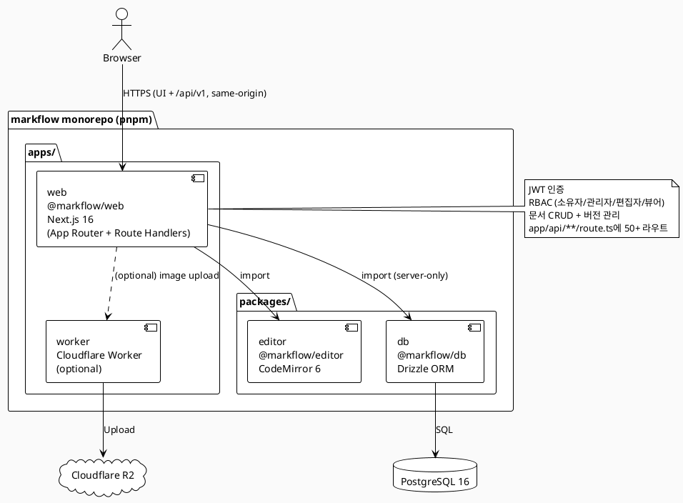
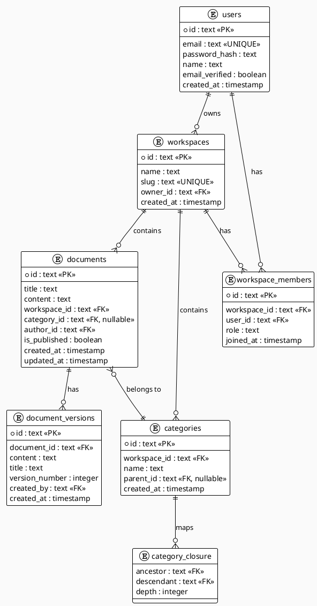
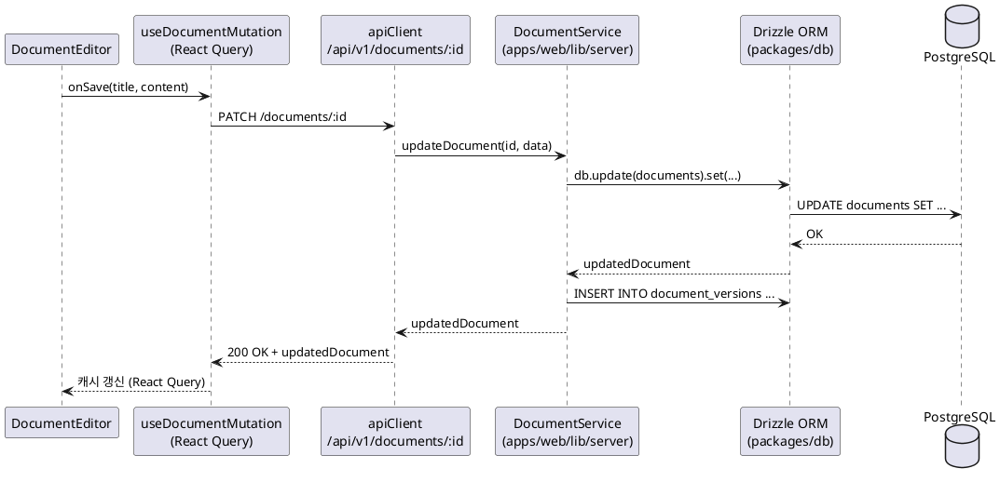
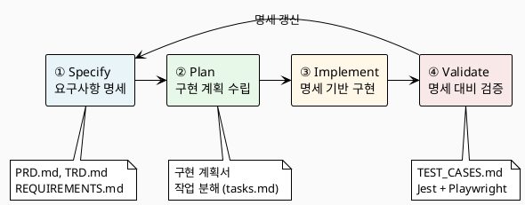
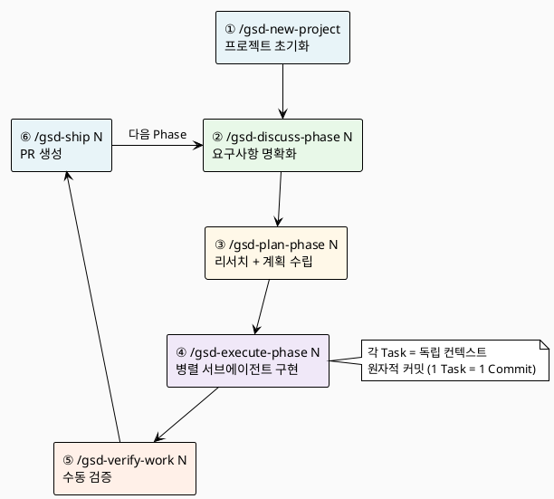
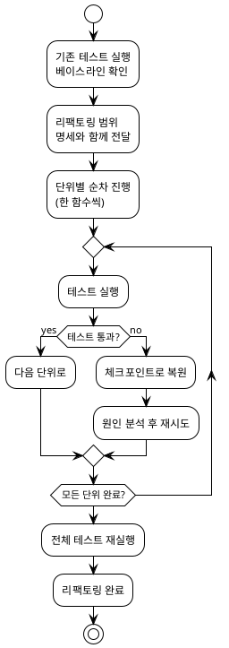

# ④ 실전 워크플로우

## 🟡 LEVEL 4 — 실전 워크플로우

> **실습 프로젝트**: markflow — 마크다운 에디터 기반 지식 관리 시스템  
> 오픈소스 리포지터리: https://github.com/claude-code-expert/markflow  
> 기술 스택: Next.js 16 (App Router + Route Handlers) · Drizzle ORM · PostgreSQL · Tailwind CSS 4 · TypeScript  
> 모노레포 구조: pnpm workspaces (`@markflow/web`, `@markflow/editor`, `@markflow/db`)

---

## 4.1 프로젝트 기획과 요구사항 정의

### 4.1.1 지식관리 시스템으로 배우는 풀스택 개발

markflow는 마크다운 기반 팀 지식 관리 플랫폼(KMS, Knowledge Management System)이다. SaaS 혹은 온프레미스 형태로 배포 가능한 오픈소스 프로젝트로, 폴더 단위 문서 연관 관계 관리, 실시간 협업, RBAC(역할 기반 접근 제어)를 핵심 기능으로 제공한다.

**이 프로젝트를 통해 습득하는 역량:**

- AI와 협업하여 요건 정의부터 배포까지 전 과정을 수행하는 능력
- 모노레포 기반 풀스택 아키텍처 설계 및 구현 능력
- TDD 기반의 안정적인 코드 작성 습관
- SDD(Specification-Driven Development) 워크플로를 실무에 적용하는 능력
- 명세 기반 AI 협업 개발 프로세스에서 개발자의 오케스트레이터 역할 수립 능력

markflow는 단순 TODO 앱보다 실무에 가까운 복잡도를 지닌다. 워크스페이스, 문서 버전 관리, 카테고리 클로저 테이블, JWT 인증, RBAC, 이미지 업로드(Cloudflare R2) 등 실제 SaaS 제품의 핵심 요소를 모두 담고 있기 때문이다.

[스크린샷 영역: markflow 완성 화면 — 워크스페이스, 문서 목록, 에디터 화면 순서]

---

### 4.1.2 기술 스택 선정 (React · Next.js · Drizzle · PostgreSQL)

markflow의 기술 스택은 AI 친화성, 타입 안정성, 배포 용이성을 기준으로 선정되었다.

**AI 코딩에서의 기술 선정 3대 기준**

| 기준 | 설명 |
|------|------|
| **AI 친화성** | GitHub 학습 데이터가 풍부하여 AI가 정확한 코드를 생성할 수 있는가 |
| **타입 안정성** | 런타임 에러를 코드 작성 시점에 잡아낼 수 있는가 |
| **배포 용이성** | 무료 또는 저비용으로 빠르게 배포할 수 있는가 |

**markflow 기술 스택 결정표**

| 레이어 | 선택 | 근거 |
|--------|------|------|
| 프론트엔드 | Next.js 16 (App Router) | React 19 + TypeScript, Vercel 네이티브 통합 |
| 스타일링 | Tailwind CSS 4 | 유틸리티 클래스 기반, AI가 일관된 스타일 생성에 유리 |
| 상태 관리 | Zustand + React Query | 클라이언트/서버 상태 명확히 분리 |
| 백엔드 | Next.js Route Handlers | App Router의 `route.ts`로 API 통합, Same-origin·CORS 불필요, Vercel 단일 배포 |
| ORM | Drizzle ORM | 코드 생성 단계 불필요, 서버리스 최적화, SQL-like 문법 |
| 데이터베이스 | PostgreSQL 16+ | 벡터 검색, JSON 타입, 무료 호스팅 생태계 풍부 |
| 에디터 | CodeMirror 6 + remark/rehype | 독립 패키지로 분리 가능한 구조 |
| 패키지 매니저 | pnpm + workspaces | 모노레포 관리, 디스크 절약 |

> **참고:** markflow v0.4.0에서 별도 Fastify API 서버를 Next.js Route Handlers로 통합했다. 프론트엔드와 API가 같은 Next.js 프로세스에서 실행되어 Vercel 단일 배포로 운영된다(Same-origin이라 CORS 설정도 불필요). 외부 도메인의 클라이언트가 API를 공유해야 하는 경우에만 분리 백엔드(Fastify/Hono 등 + Railway/Render)를 고려한다.

**TypeScript가 AI 코딩에서 중요한 이유**

```typescript
// ✅ TypeScript — 인터페이스가 AI와 IDE 사이의 강력한 계약(Contract)
interface Document {
  id: string;
  title: string;
  content: string;
  workspaceId: string;
  categoryId: string | null;
}

async function getDocument(id: string): Promise<Document | null> {
  const response = await fetch(`/api/v1/documents/${id}`);
  if (!response.ok) return null;
  return response.json();
}

// 사용 시점: IDE에서 즉시 오류 표시
const doc = await getDocument("123");
console.log(doc.tilte); // ❌ 'tilte' → 'title' 즉시 오류 감지
```

AI 에이전트 기반 코딩에서는 **시간 = 토큰 = 비용**이다. 런타임 에러 디버깅보다 코드 작성 시점에 타입 체크로 오류를 즉시 발견하는 것이 훨씬 효율적이다.

---

### 4.1.3 다른 백엔드 옵션 비교 (FastAPI · Spring Boot)

> ℹ️ **참고:** 기술 스택 비교의 상세 내용(AI 친화성, 비용, 호스팅 옵션)은 Level 2에서 이미 다뤘으므로, 여기서는 markflow 선택의 맥락에서 간략히 정리한다.

**markflow가 Next.js Route Handlers를 선택한 이유**

markflow는 초기에 Fastify 5를 별도 API 서버로 운영했지만, v0.4.0에서 Next.js App Router의 Route Handlers(`app/api/**/route.ts`)로 통합했다. 단일 Vercel 프로젝트로 배포되며 Same-origin이라 CORS 설정도 필요 없다. 에디터 컴포넌트(`@markflow/editor`)는 여전히 npm 독립 패키지로 분리되어 있어 외부 프론트엔드 이식성도 유지된다.

| 상황 | 권장 스택 |
|------|----------|
| MVP, 단일 배포 (Vercel) | **Next.js App Router + Route Handlers + PostgreSQL** (markflow 선택) |
| 외부 도메인이 API를 공유해야 하는 경우 | Fastify 5/Hono + 분리 배포 (Railway/Render) |
| 데이터 과학, ML 프로젝트 | Python + FastAPI |
| 엔터프라이즈, 레거시 | Java + Spring Boot |

---

### 4.1.4 기능 요구사항 정의

기능 요구사항(Functional Requirements)은 시스템이 **무엇을 해야 하는가**를 정의한다. markflow의 핵심 기능 요구사항을 다음과 같이 정의한다.

**markflow MVP 기능 요구사항 (FR)**

| ID | 기능 영역 | 설명 |
|----|----------|------|
| FR-001 | 인증 | 이메일/비밀번호 회원가입, JWT 로그인/로그아웃, 이메일 인증 |
| FR-002 | 워크스페이스 | 워크스페이스 생성/조회/수정/삭제, 멤버 초대 및 역할 관리 |
| FR-003 | 문서 CRUD | 마크다운 문서 생성/조회/수정/삭제, 제목 및 본문 편집 |
| FR-004 | 문서 버전 관리 | 수정 이력 저장, 특정 버전으로 복원 |
| FR-005 | 카테고리 | 폴더 계층 구조 생성/관리 (Closure Table 패턴) |
| FR-006 | 문서 간 연관 관계 | 문서 간 링크 생성/삭제/조회 |
| FR-007 | 태그 | 문서에 태그 추가/삭제, 태그 기반 필터링 |
| FR-008 | 댓글 | 문서에 댓글 작성/수정/삭제 |
| FR-009 | 에디터 | CodeMirror 6 기반 마크다운 에디터, 실시간 미리보기 |
| FR-010 | 이미지 업로드 | Cloudflare R2를 통한 이미지 첨부 (선택적 기능) |

---

### 4.1.5 비기능 요구사항 정의

비기능 요구사항(NFR, Non-Functional Requirements)은 시스템이 **어떻게 수행해야 하는가**를 정의한다.

| ID | 항목 | 핵심 기준 |
|----|------|----------|
| NFR-001 | 성능 | API 응답 p95 300ms 이하, 문서 로드 2초 이내 |
| NFR-002 | 보안 | JWT 인증, RBAC (소유자/관리자/편집자/뷰어), XSS 방어 (rehype-sanitize) |
| NFR-003 | 반응형 | 모바일(360px) ~ 데스크톱(1920px) |
| NFR-004 | 데이터 정합성 | 문서 버전 관리, 낙관적 업데이트 + 롤백 |
| NFR-005 | 배포 | Vercel 단일 배포 (Next.js + API Routes 통합), HTTPS, Git Push 자동 배포 |
| NFR-006 | 확장성 | SaaS 또는 온프레미스 모두 지원 가능한 구조 |

---

### 4.1.6 사용자 스토리 작성

사용자 스토리(User Story)는 요구사항을 사용자 관점에서 서술하는 기법이다.

> **형식:** `[역할]로서, [행동]을 할 수 있다. 그래서 [가치/목적]을 달성한다.`
> 
> 출처: [agilealliance.org/glossary/user-story-template](https://www.agilealliance.org/glossary/user-story-template)

**markflow 핵심 사용자 스토리**

| ID | 사용자 스토리 | 관련 FR |
|----|-------------|---------|
| US-001 | 팀원으로서, 마크다운 문서를 작성할 수 있다. 그래서 지식을 빠르게 기록하고 공유할 수 있다. | FR-003, FR-009 |
| US-002 | 팀원으로서, 문서를 카테고리별로 분류할 수 있다. 그래서 관련 문서를 쉽게 찾을 수 있다. | FR-005 |
| US-003 | 관리자로서, 워크스페이스 멤버를 초대하고 역할을 부여할 수 있다. 그래서 팀 협업을 체계적으로 관리할 수 있다. | FR-002 |
| US-004 | 팀원으로서, 문서 수정 이력을 확인하고 이전 버전으로 복원할 수 있다. 그래서 실수로 삭제한 내용을 복구할 수 있다. | FR-004 |
| US-005 | 팀원으로서, 문서 간 연관 관계를 링크로 연결할 수 있다. 그래서 관련 지식을 연결하여 탐색할 수 있다. | FR-006 |

**사용자 스토리의 AI 협업 활용**

명세만 전달하는 것과 사용자 스토리를 함께 전달할 때의 차이를 비교해보자.

```markdown
# 프롬프트 A (기능 명세만 전달)
문서 생성 API를 만들어줘.
title(필수, 1~500자), content(마크다운), categoryId(선택), workspaceId(필수) 필드.

# 프롬프트 B (사용자 스토리 포함)
문서 생성 API를 만들어줘.
팀원이 아이디어가 떠올랐을 때 즉시 기록하는 용도야.
제목만 입력하면 바로 생성되고, 내용은 에디터에서 나중에 채울 수 있어야 해.
생성된 문서는 해당 카테고리의 최상단에 나타나야 해.
```

프롬프트 B는 에러 메시지와 기본값 설계를 사용자 친화적으로 만든다. 기능 요구사항과 사용자 스토리를 함께 전달하면, 기능적으로 정확하면서도 UX가 자연스러운 코드가 나온다.

---

## 4.2 개발 문서 작성

### 4.2.1 PRD (Product Requirements Document) 작성

PRD는 제품이 **'무엇을'** 해야 하는지를 정의하는 문서다. 기능 목록, 사용자 시나리오, MVP 범위, 제외 범위를 담는다.

**Claude Code와 함께 PRD 작성하기**

```markdown
# 프롬프트

markflow 프로젝트의 PRD를 작성해줘. 다음 정보를 포함해야 해:

1. 제품 개요: 마크다운 기반 팀 KMS (SaaS + 온프레미스)
2. MVP 범위: 이메일 인증, 워크스페이스, 문서 CRUD + 버전 관리,
   카테고리 계층, 문서 간 연관 관계, 태그, 댓글, 마크다운 에디터
3. 2차 제외 범위: 실시간 협업(WebSocket), 외부 OAuth,
   이미지 업로드(R2), 검색(Full-text), 알림은 2차로 제외
4. 사용자 시나리오: 워크스페이스 생성 → 문서 작성 → 버전 확인 → 공유
5. 핵심 기능 목록: FR-001~010과 대응
6. 기술 스택 요약표: 선정 이유 포함 (CLAUDE.md 참고)

CLAUDE.md를 읽고 이 정보를 바탕으로 PRD.md를 /docs/PRD.md에 저장해줘.
```

**PRD의 핵심 구조**

```
docs/
└── PRD.md
    ├── 1. 제품 개요
    ├── 2. MVP 범위 및 제외 범위
    ├── 3. 핵심 기능 목록 (FR 매핑)
    ├── 4. 사용자 시나리오
    └── 5. 기술 스택 요약
```

---

### 4.2.2 TRD (Technical Requirements Document) 작성

TRD는 **'어떻게'** 구현할지 기술적으로 명세한다. 시스템 아키텍처, 데이터 흐름, 성능 기준, 보안을 담는다.

**markflow TRD 핵심 내용**

```markdown
# 프롬프트

markflow 프로젝트의 TRD를 작성해줘. CLAUDE.md를 참고하고 다음을 포함해야 해:

1. 시스템 아키텍처
   - 모노레포 구조: pnpm workspaces
   - 프론트엔드(React Server/Client) → Next.js Route Handler → Drizzle → PostgreSQL 데이터 흐름
   - 패키지 의존 관계: @markflow/editor, @markflow/db, @markflow/web

2. 기술 스택 상세
   - Next.js 16 (App Router + Route Handlers) / Drizzle ORM / PostgreSQL 16
   - JWT Access + Refresh Token 전략

3. 데이터 흐름
   - 문서 읽기: 컴포넌트 → API Client → /api/v1/documents/[id]/route.ts → DocumentService → DB
   - 문서 쓰기: 에디터 → Zod 검증 → Route Handler → DocumentService → DB + 버전 기록

4. 계층 간 경계 규칙
   - 클라이언트 컴포넌트 ↔ Route Handler는 fetch 통신 (서버 모듈 직접 import 금지)
   - apps/web/lib/server/** (서비스/DB 클라이언트)는 Route Handler와 Server Component에서만 import
   - packages/db는 apps/web에서 직접 참조

5. 배포 전략
   - apps/web: Vercel 단일 배포 (Root Directory: apps/web, API + Frontend 통합)
   - PostgreSQL: Supabase/Neon
   - 이미지 업로드: 별도 Cloudflare Worker (apps/worker, 선택적)

/docs/TRD.md에 저장해줘.
```

[markflow 아키텍처 흐름도 — PlantUML]



---

### 4.2.3 REQUIREMENTS.md 작성

REQUIREMENTS.md는 FR, NFR, 사용자 스토리를 하나의 문서로 통합한 **단일 진실 공급원(Single Source of Truth)**이다. CLAUDE.md에서 이 문서를 참조하면, Claude Code는 어떤 기능을 구현하든 이 명세를 기준으로 작업한다.

```
docs/
├── PRD.md              # 제품 요구사항: "무엇을" 만드는가
├── TRD.md              # 기술 요구사항: "어떻게" 만드는가
├── REQUIREMENTS.md     # FR + NFR + US 통합 명세
├── API_SPEC.md         # API 엔드포인트 명세
├── DATA_MODEL.md       # DB 스키마, ERD, 비즈니스 규칙
├── COMPONENT_SPEC.md   # 컴포넌트 계층, Props, 이벤트 흐름
└── TEST_CASES.md       # TDD용 테스트 케이스 정의
```

**REQUIREMENTS.md 핵심 구조**

```markdown
# markflow — 요구사항 명세

## 1. 기능 요구사항 (Functional Requirements)
### FR-001: 인증
- 입력 필드 테이블 (타입, 필수 여부, 제약 조건)
- 처리 규칙 (JWT 발급, Refresh Token 전략)
- API 매핑: POST /api/v1/auth/register, POST /api/v1/auth/login

### FR-003: 문서 CRUD
...

## 2. 비기능 요구사항 (Non-Functional Requirements)
...

## 3. 사용자 스토리 (User Stories)
...

## 4. 추적 매트릭스 (US ↔ FR ↔ TC 매핑)
```

> **핵심:** 처음부터 100% 완벽할 필요는 없다. 클로드 코드에게 교차 검증을 요청하고, 오류를 보정한 뒤 실제 개발에 들어가면 토큰 낭비와 디버깅 시간이 줄어든다.

---

### 4.2.4 명세 변경 관리와 버전 추적

개발이 진행되면서 요구사항은 변경된다. 명세 변경을 체계적으로 관리하지 않으면 구현 코드와 명세 간 **Spec Drift**가 발생한다.

**명세 버전 관리 전략**

```markdown
# REQUIREMENTS.md 버전 관리 헤더 예시

---
version: 1.2.0
last_updated: 2025-10-15
changed_by: claude-code (검토: 개발자)
changes:
  - FR-007 태그: 최대 10개 제한 추가
  - FR-004 버전 관리: 최대 50개 이력 보존으로 변경
---
```

**변경 관리 워크플로**

```markdown
# 프롬프트

REQUIREMENTS.md의 FR-007 태그 기능을 다음과 같이 변경해줘:
- 문서당 최대 태그 수: 10개 (기존: 무제한)
- 변경 이유: DB 인덱스 성능 고려

변경 후:
1. 영향 받는 API_SPEC.md, DATA_MODEL.md 항목을 함께 업데이트해줘
2. 변경 내역을 REQUIREMENTS.md 상단 변경 이력에 기록해줘
3. 기존 구현 코드에서 수정이 필요한 부분이 있으면 알려줘
```

---

## 4.3 명세서 설계

### 4.3.1 데이터 설계 (ERD · 스키마)

데이터 모델은 프로젝트의 기초 골격이다. 테이블 구조가 잘못되면 API도, 컴포넌트도, 테스트도 전부 틀어진다.

**markflow DB 구조 개요**

markflow는 15개 테이블로 구성된다. `@markflow/db` 패키지에서 Drizzle ORM 스키마로 관리한다.

| 테이블 | 설명 |
|--------|------|
| `users` | 사용자 계정 (이메일 인증 포함) |
| `refresh_tokens` | JWT Refresh Token 관리 |
| `workspaces` | 워크스페이스 |
| `workspace_members` | 워크스페이스 멤버 + RBAC 역할 |
| `invitations` | 초대 링크 관리 |
| `join_requests` | 가입 요청 |
| `categories` | 카테고리 노드 |
| `category_closure` | 카테고리 계층 구조 (Closure Table) |
| `documents` | 마크다운 문서 |
| `document_versions` | 문서 버전 이력 |
| `document_relations` | 문서 간 연관 관계 |
| `tags` | 태그 |
| `document_tags` | 문서-태그 다대다 |
| `comments` | 문서 댓글 |
| `embed_tokens` | 문서 공개 임베딩 토큰 |

**핵심 테이블: documents 스키마**

```typescript
// packages/db/src/schema.ts (Drizzle ORM)
import { pgTable, text, timestamp, integer, boolean } from 'drizzle-orm/pg-core';

export const documents = pgTable('documents', {
  id: text('id').primaryKey(),
  title: text('title').notNull(),
  content: text('content').notNull().default(''),
  workspaceId: text('workspace_id')
    .notNull()
    .references(() => workspaces.id, { onDelete: 'cascade' }),
  categoryId: text('category_id')
    .references(() => categories.id, { onDelete: 'set null' }),
  authorId: text('author_id')
    .notNull()
    .references(() => users.id),
  isPublished: boolean('is_published').notNull().default(false),
  createdAt: timestamp('created_at').notNull().defaultNow(),
  updatedAt: timestamp('updated_at').notNull().defaultNow(),
});
```

**Closure Table 패턴 — 카테고리 계층 관리**

markflow는 무한 깊이의 카테고리 계층을 지원하기 위해 Closure Table 패턴을 사용한다.

```sql
-- category_closure 테이블 구조
-- ancestor: 상위 카테고리 ID
-- descendant: 하위 카테고리 ID  
-- depth: 깊이 (자기 자신은 0)
SELECT * FROM category_closure WHERE ancestor = 'cat-001';
-- 결과: cat-001 하위의 모든 카테고리를 한 번의 쿼리로 조회
```

**ERD 다이어그램**



> 전체 ERD: [docs/ERD.svg](./docs/ERD.svg), 전체 스키마: [packages/db/SCHEMA.sql](./packages/db/SCHEMA.sql)

---

### 4.3.2 API 설계 (엔드포인트 · 요청/응답)

API 명세는 프론트엔드와 백엔드 사이의 **계약(Contract)**이다. markflow의 주요 API 엔드포인트는 다음과 같다.

**markflow REST API 개요**

| 영역 | 엔드포인트 예시 | 설명 |
|------|----------------|------|
| 인증 | `POST /api/v1/auth/register` | 회원가입 |
| 인증 | `POST /api/v1/auth/login` | 로그인, JWT 발급 |
| 워크스페이스 | `GET /api/v1/workspaces` | 내 워크스페이스 목록 |
| 문서 | `POST /api/v1/workspaces/:wsId/documents` | 문서 생성 |
| 문서 | `GET /api/v1/workspaces/:wsId/documents/:docId` | 문서 조회 |
| 문서 | `PATCH /api/v1/workspaces/:wsId/documents/:docId` | 문서 수정 |
| 버전 | `GET /api/v1/documents/:docId/versions` | 버전 목록 조회 |
| 버전 | `POST /api/v1/documents/:docId/versions/:versionId/restore` | 버전 복원 |
| 카테고리 | `GET /api/v1/workspaces/:wsId/categories` | 카테고리 트리 조회 |

**문서 생성 API 예시**

```
POST /api/v1/workspaces/:workspaceId/documents
Authorization: Bearer <access_token>
```

요청 바디:

| 필드 | 타입 | 필수 | 제약 |
|------|------|------|------|
| `title` | string | O | 1~500자 |
| `content` | string | X | 마크다운, 최대 1MB |
| `categoryId` | string | X | 유효한 카테고리 ID |

성공 응답 (201 Created):

```json
{
  "id": "doc-abc123",
  "title": "신규 문서",
  "content": "",
  "workspaceId": "ws-xyz",
  "categoryId": null,
  "authorId": "user-001",
  "isPublished": false,
  "createdAt": "2025-10-15T09:00:00Z",
  "updatedAt": "2025-10-15T09:00:00Z"
}
```

**공통 에러 응답 형식**

```json
{
  "error": {
    "code": "VALIDATION_ERROR",
    "message": "제목을 입력해주세요"
  }
}
```

상태 코드 규칙: `200`(조회/수정), `201`(생성), `204`(삭제), `400`(검증 실패), `401`(미인증), `403`(권한 없음), `404`(리소스 없음), `500`(서버 오류)

---

### 4.3.3 컴포넌트 및 UseCase 설계

프론트엔드 개발에서 컴포넌트 명세는 AI가 Props, 상태 관리, 하위 컴포넌트 구조를 설계할 때 기준이 된다.

**markflow 컴포넌트 계층 구조**

```
App (layout.tsx)
└── WorkspaceLayout (클라이언트, 사이드바 + 메인 영역)
    ├── Sidebar
    │   ├── WorkspaceSelector
    │   ├── CategoryTree (재귀 트리)
    │   └── DocumentList
    └── MainContent
        ├── DocumentEditor (에디터 모드)
        │   ├── @markflow/editor (CodeMirror 6)
        │   └── MarkdownPreview
        ├── DocumentViewer (읽기 모드)
        │   ├── DocumentMeta (태그, 버전, 댓글 수)
        │   └── RelatedDocuments
        └── VersionHistory (버전 모달)
```

**핵심 컴포넌트 명세**

| 컴포넌트 | 책임 | 핵심 Props |
|----------|------|-----------|
| `CategoryTree` | Closure Table 기반 계층 트리 렌더링 | `categories: Category[]`, `onSelect: (id) => void` |
| `DocumentEditor` | 에디터 모드 — 제목, 본문, 자동 저장 | `document: Document`, `onSave: (data) => void` |
| `VersionHistory` | 버전 목록 표시, 복원 확인 모달 | `documentId: string`, `onRestore: (versionId) => void` |
| `RelatedDocuments` | 연관 문서 링크 목록 | `relations: DocumentRelation[]` |

**이벤트 흐름 — 문서 저장**



---

### 4.3.4 테스트 케이스 정의

TDD(Test-Driven Development) 방식에서 테스트 케이스는 구현 전에 명세로 먼저 작성된다.

**TEST_CASES.md 구조**

```markdown
# markflow — 테스트 케이스 정의

## TC-AUTH-001: 회원가입
### 정상 케이스
- [ ] 유효한 이메일, 비밀번호로 회원가입 성공 → 201 + user 객체
- [ ] 생성된 사용자의 email_verified = false 확인

### 에러 케이스  
- [ ] 이미 존재하는 이메일 → 409 DUPLICATE_EMAIL
- [ ] 비밀번호 8자 미만 → 400 VALIDATION_ERROR
- [ ] 이메일 형식 오류 → 400 VALIDATION_ERROR

## TC-DOC-001: 문서 생성
...
```

테스트 케이스와 기능 요구사항의 매핑을 통해 커버리지를 관리한다.

| 테스트 케이스 | 관련 FR | 관련 US |
|-------------|---------|---------|
| TC-AUTH-001 | FR-001 | — |
| TC-DOC-001 | FR-003 | US-001 |
| TC-DOC-002 (버전 복원) | FR-004 | US-004 |
| TC-CAT-001 (계층 조회) | FR-005 | US-002 |

---

## 4.4 SDD 워크플로와 풀스택 개발 실습

### 4.4.1 왜 AI와 SDD가 잘 맞는가

**SDD(Specification-Driven Development)**는 구현 전에 명세를 먼저 확정하고, 그 명세를 기준으로 개발·검증하는 방법론이다.

> "SDD는 AI 에이전트를 '도움이 되는 자동완성'에서 '책임 있는 팀원'으로 전환시킨다."  
> — Augment Code, *Claude Code for Spec-Driven Development* (2026.04)  
> 출처: https://www.augmentcode.com/guides/claude-code-spec-driven-development

**AI가 SDD와 잘 맞는 이유**

| 문제 | SDD 해결책 |
|------|-----------|
| AI가 합리적이지만 틀린 가정을 함 | 명세가 모든 결정의 기준이 됨 |
| 세션 간 컨텍스트 손실 | REQUIREMENTS.md + CLAUDE.md가 세션 너머로 명세 전달 |
| 바이브 코딩의 일관성 부재 | 구현이 명세를 따르는지 테스트로 검증 |
| 리팩토링 시 회귀 | 명세 기반 테스트가 회귀 방지 |

**SDD의 핵심 사이클**



---

### 4.4.2 수동 워크플로우와의 비교

> ℹ️ **수동 워크플로 vs AI 워크플로 일반 비교**는 Level 2에서 이미 다뤘다. 여기서는 SDD를 적용했을 때의 실질적 차이에 집중한다.

**SDD 적용 전후 비교 (markflow 기준)**

| 구분 | 명세 없는 바이브 코딩 | SDD 적용 |
|------|-------------------|---------|
| 문서 API 구현 | AI가 필드명을 임의로 결정 | DATA_MODEL.md 기준으로 100% 일치 |
| 버전 관리 로직 | "completedAt을 기록할까요?" 반복 질문 | 비즈니스 규칙이 명세에 정의되어 있어 바로 구현 |
| 회귀 발생 시 | 원인 추적 어려움 | TEST_CASES.md 기반 테스트로 즉시 감지 |
| Spec Drift | 명세와 코드 불일치 누적 | 검증 단계에서 즉시 발견 |

---

### 4.4.3 실전 SDD 워크플로 — GSD(Get Shit Done) 세팅과 워크플로우

**GSD 소개**

GSD(Get Shit Done)는 Claude Code를 위한 메타 프롬프팅 + 컨텍스트 엔지니어링 + SDD 통합 시스템이다. Discuss → Plan → Execute → Verify 4단계 phase 구조로 Context Rot 없이 장기 프로젝트를 완성할 수 있도록 설계되었다.

> GitHub: https://github.com/gsd-build/get-shit-done

**GSD 설치**

```bash
# Claude Code 내에서 실행 (--dangerously-skip-permissions 필요)
claude --dangerously-skip-permissions /gsd-new-project
```

> ⚠️ `--dangerously-skip-permissions`는 GSD 초기 설정 1회에만 사용한다. 이후에는 일반 모드로 실행한다.

**GSD 디렉토리 구조**

```
markflow/
└── .planning/
    ├── PROJECT.md       # 프로젝트 비전, 항상 로드
    ├── REQUIREMENTS.md  # 범위 지정된 v1/v2 요구사항 (ID 포함)
    ├── ROADMAP.md       # Phase 분해 + 상태 추적
    ├── STATE.md         # 결정사항, 블로커, 세션 메모리
    ├── HANDOFF.json     # 세션 핸드오프 (자동 생성)
    ├── config.json      # 워크플로 설정
    └── MILESTONES.md    # 완료된 마일스톤 아카이브
```

**GSD 실전 워크플로**

```bash
# 1. 새 프로젝트 초기화
claude --dangerously-skip-permissions /gsd-new-project

# 2. Phase 논의 (요구사항 명확화)
/clear
/gsd-discuss-phase 1   # Route Handlers API 설계 논의

# 3. 구현 계획 수립
/gsd-plan-phase 1      # 리서치 + 계획 + 검증

# 4. 병렬 실행
/gsd-execute-phase 1   # 서브에이전트 병렬 구현

# 5. 검증
/gsd-verify-work 1     # 수동 UAT

# 6. PR 생성
/gsd-ship 1            # 검증된 작업으로 PR 생성

# 7. 다음 Phase 자동 감지
/gsd-next
```

**GSD 핵심 원칙: Phase마다 컨텍스트 분리**

GSD가 Context Rot을 방지하는 핵심 메커니즘은 각 Phase마다 서브에이전트가 독립적인 컨텍스트를 갖는 것이다.



> 출처: gsd-build/get-shit-done GitHub, USER-GUIDE.md (2025.04 확인)  
> 관련 링크: https://github.com/gsd-build/get-shit-done/blob/main/docs/USER-GUIDE.md

---

## 4.5 handoff.md & changelog.md 활용

### 4.5.1 변경사항 기록을 통한 작업 이어가기

> ℹ️ **handoff 메커니즘의 이론(PreCompact Hook, willseltzer/kylesnowschwartz 비교)**은 Level 2 section 2.7.4에서 이미 상세히 다뤘다. 여기서는 markflow 프로젝트에서의 실전 활용에 집중한다.

**markflow에서의 CHANGELOG.md 자동화**

세션마다 수행한 작업을 자동으로 CHANGELOG.md에 기록하는 Skill을 설정하면, 작업 이력이 문서화된다.

```markdown
# .claude/skills/changelog/SKILL.md
---
description: 코드 변경 후 CHANGELOG.md와 CLAUDE.md 최근 변경사항을 자동으로 기록한다.
  /changelog 명령어로 호출하거나, git commit 후 자동으로 실행된다.
---

CHANGELOG.md 업데이트 지침:

1. 형식:
   ## [브랜치명] - YYYY-MM-DD HH:MM
   ### 🎯 Prompt
   > "사용자가 입력한 요청"
   ### ✅ Changes
   - **Added**: 새 기능 (`파일경로`)
   - **Modified**: 수정 내용 (`파일경로`)
   ### 📁 Files Modified
   - `파일명` (+10, -2 lines)

2. CLAUDE.md의 ## Recent Changes 섹션에 최근 7일 요약 유지
3. /changelog "요약" 명령어로 수동 호출 가능
```

**사용 예시**

```bash
# 작업 후 수동 호출
/changelog "문서 CRUD Route Handler 구현 완료"

# 응답 예시
✅ CHANGELOG.md 업데이트 완료
- 브랜치: feature/document-crud
- 변경 파일: 8개
- 추가 라인: +312, 삭제 라인: -24
- 커밋: abc1234 → 원격 푸시 완료
```

**GSD HANDOFF.json 자동 연동**

GSD를 사용한다면, `/gsd-pause-work` 실행 시 자동으로 HANDOFF.json이 생성된다. 다음 세션에서 SessionStart 훅이 이를 감지해 자동으로 `/gsd-resume-work`를 호출한다.

```bash
# 세션 종료 전
/gsd-pause-work

# 다음 세션 시작 시 자동으로 다음 실행
# SessionStart hook → /gsd-resume-work → HANDOFF.json 읽기 → 작업 재개
```

> 출처: https://github.com/jnuyens/gsd-plugin (PreCompact + PostToolUse 훅으로 19-field HANDOFF.json 자동 생성)

---

## 4.6 디버깅 & 리팩토링

### 4.6.1 에러 메시지 첨부 → 근본 원인 분석

Claude Code에게 에러를 전달할 때는 에러 메시지 단독이 아니라 **컨텍스트를 함께** 제공해야 한다.

**효과적인 에러 보고 프롬프트 패턴**

```markdown
# 프롬프트 (비효과적)
이 에러 고쳐줘: TypeError: Cannot read property 'id' of undefined

# 프롬프트 (효과적)
다음 에러가 발생했어. 근본 원인을 분석하고 수정해줘.

**에러 메시지:**
TypeError: Cannot read property 'id' of undefined
  at DocumentService.updateDocument (apps/web/lib/server/services/document.service.ts:47)

**발생 조건:**
- PATCH /api/v1/documents/:docId 호출 시
- categoryId가 null인 문서를 수정할 때만 발생
- categoryId가 있는 문서는 정상 동작

**관련 파일:**
- apps/web/lib/server/services/document.service.ts (line 47 근처)
- packages/db/src/schema.ts (documents 테이블 정의)

DATA_MODEL.md의 비즈니스 규칙도 확인해줘.
```

**근본 원인 분석 요청 패턴**

```markdown
# 증상 → 원인 → 수정 → 회귀 방지 4단계로 분석해줘

1. 증상: [에러 메시지 + 스택 트레이스]
2. 재현 조건: [어떤 상황에서 발생하는지]
3. 시도한 것: [이미 확인한 내용]
4. 관련 명세: REQUIREMENTS.md FR-003 참고
```

---

### 4.6.2 File Checkpointing — 자동 복원 지점

Claude Code는 파일을 수정하기 전에 자동으로 체크포인트를 생성한다.

> ℹ️ **File Checkpointing의 동작 원리**는 Level 3에서 이미 다뤘다. 여기서는 markflow 개발 시 실전 활용법에 집중한다.

**markflow에서 체크포인트 활용 시나리오**

```bash
# 시나리오: DocumentService 리팩토링 중 실수로 파일 손상

# 1. 현재 상태 확인
/diff apps/web/lib/server/services/document.service.ts

# 2. 변경 내역이 마음에 들지 않으면 되돌리기
# Claude Code UI: 파일 옆의 "Revert" 버튼 클릭
# 또는 git을 통한 복원
git checkout -- apps/web/lib/server/services/document.service.ts

# 3. 더 안전한 접근: 브랜치 먼저 만들고 작업
git checkout -b refactor/document-service
```

---

### 4.6.3 회귀 방지하기

회귀(regression)는 기존에 동작하던 기능이 새 변경으로 인해 broken되는 것이다.

**markflow에서 회귀 방지 전략**

```markdown
# 프롬프트

카테고리 트리 조회 API를 최적화해줘. 
단, 다음 조건을 반드시 지켜야 해:
1. TC-CAT-001 (카테고리 계층 조회) 테스트가 계속 통과해야 해
2. Closure Table 쿼리 패턴을 유지해야 해 (REQUIREMENTS.md FR-005 참고)
3. 변경 전 npm test로 기존 테스트 베이스라인 확인해줘
4. 변경 후 동일 테스트 재실행으로 회귀 없음 확인해줘
```

**회귀 방지 체크리스트**

- [ ] 변경 전 전체 테스트 실행 및 기준선 확인
- [ ] 변경 범위를 명확히 전달 (어떤 파일, 어떤 기능)
- [ ] 관련 TEST_CASES.md 항목 명시
- [ ] 변경 후 관련 테스트 재실행 확인

---

### 4.6.4 안전한 리팩토링 흐름

**markflow Route Handler 리팩토링 예시**

```markdown
# 프롬프트

apps/web/app/api/v1/workspaces/[wsId]/documents/route.ts와
apps/web/app/api/v1/workspaces/[wsId]/documents/[docId]/route.ts를 리팩토링해줘.

**목표:**
- Route Handler에서 비즈니스 로직 분리 (apps/web/lib/server/services/document.service.ts로 이동)
- 현재 250줄 → 50줄 이하로 축소

**제약 조건:**
1. API 인터페이스 변경 없음 (API_SPEC.md 준수)
2. 기존 테스트 TC-DOC-001~005 통과 유지
3. 한 번에 전체가 아닌, 함수 하나씩 순서대로 진행해줘

**순서:**
1. POST(createDocument) 핸들러 먼저
2. 테스트 통과 확인
3. GET(getDocument) 핸들러
4. 테스트 통과 확인
5. 나머지 순서대로 진행
```

**안전한 리팩토링 원칙**



---

### 4.6.5 테스트를 통한 안전망 구축

**markflow 테스트 구조**

```
markflow/
├── apps/
│   └── web/
│       ├── __tests__/
│       │   ├── api/                # Route Handler 통합 테스트 (Vitest)
│       │   │   ├── auth.test.ts
│       │   │   ├── documents.test.ts
│       │   │   └── versions.test.ts
│       │   └── components/         # 컴포넌트 단위 테스트
│       └── tests/e2e/              # Playwright E2E 시나리오
└── packages/
    └── editor/
        └── src/__tests__/          # 에디터 단위 테스트
```

**SDD 기반 테스트 작성 프롬프트**

```markdown
# 프롬프트

TEST_CASES.md의 TC-DOC-001 (문서 생성)을 Vitest 테스트로 작성해줘.

요구사항:
- apps/web/__tests__/api/documents.test.ts에 작성
- TC-DOC-001의 모든 케이스 커버 (정상 + 에러 6가지)
- Route Handler를 직접 호출하는 통합 테스트 방식 (Request/Response Web API 사용)
- 테스트 DB: 별도 테스트 DB 사용 (DATABASE_URL_TEST 환경변수)
```

**Vitest 설정 (Route Handler 통합 테스트)**

```typescript
// apps/web/__tests__/api/documents.test.ts
import { describe, it, expect } from 'vitest';
import { POST } from '@/app/api/v1/workspaces/[wsId]/documents/route';

describe('POST /api/v1/workspaces/:wsId/documents', () => {
  it('TC-DOC-001-1: 유효한 요청으로 문서 생성 성공', async () => {
    const request = new Request('http://localhost/api/v1/workspaces/ws-test/documents', {
      method: 'POST',
      headers: {
        authorization: `Bearer ${testToken}`,
        'content-type': 'application/json',
      },
      body: JSON.stringify({ title: 'markflow 소개', content: '# 소개' }),
    });

    const response = await POST(request, { params: Promise.resolve({ wsId: 'ws-test' }) });
    const body = await response.json();

    expect(response.status).toBe(201);
    expect(body.title).toBe('markflow 소개');
  });

  it('TC-DOC-001-2: 제목 없으면 400 에러', async () => {
    const request = new Request('http://localhost/api/v1/workspaces/ws-test/documents', {
      method: 'POST',
      headers: {
        authorization: `Bearer ${testToken}`,
        'content-type': 'application/json',
      },
      body: JSON.stringify({ content: '내용만 있음' }),
    });

    const response = await POST(request, { params: Promise.resolve({ wsId: 'ws-test' }) });
    const body = await response.json();

    expect(response.status).toBe(400);
    expect(body.error.code).toBe('VALIDATION_ERROR');
  });
});
```

---

### 4.6.6 테스트 자동화 (셸스크립트 및 Playwright 활용하기)

**markflow 에디터 기능 테스트 — 셸스크립트**

markflow는 이미 에디터 테스트 스크립트를 제공한다.

```bash
# 전체 28개 에디터 기능 테스트
./scripts/item-test.sh all

# Bold 기능만 테스트
./scripts/item-test.sh bold

# 통합 테스트 (22개 한 문서)
./scripts/item-test.sh int

# 도움말
./scripts/item-test.sh help
```

**Playwright E2E 테스트 — 문서 생성 시나리오**

```bash
# E2E 테스트 실행
pnpm --filter @markflow/web test:e2e
```

```typescript
// apps/web/tests/e2e/document.spec.ts
import { test, expect } from '@playwright/test';

test('TC-E2E-001: 문서 작성 → 저장 → 조회', async ({ page }) => {
  // 로그인
  await page.goto('/login');
  await page.fill('[name=email]', 'test@markflow.dev');
  await page.fill('[name=password]', 'password123');
  await page.click('button[type=submit]');

  // 워크스페이스 이동
  await page.waitForURL('/workspace/**');

  // 새 문서 생성
  await page.click('[data-testid=new-document-btn]');
  await page.fill('[data-testid=document-title]', 'Playwright 테스트 문서');

  // 에디터에 내용 입력
  await page.click('[data-testid=editor]');
  await page.keyboard.type('# markflow E2E 테스트\n\n테스트 내용입니다.');

  // 저장 (Ctrl+S)
  await page.keyboard.press('Control+s');
  await expect(page.locator('[data-testid=save-indicator]')).toHaveText('저장됨');

  // 문서 목록에서 확인
  await page.click('[data-testid=document-list]');
  await expect(page.locator('text=Playwright 테스트 문서')).toBeVisible();
});
```

**CI/CD와 테스트 자동화 통합**

```yaml
# .github/workflows/test.yml
name: Test

on: [push, pull_request]

jobs:
  test:
    runs-on: ubuntu-latest
    steps:
      - uses: actions/checkout@v4
      - uses: pnpm/action-setup@v3
      - run: pnpm install
      - run: pnpm --filter @markflow/editor build
      - run: pnpm test          # 전체 단위 테스트
      - run: pnpm --filter @markflow/web test:e2e  # E2E 테스트
```

---

## 4.7 Plugin Marketplace

### 4.7.1 Plugin 4가지 구성 요소 (Skills · Hooks · Commands · Agents)

Claude Code 플러그인은 4가지 구성 요소를 조합하여 만든다.

> 출처: https://claude.com/blog/claude-code-plugins (Anthropic 공식 블로그, 2025.10.09)

**플러그인 디렉토리 구조**

```
my-plugin/
├── .claude-plugin/
│   └── plugin.json        # 플러그인 메타데이터 (필수)
├── commands/              # 슬래시 커맨드 (선택)
│   └── my-command.md
├── agents/                # 전문화된 서브에이전트 (선택)
│   └── my-agent.md
├── skills/                # 자동 호출 컨텍스트 (선택)
│   └── my-skill/
│       └── SKILL.md
├── hooks/                 # 이벤트 핸들러 (선택)
│   └── hooks.json
└── .mcp.json              # MCP 서버 설정 (선택)
```

**plugin.json 구조**

```json
{
  "name": "markflow-dev-tools",
  "version": "1.0.0",
  "description": "markflow 프로젝트 개발 도구 모음",
  "author": "markflow team",
  "commands": ["commands/"],
  "agents": ["agents/"],
  "skills": ["skills/"],
  "hooks": "hooks/hooks.json"
}
```

**4가지 구성 요소 비교**

| 구성 요소 | 트리거 방식 | 주요 용도 |
|----------|-----------|----------|
| **Skills** | Claude가 자동으로 컨텍스트 로드 | 도메인 지식, 코딩 규칙, 반복 워크플로 |
| **Commands** | `/command-name`으로 수동 호출 | 특정 작업 실행, 파일 생성, Git 작업 |
| **Agents** | 메인 Claude가 위임 | 독립 컨텍스트 필요한 병렬 작업 |
| **Hooks** | 이벤트 기반 자동 실행 | 코드 품질 강제, 로깅, 보안 검사 |

> Skills는 설명에 매칭되는 대화가 오면 자동 로드되고, Commands는 개발자가 직접 호출해야 한다. 이 차이가 활용 방식을 결정한다.

**markflow용 Skills 예시**

```markdown
# .claude/skills/route-handler-conventions/SKILL.md
---
description: Next.js Route Handler 코딩 규칙. markflow apps/web/app/api/** 작업 시 자동 로드.
  Route Handler, Zod 스키마 검증, 미들웨어, 에러 핸들링 컨벤션을 포함한다.
---

markflow Route Handler 코딩 규칙:

1. 모든 핸들러에 Zod 스키마로 body/query 검증 적용
2. 비즈니스 로직은 apps/web/lib/server/services/** 로 분리
3. 에러 응답 형식: { error: { code: string, message: string } }
4. 인증이 필요한 라우트: extractCurrentUser → checkRole 래퍼 사용
5. Drizzle 트랜잭션은 db.transaction() 사용 (싱글턴: max:3, idle_timeout:20)

예시:
// apps/web/app/api/v1/workspaces/[wsId]/documents/route.ts
import { extractCurrentUser, handleApiError } from '@/lib/server/middleware';

export async function POST(request: Request, ctx: { params: Promise<{ wsId: string }> }) {
  try {
    const user = await extractCurrentUser(request);
    const { wsId } = await ctx.params;
    const body = createDocumentSchema.parse(await request.json());
    const document = await documentService.create({ ...body, workspaceId: wsId, authorId: user.id });
    return Response.json(document, { status: 201 });
  } catch (err) {
    return handleApiError(err);
  }
}
```

---

### 4.7.2 공식 마켓플레이스 (`anthropics/claude-code`)

Anthropic이 공식 제공하는 플러그인들은 `anthropics/claude-code` GitHub 리포지터리의 `plugins/` 디렉토리에서 확인할 수 있다.

> 출처: https://github.com/anthropics/claude-code/blob/main/plugins/README.md

**Anthropic 공식 플러그인 목록**

| 플러그인 | 기능 |
|---------|------|
| `agent-sdk-dev` | Claude Agent SDK 프로젝트 초기화 + 검증 에이전트 |
| `claude-opus-4-5-migration` | 이전 모델 문자열 → 신규 Opus 모델 자동 마이그레이션 |
| `code-review` | 다중 에이전트 기반 PR 코드 리뷰 |
| `commit-commands` | Git 커밋 메시지 작성 보조 명령 |
| `explanatory-output-style` | 결정과 설계를 설명하는 출력 스타일 |
| `feature-dev` | 기능 개발용 아키텍트·구현·검토 에이전트 묶음 |
| `frontend-design` | 프론트엔드 작업 시 디자인 가이드 자동 제공 |
| `hookify` | 대화 패턴 분석으로 커스텀 훅 생성 |
| `learning-output-style` | 주요 결정 지점에서 직접 코드 기여 유도 |
| `plugin-dev` | 플러그인 개발 보조 도구 |
| `pr-review-toolkit` | PR 단계별 자동화(리뷰·간소화·테스트) |
| `ralph-wiggum` | 반복 작업 자동화 데모 플러그인 |
| `security-guidance` | 보안 검토·취약점 가이던스 |

**공식 마켓플레이스 추가 및 플러그인 설치**

```bash
# Claude Code 내에서

# 공식 마켓플레이스 추가
/plugin marketplace add anthropics/claude-code

# 플러그인 탐색
/plugin

# 특정 플러그인 설치
/plugin install code-review@anthropics/claude-code
```

[스크린샷 영역: /plugin 명령어 실행 화면 — Discover 탭에서 플러그인 목록 표시]

---

### 4.7.3 커뮤니티 마켓플레이스 등록·설치

커뮤니티 마켓플레이스는 GitHub 리포지터리 형태로 누구나 만들고 배포할 수 있다.

**마켓플레이스 사용 방법**

```bash
# 커뮤니티 마켓플레이스 추가
/plugin marketplace add gsd-build/get-shit-done
/plugin marketplace add ccplugins/awesome-claude-code-plugins
/plugin marketplace add hesreallyhim/awesome-claude-code

# 설치 후 플러그인 탐색
/plugin

# 특정 플러그인 설치
/plugin install gsd@gsd-build/get-shit-done
```

**마켓플레이스 직접 만들기**

```
my-marketplace/                      # GitHub 리포지터리 루트
└── .claude-plugin/
    └── marketplace.json             # 마켓플레이스 메타데이터
```

```json
// .claude-plugin/marketplace.json
{
  "name": "markflow-plugins",
  "description": "markflow 프로젝트용 Claude Code 플러그인 모음",
  "plugins": [
    {
      "name": "markflow-dev-tools",
      "path": "plugins/dev-tools",
      "description": "markflow 개발 도구 — 에디터 테스트, API 검증, 배포 스크립트"
    },
    {
      "name": "markflow-doc-generator",
      "path": "plugins/doc-generator",
      "description": "API_SPEC.md 기반 자동 문서 생성"
    }
  ]
}
```

```bash
# 직접 만든 마켓플레이스 등록
/plugin marketplace add your-org/markflow-plugins
```

---

### 4.7.4 유용한 도구 설치와 활용

**markflow 개발에 추천하는 플러그인/도구**

| 도구 | 설치 방법 | 용도 |
|------|----------|------|
| GSD | `/plugin marketplace add gsd-build/get-shit-done` | SDD 워크플로 자동화 |
| cc-sdd | `npx cc-sdd@latest --claude` | Kiro 스타일 SDD, 17개 Skills |
| claude-code-spec-workflow | `npx @pimzino/claude-code-spec-workflow` | Requirements → Design → Tasks |
| security-guardrails | 공식 마켓플레이스 | PreToolUse 보안 패턴 감지 |
| code-review | 공식 마켓플레이스 | 다중 에이전트 PR 리뷰 |

> 출처:  
> - cc-sdd: https://github.com/gotalab/cc-sdd (2025.04 확인)  
> - claude-code-spec-workflow: https://github.com/Pimzino/claude-code-spec-workflow  
> - awesome-claude-code: https://github.com/hesreallyhim/awesome-claude-code

**markflow 프로젝트용 커스텀 Commands 예시**

```markdown
# .claude/commands/markflow-test.md
---
description: markflow 에디터 테스트를 실행하고 결과를 보고한다.
---

다음 순서로 markflow 에디터 테스트를 실행해줘:

1. `./scripts/item-test.sh all` 실행
2. 실패한 테스트 항목 목록 정리
3. 실패 원인 분석
4. 수정 방향 제안

실패 항목이 없으면 "✅ 전체 테스트 통과 (28/28)" 출력.
```

```bash
# 실행
/markflow-test
```

**플러그인 보안 주의사항**

플러그인은 셸 스크립트와 Hooks를 포함할 수 있으므로, 설치 전 반드시 다음을 확인한다.

- GitHub 리포지터리 소스 코드 직접 검토
- hooks.json의 실행 명령어 확인
- 신뢰할 수 없는 마켓플레이스 플러그인은 설치 금지

> "플러그인은 코드를 포함할 수 있습니다. 검토하지 않은 코드를 설치하고 실행하지 마세요."  
> — Anthropic, Claude Code 공식 블로그 (2025.10.09)  
> 출처: https://claude.com/blog/claude-code-plugins

---

## Level 4 요약

| 섹션 | 핵심 내용 |
|------|----------|
| 4.1 프로젝트 기획 | markflow KMS 소개, 기술 스택 선정 기준, FR/NFR/사용자 스토리 |
| 4.2 개발 문서 | PRD/TRD/REQUIREMENTS.md 작성, 명세 변경 관리 |
| 4.3 명세서 설계 | ERD(15개 테이블), API 설계, 컴포넌트 설계, 테스트 케이스 |
| 4.4 SDD 워크플로 | GSD 세팅, Discuss → Plan → Execute → Verify 4단계 |
| 4.5 Handoff/Changelog | 세션 연속성, CHANGELOG.md 자동화, GSD HANDOFF.json |
| 4.6 디버깅 & 리팩토링 | 에러 보고 패턴, 회귀 방지, 안전한 리팩토링, Playwright E2E |
| 4.7 Plugin Marketplace | 4가지 구성 요소, 공식/커뮤니티 마켓플레이스, 커스텀 플러그인 |

---

## 참고 자료

| 자료 | 출처 |
|------|------|
| markflow 리포지터리 | https://github.com/claude-code-expert/markflow |
| GSD (Get Shit Done) | https://github.com/gsd-build/get-shit-done |
| Claude Code Plugin 공식 발표 | https://claude.com/blog/claude-code-plugins |
| Claude Code Skills 공식 문서 | https://code.claude.com/docs/en/skills |
| Anthropic 공식 플러그인 | https://github.com/anthropics/claude-code/blob/main/plugins/README.md |
| SDD with Claude Code (Augment) | https://www.augmentcode.com/guides/claude-code-spec-driven-development |
| cc-sdd | https://github.com/gotalab/cc-sdd |
| awesome-claude-code | https://github.com/hesreallyhim/awesome-claude-code |
| Spec-driven development (Medium) | https://heeki.medium.com/using-spec-driven-development-with-claude-code-4a1ebe5d9f29 |
