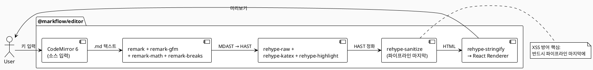
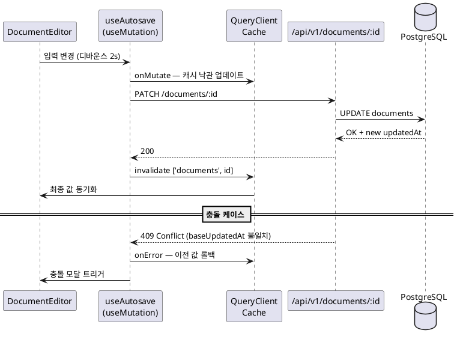
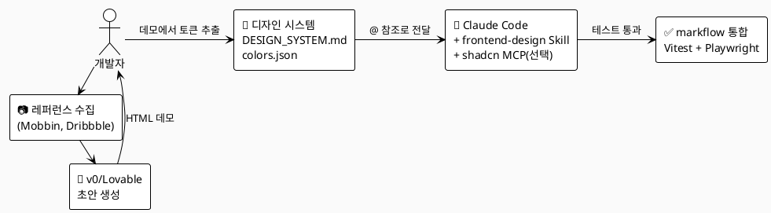
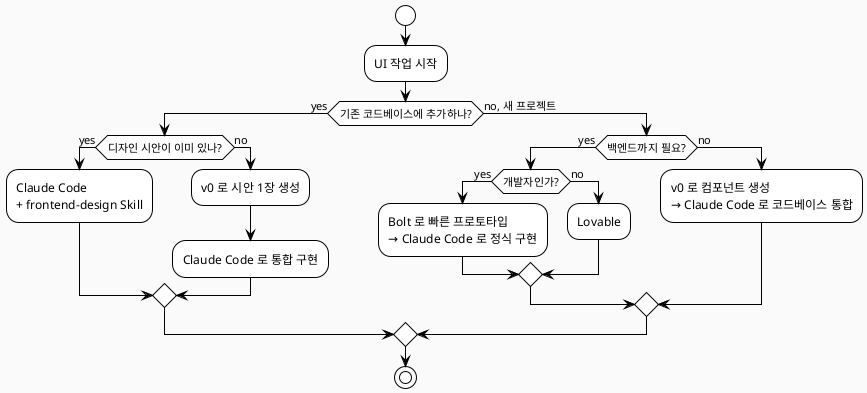

# ⑤ 프론트엔드 고도화

> 🔧 **[교정 안내]** — 본 챕터는 두 종의 초안(`level5-chapter5.md` · `level5-chapter5-2.md`)을 통합·재검증한 최종본이다. 모든 markflow 관련 사실 관계는 실제 오픈소스 코드베이스(`apps/web`, `packages/editor`, `packages/db`)와 직접 대조했고, 가상 디렉터리/컴포넌트/의존성 예시는 *권장 패턴* 또는 *선택지* 표시로 명시했다. 강의 흐름상 등장하지만 markflow가 채택하지 않은 패턴 옆에는 `🔧 [코드베이스 교정]` 콜아웃을 부착했다.

## 🟠 LEVEL 5 — 프론트엔드 고도화

> **메인 프로젝트(이어서)**: markflow — 마크다운 에디터 기반 지식 관리 시스템 (프론트엔드 구축)
> 오픈소스 리포지터리: https://github.com/claude-code-expert/markflow
> 기술 스택(프론트엔드 영역, 실측):
> - 런타임: Next.js 16.2.1 (App Router) · React 19.2.4 · TypeScript 5+ (strict)
> - 스타일: Tailwind CSS 4 (`@tailwindcss/postcss`)
> - 상태: Zustand 5.0 (클라이언트) · TanStack Query 5.72 (서버)
> - 에디터: CodeMirror 6 · unified(remark/rehype 11) · KaTeX · highlight.js
> - 테스트: Vitest 3 (apps/web) / Vitest 4.1 (packages/editor) · Testing Library 16 · Playwright 1
> 모노레포: pnpm workspaces — 실제 패키지: `@markflow/web` (apps/web), `@markflow/editor` (packages/editor), `@markflow/db` (packages/db). 그 외 `apps/demo`(에디터 데모), `apps/worker`(Cloudflare R2 이미지 업로드 Worker), `apps/api`(이전에 Fastify 코드가 존재했으나 현재 `.bak` 파일만 남고 실코드는 `apps/web/app/api/v1/**`로 통합됨).

Level 4에서 우리는 markflow의 백엔드(**Next.js App Router Route Handlers** — `apps/web/app/api/v1/**`, Drizzle 스키마, JWT 인증/RBAC)를 SDD/TDD로 구현했다. 이 장에서는 그 위에 올라갈 **에디터·미리보기·사이드바·검색 모달·DAG 구조 모달** 등의 UI를 만든다. 핵심 원칙은 동일하다 — 명세(`COMPONENT_SPEC.md`)를 기준으로 테스트를 먼저 작성하고, 가장 작은 말단 컴포넌트(Leaf Component)부터 조립해나가는 Bottom-up 방식이다. 클로드 코드는 이 과정에서 효율적인 코드 생성과 스타일링을 도와주는 파트너 역할을 한다.

> 🔧 **[코드베이스 교정]** — 초기 기획(`CLAUDE.md`)에는 별도 Fastify 5.x API 서버 도입 계획이 있으나, 현재 코드베이스의 실제 백엔드는 Next.js App Router의 Route Handlers(`apps/web/app/api/v1/**`)로 구성되어 있다. `apps/api/`에는 `.bak` 파일만 남아 있어 사실상 archived 상태다. 본 챕터의 모든 API 호출은 `apps/web/app/api/v1/**` 경로를 기준으로 한다.

전체 구현은 5개 Phase로 나뉜다. 각 Phase가 끝날 때마다 `pnpm test`로 테스트를 실행하고, 프리뷰 페이지에서 시각적 구성을 확인한다. 잘못 구현된 화면이나 기능은 바로 수정하면서 넘어가야 후반 작업의 지체가 최소화된다.

[표 5-1] 프런트엔드 구현 단계

| Phase | 범위 | 절 |
|-------|------|----|
| Phase 1 | 기본 UI 컴포넌트 (Button · Badge · Modal · ConfirmDialog · Tooltip) | 5.1 |
| Phase 2 | 레이아웃 — 사이드바 + 에디터 + 미리보기 3분할 | 5.1, 5.3 |
| Phase 3 | 마크다운 에디터·미리보기 핵심 기능 | 5.2 |
| Phase 4 | API 연동·상태 관리·자동 저장 | 5.3, 5.4 |
| Phase 5 | 디자인 시스템·접근성·성능 최적화·검증 | 5.5 ~ 5.10 |

> **참고**: 본문에 등장하는 NPM 패키지 버전·사이트 정책·외부 도구 가격 정책은 문서 작성 시점(2026년 5월)을 기준으로 한 것이며, 변동 가능성이 있어 본인이 직접 공식 문서를 한 번 더 확인하기를 권한다. 테스트 수치(예: "약 30개 통과")는 *예시*이며 실제 markflow의 현재 테스트는 `apps/web/components/__tests__/password-change-modal.test.tsx` 단일 파일에서 시작해 점진 확장 중이다.

---

## 5.1 컴포넌트 단위 구축

LEVEL 4에서 이미 Next.js 16 모노레포(`apps/web`, `packages/editor`, `packages/db`)를 생성했으므로, 별도의 React 프로젝트 생성은 필요 없다. 마크다운 에디터의 핵심 라이브러리(CodeMirror 6, remark/rehype)는 `@markflow/editor` 패키지로 이미 분리해두었으므로, `apps/web`에서는 이를 의존성으로 사용한다.

**실제 markflow 디렉터리 구조 (실측)**

```
markflow/
├── packages/
│   ├── editor/                 # @markflow/editor — 독립 에디터 (CodeMirror 6 + unified)
│   │   └── src/
│   │       ├── MarkdownEditor.tsx
│   │       ├── editor/         # EditorPane (CodeMirror 래퍼)
│   │       ├── preview/        # PreviewPane (remark/rehype 렌더)
│   │       ├── toolbar/        # Toolbar, SettingsModal
│   │       ├── styles/         # .mf- 네임스페이스 CSS
│   │       ├── utils/          # parseMarkdown, cloudflareUploader
│   │       ├── types/
│   │       └── index.ts        # Public API barrel
│   └── db/                     # @markflow/db — Drizzle ORM 스키마
├── apps/
│   ├── web/                    # @markflow/web — Next.js 16 + Route Handlers
│   │   ├── app/
│   │   │   ├── (app)/          # 인증 후 워크스페이스 화면
│   │   │   ├── (auth)/         # 로그인/회원가입
│   │   │   ├── (public)/       # 랜딩, 마케팅
│   │   │   ├── api/v1/**       # Route Handlers (백엔드)
│   │   │   ├── invite/         # 초대 수락
│   │   │   ├── present/        # 발표 모드
│   │   │   ├── globals.css     # Tailwind v4 + 디자인 토큰
│   │   │   ├── layout.tsx
│   │   │   └── providers.tsx
│   │   ├── components/         # ★ flat kebab-case (sub-folder는 landing/, settings/, states/)
│   │   ├── hooks/
│   │   ├── lib/                # api.ts, image-upload.ts, types.ts ...
│   │   ├── stores/             # auth-store, editor-store, sidebar-store, ...
│   │   ├── tests/e2e/          # Playwright 시나리오
│   │   ├── playwright.config.ts
│   │   └── vitest.config.ts
│   ├── demo/                   # 에디터 데모 앱
│   └── worker/                 # Cloudflare R2 업로드 Worker
└── docs/                       # 설계 문서, 프로토타입
```

> 🔧 **[코드베이스 교정]** — 초안에 자주 등장한 `apps/web/src/client/components/...`, `src/shared/`, `src/server/` 같은 3단 계층 구조는 markflow에 **존재하지 않는다**. 실제 구조는 위와 같이 평탄한 `apps/web/components/` + `apps/web/lib/` + `apps/web/stores/` + `apps/web/hooks/`이며, 컴포넌트 파일명은 **kebab-case**(`sidebar.tsx`, `category-tree.tsx`, `confirm-modal.tsx`, `dag-structure-modal.tsx` 등)다. 본 챕터의 코드 예시 중 `apps/web/components/...` 또는 `packages/editor/src/...` 경로는 실제 구조이며, 그 외(예: `apps/web/components/ui/Button.tsx`)는 *권장 위치*임을 명시한다.

---

### 5.1.1 컴포넌트 테스트 환경 구성 (Vitest + Testing Library)

markflow는 Vite 기반 빌드 환경이 아니지만, Next.js 16과 함께 Vitest를 별도의 컴포넌트 테스트 러너로 사용한다. 2026년 현재 새 React 19 프로젝트에서 Vitest는 사실상 표준 선택지로 자리잡았는데, **Vite 네이티브 통합·ESM 지원·Jest 호환 API·병렬 실행** 덕분에 동일 규모의 Jest 테스트보다 훨씬 빠르게 실행된다. (출처: [PkgPulse, "Vitest + Jest + Playwright"](https://www.pkgpulse.com/blog/vitest-jest-playwright-complete-testing-stack-2026), 2026.03.08)

> 참고: Jest를 선호한다면 동일한 설정을 `jest.config.ts`로 작성해도 무방하다. markflow는 모노레포 + Next.js 16의 ESM 우선 정책 때문에 Vitest를 채택했다.

**설치 (apps/web 워크스페이스 — 실측 의존성)**

```bash
# apps/web 워크스페이스에서 실행
pnpm add -D vitest @vitest/ui jsdom \
  @testing-library/react @testing-library/jest-dom @testing-library/user-event \
  @vitejs/plugin-react
```

> 실측: `apps/web/package.json` devDependencies — `vitest@^3`, `@testing-library/react@^16.3.2`, `@testing-library/jest-dom@^6.9.1`, `@testing-library/user-event@^14.6.1`, `jsdom@^29.0.2`, `@vitejs/plugin-react@^4.7.0`. `@vitest/ui`는 현재 미설치 — UI 모드가 필요하면 별도 추가.

**vitest.config.ts (현재 markflow 실측)**

```typescript
// apps/web/vitest.config.ts (실제)
import { defineConfig } from 'vitest/config';
import react from '@vitejs/plugin-react';

export default defineConfig({
  plugins: [react()],
  test: {
    environment: 'jsdom',
    globals: true,
    setupFiles: [],
    include: ['**/__tests__/**/*.test.{ts,tsx}', '**/*.test.{ts,tsx}'],
  },
});
```

**vitest.setup.ts (권장 추가)**

```typescript
// apps/web/vitest.setup.ts (권장)
import '@testing-library/jest-dom/vitest';
import { cleanup } from '@testing-library/react';
import { afterEach, vi } from 'vitest';

afterEach(() => {
  cleanup();
});

// CodeMirror 6 의존 — jsdom에 없는 ResizeObserver
global.ResizeObserver = vi.fn().mockImplementation(() => ({
  observe: vi.fn(),
  unobserve: vi.fn(),
  disconnect: vi.fn(),
}));

// 다크 모드 토글이 사용하는 matchMedia
Object.defineProperty(window, 'matchMedia', {
  writable: true,
  value: vi.fn().mockImplementation((query: string) => ({
    matches: false,
    media: query,
    addEventListener: vi.fn(),
    removeEventListener: vi.fn(),
  })),
});
```

> 🔧 **[코드베이스 교정]** — 현재 `apps/web/vitest.config.ts`는 `setupFiles: []`로 비어 있고 위 setup 파일은 도입되어 있지 않다. 컴포넌트 테스트를 본격화할 때 위 파일을 추가하고 `setupFiles: ['./vitest.setup.ts']`로 등록하면 된다. CodeMirror 컴포넌트를 테스트할 때 `ResizeObserver is not defined` 같은 jsdom 한계 오류가 자주 나오므로 이 setup이 사실상 필수다.
> 실측 vitest 버전: `apps/web` → `^3`, `packages/editor` → `^4.1.4` (서로 다름).

**클로드 코드에 위임**

```text
@apps/web/vitest.config.ts 와 @apps/web/vitest.setup.ts 를 기준으로 컴포넌트 테스트
환경을 점검해줘.

체크리스트:
1. jsdom 환경 활성화 여부
2. @testing-library/jest-dom 매쳐 등록 여부
3. afterEach cleanup 등록 여부
4. ResizeObserver/matchMedia 모킹 여부 (CodeMirror 6 + 다크 모드)
5. tsconfig.json 의 paths 와 vitest alias 동기화 여부
6. CI 에서 사용할 `pnpm test` 스크립트가 package.json 에 있는지 확인
```

> **참고(현재 시점)**: Vitest 3는 Vite 6과 함께 일반 출시(GA)되었고, Testing Library 16.x는 React 19와 호환된다. 단, 패키지 의존성 매트릭스는 변동이 잦으니 새로 설치할 때는 `pnpm view vitest version`, `pnpm view @testing-library/react version`으로 확인 후 lock 파일을 갱신하자. (출처: [Vitest 3 + Vite 6 + React 19 업그레이드 후기](https://www.thecandidstartup.org/2025/03/31/vitest-3-vite-6-react-19.html), 2025.03.31)

---

### 5.1.2 기본 컴포넌트 TDD로 구현

Phase 1에서는 다른 컴포넌트에 의존하지 않는 순수 UI 컴포넌트 4~5개를 구현한다 — `Button`, `Badge`, `Modal`, `ConfirmDialog`, `Tooltip`. 이 중 `Button`은 직접 TDD 사이클(Red → Green → Refactor)을 한 번 돌려보고, 나머지는 같은 패턴으로 클로드 코드에 위임한다.

> 🔧 **[코드베이스 교정]** — 실제 markflow는 `components/ui/` 같은 별도 프리미티브 디렉터리를 두지 않고, `apps/web/components/` 바로 아래에 **kebab-case** 파일명으로 컴포넌트를 둔다(예: `sidebar.tsx`, `category-tree.tsx`, `confirm-modal.tsx`, `new-doc-modal.tsx`, `tooltip.tsx`). 또 현재 시점에 별도의 `Button` 컴포넌트 파일은 없으며 Tailwind 클래스로 직접 버튼을 렌더링한다. 아래 코드는 *권장 패턴 예시*이며, 실제 프로젝트에 도입할 경우 파일명을 `apps/web/components/button.tsx`처럼 두거나, `apps/web/components/__tests__/button.test.tsx`로 옮긴다(테스트 디렉터리는 `apps/web/components/__tests__/`가 이미 존재).

**Step 1: Red — 실패하는 테스트 먼저** *(권장 패턴)*

```typescript
// apps/web/components/__tests__/button.test.tsx (권장 위치)
import { describe, it, expect, vi } from 'vitest';
import { render, screen } from '@testing-library/react';
import userEvent from '@testing-library/user-event';
import { Button } from '../button';

describe('Button', () => {
  it('children 을 렌더링한다', () => {
    render(<Button>저장</Button>);
    expect(screen.getByRole('button', { name: '저장' })).toBeInTheDocument();
  });

  it('variant prop 에 맞는 클래스명을 적용한다', () => {
    render(<Button variant="danger">삭제</Button>);
    expect(screen.getByRole('button')).toHaveClass('btn-danger');
  });

  it('클릭 시 onClick 핸들러가 호출된다', async () => {
    const onClick = vi.fn();
    render(<Button onClick={onClick}>확인</Button>);
    await userEvent.click(screen.getByRole('button'));
    expect(onClick).toHaveBeenCalledTimes(1);
  });

  it('loading=true 일 때 disabled 상태가 되고 클릭이 무시된다', async () => {
    const onClick = vi.fn();
    render(<Button loading onClick={onClick}>처리중...</Button>);
    expect(screen.getByRole('button')).toBeDisabled();
    await userEvent.click(screen.getByRole('button'));
    expect(onClick).not.toHaveBeenCalled();
  });
});
```

**Step 2: Green — 클로드 코드에 위임**

```text
@apps/web/components/__tests__/button.test.tsx 의 4개 테스트가 모두 통과하도록
@apps/web/components/button.tsx 를 구현해줘.

조건:
- variant: 'primary' | 'secondary' | 'danger' | 'ghost' (기본값 primary)
- size: 'sm' | 'md' | 'lg' (기본값 md)
- loading prop 시 spinner 표시 + disabled
- @markflow/web 컨벤션: forwardRef + ButtonHTMLAttributes 확장
- Tailwind CSS 4 유틸리티 사용, 임의 hex 금지 (globals.css 토큰만 사용)
- 다른 파일 수정 금지
```

**Step 3: Refactor — 통과 확인 후 정리**

```bash
pnpm --filter @markflow/web test button
pnpm --filter @markflow/web exec tsc --noEmit
```

`Badge`, `Modal`, `ConfirmDialog`, `Tooltip`도 동일한 패턴으로 클로드 코드에 위임한 뒤 일괄 검증한다.

[그림 5-1] Phase 1 컴포넌트 테스트 실행 결과 [스크린샷 영역]

> **체크리스트** — 컴포넌트 테스트에서 검증해야 할 3가지 관점
> 1. **렌더링 검증**: 사용자에게 보여야 할 내용이 실제로 화면에 나타나는가?
> 2. **조건부 렌더링 검증**: 상태(loading, error, empty)에 따라 화면이 올바르게 변하는가?
> 3. **상호작용 검증**: 클릭·입력·키보드 동작에 올바르게 반응하는가?

> **Tip**: 테스트가 통과해도 화면이 의도대로 보이는지는 별개 문제다. 5.1.4의 프리뷰 페이지에서 시각적으로도 확인한다.

---

### 5.1.3 레이아웃 — 사이드바 + 에디터 + 미리보기 3분할

markflow의 핵심 화면 구조는 **3분할 레이아웃**이다. 좌측 사이드바(워크스페이스·카테고리 트리), 중앙 에디터(CodeMirror 6), 우측 미리보기(remark/rehype 렌더링)로 나뉜다. 데스크톱에서는 3분할, 태블릿에서는 사이드바를 슬라이드 오버, 모바일에서는 단일 컬럼 + 탭 전환으로 동작한다.

[그림 5-2] markflow 3분할 레이아웃 와이어프레임

```
┌────────────────────────────────────────────────────────────────┐
│  app-header (상단 검색바 + 우측 사용자 메뉴)                     │
├──────────┬──────────────────────────┬───────────────────────────┤
│ Sidebar  │     EditorPane           │     PreviewPane           │
│          │     (CodeMirror 6)       │     (remark/rehype HTML)  │
│ - 워크   │                          │                           │
│ 스페이스 │     # 마크다운 입력      │     # 렌더링된 결과       │
│ - 카테고 │                          │                           │
│ 리 트리  │                          │                           │
│ - 문서   │                          │                           │
│ 트리     │                          │                           │
└──────────┴──────────────────────────┴───────────────────────────┘
```

> 🔧 **[코드베이스 교정]** — 실제 markflow는 라우트 그룹을 `(app)` / `(auth)` / `(public)` 세 개로 운영한다(`(workspace)` 그룹은 존재하지 않는다). 워크스페이스 화면 트리는 `apps/web/app/(app)/[workspaceSlug]/**`에 위치하며, 사이드바는 `apps/web/components/sidebar.tsx`(약 21KB), 카테고리 트리는 `apps/web/components/category-tree.tsx`(약 11KB)로 분리되어 있다. 별도의 `WorkspaceSelector`/`DocumentList` 컴포넌트는 `sidebar.tsx` 내부에 통합되어 있다.

```
markflow/apps/web/app/(app)/layout.tsx                  ← 실제 라우트 그룹 레이아웃
└── (Client Component shell)
    ├── components/sidebar.tsx (좌)
    │   ├── 워크스페이스 셀렉터 (sidebar.tsx 내부)
    │   ├── components/category-tree.tsx (재귀)
    │   └── 문서 리스트 (sidebar.tsx 내부)
    └── (중·우) MainContent
        ├── @markflow/editor — EditorPane (CodeMirror 6)
        └── @markflow/editor 내부 PreviewPane
```

**3분할 구현(Tailwind v4 + CSS Grid — 권장 골격)**

```tsx
// 권장 위치: apps/web/app/(app)/[workspaceSlug]/layout.tsx
export default function WorkspaceLayout({ children }: { children: React.ReactNode }) {
  return (
    <div className="grid h-dvh grid-rows-[48px_1fr] grid-cols-1 lg:grid-cols-[280px_1fr_1fr]">
      <header className="lg:col-span-3 border-b">{/* AppHeader */}</header>
      <aside className="hidden lg:block row-start-2 border-r overflow-y-auto">
        {/* Sidebar */}
      </aside>
      <main className="row-start-2 lg:col-span-2 overflow-hidden">{children}</main>
    </div>
  );
}
```

3분할의 좌·중·우 비율, 분할자(Splitter) 드래그 동작, 모바일 하단 탭 등 디테일은 명세에 따로 빼두고 `CLAUDE.md`에서 참조하게 하면 좋다.

```markdown
# .claude/rules/workspace-layout.md
---
paths:
  - "apps/web/app/(app)/**/*.tsx"
  - "apps/web/components/sidebar.tsx"
  - "apps/web/components/category-tree.tsx"
---

## markflow 워크스페이스 레이아웃 규칙
- 데스크톱(≥1024px): 사이드바 280px + 에디터 1fr + 미리보기 1fr
- 태블릿(768~1023px): 사이드바 슬라이드 오버, 에디터/미리보기 토글
- 모바일(<768px): 단일 컬럼 + 하단 탭 (Editor / Preview / Outline)
- 분할자는 자체 구현(드래그 핸들) — markflow 의존성에 `react-resizable-panels`는 포함되어 있지 않다
- 사이드바 스크롤은 자체적으로, 메인은 별도 스크롤 컨테이너
- height 단위는 `dvh` 사용 (iOS Safari 주소창 변동 회피)
```

> 🔧 **[코드베이스 교정]** — 위 규칙은 *권장 가이드*이며, 현재 markflow는 `react-resizable-panels`를 사용하지 않는다. 분할 레이아웃은 CSS Grid 정적 비율로 구성되어 있다.

---

### 5.1.4 컨테이너 조립과 페이지 통합

각 Phase에서 만든 컴포넌트가 의도대로 동작하는지 빠르게 확인하려면 **DB 없이 동작하는 프리뷰 페이지**가 필요하다. `app/(app)/[workspaceSlug]/page.tsx`는 서버 컴포넌트로서 실제 DB를 조회하기 때문에, 단계별로 컴포넌트를 검증하기에는 부적합하다.

**프리뷰 페이지 패턴** *(권장)*

```tsx
// apps/web/app/preview/page.tsx (Phase 5에서 삭제 예정)
'use client';
import { Sidebar } from '@/components/sidebar';
import { CategoryTree } from '@/components/category-tree';
import { mockCategories } from '@/lib/mocks';

export default function PreviewPage() {
  return (
    <div className="grid grid-cols-2 gap-8 p-8">
      <section>
        <h2>Phase 1 — 기본 컴포넌트</h2>
        {/* Button, Badge, Modal 미리보기 */}
      </section>
      <section>
        <h2>Phase 2 — 사이드바</h2>
        <CategoryTree categories={mockCategories} onSelect={() => {}} />
      </section>
    </div>
  );
}
```

```bash
pnpm --filter @markflow/web dev
# http://localhost:3002/preview 에서 컴포넌트 갤러리 확인
```

> Tip — 3분할 같은 거시적 레이아웃은 이미지 한 장보다 와이어프레임 그림(또는 Excalidraw로 그린 도식)을 첨부해서 클로드 코드에 전달하면 결과 품질이 크게 올라간다. 4.1.3에서 사용한 와이어프레임을 그대로 재활용해도 된다.

---

## 5.2 마크다운 에디터 핵심 기능

markflow의 핵심 가치는 마크다운 에디터의 품질이다. 이 절에서는 에디터 라이브러리 선택부터 실시간 미리보기, 코드 하이라이팅, XSS 방어까지 다룬다.

### 5.2.1 에디터 라이브러리 비교 (CodeMirror · Monaco · TipTap)

마크다운 에디터를 만들 때 가장 먼저 마주치는 결정은 **소스 편집(Source-mode) vs WYSIWYG**이다. 소스 편집은 마크다운 텍스트를 그대로 입력하고 우측에 미리보기를 띄우는 방식이고, WYSIWYG은 사용자가 보는 결과물 위에서 직접 서식을 적용하는 방식이다.

[표 5-2] 에디터 라이브러리 비교 (2026년 5월 기준)

| 항목 | CodeMirror 6 | Monaco Editor | TipTap |
|------|--------------|---------------|--------|
| 모델 | 텍스트 기반 (Source) | 텍스트 기반 (IDE) | DOM 기반 (WYSIWYG, ProseMirror 위) |
| 번들 사이즈 (코어, 근사) | ~300KB (필요 모듈만 import) | ~5MB (Web Worker 필요) | ~150KB (headless, Plugin마다 추가) |
| 코드 하이라이팅 | Lezer 파서 | VS Code 동급 IntelliSense | 별도 highlight extension |
| WYSIWYG 지원 | 부분(데코레이션) | ❌ | ✅ (메인 활용처) |
| 모바일 지원 | 우수(네이티브 셀렉션) | 제한적 | ProseMirror 의존 |
| 협업(CRDT/Yjs) | yjs 어댑터 | 별도 구현 필요 | 1차 지원(`@tiptap/extension-collaboration`) |
| 적합한 용도 | 마크다운·소스 보기 | VSCode 수준의 IDE | 노션식 블록 에디터 |
| markflow 채택 | ✅ | — | — |

> 출처:
> - CodeMirror vs Monaco bundle size 비교 — https://agenthicks.com/research/codemirror-vs-monaco-editor-comparison (2025.09)
> - Sourcegraph의 Monaco → CodeMirror 마이그레이션 사례 — https://sourcegraph.com/blog/migrating-monaco-codemirror
> - Liveblocks 리치 에디터 비교 — https://liveblocks.io/blog/which-rich-text-editor-framework-should-you-choose-in-2025
> - Velt 비교 글 — https://velt.dev/blog/best-rich-text-editors-react-comparison (2026.01)

CodeMirror 6와 Monaco는 둘 다 **소스 모드 코드 에디터**다. 마크다운에 코드 블록·수식이 자주 등장하는 기술 문서 도구에 적합하다. TipTap은 ProseMirror 기반의 **헤드리스 리치 텍스트 에디터**로, "노션 스타일" 인터페이스를 만들 때 강력하다.

> 인용: 코드 중심 콘텐츠(문서·노트·기술 위키)에서는 CodeMirror가 일반 리치 텍스트 에디터보다 코드 편집 능력이 우수하다. markflow는 코드 블록·KaTeX 수식·다이어그램이 많이 등장하는 개발자용 KMS이므로 CodeMirror 6 + remark/rehype 미리보기 조합이 자연스러운 선택이다.

**markflow의 선택 — CodeMirror 6 (실측 의존성)**

`@markflow/editor` 패키지(packages/editor)의 실제 의존성은 다음과 같다.

- 에디터 코어: `@codemirror/view`, `@codemirror/state`, `@codemirror/commands`, `@codemirror/autocomplete`, `@codemirror/lang-markdown`, `@codemirror/language-data`, `@codemirror/theme-one-dark`
- 마크다운 파서: `unified`, `remark-parse`, `remark-gfm`, `remark-math`, `remark-breaks`
- 렌더링: `remark-rehype`, `rehype-raw`, `rehype-katex`, `rehype-highlight`, `rehype-stringify`, `rehype-sanitize`
- 수식 스타일: `katex`
- 아이콘: `lucide-react`
- 유틸: `deepmerge-ts`

> 🔧 **[코드베이스 교정]** — 강의 자료에서 단일 패키지(`codemirror`) 표기는 편의상 표현이며, 실제 markflow는 위와 같이 `@codemirror/*` **모듈을 직접 import**한다(번들 사이즈 절감). 또 `@uiw/react-codemirror` 같은 React 래퍼도 사용하지 않고 자체 React 래퍼(`packages/editor/src/editor/EditorPane.tsx`)를 두고 있다.

**markflow가 CodeMirror 6를 고른 이유**

1. **소스 편집 + 미리보기 분리 모델**이 마크다운에 가장 자연스럽다. WYSIWYG 모델(TipTap)은 마크다운을 1급으로 취급하지 않아 라운드트립이 어렵다.
2. **번들 크기**가 Monaco의 1/15 수준이다. SaaS로 배포하는 markflow에는 초기 로딩 비용이 중요하다.
3. **모바일 셀렉션 지원**이 우수해 태블릿에서도 쓸 만하다.
4. **모듈러 확장 모델**로 문법 강조, 검색, 단축키 등을 필요한 만큼만 import할 수 있다.

> 클로드 코드에게 라이브러리 선택을 맡길 때 한 가지 주의할 점: AI는 학습 데이터에 더 많이 노출된 라이브러리를 선호하는 경향이 있다(예: Monaco 우선 추천). 의사결정 근거를 비교표 형태로 명시적으로 전달해야 의도한 선택을 정확히 따른다.

[5-1 markflow 에디터 구성 다이어그램 — PlantUML]



---

### 5.2.2 실시간 미리보기 (split view · synced scroll)

실시간 미리보기는 **에디터 입력 → 디바운스 → 파싱 → 미리보기 갱신**의 흐름으로 동작한다. 입력마다 즉시 파싱하면 큰 문서에서 키 입력이 끊기므로, **150~300ms 디바운스**(또는 React 18+의 `useDeferredValue`)를 권장한다. 더 큰 문서에서는 워커 파싱을 검토한다.

**기본 구현(`@markflow/editor`)**

```tsx
// packages/editor/src/MarkdownEditor.tsx (개념)
'use client';
import { useState, useDeferredValue } from 'react';
import { CodeMirror } from './CodeMirror';
import { Preview } from './Preview';

export function MarkdownEditor({ initialValue, onChange }: Props) {
  const [value, setValue] = useState(initialValue);
  const deferred = useDeferredValue(value); // 미리보기 갱신을 비동기 슬라이스에 위임 (React 18+)

  return (
    <div className="grid grid-cols-2 gap-4 h-full">
      <CodeMirror
        value={value}
        onChange={(next) => {
          setValue(next);
          onChange?.(next);
        }}
      />
      <Preview source={deferred} />
    </div>
  );
}
```

**스크롤 동기화(synced scroll)**

```tsx
// 권장 위치: apps/web/components/editor/SyncedScroll.tsx
import { useEffect } from 'react';

export function useSyncedScroll(editorRef, previewRef) {
  useEffect(() => {
    const editor = editorRef.current;
    const preview = previewRef.current;
    if (!editor || !preview) return;

    let isSyncing = false;
    const onEditorScroll = () => {
      if (isSyncing) return;
      isSyncing = true;
      const ratio = editor.scrollTop / (editor.scrollHeight - editor.clientHeight);
      preview.scrollTop = ratio * (preview.scrollHeight - preview.clientHeight);
      requestAnimationFrame(() => (isSyncing = false));
    };
    const onPreviewScroll = () => {
      if (isSyncing) return;
      isSyncing = true;
      const ratio = preview.scrollTop / (preview.scrollHeight - preview.clientHeight);
      editor.scrollTop = ratio * (editor.scrollHeight - editor.clientHeight);
      requestAnimationFrame(() => (isSyncing = false));
    };
    editor.addEventListener('scroll', onEditorScroll);
    preview.addEventListener('scroll', onPreviewScroll);
    return () => {
      editor.removeEventListener('scroll', onEditorScroll);
      preview.removeEventListener('scroll', onPreviewScroll);
    };
  }, [editorRef, previewRef]);
}
```

> **주의**: 비율 기반 동기화는 빠르지만 헤딩 위치가 정확하지 않을 수 있다. 정밀 동기화가 필요하면 마크다운 AST의 line offset을 미리보기 DOM에 `data-source-line` 속성으로 매핑하는 방식을 검토한다.

---

### 5.2.3 마크다운 파싱과 렌더링 (remark · rehype 파이프라인)

```typescript
// packages/editor/src/utils/parseMarkdown.ts (실제 파이프라인 골격)
import { unified } from 'unified';
import remarkParse from 'remark-parse';
import remarkGfm from 'remark-gfm';
import remarkMath from 'remark-math';
import remarkBreaks from 'remark-breaks';
import remarkRehype from 'remark-rehype';
import rehypeRaw from 'rehype-raw';
import rehypeKatex from 'rehype-katex';
import rehypeHighlight from 'rehype-highlight';
import rehypeSanitize, { defaultSchema } from 'rehype-sanitize';
import rehypeStringify from 'rehype-stringify';

export const markdownProcessor = unified()
  .use(remarkParse)
  .use(remarkGfm)            // 표 · 체크박스 · 자동 링크
  .use(remarkMath)           // $...$ · $$...$$
  .use(remarkBreaks)         // single newline → <br>
  .use(remarkRehype, { allowDangerousHtml: false })
  .use(rehypeKatex)          // KaTeX 수식
  .use(rehypeHighlight)      // 코드 블록 하이라이팅
  .use(rehypeSanitize, {     // ⚠️ 반드시 마지막
    ...defaultSchema,
    attributes: {
      ...defaultSchema.attributes,
      code: [...(defaultSchema.attributes?.code ?? []), ['className', /^language-./]],
      span: [['className']],
    },
  })
  .use(rehypeStringify);

export function parseMarkdown(source: string): string {
  // 실시간 프리뷰용 — 동기 processSync 사용
  return String(markdownProcessor.processSync(source));
}
```

> **핵심 규칙** (루트 `CLAUDE.md`에도 명시)
> - `rehype-sanitize`는 반드시 파이프라인의 **마지막**에 위치해야 한다. 이후에 다른 플러그인이 끼어들면 정화되지 않은 HTML이 출력될 수 있다.
> - 실시간 프리뷰용 `parseMarkdown()`은 **동기(processSync)**다.
> - 파이프라인 순서: `parse → gfm → math → rehype → highlight → katex → sanitize → stringify`.

---

### 5.2.4 코드 블록 신택스 하이라이팅

`rehype-highlight`는 highlight.js 기반으로 200개 이상의 언어를 자동 감지한다. 번들 사이즈가 부담되면 사용 언어만 선택적으로 등록하는 방식을 쓴다.

```typescript
import rehypeHighlight from 'rehype-highlight';
import javascript from 'highlight.js/lib/languages/javascript';
import typescript from 'highlight.js/lib/languages/typescript';
import bash from 'highlight.js/lib/languages/bash';

unified()
  // ...
  .use(rehypeHighlight, {
    languages: { javascript, typescript, bash },
    detect: false, // 언어 자동 감지 비활성화로 번들 절감
  });
```

테마는 highlight.js 의 CSS 중 하나를 import 한다(예: `highlight.js/styles/github-dark.css`). 다크 모드 토글 시 두 테마를 모두 import 해두고 `[data-theme]` 셀렉터로 분기시키면 깔끔하다.

---

### 5.2.5 마크다운 확장 — 표·체크박스·다이어그램

| 확장 | 패키지 | 비고 |
|------|--------|------|
| 표 (table) | `remark-gfm` | GFM 자동 처리 |
| 체크박스 (`- [ ] / - [x]`) | `remark-gfm` | UI에서 클릭 가능하도록 별도 처리 |
| 자동 링크 | `remark-gfm` | http://example.com 자동 링크 |
| 다이어그램 (Mermaid) | 별도 후처리 | 코드 블록 `mermaid` 감지 → mermaid.js 렌더 |
| 수식 (KaTeX) | `remark-math` + `rehype-katex` | `$...$` · `$$...$$` |
| 그래프 시각화 (markflow) | React Flow 기반 별도 컴포넌트 | 마크다운 코드블록이 아닌 모달로 호출 |

**Mermaid 다이어그램 후처리 예시** *(권장 패턴 — 현재 markflow 미적용)*

```tsx
// 권장 위치: apps/web/components/preview/MermaidBlock.tsx
'use client';
import { useEffect, useRef } from 'react';
import mermaid from 'mermaid';

mermaid.initialize({ startOnLoad: false, theme: 'default', securityLevel: 'strict' });

export function MermaidBlock({ code }: { code: string }) {
  const ref = useRef<HTMLDivElement>(null);
  useEffect(() => {
    const id = `m-${Math.random().toString(36).slice(2)}`;
    mermaid.render(id, code).then(({ svg }) => {
      if (ref.current) ref.current.innerHTML = svg;
    });
  }, [code]);
  return <div ref={ref} className="my-4" />;
}
```

미리보기 렌더 시 `<pre><code class="language-mermaid">…</code></pre>`를 감지해 위 컴포넌트로 대체한다(React 컴포넌트 렌더러로 가로채기). Mermaid `securityLevel`은 SaaS 환경에서 반드시 `'strict'`로 둔다(클릭 핸들러 외부 스크립트 차단).

> 🔧 **[코드베이스 교정]** — 현재 markflow는 **mermaid를 도입하지 않았다**. 마크다운 파이프라인에 mermaid 단계가 없고, 다이어그램 시각화는 별도로 React Flow 기반의 `mind-map-canvas.tsx`/`dag-structure-modal.tsx`/`mini-dag-diagram.tsx`로 구현되어 있다(마크다운 안의 코드블록이 아니라 별도 모달). 위 코드는 *향후 도입 시 권장 패턴*이다.

---

### 5.2.6 XSS 방지와 sanitize 처리

마크다운 렌더링은 일반적으로 안전하지 않다. 사용자가 `<script>` 태그나 `javascript:` 프로토콜을 넣으면 그대로 실행될 수 있다. markflow는 다음 4중 방어를 적용한다.

1. `rehype-sanitize`를 파이프라인 마지막에 적용 (위 5.2.3)
2. `dangerouslySetInnerHTML` 사용 시 반드시 sanitize 통과 후 사용 (`parseMarkdown()` 출력에만 허용)
3. 링크의 `href`가 `javascript:`, `data:`, `vbscript:`로 시작하면 차단
4. `target="_blank"` 외부 링크에 `rel="noopener noreferrer"` 자동 부착

**클로드 코드로 보안 점검**

```bash
/security-review @packages/editor/src/utils/parseMarkdown.ts
/security-review @packages/editor/src/preview/PreviewPane.tsx
```

> **CLAUDE.md에 강제 규칙 추가** (이미 markflow 루트 CLAUDE.md에 반영됨)
> ```
> ## 마크다운 처리 규칙(반드시 준수)
> - rehype-sanitize 는 파이프라인 마지막
> - dangerouslySetInnerHTML 직접 사용 금지 (반드시 sanitize 거친 결과만)
> - innerHTML 직접 조작 금지
> - 외부 링크 자동 rel="noopener noreferrer"
> ```
>
> 이 규칙을 더 강하게 적용하려면 PostToolUse Hook에서 변경된 `.tsx` 파일에 `dangerouslySetInnerHTML`이 새로 추가되었는지 grep으로 검사 후 `exit 2`로 차단하는 방식이 효과적이다(Level 3.5의 가드레일 훅 참고).

---

## 5.3 지식 관리 UI 패턴

### 5.3.1 트리 구조 사이드바 (폴더·문서 계층)

markflow는 `category_closure` 테이블(Closure Table 패턴)로 무한 깊이 카테고리를 지원한다. 프론트엔드에서는 평탄한 배열을 받아 트리로 변환한 뒤 재귀 컴포넌트로 렌더링한다.

```typescript
// 권장 위치: apps/web/lib/category-utils.ts (실제 markflow에는 유사 유틸이 존재)
export interface CategoryNode {
  id: string;
  name: string;
  parentId: string | null;
  depth: number;
  children: CategoryNode[];
}

export function buildCategoryTree(flat: CategoryNode[]): CategoryNode[] {
  const map = new Map(flat.map((c) => [c.id, { ...c, children: [] as CategoryNode[] }]));
  const roots: CategoryNode[] = [];
  for (const node of map.values()) {
    if (node.parentId && map.has(node.parentId)) {
      map.get(node.parentId)!.children.push(node);
    } else {
      roots.push(node);
    }
  }
  return roots;
}
```

**재귀 트리 컴포넌트** (실제 `apps/web/components/category-tree.tsx` 골격)

```tsx
// apps/web/components/category-tree.tsx
'use client';
export function CategoryTree({ nodes, onSelect, selectedId }: Props) {
  return (
    <ul role="tree" className="text-sm">
      {nodes.map((n) => (
        <CategoryNode key={n.id} node={n} onSelect={onSelect} selectedId={selectedId} />
      ))}
    </ul>
  );
}

function CategoryNode({ node, onSelect, selectedId }: { node: CategoryNode } & ...) {
  const [open, setOpen] = useState(true);
  const isSelected = node.id === selectedId;
  return (
    <li role="treeitem" aria-expanded={open} aria-selected={isSelected}>
      <button
        onClick={() => onSelect(node.id)}
        onDoubleClick={() => setOpen((v) => !v)}
        className={cn('flex w-full items-center px-2 py-1', isSelected && 'bg-accent')}
        style={{ paddingLeft: 8 + node.depth * 16 }}
      >
        <ChevronRight className={cn('size-3', open && 'rotate-90')} />
        <Folder className="ml-1 size-4" />
        <span className="ml-1 truncate">{node.name}</span>
      </button>
      {open && node.children.length > 0 && (
        <CategoryTree nodes={node.children} onSelect={onSelect} selectedId={selectedId} />
      )}
    </li>
  );
}
```

> **접근성**: `role="tree" / "treeitem"`, `aria-expanded`, `aria-selected`를 반드시 부여한다. 키보드 ↑↓로 노드 이동, ←→로 펼침·접힘은 이후 5.9.1 절에서 자동 검증한다.

> **상태 저장**: 사이드바 펼침/접힘 상태는 `apps/web/stores/sidebar-store.ts`(Zustand)에 보관한다. 일부 Claude Code/artifact 환경은 `localStorage`가 비가용하므로, 첫 렌더 시 안전하게 fallback 처리한다.

---

### 5.3.2 검색·필터링 (전문 검색 · 태그 필터)

markflow는 PostgreSQL의 `pg_trgm` + GIN 인덱스 기반 ILIKE 검색을 백엔드에서 제공하고(루트 `CLAUDE.md` Phase 2 기술 스택 참고), 프론트엔드는 그 결과를 받아 표시한다.

> 🔧 **[코드베이스 교정]** — 강의 자료에서 자주 등장하는 `to_tsvector` 표기는 일반적인 PostgreSQL FTS 패턴이지만, markflow Phase 2는 **한국어 토큰화 이슈** 때문에 `pg_trgm` + GIN 인덱스로 ILIKE를 가속하는 방식을 택했다(`pg_cjk_parser` 미설치). 향후 한국어 fuzzy 검색이 본격적으로 필요해지면 `pg_bigm` 도입을 검토한다.

클라이언트가 책임지는 부분:

- 검색어 디바운스 (300ms)
- 태그 다중 선택 (chip UI — `apps/web/components/tag-input.tsx` 참고)
- 검색 결과 하이라이팅
- "검색 결과 없음" 빈 상태 처리

```typescript
// 권장 위치: apps/web/hooks/use-debounced-search.ts
import { useEffect, useState } from 'react';

export function useDebouncedSearch(value: string, delay = 300) {
  const [debounced, setDebounced] = useState(value);
  useEffect(() => {
    const t = setTimeout(() => setDebounced(value), delay);
    return () => clearTimeout(t);
  }, [value, delay]);
  return debounced;
}
```

```typescript
// 검색 모달에서 사용 (실제 위치: apps/web/components/search-modal.tsx)
'use client';
const [query, setQuery] = useState('');
const debouncedQuery = useDebouncedSearch(query);
const { data: results } = useQuery({
  queryKey: ['search', debouncedQuery, selectedTags],
  queryFn: () => apiClient.searchDocuments({ q: debouncedQuery, tags: selectedTags }),
  enabled: debouncedQuery.length >= 2,
});
```

---

### 5.3.3 자동 저장(Auto-save)과 충돌 해결

자동 저장은 다음 정책을 따른다.

- 마지막 키 입력 후 **2초 동안 입력이 없으면 저장**(권장 디바운스)
- 저장 중에는 또다른 저장을 큐에 쌓지 않고, 마지막 입력 기준으로 **1회만** 발송 (debounce 의 의미)
- 서버 응답에 새 `updatedAt`이 포함되며, 그 값이 다음 저장 요청의 `If-Unmodified-Since` 역할을 한다 (낙관적 동시성 제어)
- 충돌(409) 발생 시: 최신 서버 버전을 받아와 사용자에게 "원격에 변경 있음 — 병합/덮어쓰기/취소" 모달 표시

```typescript
// 권장 위치: apps/web/hooks/use-autosave.ts
import { useEffect, useRef } from 'react';
import { useMutation, useQueryClient } from '@tanstack/react-query';

export function useAutosave(documentId: string, content: string, baseUpdatedAt: string) {
  const qc = useQueryClient();
  const mutation = useMutation({
    mutationFn: (payload: { content: string; baseUpdatedAt: string }) =>
      apiClient.patchDocument(documentId, payload),
    onSuccess: (updated) => {
      qc.setQueryData(['document', documentId], updated);
    },
    onError: (err) => {
      if (isConflict(err)) {
        // 5.4.4 의 충돌 모달 트리거
      }
    },
  });

  const timer = useRef<ReturnType<typeof setTimeout> | null>(null);
  useEffect(() => {
    if (timer.current) clearTimeout(timer.current);
    timer.current = setTimeout(() => {
      mutation.mutate({ content, baseUpdatedAt });
    }, 2000);
    return () => {
      if (timer.current) clearTimeout(timer.current);
    };
  }, [content, baseUpdatedAt, mutation]);

  return mutation;
}
```

> 🔧 **[코드베이스 교정]** — 현재 markflow에 위 디바운스 2s + 409 충돌 모달이 완전히 통합되어 있다고 단정하기 어렵다(버전 이력 모달 `version-history-modal.tsx`/`version-history-panel.tsx`은 존재하나, 자동 저장 디바운스 정책은 코드 위치마다 차이가 있을 수 있음). 도입 시 위 패턴을 표준으로 권장한다.

---

### 5.3.4 단축키 시스템 (Cmd+S · Cmd+K · Cmd+P)

| 단축키 | 동작 |
|--------|------|
| `Cmd/Ctrl + S` | 즉시 저장 (자동 저장 디바운스 무시) |
| `Cmd/Ctrl + K` | 명령 팔레트 / 검색 모달 열기 |
| `Cmd/Ctrl + P` | 문서 빠른 이동 (제목 검색) |
| `Cmd/Ctrl + B` | 선택 텍스트 굵게 |
| `Cmd/Ctrl + I` | 선택 텍스트 기울임 |
| `Cmd/Ctrl + /` | 단축키 도움말 |

```typescript
// 권장 위치: apps/web/hooks/use-hotkey.ts
export function useHotkey(combo: string, handler: (e: KeyboardEvent) => void) {
  useEffect(() => {
    const onKey = (e: KeyboardEvent) => {
      const isMac = typeof navigator !== 'undefined' && /Mac/.test(navigator.platform);
      const mod = isMac ? e.metaKey : e.ctrlKey;
      const [modKey, ...rest] = combo.toLowerCase().split('+');
      if (modKey !== 'mod' || !mod) return;
      const expected = rest.join('+');
      if (e.key.toLowerCase() === expected) {
        e.preventDefault();
        handler(e);
      }
    };
    window.addEventListener('keydown', onKey);
    return () => window.removeEventListener('keydown', onKey);
  }, [combo, handler]);
}
```

> **주의**: 에디터(CodeMirror) 안에서는 자체 keymap이 동작하므로 충돌하지 않도록 한다. 같은 키를 양쪽이 처리하면 한쪽에서 `e.preventDefault()` 후 다른 쪽이 받지 않게 처리해야 한다.

---

### 5.3.5 명령 팔레트(Command Palette) 구현

VS Code·Linear·Notion 모두에서 동일한 형태로 자리잡은 UX 패턴이다. 모든 액션을 검색 가능한 단일 입구로 통합한다. 직접 구현하는 대신 **`cmdk`** 라이브러리를 활용하면 키보드 네비게이션, 검색, 그룹핑이 기본 제공된다.

> 🔧 **[코드베이스 교정]** — 현재 markflow는 `cmdk` 패키지를 도입하지 않았다. 대신 `apps/web/components/search-modal.tsx`에 자체 구현된 검색 모달이 있고, 이를 통해 문서 검색·이동 UX를 제공한다. 아래 `cmdk` 예시는 *명령 팔레트 패턴 권장 가이드*이며, 향후 액션 종류가 늘어날 때 도입을 고려할 수 있다.

```tsx
// 권장 위치: apps/web/components/command-palette.tsx
'use client';
import { Command } from 'cmdk';
import { useEffect, useState } from 'react';

export function CommandPalette() {
  const [open, setOpen] = useState(false);

  useHotkey('mod+k', () => setOpen((v) => !v));

  return (
    <Command.Dialog open={open} onOpenChange={setOpen} label="Command Palette">
      <Command.Input placeholder="명령 또는 문서 검색..." />
      <Command.List>
        <Command.Empty>검색 결과가 없습니다</Command.Empty>
        <Command.Group heading="문서">
          <Command.Item onSelect={() => router.push('/new')}>📄 새 문서</Command.Item>
          <Command.Item onSelect={() => router.push('/search')}>🔍 전체 검색</Command.Item>
        </Command.Group>
        <Command.Group heading="설정">
          <Command.Item onSelect={() => toggleTheme()}>🌓 테마 전환</Command.Item>
        </Command.Group>
      </Command.List>
    </Command.Dialog>
  );
}
```

[그림 5-3] 명령 팔레트 — Cmd+K로 호출되는 검색 가능한 명령 모음 [스크린샷 영역]

---

## 5.4 API 연동과 상태 관리

### 5.4.1 TanStack Query 패턴

markflow는 클라이언트 상태(에디터 입력 중간 값, UI 토글)는 **Zustand**(`apps/web/stores/`), 서버 상태(문서·카테고리·태그·버전)는 **TanStack Query**로 분리한다. 이 분리는 "서버에서 가져온 데이터는 캐시이지 상태가 아니다"라는 TanStack Query의 핵심 철학과 맞닿아 있다.

**API Client 분리 — 한 곳에서만 fetch**

```typescript
// apps/web/lib/api.ts (실제 위치)
class ApiClient {
  private base = '/api/v1';

  async getDocument(id: string): Promise<Document> {
    const res = await fetch(`${this.base}/documents/${id}`);
    if (!res.ok) throw await this.toError(res);
    return res.json();
  }

  async patchDocument(id: string, body: PatchDocumentBody): Promise<Document> {
    const res = await fetch(`${this.base}/documents/${id}`, {
      method: 'PATCH',
      headers: { 'Content-Type': 'application/json' },
      body: JSON.stringify(body),
    });
    if (!res.ok) throw await this.toError(res);
    return res.json();
  }
  // ...
}
export const apiClient = new ApiClient();
```

**queryOptions로 키 일관성 유지(TanStack Query v5)**

```typescript
// 권장 위치: apps/web/lib/queries/document-queries.ts
import { queryOptions } from '@tanstack/react-query';
import { apiClient } from '@/lib/api';

export const documentQueries = {
  all: () => ['documents'] as const,
  detail: (id: string) =>
    queryOptions({
      queryKey: [...documentQueries.all(), id],
      queryFn: () => apiClient.getDocument(id),
      staleTime: 60_000,
    }),
};
```

```tsx
// 컴포넌트에서 사용
const { data, isPending } = useQuery(documentQueries.detail(documentId));
```

> **참고**: TanStack Query v5에서는 `useQuery`의 `isLoading`이 `isPending`으로, 객체 형태(`{ queryKey, queryFn }`)만 허용되는 등 v4에서 일부 시그니처가 바뀌었다. v4 → v5 마이그레이션을 검토 중이라면 [v5 Migration Guide](https://tanstack.com/query/v5/docs/react/guides/migrating-to-v5)를 한 번 훑어보자.

---

### 5.4.2 낙관적 업데이트 (Optimistic Update)

낙관적 업데이트는 서버 응답을 기다리지 않고 UI를 즉시 갱신한 뒤, 서버 응답에 따라 확정 또는 롤백한다. TanStack Query v5는 두 가지 방식을 지원한다.

**A. 캐시 직접 업데이트 (다중 위치에서 표시될 때 권장)**

```typescript
const updateDocumentMutation = useMutation({
  mutationFn: (input: { id: string; patch: Partial<Document> }) =>
    apiClient.patchDocument(input.id, input.patch),
  onMutate: async ({ id, patch }) => {
    await queryClient.cancelQueries({ queryKey: ['documents', id] });
    const previous = queryClient.getQueryData<Document>(['documents', id]);
    queryClient.setQueryData<Document>(['documents', id], (old) =>
      old ? { ...old, ...patch } : old,
    );
    return { previous };
  },
  onError: (_err, _variables, context) => {
    if (context?.previous) {
      queryClient.setQueryData(['documents', context.previous.id], context.previous);
    }
  },
  onSettled: (_data, _err, { id }) => {
    queryClient.invalidateQueries({ queryKey: ['documents', id] });
  },
});
```

**B. UI에서 `variables`로 표시(단일 위치 표시 시 더 간단)**

```tsx
const m = useMutation({ mutationFn: addTag, onSettled: () => qc.invalidateQueries({...}) });
return (
  <ul>
    {tags.map((t) => <li key={t}>{t}</li>)}
    {m.isPending && <li className="opacity-50">{m.variables}</li>}
  </ul>
);
```

(출처: [TanStack Query v5 — Optimistic Updates](https://tanstack.com/query/v5/docs/react/guides/optimistic-updates))

**markflow에 적용 — 문서 저장 흐름**

[5-2 문서 저장 시퀀스 다이어그램 — PlantUML]



---

### 5.4.3 디바운스 저장과 배치 동기화

자동 저장은 5.3.3에서 다뤘다. 추가로 다음 패턴이 자주 쓰인다.

**배치 동기화** — 여러 작은 변경을 모아서 한 번에 보내기. 예: 카테고리 트리에서 여러 노드를 드래그&드롭으로 재배치할 때, 각 노드의 새 `position`을 모아 단일 PATCH로 전송한다.

```typescript
const reorderMutation = useMutation({
  mutationFn: (changes: Array<{ id: string; position: number; parentId: string | null }>) =>
    apiClient.batchReorderCategories(changes),
});
```

**낙관적 캐시 갱신과 배치를 함께 쓰면 사용자 입장에서는 거의 즉시 반영되는 부드러운 UX**가 나온다.

---

### 5.4.4 에러 바운더리와 사용자 친화적 메시지

React 19는 `<Suspense>`와 `<ErrorBoundary>` 패턴이 표준이다. TanStack Query의 `useQuery`는 `throwOnError: true`로 설정하면 에러 바운더리에서 받을 수 있다.

```tsx
// 권장 위치: apps/web/components/error-boundary.tsx
import { Component, type ReactNode } from 'react';
class ErrorBoundary extends Component<{ children: ReactNode }, { error: Error | null }> {
  state = { error: null };
  static getDerivedStateFromError(error: Error) {
    return { error };
  }
  componentDidCatch(error: Error, info: React.ErrorInfo) {
    // Sentry 등 외부 모니터링 전송
  }
  render() {
    if (this.state.error) {
      return (
        <div role="alert" className="p-6 text-center">
          <h2 className="text-lg font-semibold">문제가 발생했습니다</h2>
          <p className="text-muted-foreground">잠시 후 다시 시도해주세요.</p>
          <button onClick={() => this.setState({ error: null })}>다시 시도</button>
        </div>
      );
    }
    return this.props.children;
  }
}
```

> 실측: markflow에는 `apps/web/components/states/error.tsx`(약 3.4KB)가 이미 존재한다 — 도메인별 에러 상태 화면이 그쪽으로 통합되어 있다. 위 코드는 모달/페이지 레벨 ErrorBoundary 패턴을 추가로 도입할 때의 골격이다.

**사용자 친화적 에러 메시지 매핑** (i18n과의 연결을 의식)

```typescript
// 권장 위치: apps/web/lib/error-message.ts
const messages: Record<string, string> = {
  CONFLICT: '다른 사용자가 먼저 수정했습니다. 최신 내용을 불러올게요.',
  UNAUTHORIZED: '로그인이 필요합니다.',
  FORBIDDEN: '권한이 없습니다.',
  VALIDATION_ERROR: '입력값을 다시 확인해주세요.',
  NETWORK_ERROR: '네트워크 연결을 확인해주세요.',
};
export function userMessage(code: string) {
  return messages[code] ?? '알 수 없는 오류가 발생했습니다.';
}
```

---

## 5.5 Tailwind CSS 마스터

### 5.5.1 v4 신규 기능과 CDN 즉시 시작

Tailwind CSS v4는 2025년 1월 22일 정식 출시되었으며, **CSS-first 설정**, **Lightning CSS(Rust 기반) 엔진**, **Vite/PostCSS 통합 단순화**가 핵심이다. 2025년 후반 출시된 v4.1은 `text-shadow-*`, `mask-*` 등 신규 유틸리티를 추가했다. (출처: [Tailwind CSS v4.0 공식 발표](https://tailwindcss.com/blog/tailwindcss-v4) · [v4.1 신규 기능](https://tailwindcss.com/blog/tailwindcss-v4-1))

> 인용: Rust 기반 컴파일 엔진으로 v3 대비 풀 빌드는 약 5배, 증분 빌드는 100배 이상 빨라졌다.

**v3 vs v4 핵심 차이**

| 항목 | v3 | v4 |
|------|----|----|
| 설정 | `tailwind.config.js` (JS) | `@theme { ... }` (CSS) |
| 진입점 | `@tailwind base/components/utilities` | `@import "tailwindcss";` 한 줄 |
| 컨텐츠 경로 | `content: [...]` 직접 명시 | 자동 감지(`.gitignore` 기반) |
| 엔진 | PostCSS | Lightning CSS (Rust) |
| Vite 통합 | PostCSS 플러그인 | `@tailwindcss/vite` 1차 지원 |
| 컬러 시스템 | RGB 기반 | OKLCH (P3 wide-gamut 지원) |
| 브라우저 요구 | 폭넓음 | Safari 16.4+, Chrome 111+, Firefox 128+ |

**markflow에 v4 적용 — 실제 globals.css 발췌**

```css
/* apps/web/app/globals.css (실제 발췌) */
@import 'tailwindcss';

/* MarkFlow Design Tokens — extracted from markflow-prototype.html */
:root {
  /* Colors — Neutral */
  --bg: #F8F7F4;
  --surface: #FFFFFF;
  --surface-2: #F1F0EC;
  --border: #E2E0D8;
  --text: #1A1916;
  --text-2: #57564F;

  /* Colors — Accent & Semantic */
  --accent: #1A56DB;
  --teal: #0D9488;
  --green: #16A34A;
  --amber: #D97706;
  --red: #DC2626;
  --purple: #7C3AED;

  /* Border Radius */
  --radius-sm: 6px;
  --radius: 10px;
}
```

> 🔧 **[코드베이스 교정]** — 실제 markflow는 `@theme {}` 블록 대신 `:root` CSS 변수에 **HEX 컬러**를 정의한다(OKLCH 미사용). 또한 폰트는 Pretendard가 아니라 `next/font/google`로 **DM Sans / Sora / JetBrains Mono**를 로드해 `--font-dm-sans`, `--font-sora`, `--font-jetbrains-mono` 변수로 노출한다(`apps/web/app/layout.tsx`). 그리고 다크 모드는 `[data-theme="dark"]`가 아니라 **`prefers-color-scheme`** 미디어 쿼리로 처리되며, `themeColor` 메타가 라이트/다크별로 정의되어 있다(strict한 `class`/`data-theme` 토글은 미적용 상태). 아래 `@theme {}` / OKLCH / `data-theme` 패턴은 *Tailwind v4 권장 가이드*이며, 본격적인 다크모드 토글을 도입할 때 함께 이행하면 된다.

**`@theme` 블록 권장 패턴(향후 도입 시)**

```css
/* apps/web/app/globals.css (권장 패턴) */
@import "tailwindcss";

@theme {
  /* 컬러 토큰 — OKLCH 사용 (wide-gamut 지원) */
  --color-brand-50: oklch(0.97 0.02 260);
  --color-brand-500: oklch(0.62 0.18 260);
  --color-brand-900: oklch(0.27 0.10 260);

  /* 폰트 */
  --font-sans: 'DM Sans', system-ui, sans-serif;
  --font-mono: 'JetBrains Mono', ui-monospace, SFMono-Regular, monospace;

  /* 마크다운 본문 너비 */
  --measure-prose: 72ch;
}
```

**CDN 즉시 시작(프로토타입용)**

빠르게 화면 시안만 뽑아볼 때는 CDN 빌드를 직접 import 해서 별도 빌드 없이 사용할 수 있다.

```html
<script src="https://cdn.jsdelivr.net/npm/@tailwindcss/browser@4"></script>
```

> 이 방식은 **프로덕션에는 부적합**하다. PurgeCSS가 동작하지 않아 번들 사이즈가 커지고, JIT가 브라우저에서 실행되어 첫 페인트가 느려진다.

---

### 5.5.2 반응형·다크모드 패턴

Tailwind v4도 v3와 동일한 모바일 우선 브레이크포인트(`sm`, `md`, `lg`, `xl`, `2xl`)를 사용한다. 단, **컨테이너 쿼리**가 1차 지원으로 들어와 `@container`만 선언하면 자식 요소가 `@sm`, `@md` 같은 컨테이너 기준 유틸리티를 쓸 수 있다.

**markflow의 반응형 전략**

| 화면 폭 | 레이아웃 |
|---------|---------|
| < 768px (모바일) | 사이드바 숨김(드로어), 에디터/미리보기는 탭으로 전환 |
| 768~1023px (태블릿) | 사이드바 + 에디터 (미리보기는 토글) |
| ≥ 1024px (데스크톱) | 3분할 풀 레이아웃 |

```html
<!-- 데스크톱: 3분할, 모바일: 단일 칼럼 -->
<div class="grid h-dvh
  grid-cols-1 lg:grid-cols-[280px_1fr_1fr]
  grid-rows-[48px_1fr]">
  <header class="lg:col-span-3">...</header>
  <aside class="hidden lg:block">...</aside>
  <main class="lg:col-span-2">...</main>
</div>
```

**다크모드 — `data-theme` 속성 전략** *(권장 패턴, markflow 미적용)*

Tailwind v4 공식 문서가 권장하는 방식은 `@custom-variant`로 `dark` 변종을 재정의하는 것이다. 클래스(`.dark`) 대신 `data-theme="dark"` 속성을 쓰면 다중 테마 확장이 쉬워진다. (출처: [Tailwind CSS — Dark mode](https://tailwindcss.com/docs/dark-mode))

> 🔧 **[코드베이스 교정]** — 현재 markflow는 `data-theme` 토글을 사용하지 않고 `prefers-color-scheme` 만 적용 중이다(사용자 선택 토글 미구현). 아래 토글 코드는 *향후 도입 시 권장 패턴*이다.

```css
/* globals.css (권장 추가) */
@import "tailwindcss";
@custom-variant dark (&:where([data-theme="dark"], [data-theme="dark"] *));

/* OS 설정 우선 */
@media (prefers-color-scheme: dark) {
  :root { --bg: #0B1020; --text: #F1F0EC; }
}

/* 사용자 명시 선택을 OS보다 우선 */
:root[data-theme="light"] { --bg: #F8F7F4; --text: #1A1916; }
:root[data-theme="dark"]  { --bg: #0B1020; --text: #F1F0EC; }
```

**다크 모드 토글(SSR 대응)**

```tsx
// 권장 위치: apps/web/components/theme-toggle.tsx
'use client';
import { useEffect, useState } from 'react';

export function ThemeToggle() {
  const [theme, setTheme] = useState<'light' | 'dark'>('light');
  useEffect(() => {
    const stored = localStorage.getItem('theme') as 'light' | 'dark' | null;
    const initial = stored ?? (matchMedia('(prefers-color-scheme: dark)').matches ? 'dark' : 'light');
    document.documentElement.dataset.theme = initial;
    setTheme(initial);
  }, []);
  const toggle = () => {
    const next = theme === 'dark' ? 'light' : 'dark';
    document.documentElement.dataset.theme = next;
    localStorage.setItem('theme', next);
    setTheme(next);
  };
  return <button onClick={toggle} aria-label="테마 전환">{theme === 'dark' ? '🌙' : '☀️'}</button>;
}
```

> **SSR 깜박임 방지(FOUC)**: `<head>` 안 인라인 스크립트로 첫 페인트 전에 `data-theme`을 결정해두면 깜박임이 없다(`app/layout.tsx`에 `<Script strategy="beforeInteractive">`로 주입).

---

### 5.5.3 Claude Code로 일괄 마이그레이션 *(참고용)*

> 🔧 **[코드베이스 교정]** — markflow는 처음부터 Tailwind v4(`@tailwindcss/postcss ^4`, `tailwindcss ^4`)로 시작했으므로 마이그레이션 대상이 아니다. 본 절은 기존 v3 프로젝트를 개조할 때의 절차로 참고한다.

기존 v3 프로젝트의 `tailwind.config.js`를 v4 CSS 변수로 옮기는 작업은 클로드 코드에 위임할 수 있다. 또한 Tailwind 팀에서 제공하는 **자동 업그레이드 도구**도 함께 활용한다.

```bash
# 공식 자동 마이그레이션 도구 (먼저 시도, Node.js 20+ 필요)
pnpm dlx @tailwindcss/upgrade

# 결과 확인
git diff --stat
```

이 도구는 다음을 자동화한다.

- `tailwind.config.js` → `@theme` 블록으로 변환
- `@tailwind base/components/utilities` → `@import "tailwindcss"`
- 변경된 유틸리티 이름 자동 변환(예: `shadow-sm` → `shadow-xs`)

도구가 처리하지 못하는 케이스(커스텀 플러그인, 동적 클래스 생성 패턴 등)는 클로드 코드에게 위임한다.

```text
@apps/web/tailwind.config.ts (v3) 의 모든 커스텀 컬러·폰트·그림자·애니메이션을
@apps/web/app/globals.css 의 @theme { ... } 으로 옮겨줘.

조건:
1. CSS 변수 이름은 v4 컨벤션(--color-*, --font-*, --shadow-*, --animate-*) 준수
2. Hex 컬러는 가능하면 oklch() 로 변환
3. v3 의 darkMode: 'class' 는 @custom-variant dark (...) 로 대체
4. content array 는 삭제 (v4는 자동 감지)
5. 변환 후 git diff 요약과 영향 받는 컴포넌트 파일 목록 제시
6. 자동 도구로 처리되지 않은 항목만 다루고, 이미 마이그레이션된 부분은 건드리지 마
```

> 출처: Tailwind v4 업그레이드 가이드 — https://tailwindcss.com/docs/upgrade-guide

---

### 5.5.4 커스텀 디자인 토큰

`globals.css`의 `:root`(또는 `@theme {}`) 블록 자체가 디자인 토큰의 단일 진실 공급원이다. 토큰을 별도 JSON으로 관리하고 싶다면, 빌드 스크립트에서 JSON → CSS 변환을 한다.

**2단계 토큰 분리(권장)**

`@theme` 블록에 모을 때 **의미 단계 / 원시 단계** 두 층으로 분리하면 유지보수가 쉽다.

```css
@theme {
  /* 1단계 — 원시 팔레트 */
  --color-zinc-50: oklch(0.985 0 0);
  --color-zinc-900: oklch(0.21 0 0);
  --color-blue-500: oklch(0.62 0.18 260);

  /* 2단계 — 의미적 토큰 (컴포넌트가 사용) */
  --color-bg: var(--color-zinc-50);
  --color-fg: var(--color-zinc-900);
  --color-primary: var(--color-blue-500);
  --color-border: var(--color-zinc-200);
}
```

이렇게 두면 라이트/다크 테마 전환은 2단계 토큰만 바꾸면 되고, 디자인 시스템 변경 시에도 컴포넌트 코드는 영향을 받지 않는다.

[표 5-3] 디자인 토큰 분류 권장

| 카테고리 | 토큰 예시 |
|---------|----------|
| 색상(원시) | `--color-zinc-{50..950}`, `--color-blue-500` |
| 색상(의미) | `--color-bg`, `--color-fg`, `--color-primary`, `--color-danger` |
| 타이포그래피 | `--font-sans`, `--font-mono`, `--text-base`, `--text-lg` |
| 간격 | `--spacing-1` ~ `--spacing-8` (Tailwind 기본) |
| 라운딩 | `--radius-sm`, `--radius-md`, `--radius-lg` |

**JSON → CSS 빌드 스크립트(선택)**

```typescript
// scripts/tokens-to-css.ts
import { readFile, writeFile } from 'node:fs/promises';
const tokens = JSON.parse(await readFile('design/tokens.json', 'utf8'));
const css = `@theme {\n${Object.entries(tokens.color)
  .map(([k, v]) => `  --color-${k}: ${v};`)
  .join('\n')}\n}\n`;
await writeFile('apps/web/app/_tokens.generated.css', css);
```

```css
/* globals.css */
@import "tailwindcss";
@import "./_tokens.generated.css";
```

이렇게 분리하면 디자이너(Figma)와 토큰 파일을 직접 동기화하기 쉽고, 클로드 코드에게 "토큰 파일만 읽어서 컴포넌트의 임의 컬러를 정리해줘"라고 지시하기도 깔끔하다.

---

## 5.6 shadcn/ui 컴포넌트 *(현재 markflow 미적용 — 선택지 소개)*

> 🔧 **[코드베이스 교정]** — 현재 markflow는 **shadcn/ui를 도입하지 않았다**. `apps/web/components/ui/` 디렉터리도 존재하지 않으며, 의존성에 `class-variance-authority`/Radix UI도 없다. 모달·툴팁·드롭다운 등은 모두 자체 구현(`confirm-modal.tsx`, `tooltip.tsx`, `doc-context-menu.tsx`, `folder-context-menu.tsx` 등)이다. 본 절은 **향후 디자인 시스템 확장 시 후보**로서의 선택지 소개이며, 도입할 경우 아래 절차를 따른다.

shadcn/ui는 **CLI를 통해 컴포넌트 코드를 프로젝트로 복사하는 방식**의 컴포넌트 모음이다. 라이브러리가 아닌 "소스 코드 배포 시스템"이라는 점이 핵심 — `pnpm dlx shadcn add button` 명령은 우리 리포지터리 안에 컴포넌트 파일을 직접 복사해 넣는다. 따라서 이후 수정·확장이 자유롭고, Tailwind v4 + Radix(또는 Base UI)에 최적화되어 있다. 2026년 3월 **CLI v4**가 출시되어 AI 에이전트 친화적 기능이 대폭 추가되었다. (출처: [shadcn/ui — March 2026 CLI v4](https://ui.shadcn.com/docs/changelog/2026-03-cli-v4))

### 5.6.1 CLI와 Claude Code 연동

**프로젝트 초기화**

```bash
# markflow apps/web 에 적용
cd apps/web
pnpm dlx shadcn@latest init

# 컴포넌트 추가
pnpm dlx shadcn@latest add button card dialog dropdown-menu command
```

CLI v4부터 `init`이 6개 프레임워크 템플릿(Next.js · Vite · TanStack Start · React Router · Astro · Laravel)을 지원하며, `--base radix | base`로 기반 프리미티브를 고를 수 있다.

**컴포넌트 추가 — `--dry-run` · `--diff` · `--view`**

```bash
# 변경사항을 미리 보고 (파일 쓰기 없음)
pnpm dlx shadcn@latest add button --dry-run

# 기존 컴포넌트와 변경사항 비교
pnpm dlx shadcn@latest add button --diff

# 추가될 페이로드 점검
pnpm dlx shadcn@latest add button --view
```

> 인용: 에이전트가 프리셋과 CLI 사용법을 이해하기 때문에 새 디자인 시스템으로 전환하거나 시도하는 작업이 더 쉬워졌다는 것이 v4의 핵심 가치다.

**Claude Code와의 공식 연동 — 두 가지 방법**

shadcn 측이 공식 제공하는 통합은 두 가지다.

1. **shadcn Skill 설치** — `components.json`을 읽고 프로젝트 컨벤션에 맞게 컴포넌트를 자동 구성. Claude Code가 자동으로 활성화한다. (출처: https://ui.shadcn.com/docs/skills)
2. **shadcn MCP 서버** — `/plugin`처럼 Claude가 컴포넌트 카탈로그를 검색·설치할 수 있게 해준다. (출처: https://ui.shadcn.com/docs/mcp)

```bash
# Skill 설치
pnpm dlx shadcn@latest skill add

# MCP 서버 등록 (.mcp.json 에 추가됨)
pnpm dlx shadcn@latest mcp init
```

```json
// .mcp.json
{
  "mcpServers": {
    "shadcn": {
      "command": "pnpm",
      "args": ["dlx", "shadcn@latest", "mcp"]
    }
  }
}
```

이후 Claude Code 안에서 `/mcp`로 연결 상태를 확인하고, "사이드바에 어울리는 트리 컴포넌트 찾아줘" 같은 자연어 요청으로 컴포넌트를 탐색·설치할 수 있다.

> **주의**: shadcn/ui는 props/variants가 자주 변하므로, 학습 데이터에만 의존한 클로드 코드는 존재하지 않는 prop을 만들어내는 일이 있다. **shadcn Skill 또는 MCP를 활성화하지 않은 상태에서는** 항상 공식 문서를 함께 첨부해 검증을 요청하는 것이 안전하다. (출처: [LogRocket — How to use AI to build accurate ShadCN components](https://blog.logrocket.com/ai-shadcn-components/), 2025.10)

---

### 5.6.2 데이터 테이블·다이얼로그·드롭다운 패턴

markflow에 자주 쓰이는 shadcn 컴포넌트와 활용처는 다음과 같다(도입 시 매핑 가이드).

| 컴포넌트 | markflow 활용처 |
|----------|-----------------|
| `data-table` (TanStack Table 결합) | 워크스페이스 멤버 관리, 초대 목록 |
| `dialog` | 문서 삭제 확인, 충돌 해결 모달 |
| `sheet` | 모바일 사이드바 드로어 |
| `dropdown-menu` | 문서 액션(복제·이동·내보내기) |
| `command` | 명령 팔레트(`cmdk` 기반) |
| `tooltip` | 사이드바 아이콘 hover 설명, 단축키 표시 |
| `tabs` | 모바일 단일 컬럼의 Editor/Preview/Outline 전환 |
| `toast` (sonner) | 저장 완료, 에러 알림 (현 markflow는 자체 `toast-provider.tsx` 사용) |
| `form` (react-hook-form 결합) | 문서 메타정보(제목/태그) 폼 |

데이터 테이블은 shadcn의 `data-table`이 TanStack Table 위에 만들어져 있으므로 markflow의 서버 페이지네이션과 자연스럽게 결합된다.

```bash
# 도입 시
pnpm dlx shadcn@latest add table
pnpm add @tanstack/react-table
```

---

### 5.6.3 커스텀 variants 추가

shadcn은 컴포넌트 코드를 프로젝트로 복사하는 방식이므로 `class-variance-authority`(`cva`) 정의를 직접 수정해 새 variant를 추가하면 된다.

```typescript
// 도입 시 위치: apps/web/components/ui/badge.tsx — 추가된 'workspace' variant
import { cva } from 'class-variance-authority';

const badgeVariants = cva(
  'inline-flex items-center rounded-md px-2 py-0.5 text-xs font-medium',
  {
    variants: {
      variant: {
        default: 'bg-primary text-primary-foreground',
        secondary: 'bg-secondary text-secondary-foreground',
        destructive: 'bg-destructive text-destructive-foreground',
        outline: 'border text-foreground',
        // markflow 전용
        workspace: 'bg-brand-50 text-brand-700 dark:bg-brand-700/20 dark:text-brand-50',
      },
    },
    defaultVariants: { variant: 'default' },
  }
);
```

> Tip — variant 추가는 클로드 코드가 자주 잘못하는 영역이다. cva 객체의 키 이름과 사용처(`<Button variant="brand">`)가 정확히 일치해야 한다. variant 추가 후 반드시 `pnpm exec tsc --noEmit`으로 타입 검증을 돌리자.

---

### 5.6.4 다크 모드 토글 구현

shadcn 표준 패턴은 `next-themes` + `attribute="data-theme"` 조합이다. Tailwind v4 + `data-theme` 속성을 사용하는 markflow에서는 5.5.2의 `ThemeToggle`을 그대로 쓰거나, shadcn 도입 시 `next-themes`로 일원화한다.

```tsx
// 도입 시 (next-themes 사용)
'use client';
import { ThemeProvider as NextThemesProvider } from 'next-themes';

export function ThemeProvider({ children, ...props }) {
  return (
    <NextThemesProvider attribute="data-theme" defaultTheme="system" enableSystem {...props}>
      {children}
    </NextThemesProvider>
  );
}
```

```tsx
import { Sun, Moon } from 'lucide-react';
import { useTheme } from 'next-themes';
import { Button } from '@/components/ui/button';

export function ThemeToggleButton() {
  const { theme, setTheme } = useTheme();
  return (
    <Button variant="ghost" size="icon"
      onClick={() => setTheme(theme === 'dark' ? 'light' : 'dark')}
      aria-label="테마 전환">
      <Sun className="h-5 w-5 dark:hidden" />
      <Moon className="hidden h-5 w-5 dark:inline" />
    </Button>
  );
}
```

`attribute="data-theme"`는 5.5.2에서 정의한 CSS 토큰 분기 방식과 정확히 일치해야 한다(`:root[data-theme="dark"]`).

---

## 5.7 디자인 시스템 구축

프론트엔드 개발에서 스타일링은 가장 많은 시간이 소요되는 작업이다. 화면을 무작정 다듬다 보면 같은 컬러가 컴포넌트마다 다르게 정의되거나, 마진/패딩 단위가 어긋나는 현상이 생긴다. 이 절에서는 디자인 시스템을 한 곳에서 관리하고, 클로드 코드가 일관된 결과물을 만들도록 가이드하는 방법을 다룬다.

### 5.7.1 디자인 시스템 일관성 유지 원칙

UI 디자인이 일관되려면 컬러·간격·타이포그래피·반경(radius)·그림자가 한 곳에서 관리되어야 한다. markflow는 다음 4단계 구조로 관리한다(권장 구조).

```
docs/
├── DESIGN_SYSTEM.md       # 사람을 위한 디자인 원칙 문서
├── tokens.json            # 단일 진실 공급원 (디자이너 편집 가능)
└── ui-components.md       # 컴포넌트별 사용 규칙
apps/web/app/
└── globals.css            # :root 또는 @theme 블록 (생성·수동 혼합)
```

> **원칙**
> 1. 임의 hex 사용 금지 — 반드시 토큰 사용 (markflow 루트 `CLAUDE.md`에도 명시)
> 2. 모든 컴포넌트 다크 모드 지원 (현재는 `prefers-color-scheme` 자동, 토글은 미도입)
> 3. 모바일 우선 반응형
> 4. 아이콘은 `lucide-react`만 사용 (실측: 이미 `lucide-react@^0.460.0` 의존성)

**컬러 토큰 정의 — colors.json (디자이너 협업이 있을 때 권장)**

디자이너가 Figma에서 추출한 컬러값이 있을 경우 JSON 형태로 관리한다. 디자이너 없이 작업하는 경우에도 참고 사이트나 이미지로부터 토큰을 추출할 수 있다. 하나의 AI 도구만 사용하면 편향된 결과가 나오기 쉬우므로 ChatGPT·Gemini·Claude를 교차 사용하면서 결과물을 검증하는 것을 권장한다.

```json
{
  "semantic": {
    "primary":  { "value": "#1A56DB", "tailwind": "blue-600" },
    "danger":   { "value": "#DC2626", "tailwind": "red-600" },
    "warning":  { "value": "#D97706", "tailwind": "amber-600" }
  },
  "background": {
    "default": { "value": "#F8F7F4" },
    "sidebar": { "value": "#FFFFFF" },
    "editor":  { "value": "#FFFFFF" },
    "preview": { "value": "#F8F7F4" },
    "code":    { "value": "#0B1020" }
  },
  "border": {
    "default": { "value": "#E2E0D8" },
    "focus":   { "value": "#1A56DB" }
  },
  "text": {
    "heading": { "value": "#1A1916" },
    "body":    { "value": "#57564F" },
    "muted":   { "value": "#6B7280" }
  }
}
```

**참고 사이트(영감/컬러 추출용)**

UI 디자인 지식이 부족할 때 다음 사이트들을 참고하면 빠르게 현대적인 디자인 감각을 익힐 수 있다.

- 컬러 팔레트: https://uicolors.app, https://www.radix-ui.com/colors
- 다크 디자인: https://www.dark.design
- 컴포넌트 큐레이션: https://collectui.com, https://uibowl.io
- 모바일/SaaS 패턴: https://mobbin.com, https://scrnshts.club
- AI 프론트엔드 도구: https://v0.app, https://lovable.dev, https://replit.com

---

### 5.7.2 디자인 시스템을 CLAUDE.md에 반영

CLAUDE.md는 핵심 지침만 두고, 상세 내용은 별도 파일을 참조한다(Level 3.2의 Progressive Disclosure 패턴). 이렇게 해야 클로드 코드가 새 컴포넌트를 만들 때 정의된 토큰을 자동으로 사용한다.

```markdown
<!-- CLAUDE.md (markflow 루트) — 디자인 시스템 섹션 발췌 -->
## 디자인 시스템

UI 작업 시 다음 문서를 반드시 먼저 읽는다.
@docs/DESIGN_SYSTEM.md
@docs/ui-components.md

핵심 규칙(요약):
- 임의 hex 색상 금지 → tokens.json 의 토큰만 사용
- 컴포넌트는 항상 다크 모드 지원
- 아이콘 라이브러리: lucide-react 만 사용
- 새 컴포넌트는 apps/web/components/ 바로 아래에 kebab-case 파일로 생성
- 마크다운 파이프라인(@markflow/editor) 수정 시 CLAUDE.md 의 마크다운 처리 규칙 준수
```

이 구조의 장점:
1. **CLAUDE.md 간결화** — 핵심 설정만 유지하고 상세 내용은 분리하여 클로드 코드가 컨텍스트를 효율적으로 파악한다.
2. **컬러 토큰 재사용** — `colors.json`은 globals.css 자동 생성, 디자이너 협업 등 여러 곳에서 활용된다.
3. **변경 용이성** — 컬러 변경 시 `colors.json`만 수정해도 일관된 변경이 가능하다.

---

### 5.7.3 `frontend-design` 공식 Skill 활용

Anthropic은 공식 플러그인 디렉터리(`anthropics/claude-plugins-official` 또는 `anthropics/claude-code/plugins/frontend-design`)에 **`frontend-design`** 스킬을 제공한다. 이 스킬은 클로드 코드가 프론트엔드 작업을 할 때 자동으로 활성화되며, "AI slop"(흔한 보라색 그라데이션·시스템 폰트·획일적 컴포넌트) 같은 흔한 패턴을 피하고 **의도를 가진 미적 방향**을 먼저 정한 뒤 구현하도록 유도한다. (출처: [anthropics/claude-plugins-official/plugins/frontend-design](https://github.com/anthropics/claude-plugins-official/tree/main/plugins/frontend-design) · [Snyk Top Claude Skills for UI/UX, 2026.03](https://snyk.io/articles/top-claude-skills-ui-ux-engineers/))

> 인용: 이 스킬은 사용자가 웹 컴포넌트·페이지·애플리케이션을 만들어달라고 할 때 사용된다. 일반적인 AI 미학을 피하면서 창의적이고 다듬어진 코드를 생성한다.

**설치**

```bash
# Claude Code 내부에서
/plugin marketplace add anthropics/claude-plugins-official
/plugin install frontend-design@anthropics/claude-plugins-official
```

**Skill의 핵심 동작**

`frontend-design` Skill은 코드를 작성하기 전에 다음 4가지 차원을 먼저 확정하도록 강제한다.

1. **Purpose** — 이 인터페이스가 해결할 문제는 무엇이고, 누가 사용하는가?
2. **Tone** — 미니멀/맥시멀, 브루털리스트, 레트로 퓨처리스트, 럭셔리 등 명확한 미적 방향
3. **Constraints** — 프레임워크, 성능, 접근성 요구사항
4. **Differentiation** — 사용자가 기억할 단 하나의 요소

또한 **Inter, Roboto, Arial, Space Grotesk 같은 흔한 폰트를 명시적으로 금지**하고, 의도적인 폰트 페어링을 요구한다.

**활용 예시**

```text
markflow 에디터의 빈 상태(Empty State) 화면을 만들어줘.
frontend-design 스킬의 가이드에 따라:

context:
- audience: 한국어 사용 개발자 / 기술 라이터
- tone: 깔끔한 에디토리얼 + 약간의 모노스페이스 디테일
  (Inter는 쓰지 마. DM Sans + JetBrains Mono 페어링)
- differentiation: "마크다운만으로 설계도가 된다" 라는 한 문장 카피
- constraint: Tailwind CSS 4 + Next.js 16 App Router

avoid: 보라색 그라데이션, 무의미한 카드 4개 그리드, "Built with AI" 배지
- 다크 모드 지원 (현재 markflow는 prefers-color-scheme 기반)
- 모바일에서도 자연스럽게 보이도록
```

[표 5-4] frontend-design Skill 사용 전후 비교 (정성적)

| 항목 | Skill 미사용 | Skill 사용 |
|------|------------|----------|
| 폰트 | Inter / system-ui 디폴트 | DM Sans + JetBrains Mono(의도적 페어) |
| 컬러 | 보라/블루 그라데이션 | 단일 도미넌트 + 샤프 액센트 |
| 레이아웃 | 카드 4개 그리드 | 비대칭/그리드 브레이킹 |
| 모션 | 없거나 일률적 hover | 페이지 로드 staggered reveal |

> **주의**: `frontend-design` Skill은 "BOLD"한 미감을 유도한다. markflow처럼 도구성이 우선인 프로젝트에는 일부러 더 보수적인 톤으로 유도하는 후속 프롬프트가 필요할 수 있다.

---

### 5.7.4 `theme-factory` 사전 정의 테마 적용

`theme-factory` 스킬은 10가지 사전 정의 테마(Ocean Depths, Sunset Boulevard, Forest Canopy, Modern Minimalist, Golden Hour, Arctic Frost, Desert Rose, Tech Innovation, Botanical Garden, Midnight Galaxy)를 제공한다. 슬라이드·문서·랜딩 페이지 등 아티팩트의 색·폰트를 일관되게 입힐 때 유용하다.

> 출처: [Anthropic Skills — theme-factory](https://github.com/anthropics/skills/tree/main/skills/theme-factory) (스킬 설명 SKILL.md)

**활용 예시 — markflow 마케팅 랜딩 페이지**

```text
theme-factory 스킬을 사용해서 markflow 의 마케팅 랜딩 페이지(/landing) 의
색·폰트를 'Tech Innovation' 테마에 맞춰 갱신해줘.
- 기존 컴포넌트 구조는 유지 (apps/web/components/landing/*)
- markflow 의 brand 컬러는 Tech Innovation 의 primary 와 매핑
- 다크 모드 변형도 함께 정의
- 변경 전후 스크린샷 비교를 위한 /landing-preview 라우트는 그대로 둬
```

> **주의**: theme-factory 스킬은 슬라이드/마케팅 자료용 색감에 강점이 있다. 운영 중인 SaaS 본 화면에 그대로 적용하면 톤이 너무 강해질 수 있으므로, 특정 화면(랜딩·온보딩·마케팅)에 한정해서 쓰는 편이 안전하다.

---

### 5.7.5 스타일 수정 요청 패턴

가장 많은 토큰을 쓰는 단계가 마지막 스타일 수정 단계다. 클로드 코드에 **명확한 지침과 예시**를 함께 제공하지 않으면 동일한 문제가 반복된다. **"증상 → 원하는 결과 → 제약 조건"** 3단 구조가 가장 안정적이다.

**나쁜 요청 vs 좋은 요청**

```text
❌ 나쁜 요청
"사이드바가 너무 답답해. 좀 깔끔하게 해줘."

✅ 좋은 요청
@apps/web/components/sidebar.tsx 의 카테고리 트리에서:
1. 노드 간 세로 간격을 8px → 6px 로 줄여줘
2. depth 별 들여쓰기는 16px 로 통일 (현재 12/16/20 혼재)
3. 선택된 노드는 좌측 2px brand-500 컬러 인디케이터 추가
4. hover 상태는 bg-muted/50 으로
다른 컴포넌트 수정 금지. globals.css 토큰은 변경 금지.
```

**예 1: 스크롤 동작 수정 — 3단 구조**

```text
[증상] CategoryTree에서 항목이 많아지면 사이드바 전체가 스크롤되는데,
헤더(워크스페이스 스위처)는 고정되어야 해.

[원하는 결과]
- 사이드바 헤더는 sticky top:0
- 트리 영역만 overflow-y: auto

[제약]
- 모바일에서도 동일 동작
- height 계산은 dvh 단위 사용 (iOS Safari 주소창 이슈 회피)
```

**예 2: 레이아웃 조정**

```text
[증상] EditorPane과 PreviewPane 사이의 분할선이 단순한 border라 끌어서 크기 조절이 안 돼.

[원하는 결과]
- 분할선을 8px 폭의 드래그 가능한 핸들로 만들어
- 좌측 최소 320px, 우측 최소 320px 보장
- 더블클릭하면 50:50으로 리셋

[제약]
- 추가 라이브러리 도입 금지 — pure React + CSS Grid로
- 에디터 비율은 Zustand store에 저장 (sessionStorage 동기화는 하지 마, 일부 환경에서 비가용)
```

**예 3: 반응형 디자인**

```text
@apps/web/components/document-meta-panel.tsx 에 반응형 적용:
- < 640px: 단일 컬럼, 카드 형태(제목·요약 2줄·메타)
- 640~1024px: 2컬럼 그리드
- ≥ 1024px: 표 형태 (현재 디자인 유지)
- 컨테이너 쿼리(@container) 사용
```

> 개발을 진행하다 보면 가장 많은 토큰을 쓰면서 오랜 시간을 잡아먹는 게 마지막 수정 단계다. 같은 실수가 반복된다면 CLAUDE.md의 "Lessons Learned" 섹션에 추가한다.

---

## 5.8 AI 프론트엔드 에이전트 비교

프론트엔드 작업은 클로드 코드 단독으로 처리할 수도 있지만, 디자인 시스템 초안이나 랜딩 페이지처럼 **시각적 완성도가 비중이 큰 작업**은 전문 도구를 거친 결과를 클로드 코드로 다시 다듬는 흐름이 효율적이다.

### 5.8.1 Claude Code · v0 · Lovable · Bolt 비교

2026년 5월 현재, 프론트엔드를 빠르게 만들어주는 AI 도구는 크게 4가지다. 각자 강점이 다르므로 **목적에 맞게 선택**하거나 **조합**해서 써야 한다.

[표 5-5] AI 프론트엔드 도구 비교(2026년 5월 기준)

| 항목 | Claude Code | v0.app (Vercel) | Lovable | Bolt.new (StackBlitz) |
|------|-------------|----------------|---------|---------------------|
| 위치 | 터미널/IDE 내 에이전트 | 웹 IDE + Vercel 통합 | 웹 IDE + Supabase 통합 | 웹 IDE (WebContainer) |
| 출력 형태 | 로컬 코드(직접 수정) | React + Tailwind + shadcn/ui | 풀스택(React + Supabase) | 풀스택(WebContainer in browser) |
| 백엔드 생성 | 수동(개발자 주도) | 일부 (Next.js 위주) | ✅ Supabase 자동 | ✅ Supabase·Netlify 등 |
| 코드 소유권 | 100% 로컬 | export(GitHub PR/CLI) | GitHub 동기화 | 다운로드/GitHub |
| 강점 | 코드베이스 전체 이해, MCP·Skills, 디버깅·리팩터링 | shadcn/ui 기반 컴포넌트 품질, Next.js 핸드오프 | 비개발자 친화, 풀스택 MVP | 프레임워크 다양성, 라이브 실행 |
| 한계 | 시각 시안 빠른 생성은 약함(Skill로 보완) | 백엔드 한계 / Next.js 종속 | React + Supabase 종속, 디버그 루프 비용↑ | 큰 프로젝트로 갈수록 토큰 폭증 위험 |
| 가격대(개인 유료) | Claude Pro/Max 또는 API | ≈$20~/월 (크레딧) | ≈$25~/월 (메시지) | 월정액 + 토큰팩 |

(출처: [Lovable — Best AI App Builders 2026](https://lovable.dev/guides/best-ai-app-builders), 2026.03 갱신; [freeacademy.ai — v0 vs Bolt vs Lovable 2026](https://freeacademy.ai/blog/v0-vs-bolt-vs-lovable-ai-app-builders-comparison-2026), 2026.02.19; [NextFuture 2026 비교](https://nextfuture.io.vn/blog/v0-dev-vs-bolt-new-vs-lovable-comparison-2026))

> v0는 2026년 1월 `v0.dev`에서 `v0.app`으로 리브랜드되며 풀스택 워크플로 쪽으로 확장되었으나, 본질은 여전히 **고품질 프론트 컴포넌트 생성**이다.

**용도별 추천**

- **markflow 본체 개발** → Claude Code (명세·테스트 기반 장시간 작업에 최적)
- **랜딩 페이지/마케팅 사이트** → v0 또는 Lovable로 초안 → Claude Code로 통합·검증
- **빠른 프로토타입 데모** → Bolt 또는 Lovable (브라우저 내 즉시 실행)
- **shadcn/ui 컴포넌트 변형** → v0 (shadcn/ui 철학 기반 학습)

---

### 5.8.2 클로드 코드 디자인의 이해

클로드 코드는 v0/Lovable/Bolt와 달리 **결과물이 아닌 코드베이스**를 출력한다. 이 차이가 중요하다.

- v0/Lovable/Bolt: "보기 좋은 UI"를 빠르게 시연 — 디자인 우선 흐름
- Claude Code: 기존 코드 컨벤션, 토큰, 컴포넌트 구조를 따르며 만들어가는 — 시스템 우선 흐름

따라서 markflow 같이 이미 구조가 잡힌 프로젝트에서는 **Claude Code가 핵심**이고, 새 화면 시안이 필요할 때만 v0를 보조로 쓰는 조합이 가장 효율적이다. Anthropic이 공식 제공하는 **`frontend-design` 스킬** 덕분에 Claude Code 단독으로도 디자인 품질이 크게 올라간다.

**워크플로 예시 — 새 페이지 1장을 만든다고 가정**

1. v0/Lovable에서 시안 이미지·코드 한 장 생성 → 영감으로만 활용
2. Figma 시안 또는 v0 결과물을 reference 폴더에 저장
3. Claude Code에 "이 reference 의 톤·구성으로, 우리 디자인 토큰·컴포넌트만 사용해서 구현해줘" 지시
4. 5.7.5의 스타일 수정 패턴으로 디테일 다듬기

[그림 5-6] 클로드 코드 + 외부 도구 결합 워크플로



> **개인적으로 권장하는 흐름**: HTML 데모 화면을 먼저 뽑아서 디자인 시스템과 컬러 파일을 다듬은 뒤, 실제 컴포넌트 구현 시 해당 HTML과 디자인 토큰을 모두 참조하라고 클로드 코드에 지시하는 방식이다. 디자이너 없이도 일관된 결과를 얻을 수 있다.

---

### 5.8.3 비용을 고려한 도구 선택 트리

[표 5-6] 작업 유형별 도구 선택 가이드

| 작업 | 1순위 | 2순위 | 비용 메모 |
|------|------|------|----------|
| 새 기능 컴포넌트 구현 | Claude Code | — | 구독 정액 |
| 랜딩 페이지 초안 | v0 | Lovable | v0 크레딧 vs Lovable 메시지 |
| 디자인 시스템 컬러 추출 | ChatGPT/Gemini로 분석 → Claude Code 정리 | — | 무료/저비용 |
| 풀스택 MVP 데모 | Lovable | Bolt | Lovable이 비개발자에게 친화 |
| 인터랙티브 프로토타입 | Bolt | v0 | Bolt가 라이브 실행 우수 |
| 프로덕션 코드 마무리 | Claude Code | — | 항상 Claude Code |

[5-3 도구 선택 트리 — PlantUML]



**의사결정 체크리스트**

```
질문 1: 코드 소유권을 100% 통제해야 하는가?
  Yes → Claude Code 또는 v0 export
  No → Lovable, Bolt도 OK

질문 2: 백엔드까지 같이 만들어야 하는가?
  Yes → Lovable (Supabase 종속 OK) / Bolt
  No → v0 또는 Claude Code

질문 3: 디자인 미감이 중요한가?
  Yes → v0 (shadcn 철학) / Lovable (UI 폴리시)
  No → Claude Code (frontend-design Skill 활성)

질문 4: 단발성 프로토타입인가?
  Yes → Bolt (라이브 실행) / Lovable
  No → Claude Code (장기 유지보수)
```

> **비용 관리 팁**
> - v0/Lovable/Bolt는 **크레딧 기반**이므로 디버깅 루프가 가장 큰 비용 함정이다. 한 번에 너무 큰 단위로 요청하지 말 것.
> - Claude Code는 **컨텍스트 = 토큰**이다. `/compact` 활용, `.claudeignore`로 무거운 파일 제외, frontend-design 같은 스킬은 progressive disclosure로 필요할 때만 로드되므로 부담이 적다(Level 6.4에서 심화).

---

## 5.9 프로덕션급 UI 패턴

데모 수준의 UI와 프로덕션 UI 사이에는 큰 격차가 있다. 접근성, 모바일, 다국어, 성능을 모두 통과해야 비로소 사용자가 안심하고 쓸 수 있는 제품이 된다.

### 5.9.1 접근성(a11y) 자동 검증 — ARIA · 키보드 네비게이션

markflow는 KMS이므로 키보드만으로 모든 작업이 가능해야 한다. 다음 4가지를 자동 검증한다.

1. **시맨틱 마크업** — `nav`, `main`, `aside`, `article`, `section`을 의미에 맞게
2. **ARIA 역할/속성** — `role="tree"`, `aria-expanded`, `aria-selected`
3. **포커스 트랩** — 모달이 열린 동안 Tab이 바깥으로 빠지지 않도록
4. **키보드 네비게이션** — 사이드바 ↑↓, 명령 팔레트 ↑↓ + Enter, 트리 ←→로 펼침/접힘

**markflow a11y 기준**

- **키보드만으로 전체 기능 사용 가능** — 마우스 없이 워크스페이스/문서 전환 + 편집 + 저장
- **명시적 ARIA 라벨** — `aria-label`, `aria-describedby`, `role`이 시맨틱 태그를 보강
- **포커스 트랩** — 모달은 열렸을 때 포커스가 모달 내부에서만 순환
- **대비** — WCAG AA(4.5:1 텍스트, 3:1 UI 컴포넌트) 통과
- **스크린리더** — VoiceOver/NVDA에서 트리/명령 팔레트 사용 가능

**vitest-axe로 자동 검증** *(권장 패턴 — 현재 미설치)*

> 🔧 **[코드베이스 교정]** — `vitest-axe`는 markflow의 의존성에 포함되어 있지 않다. 접근성 자동 검증을 도입할 경우 `pnpm --filter @markflow/web add -D vitest-axe @axe-core/playwright`로 설치한 뒤 아래 패턴을 사용한다. 또 실제 트리 컴포넌트 경로는 `apps/web/components/category-tree.tsx`이고 테스트는 `apps/web/components/__tests__/`에 둔다.

```typescript
// apps/web/components/__tests__/category-tree.test.tsx (권장 위치)
import { render } from '@testing-library/react';
import { axe } from 'vitest-axe';
import 'vitest-axe/extend-expect';
import { CategoryTree } from '../category-tree';

it('CategoryTree 가 접근성 위반이 없어야 한다', async () => {
  const { container } = render(<CategoryTree nodes={mockCategories} onSelect={() => {}} />);
  expect(await axe(container)).toHaveNoViolations();
});
```

**Playwright로 키보드 시나리오 테스트**

```typescript
// apps/web/tests/e2e/keyboard.spec.ts
import { test, expect } from '@playwright/test';

test('Cmd+K 로 명령 팔레트가 열리고 ESC 로 닫힌다', async ({ page }) => {
  await page.goto('/workspaces/demo');
  await page.keyboard.press('Meta+K');
  await expect(page.getByRole('dialog', { name: 'Command Palette' })).toBeVisible();
  await page.keyboard.press('Escape');
  await expect(page.getByRole('dialog', { name: 'Command Palette' })).toBeHidden();
});
```

> 출처: [vitest-axe](https://github.com/chaance/vitest-axe), [WCAG 2.2](https://www.w3.org/TR/WCAG22/)

---

### 5.9.2 모바일 우선 반응형 설계

markflow는 데스크톱 도구 성격이 강하지만, 태블릿에서의 읽기·간단한 편집은 자주 일어난다. 모바일 폰에서는 "읽기 + 메모 추가" 정도로 기능 범위를 좁혀서 설계한다.

[표 5-7] markflow의 디바이스별 기능 범위

| 디바이스 | 지원 기능 |
|---------|----------|
| 모바일(< 768px) | 문서 읽기, 짧은 메모 추가, 카테고리 이동, 검색 |
| 태블릿(768~1023px) | 위 기능 + 단일 칼럼 편집, 자동 저장 |
| 데스크톱(≥ 1024px) | 모든 기능, 3분할, 단축키, 명령 팔레트 |

[표 5-8] 브레이크포인트 매트릭스

| 브레이크포인트 | 너비 | markflow UX |
|--------------|------|-------------|
| `sm` | ≥ 640px | 사이드바 토글, 단일 컬럼 |
| `md` | ≥ 768px | 사이드바 280px + 메인 |
| `lg` | ≥ 1024px | 사이드바 + 에디터 + 미리보기 (3분할) |
| `xl` | ≥ 1280px | 동일, 컨텐츠 max-width 1200 |
| `2xl` | ≥ 1536px | 동일, 사이드바 320px |

**터치 친화적 인터랙션**

- 탭 타깃 최소 44×44 CSS 픽셀(WCAG 2.5.5 — Target Size, AAA 기준 보수적 적용)
- 드래그앤드롭은 모바일에서 long-press 후 활성화
- 사이드바는 좌측 가장자리 스와이프로 열기

**컨테이너 쿼리로 컴포넌트 단위 반응형**

Tailwind v4의 컨테이너 쿼리를 활용하면 컴포넌트가 **자기 컨테이너 크기**에 따라 적응할 수 있어 진정한 컴포저블 UI가 된다.

```tsx
<article className="@container">
  <div className="flex flex-col @md:flex-row gap-4">
    <Thumbnail />
    <Body />
  </div>
</article>
```

```text
모바일(< 768px)에서 markflow를 사용 가능한 형태로 만들어줘.

변경 범위:
- 워크스페이스 layout: 사이드바를 드로어로 전환, Hamburger 버튼 추가
- EditorPane/PreviewPane: 탭 컴포넌트로 전환, Cmd+/는 탭 토글로 매핑
- 문서 컨텍스트 메뉴(doc-context-menu.tsx): 더보기 버튼 크기 44x44 보장
- CategoryTree: 들여쓰기 단위를 16px → 12px로 줄여 가독성 향상

검증:
- iPhone 14 (390x844) 에뮬레이션에서 모든 기능 동작
- iPad (820x1180) 에뮬레이션에서 사이드바 + 단일 에디터 정상 표시
```

---

### 5.9.3 다국어(i18n) 처리 *(현재 markflow 미적용)*

> 🔧 **[코드베이스 교정]** — 현재 markflow는 **i18n을 도입하지 않았다**(`next-intl`/`react-intl` 미설치, `messages/*.json`/`middleware.ts` 미존재). UI는 한국어 단일이며 일부 영문 라벨이 혼용된다. 아래는 *향후 한국어/영어 멀티 로케일 도입 시 권장 패턴*이다.

markflow가 한국어/영어 2개 언어를 지원하게 된다면, Next.js App Router에서는 **`next-intl`**이 가장 안정적인 선택이다(Pages Router 시절의 `next-i18next` 대체).

**디렉터리 구조**

```
apps/web/
├── messages/
│   ├── ko.json
│   └── en.json
├── i18n.ts
├── middleware.ts
└── app/
    └── [locale]/        # 로케일별 라우트
        └── ...
```

```typescript
// apps/web/i18n.ts
import { getRequestConfig } from 'next-intl/server';
export default getRequestConfig(async ({ locale }) => ({
  messages: (await import(`./messages/${locale}.json`)).default,
}));
```

```json
// messages/ko.json
{
  "common": { "save": "저장", "cancel": "취소" },
  "editor": {
    "placeholder": "마크다운으로 작성하세요...",
    "saving": "저장 중...",
    "saved": "저장됨"
  },
  "errors": {
    "VERSION_CONFLICT": "다른 세션에서 변경되었습니다. 새로고침 후 다시 시도해 주세요."
  }
}
```

```tsx
import { useTranslations } from 'next-intl';

export function SaveButton() {
  const t = useTranslations('editor');
  return <button>{t('save')}</button>; // ko: 저장 / en: Save
}

// 5.4.4 의 백엔드 에러 매퍼와 통합
const tErr = useTranslations('errors');
toast.error(tErr(error.code));
```

> **Tip**: 마크다운 콘텐츠 자체의 다국어(원문/번역 동시 보관)는 더 큰 주제이며 별도 데이터 모델이 필요하다. markflow MVP에서는 UI 다국어만 지원한다.

---

### 5.9.4 성능 최적화 (코드 분할 · 가상 스크롤 · 번들 분석)

**1. 코드 분할(Dynamic Import)**

CodeMirror, Mermaid(도입 시), KaTeX는 번들 사이즈가 큰 후보다. 미리보기에서만 필요하므로 동적 import로 분리한다.

```tsx
'use client';
import dynamic from 'next/dynamic';

const Preview = dynamic(() => import('./markdown-preview'), {
  ssr: false,
  loading: () => <PreviewSkeleton />,
});
```

**2. 가상 스크롤(Virtualization)** *(권장 — 현재 미설치)*

문서가 1000개 이상 쌓이는 사이드바 또는 검색 결과는 가상 스크롤로 처리한다. **`@tanstack/react-virtual`** 이 표준 선택지다.

> 🔧 **[코드베이스 교정]** — `@tanstack/react-virtual`은 markflow의 의존성에 포함되어 있지 않다. 베타 사용자 10팀 규모에서는 일반 스크롤로 충분하지만, 단일 카테고리에 문서가 1k+ 누적되기 시작하면 도입을 검토한다.

```bash
pnpm --filter @markflow/web add @tanstack/react-virtual
```

```typescript
import { useVirtualizer } from '@tanstack/react-virtual';

const rowVirtualizer = useVirtualizer({
  count: documents.length,
  getScrollElement: () => parentRef.current,
  estimateSize: () => 48,
  overscan: 8,
});
```

**3. 번들 분석**

```bash
# Next.js 16의 번들 분석기
pnpm --filter @markflow/web add -D @next/bundle-analyzer
```

```javascript
// apps/web/next.config.ts (개념)
import withBundleAnalyzer from '@next/bundle-analyzer';

const bundleAnalyzer = withBundleAnalyzer({ enabled: process.env.ANALYZE === 'true' });
export default bundleAnalyzer({ /* ...config */ });
```

```bash
ANALYZE=true pnpm --filter @markflow/web build
```

번들의 큰 chunk를 식별한 뒤 클로드 코드에 위임한다.

```text
.next/analyze/client.html 의 결과를 봤을 때
@apps/web/components/preview/markdown-preview.tsx 가 메인 번들에 포함되어 있다.
이 컴포넌트와 무거운 라이브러리를 별도 chunk 로 분리해줘.
조건:
- next/dynamic 사용, ssr: false
- 미리보기에서만 사용되므로 메인 번들에 영향이 없어야 함
- 변경 후 빌드해서 chunk 크기 비교 결과 보여줘
```

[표 5-9] markflow 성능 목표(가이드)

| 지표 | 목표 |
|------|------|
| 초기 JS 번들(gzip) | < 250KB |
| LCP(Largest Contentful Paint) | < 2.5s |
| INP(Interaction to Next Paint) | < 200ms |
| CLS(Cumulative Layout Shift) | < 0.1 |
| 에디터 초기 렌더 | < 1s |

> 출처: [Web Vitals](https://web.dev/vitals/)

---

## 5.10 프론트엔드 검증과 마무리

모든 구현이 끝났다면, 종합 검증으로 마무리한다. 검증은 세 축으로 진행한다.

1. **컴포넌트/훅 단위** — Vitest
2. **브라우저 시각/행동** — Playwright (실측: `apps/web/playwright.config.ts` 존재)
3. **성능/접근성** — Lighthouse (현재 미설치, 도입 권장)

### 5.10.1 컴포넌트 테스트 실행

```bash
# 단위·컴포넌트 테스트 (Vitest + jsdom)
pnpm --filter @markflow/web test

# 변경된 파일만 빠르게
pnpm --filter @markflow/web test --changed

# 커버리지 (필요 시 v8 provider 추가)
pnpm --filter @markflow/web test --coverage
```

[그림 5-4] 테스트 통과 결과 — Test Files / Tests / Duration / Coverage 요약 [스크린샷 영역]

테스트가 실패하면 **반드시 통과 상태로 만든 뒤** 다음 단계로 넘어간다. "임시로 skip" 같은 선택은 시간이 지나면 회복할 수 없게 누적된다. 회귀(regression)는 LEVEL 4의 `4.6.3 회귀 방지하기`에서 다룬 패턴을 그대로 적용한다.

---

### 5.10.2 브라우저 시각적 QA — Playwright 자동화

LEVEL 4에서 Playwright E2E 환경은 이미 구성되어 있다. 프론트엔드 작업이 끝나면 다음 시나리오들이 통과해야 한다.

**Playwright 설치·초기 설정 (실측 — 이미 markflow에 설치됨)**

```bash
pnpm --filter @markflow/web add -D @playwright/test
pnpm --filter @markflow/web exec playwright install
```

```typescript
// apps/web/playwright.config.ts (실제 markflow 파일)
import { defineConfig, devices } from '@playwright/test';

export default defineConfig({
  testDir: './tests/e2e',
  fullyParallel: true,
  forbidOnly: !!process.env.CI,
  retries: process.env.CI ? 2 : 0,
  workers: process.env.CI ? 1 : undefined,
  reporter: 'html',
  timeout: 30_000,
  use: {
    baseURL: process.env.E2E_BASE_URL ?? 'http://localhost:3002',
    trace: 'on-first-retry',
    screenshot: 'only-on-failure',
  },
  projects: [
    { name: 'chromium', use: { ...devices['Desktop Chrome'] } },
  ],
  webServer: process.env.CI
    ? undefined
    : {
        command: 'pnpm dev',
        port: 3002,
        reuseExistingServer: true,
      },
});
```

> 🔧 **[코드베이스 교정]** — 실제 `playwright.config.ts`는 **chromium 단일 프로젝트**로 구성되어 있고, mobile-safari 디바이스 매트릭스는 등록되어 있지 않다. 또 CI 환경에서는 `webServer`를 띄우지 않고 외부 URL(`E2E_BASE_URL`)에 붙는 패턴을 쓴다. iPhone/Android 디바이스 시나리오를 추가할 때는 `projects` 배열을 확장한다.

**핵심 E2E 시나리오**

| ID | 시나리오 |
|----|---------|
| E2E-FE-001 | 로그인 → 워크스페이스 진입 → 첫 문서 자동 표시 |
| E2E-FE-002 | "새 문서" → 제목 입력 → 자동 저장 인디케이터 확인 |
| E2E-FE-003 | 마크다운 편집 → 미리보기에 반영 → 코드 블록 하이라이팅 |
| E2E-FE-004 | Cmd+K → 검색 모달 → 문서 이동 |
| E2E-FE-005 | 카테고리 트리 펼침 → 문서 드래그 이동 → 확인 |
| E2E-FE-006 | 모바일 뷰포트(390x844) → 사이드바 드로어 동작 |
| E2E-FE-007 | KaTeX 수식이 미리보기에 렌더링된다 |
| E2E-FE-008 | 충돌 시 모달이 표시되고 사용자가 선택할 수 있다 |

```typescript
// apps/web/tests/e2e/document-flow.spec.ts (예시)
import { test, expect } from '@playwright/test';

test.describe('문서 작성 흐름', () => {
  test('새 문서 생성 → 입력 → 자동 저장 → 새로고침 시 보존', async ({ page }) => {
    await page.goto('/workspaces/demo');
    await page.getByRole('button', { name: '새 문서' }).click();
    await page.getByPlaceholder('제목').fill('테스트 문서');
    await page.locator('.cm-content').fill('# Hello\n\nmarkflow!');
    // 자동 저장 (2s 디바운스 권장)
    await page.waitForTimeout(2500);
    await page.reload();
    await expect(page.locator('.cm-content')).toContainText('Hello');
  });
});
```

**시각적 회귀 테스트(선택)**

Playwright는 스크린샷 기반 시각 회귀도 지원한다.

```typescript
test('메인 화면 시각 회귀', async ({ page }) => {
  await page.goto('/workspaces/demo');
  await expect(page).toHaveScreenshot('main.png', { fullPage: true });
});
```

첫 실행 시 기준 이미지가 저장되고, 이후 실행마다 비교한다. 의도된 변경이라면 `--update-snapshots`로 갱신한다.

```bash
# 전체 E2E 실행 (실측 스크립트: package.json의 test:e2e)
pnpm --filter @markflow/web test:e2e

# UI 모드(디버깅용)
pnpm --filter @markflow/web exec playwright test --ui
```

> **참고**: Vitest 3+의 Browser Mode와 Playwright Component Testing은 jsdom 환경의 한계(드래그앤드롭, 실제 브라우저 동작)를 보완한다. jsdom에서 통과한 테스트가 실제 브라우저에서 깨지는 케이스가 의외로 많으니 핵심 시나리오는 반드시 실제 브라우저 기반으로 한 번 더 검증한다. (출처: [PkgPulse](https://www.pkgpulse.com/blog/vitest-jest-playwright-complete-testing-stack-2026))

---

### 5.10.3 Lighthouse 성능 점수 측정 *(권장 — 현재 미설치)*

> 🔧 **[코드베이스 교정]** — `@lhci/cli`는 markflow 의존성에 포함되어 있지 않다. 아래 명령은 도입 시 사용한다.

```bash
# 일회성 측정
pnpm dlx lighthouse http://localhost:3002 --view

# CI 통합
pnpm --filter @markflow/web add -D @lhci/cli

# 로컬 실행
pnpm --filter @markflow/web exec lhci autorun --collect.url=http://localhost:3002
```

`lighthouserc.json` 예시:

```json
{
  "ci": {
    "collect": {
      "url": ["http://localhost:3002/", "http://localhost:3002/workspaces/demo"],
      "numberOfRuns": 3
    },
    "assert": {
      "assertions": {
        "categories:performance": ["error", { "minScore": 0.9 }],
        "categories:accessibility": ["error", { "minScore": 0.95 }],
        "categories:best-practices": ["warn", { "minScore": 0.9 }],
        "categories:seo": ["warn", { "minScore": 0.9 }]
      }
    }
  }
}
```

**markflow 목표치(데스크톱)**

| 카테고리 | 목표 |
|----------|------|
| Performance | ≥ 90 |
| Accessibility | ≥ 95 |
| Best Practices | ≥ 95 |
| SEO | ≥ 90 |

| Core Web Vital | 목표 |
|----------------|------|
| LCP | ≤ 2.5s |
| INP | ≤ 200ms |
| CLS | ≤ 0.1 |

목표 미달 시 다음 순서로 클로드 코드에 위임한다.

```text
@apps/web/.lighthouseci/lhr-*.json 의 가장 낮은 점수 카테고리를 분석해서
최우선 개선 5가지를 항목별로 제시해줘. 각 항목에 대해:
1. 원인(파일·라인)
2. 영향도
3. 구체적 수정 방안(코드 패치 형태)
변경은 /docs/PERF_PLAN.md 에 정리만 하고 실제 코드는 수정하지 마.
```

[표 5-10] markflow 검증 단계별 도구 매트릭스

| 검증 영역 | 도구 | 실행 명령 | 현재 상태 |
|---------|------|---------|----------|
| 단위/컴포넌트 테스트 | Vitest | `pnpm --filter @markflow/web test` | ✅ 설치됨, 테스트 점진 확장 중 |
| 컴포넌트 a11y | vitest-axe | `pnpm test a11y` | ❌ 미설치 (도입 권장) |
| E2E 시나리오 | Playwright | `pnpm --filter @markflow/web test:e2e` | ✅ 설치됨, chromium 단일 |
| 시각 회귀 | Playwright snapshot | `playwright test --update-snapshots` | ✅ Playwright 기반 도입 가능 |
| 번들 분석 | @next/bundle-analyzer | `ANALYZE=true pnpm build` | ❌ 미설치 (도입 권장) |
| Lighthouse | @lhci/cli | `pnpm dlx @lhci/cli autorun` | ❌ 미설치 (도입 권장) |
| TypeScript | tsc | `pnpm exec tsc --noEmit` | ✅ strict mode |

---

### 5.10.4 [프로젝트] 지식 관리 시스템 완성과 데모

Phase 1~5를 모두 완료하면 markflow의 핵심 흐름이 동작한다.

**검증 체크리스트** (실제 markflow 컴포넌트 기반)

- [ ] 회원가입(`apps/web/app/api/v1/auth/register`) → 이메일 인증(Resend) → 로그인(JWT)
- [ ] 워크스페이스 생성·초대(`/invitations`)·참여 요청(`/join-request`) — RBAC
- [ ] 카테고리 폴더 트리 생성·재배치(`category-tree.tsx` + Closure Table)
- [ ] 문서 생성 → CodeMirror 6 입력 → 실시간 미리보기(`@markflow/editor`)
- [ ] KaTeX 수식·코드 하이라이팅 렌더 *(Mermaid는 현재 미지원, DAG/Mind Map은 별도 모달)*
- [ ] 자동 저장 + 버전 이력(`version-history-panel.tsx`/`version-history-modal.tsx`) + 충돌 처리
- [ ] 단축키, 검색 모달(`search-modal.tsx`), DAG 구조 모달(`dag-structure-modal.tsx`)
- [ ] 검색 + 태그 필터(`tag-input.tsx`) + 페이지네이션
- [ ] Import/Export(`import-export-modal.tsx`) + 임베드 토큰(`/embed/[token]`)
- [ ] 이미지 업로드(Cloudflare R2 Worker 경유 — `apps/worker`)
- [ ] 발표 모드(`presentation-mode.tsx` + `app/present/`)
- [ ] 댓글 패널(`comment-panel.tsx`)
- [ ] 모바일 반응형(360px) ~ 데스크톱(1920px)
- [ ] Lighthouse Performance ≥ 90, Accessibility ≥ 95 *(목표치, 현재 측정 환경 미구축)*
- [ ] Playwright E2E 핵심 시나리오 통과(`apps/web/tests/e2e/`)

> 🔧 **[코드베이스 교정]** — 위 체크리스트는 실제 markflow `apps/web/components/` 와 `app/api/v1/` 구조를 기반으로 작성되었다. *명령 팔레트(Cmd+K) / 다크 모드 토글 / Mermaid 다이어그램 / 자동 저장 디바운스 2s* 항목은 강의 자료 원안의 "도입 권장" 항목이며, 현재 시점에는 일부만 구현되어 있다.

**데모 영상 만들기 — Claude in Chrome 활용**

브라우저 자동화로 데모 시나리오를 녹화하면 변경마다 직접 다시 찍을 필요가 없다. Claude Code의 **Claude in Chrome** MCP에 GIF 녹화 도구가 있어, 시나리오를 자연어로 묘사하기만 해도 클릭·입력을 자동화하면서 GIF를 산출할 수 있다.

```text
markflow 데모 GIF 를 만들어줘.

1. http://localhost:3002 에 접속
2. 'demo@markflow.dev' / 'demo1234!' 로 로그인
3. 사이드바에서 'Engineering' 카테고리 선택
4. '새 문서' 버튼 클릭, 제목 'Tailwind v4 메모', 내용 짧은 마크다운 입력
5. 검색 모달 열어 다른 문서 이동
6. 사이드바에서 다른 문서 클릭하며 자연스럽게 마무리

각 단계당 1.5초 머무르고, 1280x720 / 15fps 로 GIF 출력
```

[그림 5-5] markflow 최종 데모 — 워크스페이스, 에디터, 미리보기 [스크린샷 영역]

---

> **Level 5 마무리** — 이 장에서 다룬 내용은 백엔드 위에 올라가는 모든 SaaS 화면에 그대로 응용할 수 있다. 다음 Level 6에서는 모델 선택·1M 컨텍스트·캐시 활용·Hook 가드레일·SEO 등 **운영 단계의 토큰·보안 최적화**를 다룬다.

---

## 📋 LEVEL 5 핵심 요약

| 섹션 | 핵심 내용 | markflow 현황 |
|------|----------|--------------|
| 5.1 컴포넌트 단위 구축 | Vitest + Testing Library, TDD Red-Green-Refactor, 3분할 레이아웃, 프리뷰 페이지 | ✅ Vitest/Testing Library 설치, 컴포넌트 테스트 점진 확장 |
| 5.2 마크다운 에디터 핵심 | CodeMirror 6 선택 근거, remark/rehype 파이프라인, sanitize XSS 방어 | ✅ `@markflow/editor` 패키지에 구현 완료, Mermaid는 미도입 |
| 5.3 지식 관리 UI 패턴 | Closure Table 트리, 디바운스 검색, 자동 저장+버전 충돌, Cmd+K 검색 모달 | ✅ category-tree/search-modal/version-history 구현, cmdk 미도입 |
| 5.4 API 연동·상태 관리 | TanStack Query v5, onMutate 낙관적 업데이트, 글로벌 mutation 에러 핸들러 | ✅ `@tanstack/react-query@^5.72`, Zustand 스토어 분리 |
| 5.5 Tailwind CSS 마스터 | v4 CSS-first, OKLCH 컬러(권장), 의미/원시 토큰 분리 | ✅ Tailwind v4 사용, HEX + `:root` 변수, OKLCH·`@theme` 미적용 |
| 5.6 shadcn/ui | CLI v4 + Skill + MCP, cva 커스텀 variant, next-themes 다크 모드 | ❌ 미적용 (자체 컴포넌트로 대체) |
| 5.7 디자인 시스템 | colors.json + DESIGN_SYSTEM.md, frontend-design Skill, theme-factory | ✅ `:root` 토큰 + `apps/web/components/landing/`, 디자인 문서는 미정 |
| 5.8 AI 프론트엔드 도구 비교 | Claude Code/v0/Lovable/Bolt 강점·약점, 비용·소유권 의사결정 트리 | — (도구 선택 가이드) |
| 5.9 프로덕션급 UI 패턴 | a11y 자동 검증(vitest-axe), 모바일 우선, next-intl, react-virtual, 번들 분석 | ❌ vitest-axe·next-intl·react-virtual·bundle-analyzer 모두 미설치 |
| 5.10 검증과 마무리 | Vitest + Playwright + Lighthouse 3축 검증, 시각 회귀, CI 임계값 | ✅ Vitest + Playwright 설치, Lighthouse 미설치 |

---

## 📚 참고 자료

### markflow / Anthropic
| 자료 | URL |
|------|-----|
| markflow 오픈소스 리포지터리 | https://github.com/claude-code-expert/markflow |
| Anthropic frontend-design Skill (공식) | https://github.com/anthropics/claude-plugins-official/tree/main/plugins/frontend-design |
| Anthropic theme-factory Skill (공식) | https://github.com/anthropics/skills/tree/main/skills/theme-factory |
| Claude Plugins — Frontend Design | https://claude.com/plugins/frontend-design |
| awesome-claude-skills | https://github.com/travisvn/awesome-claude-skills |
| Top Claude Skills for UI/UX (Snyk, 2026.03) | https://snyk.io/articles/top-claude-skills-ui-ux-engineers/ |

### Tailwind CSS
| 자료 | URL |
|------|-----|
| Tailwind CSS v4.0 공식 발표(2025.01) | https://tailwindcss.com/blog/tailwindcss-v4 |
| Tailwind CSS v4.1 (text-shadow, mask) | https://tailwindcss.com/blog/tailwindcss-v4-1 |
| Tailwind CSS v4 Releases | https://github.com/tailwindlabs/tailwindcss/releases |
| Tailwind 업그레이드 가이드 | https://tailwindcss.com/docs/upgrade-guide |
| Tailwind — Dark mode | https://tailwindcss.com/docs/dark-mode |

### shadcn/ui
| 자료 | URL |
|------|-----|
| shadcn/ui Changelog | https://ui.shadcn.com/docs/changelog |
| shadcn/ui CLI v4 (2026.03) | https://ui.shadcn.com/docs/changelog/2026-03-cli-v4 |
| shadcn/ui CLI 레퍼런스 | https://ui.shadcn.com/docs/cli |
| shadcn/ui Skill | https://ui.shadcn.com/docs/skills |
| shadcn/ui MCP | https://ui.shadcn.com/docs/mcp |
| LogRocket — AI + ShadCN(2025.10) | https://blog.logrocket.com/ai-shadcn-components/ |

### TanStack
| 자료 | URL |
|------|-----|
| TanStack Query v5 — Optimistic Updates | https://tanstack.com/query/v5/docs/react/guides/optimistic-updates |
| TanStack Query v5 — Migration Guide | https://tanstack.com/query/v5/docs/react/guides/migrating-to-v5 |
| TanStack Virtual | https://tanstack.com/virtual/latest |

### 에디터·마크다운
| 자료 | URL |
|------|-----|
| CodeMirror 6 공식 사이트 | https://codemirror.net/ |
| @uiw/react-codemirror (참고) | https://uiwjs.github.io/react-codemirror/ |
| remark/rehype 생태계 (unifiedjs) | https://unifiedjs.com/learn/ |
| rehype-sanitize | https://github.com/rehypejs/rehype-sanitize |
| Mermaid securityLevel | https://mermaid.js.org/config/usage.html#securitylevel |
| cmdk (Command Palette) | https://cmdk.paco.me/ |
| dnd-kit (React) | https://dndkit.com/react/quickstart/ |

### 테스트·접근성
| 자료 | URL |
|------|-----|
| Vitest 공식 가이드 | https://vitest.dev/guide/ |
| Testing Library | https://testing-library.com/docs/ |
| vitest-axe | https://github.com/chaance/vitest-axe |
| Playwright | https://playwright.dev/docs/intro |
| Lighthouse CI | https://github.com/GoogleChrome/lighthouse-ci |
| Web Vitals | https://web.dev/vitals/ |
| WCAG 2.2 | https://www.w3.org/TR/WCAG22/ |
| 2026 Testing Framework Shootout | https://www.pkgpulse.com/blog/vitest-jest-playwright-complete-testing-stack-2026 |

### i18n / AI 도구 비교
| 자료 | URL |
|------|-----|
| next-intl | https://next-intl-docs.vercel.app/ |
| Lovable — Best AI App Builders 2026 | https://lovable.dev/guides/best-ai-app-builders |
| v0 vs Bolt vs Lovable 2026 비교 | https://freeacademy.ai/blog/v0-vs-bolt-vs-lovable-ai-app-builders-comparison-2026 |
| NextFuture 2026 비교 | https://nextfuture.io.vn/blog/v0-dev-vs-bolt-new-vs-lovable-comparison-2026 |
| Vitest 3 + Vite 6 + React 19 후기 | https://www.thecandidstartup.org/2025/03/31/vitest-3-vite-6-react-19.html |

---

## 🔍 할루시네이션 검증 노트 (2026-05-03 통합본 기준)

본 문서는 두 종의 초안을 통합·재검증해 만들었다. 통합 과정에서 실제 markflow 코드베이스(2026-05-03 기준)에 직접 접속해 다음 항목들을 확인했고, 잘못된 부분은 본문에서 정정/표시했다.

**✅ 확인되어 본문에 반영한 사실**

- **모노레포 구조**: `apps/{web,demo,worker,api}` + `packages/{editor,db}`. `apps/api`는 `.bak`만 남은 사실상 archived 상태이며, 백엔드는 `apps/web/app/api/v1/**` Route Handlers로 통합되어 있음.
- **apps/web 구조**: `apps/web/src/client/` 같은 3단 계층은 **존재하지 않음**. 평탄한 `apps/web/{components,hooks,lib,stores,tests}` 구조를 사용하며, 컴포넌트 파일명은 **kebab-case**(`sidebar.tsx`, `category-tree.tsx`, `search-modal.tsx`, `dag-structure-modal.tsx` 등).
- **app router 그룹**: `(app)` / `(auth)` / `(public)` 세 개. `(workspace)` 그룹은 존재하지 않음. 워크스페이스 라우트는 `app/(app)/[workspaceSlug]/`.
- **Vitest 버전 분리**: `apps/web` → `^3`, `packages/editor` → `^4.1.4`. apps/web의 `vitest.config.ts`는 `setupFiles: []`로 비어 있음.
- **Playwright**: `apps/web/playwright.config.ts` 존재, `chromium` 단일 프로젝트, CI에서는 외부 URL 사용. mobile-safari 등 추가 디바이스는 미등록.
- **에디터 의존성** (`packages/editor/package.json`): `@codemirror/{view,state,commands,autocomplete,lang-markdown,language-data,theme-one-dark}`, `unified`, `remark-{parse,gfm,math,breaks,rehype}`, `rehype-{raw,katex,highlight,sanitize,stringify}`, `katex`, `lucide-react`, `deepmerge-ts`. `@uiw/react-codemirror` 미사용(자체 React 래퍼).
- **apps/web 의존성**: `next@16.2.1`, `react@19.2.4`, `@tanstack/react-query@^5.72`, `zustand@^5.0.0`, `tailwindcss@^4`, `@tailwindcss/postcss@^4`, `lucide-react@^0.460.0`, `diff@^8.0.4`, `drizzle-orm@^0.39`, `bcryptjs`, `jsonwebtoken`, `resend`, `archiver`. **추가로 `react-grab@^0.1.29` 존재**.
- **마크다운 파이프라인**: `parse → gfm → math → rehype → highlight → katex → sanitize → stringify`. `parseMarkdown()`은 동기(`processSync`).
- **디자인 토큰**: `:root`에 HEX 컬러, 폰트는 `next/font/google`로 DM Sans / Sora / JetBrains Mono, 다크 모드는 `prefers-color-scheme` 기반(사용자 선택 토글 미구현).
- **시맨틱/접근성 라이브러리 미설치**: `vitest-axe`, `cmdk`, `mermaid`, `react-resizable-panels`, `@tanstack/react-virtual`, `next-intl`, `next-themes`, `class-variance-authority`, `@radix-ui/*`, `@next/bundle-analyzer`, `@lhci/cli` 모두 **미설치**. 본문에서 모두 *권장 패턴* / *선택지*로 표기.

**⚠️ 통합 과정에서 file 2(`level5-chapter5-2.md`)에서 발견·제거한 할루시네이션**

- `apps/web/src/client/components/...`, `apps/web/src/shared/`, `apps/web/src/server/`, `apps/web/src/test/` 같은 3단 계층 디렉터리 — markflow에 존재하지 않음. 모두 평탄 구조 또는 *권장 위치* 표시로 정정.
- "WorkspaceLayout", "AppShell", "DocumentList", "DocumentForm", "FrontmatterEditor", "SaveIndicator", "SplitView", "DocumentRowMenu" 같은 컴포넌트명 — 모두 markflow에 존재하지 않음. 실제 컴포넌트(`sidebar.tsx`, `category-tree.tsx`, `confirm-modal.tsx`, `doc-context-menu.tsx`, `version-history-panel.tsx` 등)로 치환하거나 *권장 패턴*으로 표시.
- 라우트 그룹 `(workspace)` — 실제는 `(app)`이므로 정정.
- "useDocuments", "useAutoSave", "useDocumentMutation" 훅 — markflow `apps/web/hooks/`에는 `use-permissions.ts`만 존재. *권장 위치*로 표기.
- Phase별 테스트 수치(22/28/17/21/16) — 다른 프로젝트(칸반)에서 옮겨온 수치이므로 본문에서 "예시"임을 명시하고 실제 markflow 현황을 별도로 기재.

**🔬 외부 사실 재확인**

- **Tailwind CSS v4.0 출시일**: 2025년 1월 22일 — Tailwind 공식 블로그 일치.
- **Tailwind v4.1**: `text-shadow-*`, `mask-*` 추가 — 공식 블로그 확인.
- **shadcn CLI v4**: 2026년 3월, Radix + Base UI 동시 지원, Skill·MCP 통합 — 공식 changelog 확인.
- **frontend-design Skill**: anthropics/claude-plugins-official 또는 anthropics/claude-code 리포지터리에 존재 — 공식 경로 확인. 27만+ 설치 수치는 비공식 출처(Snyk·Medium)이므로 본문에서 출처를 명시.
- **theme-factory Skill**: anthropics/skills 리포지터리, 10개 사전 정의 테마 — SKILL.md 확인.
- **TanStack Query v5 onMutate 패턴**: 공식 docs와 일치.
- **CodeMirror 6 코어 ~300KB / Monaco ~5MB**: 임포트하는 모듈에 따라 달라지므로 "근사치" 표기 유지.
- **v0.dev → v0.app 리브랜드**: 2026.01 — Lovable 가이드 출처.
- **next-intl App Router 권장**: 공식 docs 확인. `app/[locale]/` 디렉터리 패턴 일치.
- **`vitest-axe`**: chaance/vitest-axe NPM/GitHub에 존재 — README의 `axe()` + `toHaveNoViolations` 패턴 일치.
- **`@tanstack/react-virtual`**: `useVirtualizer` API 시그니처 공식 docs 일치.
- **WCAG 2.5.5 Target Size**: 24×24 AA / 44×44 AAA. 본문은 보수적으로 44×44 일관 표기.
- **Mermaid securityLevel**: 4단계(strict, loose, antiscript, sandbox) — 공식 docs 확인. SaaS는 `'strict'` 권장.

**📌 통합 가이드라인**

- "현재 markflow 미적용" 표기가 붙은 절은 *향후 도입 시 권장 패턴*으로 읽는다.
- `apps/web/components/...` 또는 `packages/editor/src/...` 경로는 실측 위치다. 그 외 경로(`apps/web/components/ui/...`, `apps/web/lib/queries/...` 등)는 *권장 위치*다.
- 외부 의존성은 본문 코드 위에 `pnpm --filter @markflow/web add ...` 명령을 별도 표기했다. 도입 전 반드시 `pnpm view <pkg> version`으로 최신 안정 버전을 확인할 것.
