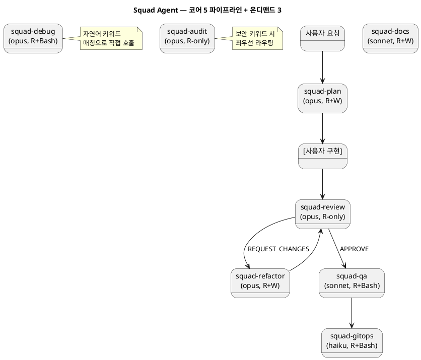
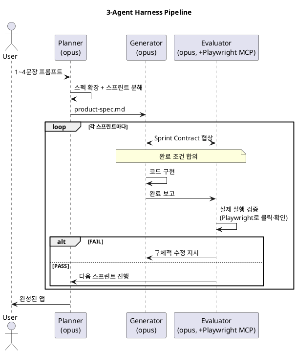
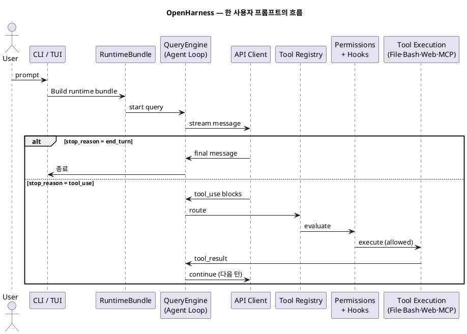
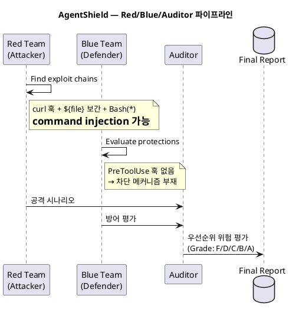
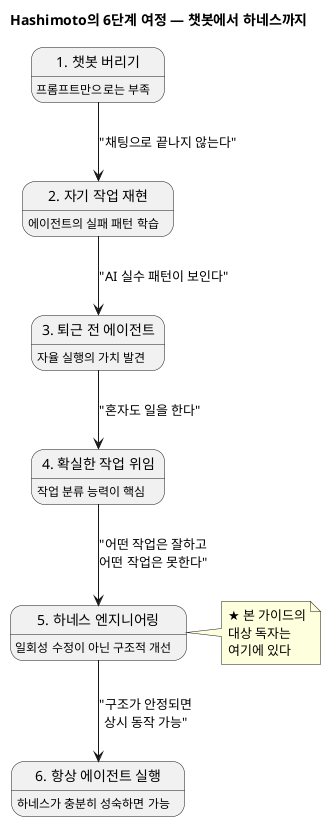
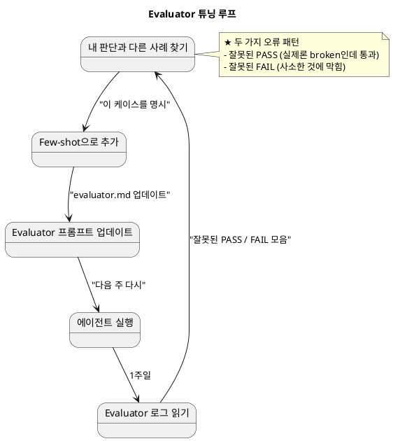
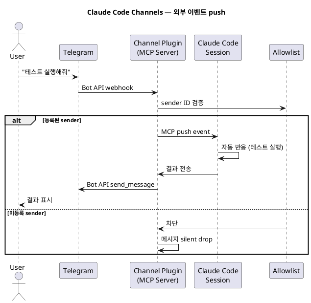
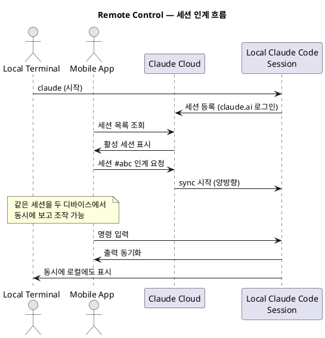
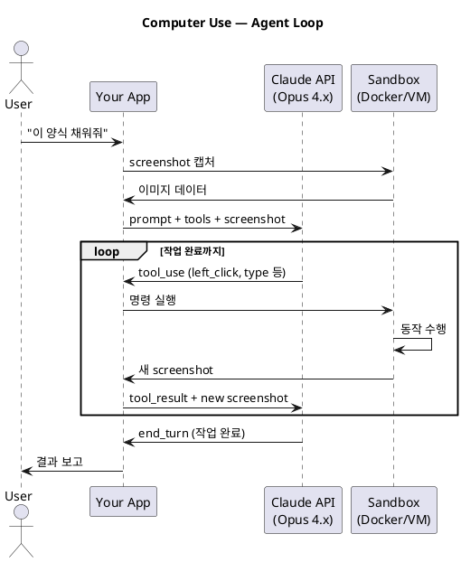

# LEVEL 9 — 하네스 엔지니어링·클로드 코드 베스트 프렉티스

> **메인 프로젝트:** 하네스 엔지니어링 with SubAgent CLI 구축하기
>
> Level 7은 Claude Code를 단순 "AI 코딩 어시스턴트"에서 **자기 검증 가능한 자율 시스템**으로 끌어올리는 단계다. 7.1에서 서브에이전트 시스템을 직접 만들어 오픈소스로 배포하고, 7.2~7.3에서 Anthropic Labs와 홍콩대 OpenHarness가 정립한 하네스 엔지니어링 이론을 학습한다. 7.4에서 그 이론을 자기 프로젝트에 적용하는 10단계 가이드를 따라가고, 7.5~7.6에서 멀티 에이전트 확장과 자율 운용까지 다룬다.

---

## 학습 흐름 한눈에

```
7.1  Subagent 직접 만들기      → 8개 에이전트 + 9개 커맨드 + 3개 훅으로 SubAgent CLI 빌드 → npm 배포
7.2  하네스 엔지니어링 이론     → 두 실패 모드 → 세 기둥 → GAN 영감 멀티 에이전트 → 평가 기준
7.3  오픈소스 케이스 분석       → OpenHarness(이론·구현) + ECC(생태계·메타 레이어)
7.4  내 프로젝트에 적용         → Hashimoto 6단계 진단 → 슬롯 설계 → 평가 기준 → 튜닝 루프
7.5  멀티 에이전트 확장         → 3 에이전트 병렬 + 결과 수렴
7.6  자율 운용                  → Headless · Auto · Dispatch · Channels · Remote · Computer Use
```

---

# 7.1 Subagent의 이해와 구현

## 7.1.1 `.claude/agents/<name>.md` 작성법

서브에이전트(sub-agent)는 메인 Claude Code 세션 안에서 **독립된 컨텍스트 윈도우**를 갖고 동작하는 전문화된 AI 인스턴스다. 메인 세션의 컨텍스트를 오염시키지 않고 특정 작업만 처리한 뒤, 결과 요약만 메인으로 반환한다.

### 호출 방식 비교

```
[일반 호출 — 인라인]
사용자 → Claude (메인 컨텍스트)
        └─ git diff (30k) + 파일 읽기 (16k) + 분석 (15k) 모두 메인에 누적

[서브에이전트 호출]
사용자 → Claude (메인 컨텍스트)
        └─ Agent(subagent_type="code-reviewer")
            └─ 새 컨텍스트 윈도우에서 git diff·파일·분석 실행
            └─ 최종 요약(2k)만 메인 컨텍스트로 반환
```

> ⚠️ `claude -p`로 외부 프로세스를 띄우는 게 **아니다**. 같은 프로세스 내부에서 Agent 도구로 위임된다.

### 파일 구조

```
~/.claude/agents/<name>.md          # 사용자 전역 (모든 프로젝트에서 사용)
.claude/agents/<name>.md            # 프로젝트 (git 커밋 → 팀 공유)
```

> **충돌 시 우선순위**: 프로젝트 > 사용자 전역. 같은 이름이면 프로젝트 정의가 이긴다 (팀 룰 강제용).

### 표준 에이전트 정의 형식

```markdown
---
name: code-reviewer
description: >
  Expert code review agent. Use PROACTIVELY after code changes.
  Pipeline: APPROVE → /qa, REQUEST_CHANGES → /refactor
tools: Read, Bash, Glob, Grep
model: opus
maxTurns: 15
---

You are a senior staff engineer conducting thorough code reviews.

## Review Process
1. Run `git diff HEAD~1` to identify modified files.
2. For each file, read the full file for context.
3. Classify findings: Critical / High / Medium / Low.

## Rules
- NEVER modify any files. Read-only.
- Focus on the DIFF, not the entire codebase.

## Output Format
| Severity | File:Line | Issue | Suggested Fix |
|----------|-----------|-------|---------------|
```

두 부분으로 구성된다 — **frontmatter**(YAML 메타데이터·도구·모델) + **시스템 프롬프트**(페르소나·절차·출력 형식).

### Frontmatter 필드 레퍼런스

| 필드 | 필수 | 기본값 | 설명 |
|------|------|--------|------|
| `name` | ✅ | — | 에이전트 ID. `Agent(subagent_type="...")`에 매칭 |
| `description` | ✅ | — | 자동 위임 트리거. `PROACTIVELY` 포함 시 자동 호출 |
| `tools` | ❌ | (상속) | 콤마 구분 도구 목록. 없으면 메인 세션 도구 상속 |
| `model` | ❌ | inherit | `haiku` / `sonnet` / `opus` / `inherit` |
| `maxTurns` | ❌ | — | 최대 턴 제한 (무한 루프 방지) |
| `permissionMode` | ❌ | — | `plan` / `acceptEdits` / `bypassPermissions` (Auto 모드에서는 무시됨) |
| `skills` | ❌ | — | 사전 로드할 스킬 |
| `mcpServers` | ❌ | — | 에이전트 전용 MCP 서버 |
| `hooks` | ❌ | — | 에이전트 전용 훅 |
| `background` | ❌ | false | 백그라운드 실행 |

> 출처: [Claude Code Sub-agents 공식 문서](https://code.claude.com/docs/en/sub-agents) ✅ 검증

### 작성 시 자주 하는 실수

| 문제 | 해결 |
|------|------|
| description에 콜론(`:`) 포함 시 YAML 파싱 실패 | `description: >` 블록 사용 |
| 들여쓰기에 탭 사용 시 YAML 에러 | 공백(스페이스)만 사용 |
| `tools` 누락으로 모든 도구 상속 → 의도치 않은 권한 | 항상 명시적으로 작성 |
| 무한 루프 우려 | `maxTurns: 15` 명시 |

---

## 7.1.2 역할별 모델 선택 — Opus·Sonnet·Haiku 3-Tier 라우팅

작업 성격에 따라 모델을 분배하면 **정확도와 비용을 동시에 최적화**할 수 있다. 모든 작업을 Opus로 돌리는 건 비싸고, 모든 작업을 Haiku로 돌리는 건 위험하다.

### 작업 → 모델 매트릭스

| 작업 성격 | 권장 모델 | 이유 |
|----------|----------|------|
| 보안·로직 검토 | **opus** | 미스 비용이 큰 깊은 추론 |
| 아키텍처 설계 | **opus** | 엣지케이스·트레이드오프 고려 |
| 안전한 리팩토링 | **opus** | 의미 보존을 위한 깊은 이해 |
| 디버깅 (근본 원인 분석) | **opus** | 표면 너머의 인과 추적 |
| 보안 감사 | **opus** | 놓치면 프로덕션 사고 |
| 테스트 실행·결과 정리 | **sonnet** | 단순 실행·구조화 |
| 문서 생성 (코드→자연어) | **sonnet** | 변환 작업 |
| 일반 구현 | **sonnet** | 균형점, 기본값 |
| 커밋 메시지 작성 | **haiku** | 패턴 작업, 비용 최적화 |
| 단순 린트·포맷 | **haiku** | 결정론적 작업 |
| 라벨링·분류 | **haiku** | 패턴 매칭 |

### 글로벌 오버라이드

```bash
# 모든 서브에이전트를 sonnet으로 통일 (비용 절감 시)
export CLAUDE_CODE_SUBAGENT_MODEL=sonnet

# 특정 에이전트만 다른 모델 강제 (frontmatter)
model: haiku  # 비용 최적화
model: opus   # 정확도 최우선
model: inherit  # 메인 세션 모델 상속 (기본값)
```

### 비용 추정 가이드 (2026.04 기준)

| 모델 | 입력 / 출력 (1M 토큰) | 적합 |
|------|---------------------|------|
| Opus 4.7 / 4.6 | $5 / $25 | 복잡 추론, 보안 |
| Sonnet 4.6 | $3 / $15 | 일반 구현, 기본값 |
| Haiku 4.5 | $1 / $5 | 패턴 작업, 대량 처리 |

> 출처: [Anthropic Claude API Pricing 2026](https://www.silicondata.com/use-cases/anthropic-claude-api-pricing-2026/) ✅

> ⚠️ **주의**: Haiku 4.5는 **prompt injection 보호가 없다**. 신뢰할 수 없는 입력을 처리하는 에이전트에는 Haiku를 쓰지 마라. 출처: [Everything Claude Has Shipped in 2026](https://www.the-ai-corner.com/p/everything-claude-shipped-2026-complete-guide) ✅

### 라우팅 결정 프레임

```
질문: "이 에이전트가 잘못 판단하면 무엇을 잃는가?"

  답이 "프로덕션 사고/보안 사고"          → opus
  답이 "재작업 1시간"                     → sonnet
  답이 "텍스트 한 줄 다시 쓰기"           → haiku
```

---

## 7.1.3 도구 권한 분리 (Toolset Isolation)

프롬프트로 "수정하지 말라"고 지시하는 건 LLM이 무시할 수 있다. 진짜 강제는 **도구 자체를 부여하지 않는 것**이다. Write 도구가 frontmatter에 없으면 호출 자체가 차단된다.

### 도구 순서 표준 (Tool Ordering)

| 유형 | 도구 순서 | 적용 사례 |
|------|----------|----------|
| Read-only | `Read, Bash, Glob, Grep` | code-reviewer, security-auditor |
| Read + Bash 실행 | `Read, Bash, Glob, Grep` | qa-runner (테스트 실행) |
| Write (Bash 없음) | `Read, Write, Edit, Glob, Grep` | doc-writer |
| Write + Bash | `Read, Write, Edit, Bash, Glob, Grep` | planner, refactor-cleaner |

> 도구 순서는 **하드 제약**이다. `tools:` 필드에 없는 도구는 호출 자체가 차단된다.

### Bash 도구 사용 시 화이트리스트 + 블랙리스트 패턴

Bash는 강력하다 — 시스템 전체를 망가뜨릴 수 있다. 시스템 프롬프트에 명시적 허용·금지 리스트를 둔다.

```markdown
## Allowed Commands

git diff, git log, git show, git status
grep, cat, wc, find, head, tail
npx tsc --noEmit, npm test

## NEVER Run

rm, mv, dd
git commit, git push, git reset --hard
npm install, npm publish
Any write or destructive operation
```

> **두 섹션 모두 두는 이유**: LLM이 화이트리스트만 보고 우회를 시도할 수 있기 때문에 명시적 블랙리스트가 안전망 역할을 한다.

### Write 권한 에이전트는 반드시 `## Boundaries` 섹션 필수

```markdown
## Boundaries

**Will:**
- Read and analyze code changes
- Create new feature branches
- Modify files within the specified scope

**Will Not:**
- Modify test files (→ qa-runner agent)
- Run `git commit` or `git push` (→ gitops agent)
- Touch CI/CD config files
- Refactor and fix bugs simultaneously
```

각 "Will Not" 항목에 **위임 대상을 명시**하면 책임이 모호한 부분이 다른 에이전트로 자연스럽게 흘러간다.

### Auto 모드에서의 주의사항

Auto 모드(`--enable-auto-mode`)에서는 **Subagent의 `permissionMode` frontmatter가 무시된다**. Auto 모드의 Classifier가 모든 Subagent 동작을 검토하므로, Subagent에서 별도 권한 모드를 지정해도 효과가 없다.

> 출처: Claude Code 공식 문서의 Permission Modes 섹션 (Level 6에서 상세 다룸 — 재활용)

### 안전 프로토콜 — Write 권한 에이전트 필수 패턴

```markdown
## Safety Protocol (MANDATORY — execute before ANY file modification)

1. Run `git stash list && git status` to verify clean working state.
2. Run `git stash push -m "pre-refactor-checkpoint"` if there are unstaged changes.
3. Proceed with refactoring.
4. After all changes, run `git diff --stat` to summarize.

If `git status` shows uncommitted changes that aren't yours,
STOP and report.
```

→ **Write 권한 = 자동 롤백 가능 상태 보장 의무**. 사용자의 in-progress 작업을 절대 덮어쓰지 않는다.

---

## 7.1.4 SubAgent CLI의 기능과 구현 I

> 이 절부터 7.1.6까지는 실제 작동하는 오픈소스 SubAgent CLI를 빌드한다. 기준 프로젝트는 `claude-code-expert/subagents`(Squad Agent v1.3.2) — 8개의 전문 에이전트 + 9개 슬래시 커맨드 + 3개 훅으로 구성된 시스템이다.
>
> 자세한 구현은 별도 슬라이드 자료(`7.1.4-SubAgent-CLI-기능과-구현-I.md`)에 담겨 있다. 본 절에서는 핵심 설계 결정과 시스템 전체 지도를 다룬다.

### Squad Agent — 8개 에이전트 전체 지도

```
┌─── 코어 파이프라인 (자동 체이닝) ───────────────────────────────┐
│                                                                │
│  squad-plan → [구현] → squad-review → squad-qa → squad-gitops  │
│    opus                  opus  ◄──┐    sonnet      haiku       │
│    R+W                   R-only   │    R+Bash      R+Bash      │
│                                   │                            │
│                            squad-refactor                      │
│                              opus · R+W                        │
│                                                                │
├─── 온디맨드 (필요 시 호출) ────────────────────────────────────┤
│  squad-debug (opus)   squad-docs (sonnet)   squad-audit (opus) │
│  R+Bash               R+W                   R-only             │
└────────────────────────────────────────────────────────────────┘
```



### 8개 에이전트 — 책임·모델·도구 분배

| 에이전트 | 역할 | 모델 | 도구 | 라우팅 근거 |
|---------|------|------|------|------------|
| `squad-review` | 코드 리뷰 | opus | Read, Bash, Glob, Grep | 보안·로직 = 깊은 추론 |
| `squad-plan` | 기획·와이어프레임 | opus | +Write, Edit | 설계·엣지케이스 |
| `squad-refactor` | 리팩토링 | opus | +Write, Edit | 안전한 구조 변환 |
| `squad-qa` | 테스트·QA | sonnet | Read, Bash, Glob, Grep | 실행·결과 정리 |
| `squad-debug` | 디버깅 | opus | Read, Bash, Glob, Grep | 근본 원인 분석 |
| `squad-docs` | 문서 작성 | sonnet | Read, Write, Edit | 코드→자연어 변환 |
| `squad-gitops` | Git 자동화 | haiku | Read, Bash, Glob, Grep | 패턴 작업, 비용 최적화 |
| `squad-audit` | 보안 감사 | opus | Read, Bash, Glob, Grep | 보안은 놓치면 안 됨 |

### 토큰 절감 효과 — 단발 vs 누적

```
[20개 파일 리뷰 — 단일 호출 기준]
인라인:        85k 메인 컨텍스트
서브에이전트:  26k 메인 + 69k 서브(폐기) = 총 95k (단발은 +12% 비쌈)

[10턴 누적 효과]
메인 컨텍스트는 매 턴 input token으로 재전송됨
인라인:        85k × 10턴 = 850k 누적
서브에이전트:  26k × 10턴 = 260k 누적
차이:          590k 토큰 절감 (-69%)
```

> **결론**: 서브에이전트는 **컨텍스트 위생(context hygiene) 도구**다. 짧은 세션엔 손해, 긴 세션엔 압도적 이득.

### 핵심 설계 원칙 4가지

1. **단일 책임 원칙(SRP)을 에이전트 레벨에 적용** — `squad-review`는 찾기만, `squad-refactor`는 수정만, `squad-qa`는 테스트만
2. **도구 권한 ≠ 프롬프트 지시** — "수정하지 말라"는 무시될 수 있다. Write 도구를 미부여하면 호출이 차단된다
3. **파이프라인 컨텍스트** — 각 에이전트의 description에 `Pipeline:` 라인을 넣어 워크플로우 위치 명시
4. **페르소나 + 절차 + 출력 형식** — 시스템 프롬프트 = "당신은 X다" + "이 순서로 일하라" + "이 형식으로 보고하라"

---

## 7.1.5 SubAgent CLI의 기능과 구현 II

> 7.1.4가 에이전트 정의 형식이었다면, 7.1.5는 **에이전트를 호출하고 자동화하는 메커니즘**이다. 슬래시 커맨드, 훅, 자연어 자동 라우팅을 다룬다. 상세 구현은 별도 슬라이드(`7.1.5-SubAgent-CLI-기능과-구현-II.md`) 참조.

### 슬래시 커맨드 — 명시적 호출

```markdown
<!-- ~/.claude/commands/squad-review.md -->
---
description: "Code review. Usage: /squad-review [scope]"
allowed-tools: Agent
---
Invoke the squad-review subagent. Default scope: last commit diff.
$ARGUMENTS
```

핵심 포인트:

- `allowed-tools: Agent` — 슬래시 커맨드는 Agent 도구만 허용 (다른 도구 차단)
- `$ARGUMENTS` — 사용자 입력 인자 자동 치환
- 본문은 Claude에게 주는 지시문 — "Invoke the squad-X subagent"로 위임 강제

### 3개 훅 시스템

```
┌─── Squad Agent의 3개 훅 ───────────────────────────────────────┐
│                                                                │
│  1. UserPromptSubmit  → squad-router.sh                        │
│     사용자 프롬프트 제출 시 키워드 분석 → 자동 라우팅              │
│                                                                │
│  2. SubagentStart     → subagent-chain.sh                      │
│     서브에이전트 시작 시 OS 알림 발생                              │
│                                                                │
│  3. SubagentStop      → subagent-chain.sh                      │
│     서브에이전트 종료 시 OS 알림 + 다음 단계 안내                   │
│                                                                │
└────────────────────────────────────────────────────────────────┘
```

### 자연어 자동 라우팅 — Squad Router

사용자가 "이 코드 보안 검사해줘"라고 입력하면 슬래시 명령 없이도 자동으로 `squad-audit`에 위임된다. 핵심은 `UserPromptSubmit` 훅이 stdin으로 받은 프롬프트를 키워드로 매칭하고, `hookSpecificOutput.additionalContext`로 system-reminder 컨텍스트 주입하는 것.

### 80개 키워드 → 8개 에이전트 매핑 (우선순위 순)

| 우선순위 | 에이전트 | 주요 키워드 |
|---------|---------|------------|
| 1 | squad-audit | 보안, security, 취약점, vulnerability, OWASP, 시크릿, injection, xss, csrf |
| 2 | squad-debug | 디버그, debug, 에러, error, 버그, bug, 크래시, traceback, exception |
| 3 | squad-plan | 기획, 설계해, 와이어프레임, wireframe, 유저스토리, brainstorm, spec |
| 4 | squad-refactor | 리팩토링, refactor, 클린업, cleanup, 추출, extract, 중복 제거 |
| 5 | squad-docs | 문서화, 문서, document, readme, jsdoc, tsdoc, 주석, comment |
| 6 | squad-gitops | 커밋, commit, 체인지로그, changelog, 릴리즈 노트, conventional |
| 7 | squad-qa | 테스트, test, qa, 검증, 린트, lint, 타입체크, regression |
| 8 | squad-review | 리뷰, review, 코드 검토, 검토해, diff 봐 |

> **광범위한 키워드(`review`)는 가장 마지막 순위** — 다른 키워드가 먼저 매칭되도록.
>
> POC 검증 결과: 112개 테스트 케이스 100% pass (false positive 0%)

### 키워드 선정 3대 기준

1. **Hit rate (적중률)** — `보안`은 100% 보안 의도, `정리해`는 회의록도 매칭 → 제외
2. **False Positive Resistance (오탐 저항성)** — `dry`, `docs`, `안돼`처럼 일반어는 제외
3. **Conflict Safety (충돌 안전성)** — `PR 리뷰`→review, `PR 작성`→gitops로 다단어 분리

### Router 비활성화 옵션

| 방법 | 범위 | 예시 |
|------|------|------|
| `--no-route` 추가 | 건별 | `"리뷰해줘 --no-route"` |
| `#direct` 마커 | 건별 | `"리뷰해줘 #direct"` |
| `SQUAD_ROUTER=off` | 전역 | `export SQUAD_ROUTER=off` |
| 슬래시 커맨드 사용 | 자동 | `/squad-review` (스킵됨) |

> 사용자가 명시적으로 슬래시를 입력했다면 자동 라우팅을 건너뛴다 — **명시적 의도 존중**

### 훅 stdout 처리 — 흔한 실수

| 훅 이벤트 | stdout 사용 | 비고 |
|----------|------------|------|
| **UserPromptSubmit** | ✅ JSON으로 컨텍스트 주입 가능 | `hookSpecificOutput.additionalContext` |
| **SubagentStart** | ❌ 화면 표시 안 됨 | OS 알림 사용 |
| **SubagentStop** | ❌ 화면 표시 안 됨 | OS 알림 사용 |

```bash
# ❌ SubagentStop에서 echo로 안내 — Claude Code TUI에 표시 안 됨
echo "Next: /squad-qa"

# ✅ OS 네이티브 알림 사용
osascript -e "display notification \"Next: /squad-qa\""   # macOS
notify-send "Squad" "Next: /squad-qa"                      # Linux
```

### 메타 케이스 스터디 — Squad Router는 squad-plan으로 만들어졌다

> Squad Router 훅(v1.3.0)은 `squad-plan` 에이전트가 직접 작성한 497줄짜리 기획서(`docs/plans/squad-router-hook.md`)로 만들어진 산출물이다.

```
[v1.2.x 시점]
  squad-plan 에이전트 (이미 존재)
        │
        │ /squad-plan "자연어 자동 라우팅 훅 만들어줘"
        ↓
[squad-plan이 산출]
  - US-001 ~ US-006 (6개 유저스토리)
  - Conflict Resolution Strategy
  - Phase 1/2/3 case 문 구조
  - Open Questions (Hook stdout 효과 검증 등)
        ↓
[사용자 구현]
  hooks/squad-router.sh + install.sh 수정
        ↓
[v1.3.0 릴리스]
  Squad Router 훅 — squad-plan이 만든 또 다른 squad 에이전트의 호출자
```

> "에이전트로 에이전트 시스템을 키운다" — Squad Agent가 자기 자신을 확장한 첫 번째 사례. 이 패턴이 7.4의 하네스 적용 가이드 STEP 9 "Evaluator 튜닝 루프"의 모티브가 된다.

---

## 7.1.6 SubAgent CLI 오픈소스로 배포하기

> 만든 에이전트 시스템을 다른 사람이 한 줄로 설치할 수 있게 배포한다. `install.sh` 단일 스크립트로 로컬·원격·언인스톨을 분기, GitHub Releases로 자동 빌드, npm으로도 배포한다. 상세 구현은 별도 슬라이드(`7.1.6-SubAgent-CLI-오픈소스로-배포하기.md`) 참조.

### 배포 채널 비교

| 방법 | 장점 | 단점 | 적합한 경우 |
|------|------|------|------------|
| **curl \| bash** (원라인) | 한 줄 설치, 의존성 없음 | 보안 우려, 업데이트 수동 | 셸 스크립트 도구, 데모 |
| **GitHub Releases** | 버전 관리, 체크섬, 변경 이력 | 단계 복잡 | 정식 릴리스 채널 |
| **npm/pnpm/yarn** | 자동 업데이트, npx 즉시 실행 | Node.js 의존성 | JS/TS 생태계 |
| **Homebrew** | macOS 표준 | tap 등록 부담 | macOS 타겟 도구 |

### install.sh — 단일 진입점 패턴

```bash
#!/bin/bash
set -euo pipefail

REPO="claude-code-expert/subagents"
VERSION=$(cat "$(dirname "${BASH_SOURCE[0]}")/VERSION" 2>/dev/null || echo "1.3.2")

main() {
  case "${1:-}" in
    --uninstall|-u) uninstall ;;
    --version|-v)   echo "Squad Agent v$VERSION" ;;
    --dev)          register_precommit ;;
    --help|-h)      print_help ;;
    *)              banner; do_install "$(find_source_dir)" || download_and_install ;;
  esac
}

main "$@"
```

> **단일 진입점 main 함수**로 감싸는 이유: `curl | bash`로 다운로드 도중 끊겨도 부분 실행 방지

### 원라인 설치 흐름

```bash
curl -sL https://raw.githubusercontent.com/claude-code-expert/subagents/main/install.sh | bash
```

```
1. curl이 install.sh 전체 다운로드
2. bash가 stdin으로 받아 실행
3. install.sh가 로컬 소스 디렉토리 탐색 (find_source_dir)
4. 로컬 소스 없음 → GitHub Releases에서 최신 tar.gz 다운로드
5. SHA256 체크섬 검증
6. ~/.claude/{agents,commands,hooks}/ 에 복사
7. settings.json에 훅 자동 등록 (jq 사용)
```

### GitHub Releases 자동화 — `.github/workflows/release.yml`

```yaml
name: Release

on:
  push:
    tags: ['v*']

permissions:
  contents: write

jobs:
  release:
    runs-on: ubuntu-latest
    steps:
      - uses: actions/checkout@v4

      - name: Build archive
        run: |
          mkdir -p dist/squad-agents
          cp -r agents commands hooks install.sh VERSION LICENSE README.md \
                dist/squad-agents/
          cd dist
          tar czf "squad-agents-${GITHUB_REF_NAME}.tar.gz" squad-agents/
          shasum -a 256 "squad-agents-*.tar.gz" > "squad-agents-*.tar.gz.sha256"

      - name: Create Release
        uses: softprops/action-gh-release@v2
        with:
          name: "Squad Agent ${{ github.ref_name }}"
          files: |
            dist/squad-agents-*.tar.gz
            dist/squad-agents-*.tar.gz.sha256
          generate_release_notes: true
```

### CI 파이프라인 — `.github/workflows/ci.yml`

```yaml
name: CI

on:
  pull_request: { branches: [main] }
  push: { branches: [main] }

jobs:
  validate:
    runs-on: ubuntu-latest
    steps:
      - uses: actions/checkout@v4
      - name: ShellCheck
        run: |
          sudo apt-get install -y shellcheck
          shellcheck install.sh hooks/squad-router.sh
      - run: bash tests/test-router.sh
      - run: bash tests/test-files.sh
      - run: bash install.sh --version
```

### npm 배포 — bash 도구를 Node 패키지로 포팅

```json
{
  "name": "squad-agents",
  "version": "1.3.2",
  "description": "Claude Code sub-agent system — review, plan, refactor, QA...",
  "bin": { "squad-agents": "./bin/squad-agents.js" },
  "files": ["bin/", "src/", "assets/", "README.md", "LICENSE"],
  "engines": { "node": ">=18" },
  "license": "Apache-2.0",
  "keywords": ["claude-code", "subagent", "ai-agent", "cli"]
}
```

```bash
npm login
npm pack                # 로컬 검증
npm install -g ./squad-agents-1.3.2.tgz
squad-agents --version

npm publish --access public

# 사용자 설치
npm install -g squad-agents
# 또는 즉시 실행
npx squad-agents install
```

### 라이선스 선택

| 라이선스 | 특징 | 적합 |
|---------|------|------|
| **MIT** | 가장 자유, 짧음 | 단순 도구 |
| **Apache 2.0** | 특허 명시, 변경 고지 | 기업 친화 |
| **GPL v3** | 카피레프트 | 파생물도 오픈소스 강제 |
| **AGPL v3** | 서버 사이드도 GPL 적용 | SaaS 형태 보호 |

> Claude Code 생태계 도구는 **Apache 2.0 또는 MIT**가 기본 선택지. ECC는 MIT, Squad Agent 예제는 Apache 2.0.

### 운영 체크리스트

매 릴리스마다:

- [ ] VERSION 파일 업데이트
- [ ] CHANGELOG.md에 변경 사항 기록 (Keep a Changelog 형식)
- [ ] `bash tests/run-all.sh` 통과 확인
- [ ] `git tag vX.Y.Z && git push --tags`
- [ ] GitHub Actions release.yml 실행 확인
- [ ] 새 환경에서 `curl | bash` 설치 테스트

---

# 7.2 하네스 엔지니어링

## 7.2.1 하네스 엔지니어링이란 — 용어의 탄생과 정의

### 한 줄 정의

> **Agent Harness = LLM을 "기능하는 에이전트"로 만들기 위해 모델 주위를 감싸는 인프라 전체**

```
모델(LLM)이 제공하는 것:        지능 (intelligence)
하네스(Harness)가 제공하는 것:  손 · 눈 · 기억 · 안전 경계
```

OpenHarness 프로젝트의 README가 정의하는 Harness 방정식:

```
Harness  =  Tools  +  Knowledge  +  Observation  +  Action  +  Permissions
            (도구)   (지식)        (관찰)         (행동)     (권한)
```

> 출처: [HKUDS/OpenHarness README](https://github.com/HKUDS/OpenHarness) ✅

### 슬로건 — "The model is the agent. The code is the harness."

(모델이 에이전트다. 코드는 하네스일 뿐이다.)

이것은 **모델 비종속성** 원칙을 함축한다 — Claude, GPT, Kimi, GLM, Gemini, Ollama 로컬 모델 무엇을 쓰든, 하네스는 동일하게 작동해야 한다.

### 왜 지금 하네스 엔지니어링인가

세 가지 변화가 동시에 수렴했다.

| 변화 | 의미 |
|------|------|
| **모델의 상품화** | Claude·GPT·Gemini가 벤치마크에서 좁은 범위로 수렴. 차이를 만드는 것은 모델을 감싸는 시스템 |
| **에이전트의 프로덕션 진입** | 2026년, 에이전트가 실제 프로덕션 코드를 작성. "다운되면 안 된다" 수준의 신뢰도 요구 |
| **벤치마크의 한계** | 벤치마크는 단일 턴 측정. 프로덕션 에이전트는 수백 단계를 실행. 50단계 후 방향 이탈에 1% 향상은 무의미 |

> 출처: 하네스엔지니어링 슬라이드 (Noah, 2026.04) — 프로젝트 자료

### 세 패러다임의 진화 — 포함적 확장

각 단계는 이전을 부정하지 않고 포함하며 확장한다.

```
2022-2024                    2025                    2026
┌──────────────┐         ┌──────────────┐         ┌──────────────┐
│ 프롬프트     │         │ 컨텍스트     │         │ 하네스       │
│ 엔지니어링   │  ───→   │ 엔지니어링   │  ───→   │ 엔지니어링   │
│              │         │              │         │              │
│ "어떻게 말?" │         │ "뭘 알아야?" │         │ "어떤 시스템?"│
│ 단일 입력    │         │ 정보 환경    │         │ 런타임 환경  │
│ Few-shot,CoT │         │ RAG, MCP     │         │ 제약·피드백  │
│ 역할 부여    │         │ 도구 정의    │         │ 상태 관리    │
└──────────────┘         └──────────────┘         └──────────────┘
```

### 컴퓨터 아키텍처 비유

| 계층 | 비유 | 엔지니어링 |
|------|------|-----------|
| Application (에이전트) | 실제 작업 수행 | — |
| **Operating System (하네스)** | 프로세스·메모리·I/O 제어 | ◄ **하네스 엔지니어링** |
| RAM (컨텍스트 윈도우) | RAG, MCP, 대화, 도구 정의 | ◄ 컨텍스트 엔지니어링 |
| CPU (모델) | 프롬프트 = CPU 명령어 | ◄ 프롬프트 엔지니어링 |

> OS 없이 CPU에서 직접 프로그램을 돌리면? → 메모리 충돌, 무한 루프 보호 장치 없음.

### Anthropic의 정의 — "harnesses encode assumptions"

Anthropic Engineering 블로그(2026.04, Managed Agents 발표):

> "A common thread across this work is that **harnesses encode assumptions about what Claude can't do on its own.** However, those assumptions need to be frequently questioned because they can go stale as models improve."
>
> 하네스는 모델이 혼자서는 못 하는 것에 대한 가정을 코드로 박아 넣은 것이다. 모델이 좋아지면 그 가정도 다시 검증해야 한다.

이 관점은 7.4의 STEP 9 "Evaluator 튜닝 루프"와 직결된다. 하네스는 한 번 만들고 끝이 아니라, 모델이 진화할 때마다 재검토해야 한다.

> 출처: [Anthropic — Managed Agents (2026.04)](https://www.anthropic.com/engineering/managed-agents) ✅

---

## 7.2.2 단일 에이전트의 두 실패 모드

Anthropic Labs의 Prithvi Rajasekaran은 2026년 3월 24일 "Harness design for long-running application development" 글에서 단일 에이전트의 두 가지 근본적 실패 모드를 정의했다.

### 실패 모드 1 — 컨텍스트 불안 (Context Anxiety)

- 에이전트는 컨텍스트 창이 채워질수록 품질이 떨어진다
- 일부 모델은 컨텍스트 한계에 다가가면 **작업을 조기 마무리**하려 한다
- 결과: 기능이 stub 상태로 남거나, 핵심 로직이 빠진 채 완료 선언

> Anthropic 팀이 초기 실험에서 **Sonnet 4.5**가 이 경향을 강하게 보였다고 밝혔다. 컨텍스트 압축(`/compact`)으로도 충분하지 않아서, **컨텍스트 리셋**(컨텍스트 윈도우를 완전히 비우고 새 에이전트를 시작하되 이전 상태를 구조화된 핸드오프 문서로 전달)이 필수적이었다고 한다. 이후 등장한 **Opus 4.5**는 이 경향이 크게 줄어들어, 하네스 설계에서 컨텍스트 리셋을 제거할 수 있었다.

### 실패 모드 2 — 자기평가 불능 (Self-Evaluation Blindspot)

- 에이전트에게 자기 작업을 평가하라고 하면 **자신의 결과물을 과하게 칭찬**한다
- "이 기능이 동작합니까?" → "네, 잘 동작합니다" (실제로는 broken)
- 특히 UI/디자인처럼 주관적 영역에서 더 심각

```
"이 API가 제대로 동작합니까?" → "네, 잘 동작합니다."
실제로 열어보면:
  - 에러 케이스 처리 없음
  - 항상 200을 반환
  - 핵심 로직이 stub 상태로 남음
하지만 생성자는 자기 코드를 검토하면서도 "별로 중요하지 않다"고 결론지음
```

> Anthropic 팀의 표현:
> "Separating the agent doing the work from the agent judging it proves to be a strong lever to address this issue."
> (만드는 에이전트와 평가하는 에이전트를 분리하는 것이 이 문제를 해결하는 강력한 레버다.)

> 출처: [Anthropic Engineering — Harness design for long-running application development (2026.03.24)](https://www.anthropic.com/engineering/harness-design-long-running-apps) ✅

### 두 실패 모드의 관계

| 실패 모드 | 무엇이 망가지는가 | 무엇으로 해결하는가 |
|-----------|-----------------|-------------------|
| Context Anxiety | 결과물 완성도 (stub로 끝) | 컨텍스트 리셋 + 구조화된 핸드오프 |
| Self-Eval Blindspot | 결과물 검증 정확도 | Generator-Evaluator 분리 |

이 두 문제를 동시에 해결하는 것이 **하네스 엔지니어링의 출발점**이다.

---

## 7.2.3 하네스의 세 기둥 — 제약 · 피드백 루프 · 상태 관리

세 패러다임은 포함 관계다. 컨텍스트 엔지니어링이 컨텍스트 윈도우 안의 정보를 다룬다면, 하네스 엔지니어링은 **컨텍스트 윈도우 자체의 동작 환경**을 다룬다.

```
하네스 엔지니어링
├── 제약 시스템            (allowed_tools, 린터, 구조 테스트)
├── 피드백 루프            (Generator-Evaluator 분리, 2단계 리뷰)
└── 상태 관리              (파일 핸드오프, 서브에이전트 격리)
        │
        ▼ 포함
컨텍스트 엔지니어링
├── RAG / MCP
├── 대화 히스토리 관리
└── 도구 정의 및 선택
        │
        ▼ 포함
프롬프트 엔지니어링
├── Few-shot, CoT
├── 역할 부여, 출력 형식
```

### 기둥 1 — 제약 (Constraints)

> **탐색 공간이 줄어들면 에이전트는 더 집중된 출력을 생성한다.** (직관에 반하는 생산성)

```markdown
# CLAUDE.md — 구조적 제약 예시

## 절대 금지
- @Transactional 내부에서 외부 API 호출 금지
- Redis 분산락을 트랜잭션 경계 안에서 금지
- ALTER TABLE 전 INSTANT 가능 여부 미확인 시 금지

## 구조적 규칙
- domain은 infrastructure를 import 불가
- API 응답 DTO와 Entity 직접 매핑 금지
```

핵심 인사이트:

- CLAUDE.md는 매 세션 시작 시 자동 로드된다. 에이전트가 "잊을 수 없는" 제약이 된다
- OpenAI Codex 팀: 엄격한 레이어 아키텍처를 린터로 강제 → 에이전트가 레이어를 침범하는 코드 생성이 불가능해짐
- **PreToolUse Hook**: 모델이 규칙을 "잊어도" 메커니즘이 잡아낸다 (예: `@Transactional` 내부 `RedisTemplate.setIfAbsent()` 호출 자동 차단)

### 기둥 2 — 피드백 루프 (Feedback Loop)

검증의 원칙:

1. **완료 조건을 먼저 정한다** — "이 3가지가 되면 끝" — 시작 전에 합의 (Sprint Contract)
2. **조건을 측정 가능하게 쓴다** — "잘 되게" 말고 "테스트 통과 + 빌드 성공"
3. **미달이면 다시 돌린다** — 기준이 있으니 자동 반복이 가능

```
[Sprint Contract]
작업 전에 "뭘 만들고 어떻게 검증할지" 합의한다.
기준 없이 시키면 AI가 끝없이 하거나 대충 끝냈다고 한다.

[Ralph Loop]
기준 달성까지 반복시킨다. 기준이 명확하면 자동화가 가능.
```

### 기둥 3 — 상태 관리 (State Management)

| 전략 | 동작 | 장점 | 단점 |
|------|------|------|------|
| **컴팩션** | 이전 대화를 요약하여 축소 | 연속성 유지 | 컨텍스트 불안 가능 |
| **컨텍스트 리셋** | 세션을 완전히 새로 시작 | 깨끗한 슬레이트 | 핸드오프 필요 |
| **파일 핸드오프** | 파일에 상태 기록, 다음 세션에서 읽기 | 영속적, 인간도 읽기 가능 | 파일 구조 설계 필요 |
| **서브에이전트** | Hashimoto 격리의 핵심 실천 | 태스크별 독립 컨텍스트, 오염 없음 | 오케스트레이션 복잡 |

> `progress.txt` 파일에 현재까지의 진행 상황과 다음 단계를 기록하고, 매 세션 시작 시 에이전트가 이 파일을 읽도록 한다. 인간이 TODO 리스트를 사용하는 것과 동일한 원리.

**파일 핸드오프 구조 예시**:
```
plan.md → sprint-contract.md → sprint-result.md → validation-result.md → lessons-learned.md
```

---

## 7.2.4 GAN 영감 멀티 에이전트 구조 (Planner → Generator ⇄ Evaluator)

Anthropic Labs는 GAN(Generative Adversarial Networks)의 구조에서 영감을 얻었다. GAN에서 생성자(Generator)와 판별자(Discriminator)가 서로 경쟁하며 품질을 높이듯, AI 에이전트도 "만드는 역할"과 "평가하는 역할"을 분리하면 품질이 크게 향상된다.

### 3-에이전트 구조도

```
사용자 프롬프트 (1~4문장)
       │
       ▼
┌──────────────┐
│   PLANNER    │  짧은 프롬프트를 상세 스펙으로 확장
│   (opus)     │  스프린트 단위로 분해
└──────┬───────┘  product-spec.md 작성
       │
       ▼
┌──────────────┐        ┌──────────────┐
│  GENERATOR   │◄──────►│  EVALUATOR   │
│  (opus)      │        │  (opus)      │
│              │        │              │
│ Sprint 계약  │  피드백 │ Sprint 계약  │
│ 협상 후 구현  │◄───────│ 검증 후 판정  │
│              │        │              │
│ 결과: 코드   │        │ 결과: QA 보고 │
└──────┬───────┘        └──────────────┘
       │
       │  FAIL → 피드백 반영 후 재시도
       │  PASS → 다음 스프린트
       ▼
┌──────────────┐
│  완성된 앱   │
└──────────────┘
```



### 세 에이전트 각각의 역할

**Planner** — "TODO 앱 칸반 보드를 만들어줘"라는 한 줄의 요청을 받아, PRD 수준의 상세 스펙을 작성한다. 기능을 스프린트 단위로 분해하고, 각 스프린트의 범위를 정의한다. **기술적 구현 세부사항은 최소화**하고, "무엇을 만들 것인가"에 집중한다. 잘못된 기술 세부사항이 스펙에 들어가면 하위 에이전트에 연쇄적으로 영향을 미치기 때문이다.

**Generator** — 스프린트 단위로 코드를 구현한다. 각 스프린트에서 하나의 기능을 완성하고, 자체 검증 후 Evaluator에게 넘긴다.

**Evaluator** — Generator가 "완료했다"고 보고한 코드를 실제로 실행하면서 검증한다. Anthropic 팀은 Evaluator에게 **Playwright MCP**를 제공하여 실행 중인 앱을 직접 클릭하고 탐색하게 했다. 각 스프린트의 평가 기준에 따라 PASS/FAIL을 판정하고, FAIL 시 구체적인 수정 지시를 Generator에게 전달한다.

> 핵심: "Evaluator는 까다로운 시니어 엔지니어이자 QA 엔지니어"라는 페르소나로 튜닝된다. 관대하게 평가하면 안 된다.

### Sprint Contract — 코딩 전에 "완료" 합의

Generator에게 바로 코딩을 시키는 것이 아니라, Generator와 Evaluator가 "이번 스프린트에서 무엇을 만들고, 어떻게 검증할 것인가"를 먼저 합의한다.

```markdown
# Sprint 3 계약: 드래그앤드롭 구현

## Generator 제안
이번 스프린트에서 @dnd-kit을 사용하여 칼럼 간, 칼럼 내 카드 드래그앤드롭 구현.

### 구현 범위
- [ ] 칼럼 간 카드 이동 (상태 변경)
- [ ] 같은 칼럼 내 순서 변경
- [ ] 낙관적 업데이트 (UI 즉시 반영, API 비동기)
- [ ] API 실패 시 롤백

### 완료 조건
1. Backlog→TODO 드래그 시 status 변경
2. 같은 칼럼 내 순서 변경 시 position 재계산
3. 네트워크 에러 시 카드가 원래 위치로 복귀
4. npm test 통과

---

## Evaluator 검토
다음 추가 조건 포함 필수:

5. BACKLOG → TODO 이동 시 startedAt 자동 설정
6. TODO → BACKLOG 복귀 시 startedAt = null
7. 어떤 칼럼 → DONE 이동 시 completedAt 자동 설정
8. DONE → 다른 칼럼 이동 시 completedAt = null
9. position 간격이 1 이하로 좁아지면 칼럼 전체 재정렬

### 테스트 방법
- Playwright로 실행 중인 앱에서 직접 드래그앤드롭
- DB 상태를 API로 검증 (GET /api/tickets 후 필드 값 확인)
- 네트워크 차단 후 롤백 동작 확인

위 9개 조건 중 하나라도 FAIL이면 스프린트 전체 FAIL.

---

## 합의
Generator: 동의합니다. 구현을 시작합니다.
```

> 실제 Anthropic 팀의 실험에서, 한 스프린트의 계약에 **27개의 검증 기준**이 포함된 사례도 있었다. 이 정도로 구체적이어야 Evaluator가 "대충 봐주고 PASS" 하는 것을 방지할 수 있다.

### Lazy Delegation 안티패턴 — 절대 금기

```python
# ❌ BAD — 이해를 워커에게 떠넘김
agent(prompt="Based on your findings, fix the auth bug")

# ✅ GOOD — Coordinator가 이해를 명시
agent(
    description="Fix the null pointer in src/auth/validate.ts:42",
    subagent_type="worker",
    prompt=(
        "Fix the null pointer exception in validate.ts:42 "
        "when sessions expire but the token remains cached. "
        "Add a null check before user.id access — "
        "if null, return 401 with 'Session expired'. "
        "Commit and report the hash."
    )
)
```

원칙:

> **"You never hand off understanding to another worker."**
> (이해는 절대 위임하지 않는다.)

> 출처: HARNESS-ENGINEERING-LECTURE.md (HKUDS OpenHarness 분석) — 첨부 자료

---

## 7.2.5 평가 기준 4가지 — 디자인 · 독창성 · 크래프트 · 기능성

하네스 설계에서 가장 먼저 해야 할 일은 "좋은 결과"를 구체적으로 정의하는 것이다. 주관적인 판단을 그대로 두면 에이전트도 개발자도 결과를 일관되게 평가할 수 없다.

### Anthropic 프론트엔드 실험의 4가지 기준

| 기준 | 핵심 질문 | 가중치 |
|------|-----------|--------|
| **디자인 품질** | 색상, 타이포, 레이아웃이 하나의 일관된 분위기를 만드는가? | ★★★★★ |
| **독창성** | 라이브러리 기본값이나 AI 특유의 패턴을 그대로 쓴 것은 아닌가? | ★★★★★ |
| **크래프트** | 타이포그래피 계층, 간격 일관성, 색상 대비가 기본 이상인가? | ★★★ |
| **기능성** | 사용자가 UI를 이해하고 주요 동작을 완료할 수 있는가? | ★★★ |

### 왜 디자인 품질·독창성 가중치가 더 높은가?

AI는 크래프트와 기능성은 **기본적으로 잘 해낸다**. 문제는 항상 "AI 티가 나는" 평범한 결과물이다.

```
보라색 그라데이션 위에 흰색 카드, 모든 SaaS 랜딩 페이지에서 본 듯한 레이아웃,
어디서나 본 lucide 아이콘, 가운데 정렬된 hero text...
```

→ **평가 기준의 가중치 자체가 에이전트의 방향을 조정**한다. 가중치를 높게 두면 에이전트가 그 영역에 더 신경 쓴다.

> 출처: [Anthropic Engineering — Harness design for long-running application development](https://www.anthropic.com/engineering/harness-design-long-running-apps) ✅

### 풀스택 프로젝트용 평가 기준 (조정된 가중치)

프론트엔드가 아니라 풀스택 앱이라면 가중치를 다르게 두어야 한다. 예시:

```markdown
## TODO 칸반 앱 평가 기준

### 1. 기능 완성도 (★★★★★)
- 스펙에 정의된 기능이 end-to-end로 동작하는가?
- stub 함수나 TODO 주석이 남아있지 않은가?
- 에러 케이스(null, 빈 배열, 네트워크 오류)를 처리하는가?
- "동작하는 척"이 아니라 실제 사용 시나리오에서 작동하는가?

### 2. 데이터 무결성 (★★★★★)
- 드래그앤드롭 시 startedAt/completedAt 자동 관리 규칙이 정확한가?
- position 재계산이 올바른가?
- 낙관적 업데이트 실패 시 롤백이 작동하는가?

### 3. 타입 안전성 (★★★)
- any 타입 사용이 없는가?
- TypeScript 컴파일 에러가 없는가? (`npx tsc --noEmit`)
- Zod 스키마와 Drizzle 스키마가 일치하는가?

### 4. 테스트 커버리지 (★★★)
- 핵심 비즈니스 로직에 단위 테스트가 있는가?
- 엣지 케이스가 테스트되었는가?
- npm test가 0 failures로 통과하는가?
```

가중치가 높은 항목에 주목하라. **기능 완성도와 데이터 무결성이 최우선**이다. 가장 복잡한 비즈니스 규칙은 상태 전이에 따른 타임스탬프 자동 관리인데, 이 부분이 깨지면 앱 전체의 신뢰성이 무너진다. 타입 안전성과 테스트 커버리지는 AI가 기본적으로 잘 해내는 영역이므로 가중치를 낮게 둔다.

---

## 7.2.6 평가 기준의 정량화

평가 기준을 ★ 가중치만으로 두면 여전히 주관적이다. 진짜 자동화하려면 **에이전트가 그레이딩할 수 있는 측정 가능한 기준**으로 변환해야 한다.

### 정량화의 3단계 단계적 변환

```
Level 1: 주관적                    "디자인이 좋은가?"
            ↓ 정량화
Level 2: 체크리스트                "색상 팔레트가 3색 이내인가?"
            ↓ 자동화
Level 3: 결정론적 검증              shell 명령으로 PASS/FAIL 판정
```

### Level 3 정량화 예시 — 자동 검증 가능한 기준

```markdown
# 평가 기준 (자동 검증 가능)

## API 완성도 (MUST PASS — 0이 아니면 전체 FAIL)
- [ ] 엔드포인트 실제 DB 연결: `curl localhost:3000/api/users && [ $? -eq 0 ]`
- [ ] 응답 형식 일관: `grep -r "{ data:" src/api/ | wc -l > 0`
- [ ] 테스트 통과: `npm test 2>&1 | grep -c "FAIL" -eq 0`

## 타입 안전성 (MUST PASS)
- [ ] tsc 에러 0개: `npx tsc --noEmit 2>&1 | grep -c "error" -eq 0`
- [ ] any 타입 0개: `grep -rn ": any" src/ | wc -l -eq 0`

## 보안 기본 (MUST PASS)
- [ ] JWT 검증 존재: `grep -r "jwt.verify" src/ | wc -l > 0`
- [ ] 시크릿 하드코딩 없음: `grep -rE "(sk-|api_key|password) ?=" src/ | wc -l -eq 0`

## 코드 품질 (SHOULD PASS — 70% 이상이면 PASS)
- [ ] 함수 50줄 이하 비율: `find src/ -name "*.ts" | xargs awk '...'` ≥ 70%
- [ ] 비즈니스 로직 분리: 컨트롤러 파일 평균 100줄 이하
```

### Sprint Contract의 27개 검증 기준 사례

Anthropic 팀의 실제 실험에서 한 스프린트의 계약에 27개 검증 기준이 들어간 사례:

```markdown
## 드래그앤드롭 + 타임스탬프 + 권한 — Sprint 3 검증 기준 (27개)

### 드래그앤드롭 동작 (12개)
1.  Backlog→TODO 드래그 시 status='TODO'로 변경
2.  TODO→IN_PROGRESS 드래그 시 status 변경
3.  IN_PROGRESS→DONE 드래그 시 status 변경
4.  DONE→Backlog 역방향 드래그 가능
5.  같은 칼럼 내 순서 변경 시 position 재계산
6.  position 간격이 1 이하면 칼럼 전체 재정렬
7.  드래그 중 시각 피드백 (그림자, 투명도)
8.  드롭 가능한 영역 하이라이트
9.  드롭 영역 외부에 놓으면 원위치
10. 키보드 접근성 (Space로 픽업, 화살표로 이동)
11. 모바일 터치 이벤트 지원
12. 스크롤 자동 트리거 (긴 칼럼)

### 타임스탬프 자동 관리 (8개)
13. BACKLOG → TODO/IN_PROGRESS 시 startedAt = NOW()
14. TODO/IN_PROGRESS → BACKLOG 시 startedAt = null
15. * → DONE 시 completedAt = NOW()
16. DONE → * 시 completedAt = null
17. startedAt이 이미 있으면 덮어쓰지 않음
18. completedAt < startedAt 검증 (DB 제약)
19. 시간대 일관성 (UTC 저장)
20. 표시 시 사용자 시간대 변환

### 낙관적 업데이트 + 롤백 (5개)
21. UI 즉시 반영 (API 응답 대기 X)
22. API 실패 시 카드 원위치 복귀
23. 사용자에게 에러 토스트 표시
24. 네트워크 재시도 1회 자동
25. 5초 이내 재시도 실패 시 영구 롤백

### 권한 (2개)
26. 본인이 만든 카드만 수정 가능
27. 관리자는 모든 카드 수정 가능
```

→ **27개 모두 자동 검증 가능**한 기준이다. Evaluator가 Playwright로 실제 클릭·드래그하면서 하나씩 PASS/FAIL 판정한다.

### 비용 vs 품질 트레이드오프 (Anthropic 측정값)

| 접근 방식 | 시간 | 비용 | 품질 |
|-----------|------|------|------|
| 단일 에이전트 (Solo) | 20분 | $9 | 핵심 기능 broken |
| 3-에이전트 풀 하네스 | 6시간 | $200 | 실제 동작하는 앱 |
| 간소화 하네스 (Opus 4.6) | 4시간 | $124 | 품질 유지, 비용 절감 |

> 모델이 진화하면 하네스를 간소화할 수 있다. Sonnet 4.5에서 필요했던 컨텍스트 리셋이 Opus 4.5에서는 불필요해졌다. Anthropic 팀의 표현:
>
> "The space of interesting harness combinations doesn't shrink as models improve. Instead, it moves, and the interesting work for AI engineers is to keep finding the next novel combination."
>
> (모델이 좋아진다고 흥미로운 하네스 조합의 공간이 줄어드는 게 아니다. 그 공간이 이동하는 것이며, AI 엔지니어의 흥미로운 일은 계속 새로운 조합을 찾는 것이다.)

### 핵심 원칙 요약

1. **평가 기준을 먼저 정의하라** — "좋은 결과"를 주관적으로 두지 않는다
2. **Generator와 Evaluator를 분리하라** — 자기 작업을 자기가 평가하게 하지 않는다
3. **Sprint Contract로 "완료"를 합의하라** — 코딩 전에 검증 기준을 협상한다
4. **Evaluator를 반복 튜닝하라** — 처음부터 완벽한 Evaluator는 없다
5. **간소화는 한 번에 하나씩** — 컴포넌트를 한꺼번에 제거하면 어디서 망가졌는지 알 수 없다
6. **모델이 바뀌면 하네스를 재검토하라** — 모델 능력이 올라가면 불필요한 컴포넌트가 생긴다

---

# 7.3 오픈소스 하네스와 ECC 케이스 분석

## 7.3.1 하네스 스택의 안과 밖

하네스를 학습할 때 두 가지 시각이 모두 필요하다.

| 시각 | 무엇을 보는가 | 대표 자료 |
|------|--------------|-----------|
| **안(Inside)** | Agent Loop가 어떻게 도는가, 도구 실행 파이프라인은 어떻게 생겼나 | HKUDS/OpenHarness — Python으로 재구현된 참고 구현 |
| **밖(Outside)** | 어떤 에이전트·스킬·훅·룰·MCP를 어떤 조합으로 쓰는가 | affaan-m/everything-claude-code (ECC) — 10개월 실전 사용 산출물 |

OpenHarness는 **하네스 자체를 분석하는 데** 가장 적합하고, ECC는 **하네스 위에서 동작하는 자산 라이브러리**로 가장 풍부하다.

### 두 프로젝트 비교

| 항목 | OpenHarness (HKUDS) | Everything Claude Code (ECC) |
|------|---------------------|-----------------------------|
| 목적 | Claude Code 아키텍처를 순수 Python으로 재구현 | Claude Code 위의 에이전트·스킬·훅 패키지 |
| 언어 | Python | Markdown 정의 + JSON 설정 (모델/하네스 무관) |
| 호환 모델 | Claude · OpenAI · Copilot · Codex · Anthropic-compat | Claude Code · Codex · Cursor · OpenCode · Gemini |
| 라이선스 | MIT | MIT |
| 수치 | 10개 서브시스템, 43+ 도구, 10개 라이프사이클 이벤트 | 48 agents, 182 skills, 68 commands |
| ⭐ Stars | 신규 (2026.04.01 출시) | 44k+ (꾸준히 증가) |
| 학습 가치 | "하네스가 어떻게 도는가" 이해 | "실전 에이전트 라이브러리는 어떻게 구성하는가" |

> 출처:
> - [HKUDS/OpenHarness GitHub](https://github.com/HKUDS/OpenHarness) ✅
> - [affaan-m/everything-claude-code GitHub](https://github.com/affaan-m/everything-claude-code) ✅

### 학습 순서 권장

```
1. OpenHarness 디렉토리 구조 → 7.3.2
        ↓
2. OpenHarness Agent Loop 의사코드 → 7.3.3 (어떻게 도는가)
        ↓
3. ECC 외부 자산 구성 → 7.3.4 (어떤 자산이 있는가)
        ↓
4. ECC 메타 레이어 → 7.3.5 (자기 강화 시스템)
```

7.3.2~7.3.3은 "엔진을 분해해서 보는" 학습, 7.3.4~7.3.5는 "엔진 위에서 어떤 부속을 조립할까"의 학습이다.

---

## 7.3.2 OpenHarness 분석 I — 디렉토리 구조와 10개 서브시스템

### 디렉터리로 본 전체 구조

```
openharness/
├── engine/         🧠 Agent Loop (query → stream → tool-call → loop)
├── tools/          🔧 43+ Tools (File · Shell · Search · Web · MCP)
├── skills/         📚 On-demand Knowledge (.md 파일 기반)
├── plugins/        🔌 Extension (commands · hooks · agents · MCP)
├── permissions/    🛡️ Safety (Mode · PathRule · DenyList · Sensitive)
├── hooks/          ⚡ Lifecycle Events (Pre/Post ToolUse · Stop · …)
├── commands/       💬 Slash Commands (/help · /commit · /resume …)
├── mcp/            🌐 Model Context Protocol Client
├── memory/         🧠 Persistent Cross-Session Memory (MEMORY.md)
├── coordinator/    🤝 Multi-Agent (subagent · team · swarm)
├── prompts/        📝 System Prompt 조립 (CLAUDE.md, env, skills 주입)
├── config/         ⚙️ 다층 설정 (settings.json · profile · migration)
└── ui/             🖥️ React/Ink TUI (terminal interactive UI)
```

### 한 사용자 프롬프트의 흐름



핵심 통찰:
> **루프의 종료 조건은 모델이 결정**한다. Harness는 단지 "도구가 있는지", "권한이 있는지"만 판정한다.

### 각 서브시스템 한 줄 요약

| 시스템 | 책임 | 주요 추상 |
|--------|------|----------|
| `engine` | Agent Loop, 스트리밍, 자동 압축 | `QueryContext`, `run_query()` |
| `tools` | 43+ 도구의 통일 인터페이스 | `BaseTool`, `ToolRegistry`, `ToolResult` |
| `skills` | 도메인 지식의 on-demand 로딩 | `SkillDefinition` (`SKILL.md`) |
| `plugins` | 외부 확장(claude-code 호환) | `plugin.json` 디스커버리 |
| `permissions` | 도구 실행 가부 판정 | `PermissionChecker.evaluate()` |
| `hooks` | 라이프사이클 이벤트 인터셉트 | `HookEvent`, `HookExecutor` |
| `mcp` | 외부 MCP 서버 연결 | `MCPClient`, HTTP/STDIO transport |
| `memory` | 세션 간 영구 기억 | `MEMORY.md` + 본문 메모 파일 |
| `coordinator` | 멀티 에이전트 오케스트레이션 | `<task-notification>` XML |
| `prompts` | system prompt 동적 조립 | `build_runtime_system_prompt()` |

### 4가지 확장점만 제공한다

OpenHarness는 의도적으로 확장점을 4개로 제한한다. 이게 전부다.

```
1.  Tool    — 새로운 도구 추가 (기능 확장)
2.  Skill   — 도메인 지식 추가 (.md 파일)
3.  Plugin  — 패키지화된 확장 (commands + hooks + agents)
4.  Hook    — 라이프사이클 이벤트 가로채기
```

### 라이프사이클 이벤트 10개

```python
class HookEvent(str, Enum):
    SESSION_START      = "session_start"
    SESSION_END        = "session_end"
    PRE_COMPACT        = "pre_compact"
    POST_COMPACT       = "post_compact"
    PRE_TOOL_USE       = "pre_tool_use"
    POST_TOOL_USE      = "post_tool_use"
    USER_PROMPT_SUBMIT = "user_prompt_submit"
    NOTIFICATION       = "notification"
    STOP               = "stop"
    SUBAGENT_STOP      = "subagent_stop"
```

훅 종류 4가지:

| 종류 | 무엇이 실행되는가 | 용도 |
|------|------------------|------|
| `command` | 셸 명령 (subprocess) | linter, secret 스캔 |
| `http` | HTTP POST 요청 | Slack 알림, 로깅 SaaS |
| `prompt` | 또 다른 LLM 호출 (`{ok: bool}` 반환) | 가벼운 LLM 게이팅 |
| `agent` | LLM + 더 깊은 reasoning | 정책 위반 정밀 판정 |

> 출처: HARNESS-ENGINEERING-LECTURE.md (HKUDS OpenHarness 분석) — 첨부 자료

---

## 7.3.3 OpenHarness 분석 II — Agent Loop 의사 코드와 세 기둥 매핑

### 가장 단순한 Agent Loop

```python
while True:
    response = api.stream(messages, tools)
    if response.stop_reason != "tool_use":
        break                           # 모델이 끝났다고 판단
    for tool_call in response.tool_uses:
        result = harness.execute_tool(tool_call)
        messages.append(result)
    # 모델이 결과를 보고 다음 턴 결정
```

### OpenHarness 실제 의사 코드 (생산 수준)

```python
async def run_query(context, messages):
    turn_count = 0
    reactive_compact_attempted = False

    while context.max_turns is None or turn_count < context.max_turns:
        turn_count += 1

        # ── (1) 자동 압축: 매 턴 시작 시 토큰 임계치 확인 ──
        messages = await auto_compact_if_needed(
            messages,
            threshold = context.auto_compact_threshold_tokens,
            strategy_order = ["microcompact", "summarize_old"],
        )

        # ── (2) 모델 스트리밍 호출 ──
        try:
            async for event in api.stream_message(model, messages, tools):
                if event is TextDelta:    yield AssistantTextDelta(event.text)
                if event is RetryEvent:   yield StatusEvent("retrying...")
                if event is MessageDone:  final_message, usage = event.message, event.usage
        except PromptTooLong as e:
            # ── (2-a) 컨텍스트 초과 시 reactive compaction ──
            if not reactive_compact_attempted:
                reactive_compact_attempted = True
                messages = await auto_compact_if_needed(messages, force=True)
                continue
            yield ErrorEvent(...); return

        messages.append(final_message)

        # ── (3) 모델이 도구를 더 부르지 않으면 종료 ──
        if not final_message.tool_uses:
            await hooks.execute(HookEvent.STOP, payload)
            return

        # ── (4) 도구 호출: 1개면 순차, N개면 병렬 ──
        tool_calls = final_message.tool_uses
        if len(tool_calls) == 1:
            tool_results = [await execute_tool_call(context, tool_calls[0])]
        else:
            raw = await asyncio.gather(
                *[execute_tool_call(context, tc) for tc in tool_calls],
                return_exceptions=True,
            )
            tool_results = [tc_to_result(tc, r) for tc, r in zip(tool_calls, raw)]

        messages.append(user_message_with(tool_results))
        # 다시 (1)로
```

### 단일 도구 호출의 6단 파이프라인

```python
async def execute_tool_call(context, tool_call):

    # ── ① PreToolUse Hook ──
    pre = await hooks.execute(HookEvent.PRE_TOOL_USE,
                              {"tool_name": tool_call.name, "tool_input": ...})
    if pre.blocked:
        return ToolResult(error=pre.reason)

    # ── ② Schema Validation (Pydantic) ──
    parsed = tool.input_model.model_validate(tool_call.input)

    # ── ③ Permission Decision ──
    decision = permission_checker.evaluate(
        tool_name      = tool.name,
        is_read_only   = tool.is_read_only(parsed),
        file_path      = resolve_path(parsed),
        command        = extract_command(parsed),
    )
    if not decision.allowed:
        if decision.requires_confirmation:
            confirmed = await permission_prompt(tool.name, decision.reason)
            if not confirmed: return ToolResult(error="denied by user")
        else:
            return ToolResult(error=decision.reason)

    # ── ④ Execute ──
    result = await tool.execute(parsed, ToolExecutionContext(cwd, metadata, ...))

    # ── ⑤ Output Offload (큰 결과는 디스크로) ──
    if len(result.output) > inline_limit:
        artifact_path = save_to_disk(result.output)
        result.output = preview + "[full saved to ...]"

    # ── ⑥ PostToolUse Hook ──
    await hooks.execute(HookEvent.POST_TOOL_USE,
                        {"tool_name": ..., "tool_output": ..., "tool_is_error": ...})
    return result
```

### Permission 평가 알고리즘 (의사 코드)

```python
def evaluate(tool, *, is_read_only, file_path, command):
    # 1. 빌트인 민감 경로 → 무조건 차단
    if file_path matches SENSITIVE_PATH_PATTERNS:  # ~/.ssh/*, ~/.aws/*, etc.
        return Decision(allowed=False, reason="credential path")

    # 2. 명시적 deny / allow 리스트
    if tool in denied_tools:   return Decision(False, "denied")
    if tool in allowed_tools:  return Decision(True,  "allowed")

    # 3. path 룰 (사용자 설정)
    if file_path matches any deny path_rule:
        return Decision(False, ...)

    # 4. 명령 deny 패턴
    if command matches any denied_commands:
        return Decision(False, ...)

    # 5. 모드 기반 결정
    if mode == FULL_AUTO:    return Decision(True)
    if is_read_only:         return Decision(True)
    if mode == PLAN:         return Decision(False, "plan mode blocks writes")
    return Decision(allowed=False, requires_confirmation=True)  # default mode
```

### 핵심 동작 원리 5가지

1. **Stop reason driven** — 모델의 `stop_reason`이 루프 제어. 하네스는 정책만 강제
2. **Streaming first** — 텍스트는 토큰 단위 스트림, 사용자에게 즉시 노출
3. **Parallel tool calls** — 한 응답에 N개 호출이 오면 `asyncio.gather`. 단, 모든 `tool_use`에 대응되는 `tool_result`가 있어야 API가 다음 턴을 받는다
4. **Self-healing context** — `prompt too long` 감지 시 reactive compaction으로 자동 회복
5. **Hook-permission-execute 3단** — 모든 도구 실행은 항상 동일한 3단을 거친다. 우회 경로 없음

### 세 기둥과의 매핑

7.2.3에서 다룬 하네스의 세 기둥이 OpenHarness 코드의 어디에 매핑되는지 보자.

| 하네스 기둥 | OpenHarness 구현체 | 코드 위치 |
|-------------|-------------------|----------|
| **제약 (Constraints)** | Permission Checker + PreToolUse Hook + tool 화이트리스트 | `permissions/`, `hooks/`, `tools/registry.py` |
| **피드백 루프 (Feedback Loop)** | Tool Result → 모델 다음 턴 → stop_reason 분기 | `engine/query.py` Agent Loop |
| **상태 관리 (State Management)** | Auto-compact + Memory + Output Offload + Coordinator | `engine/compact.py`, `memory/`, `coordinator/` |

### 빌트인 민감 경로 보호 — 사용자 설정과 무관하게 차단

```python
SENSITIVE_PATH_PATTERNS = (
    "*/.ssh/*",                                  # SSH 키
    "*/.aws/credentials", "*/.aws/config",       # AWS
    "*/.config/gcloud/*",                        # GCP
    "*/.azure/*",                                # Azure
    "*/.gnupg/*",                                # GPG
    "*/.docker/config.json",                     # Docker
    "*/.kube/config",                            # K8s
    "*/.openharness/credentials.json",
    "*/.openharness/copilot_auth.json",
)
```

→ 프롬프트 인젝션으로 자격증명을 빼내려는 시도를 1차 방어. **`full_auto` 모드도 이걸 우회 못 함**.

> 출처: HARNESS-ENGINEERING-LECTURE.md Part 3 (HKUDS OpenHarness 의사 코드) — 첨부 자료

### Naive LLM 호출 vs Harness 호출 — 무엇이 다른가

| 차원 | Naive LLM | OpenHarness Harness |
|------|-----------|--------------------|
| 입력 | 단일 프롬프트 | 프롬프트 + CLAUDE.md + skills + memory + env + tools schema |
| 출력 | 텍스트만 | 텍스트 + 파일 변경 + 명령 실행 + 검증된 결과 |
| 종료 결정 | 모델 응답 1번 | 모델의 stop_reason (반복적) |
| 안전성 | 없음 | 4중 (sensitive paths · path rules · deny commands · mode) |
| 컨텍스트 한계 | hard fail | auto-compact + reactive compact |
| 도구 실패 | 없음 (도구 없음) | 자동 재시도 + 에러를 모델에게 피드백 |
| 협업 | 없음 | Coordinator/Worker swarm |
| 외부 시스템 | 없음 | MCP (43+ 도구 + 외부 MCP 서버) |
| 라이프사이클 후킹 | 없음 | 10개 이벤트 × 4종 hook |

---

## 7.3.4 Everything Claude Code 분석 I — agents · skills · commands · rules의 패키지 구성

### 한 줄 요약

> **ECC = "에이전트 하네스 성능 최적화 시스템"** — Anthropic 해커톤 우승자 Affaan Mustafa가 zenith.chat을 빌드하며 10개월 이상 매일 사용한 결과를 오픈소스로 공개한 종합 하네스 패키지

> 출처:
> - GitHub: https://github.com/affaan-m/everything-claude-code ✅ (2026.04.30 직접 fetch 검증)
> - 라이선스: MIT
> - ⭐ 44.1k+ stars, 🍴 5.5k forks

### 구성 (최신 README 기준)

| 컴포넌트 | 수량 | 역할 |
|----------|------|------|
| **agents/** | 48 | Specialized subagents (planner, code-reviewer, tdd-guide, security-reviewer 등) |
| **skills/** | 182 | Workflow skills + 도메인 지식 (TDD, security review, codemaps 등) |
| **commands/** | 68 | Slash commands (`/tdd`, `/plan`, `/e2e`, `/harness-audit` 등) |
| **hooks/** | 20+ | Pre/PostToolUse, SessionStart/End 자동화 |
| **rules/** | — | Always-follow guidelines (common + per-language: typescript/python/golang) |
| **scripts/** | — | Cross-platform Node.js utilities |
| **mcp-configs/** | 14 | MCP server configurations |
| **tests/** | 992+ | 통합 테스트 스위트 |

> ⚠️ 수치는 시점에 따라 다르다. ecc.tools 사이트는 47/181/79로 표기. 학습 시에는 **숫자보다 구조**가 중요하다.

### 4-레이어 아키텍처

```
Layer 1: Interaction   → 슬래시 커맨드 기반 진입점 (commands/)
Layer 2: Intelligence  → 전문화된 서브에이전트 (agents/)
Layer 3: Automation    → 훅 기반 자동 품질 관리 (hooks/)
Layer 4: Learning      → 성공 패턴을 instinct로 자동 변환 (메타 레이어, 7.3.5)
```

### Skills — 핵심 워크플로우 표면 (Primary Workflow Surface)

ECC의 가장 중요한 설계 결정: **Skills를 핵심 워크플로우 단위로 본다**. Commands는 legacy 슬래시 진입점일 뿐이며, 새로운 워크플로우는 모두 skills/에 먼저 추가된다.

```
~/.claude/skills/
├── tdd-workflow/
│   ├── SKILL.md          # 1. Define interfaces  2. Write failing tests (RED)
│   │                     # 3. Implement minimal (GREEN)  4. Refactor
│   │                     # 5. Verify 80%+ coverage
│   └── templates/
├── security-review/
│   └── SKILL.md
├── strategic-compact/
│   └── SKILL.md
├── coding-standards.md
├── backend-patterns.md
├── frontend-patterns.md
└── ... (총 182개)
```

> 핵심: SKILL.md는 **on-demand 지식 블록**이다. 모델이 명시적으로 호출할 때만 컨텍스트로 로드된다 → 토큰 절약.

### Agents — 전문화된 서브에이전트 (대표 에이전트)

```
agents/
├── planner.md              # 기능 구현 계획
├── architect.md            # 시스템 설계
├── tdd-guide.md            # TDD 워크플로우
├── code-reviewer.md        # 품질·보안 리뷰
├── security-reviewer.md    # 취약점 분석
├── build-error-resolver.md
├── e2e-runner.md           # Playwright E2E
├── refactor-cleaner.md     # 죽은 코드 정리
└── doc-updater.md          # 문서 동기화
... (총 48개)
```

각 agent는 표준 frontmatter + 시스템 프롬프트 형식이다 (7.1.1과 동일).

### Commands — 빠른 진입점 (legacy 호환 레이어)

```
commands/
├── tdd.md                  # /tdd - TDD 사이클 시작
├── plan.md                 # /plan - 구조화된 구현 계획
├── e2e.md                  # /e2e - E2E 테스트
├── test-coverage.md        # /test-coverage
├── refactor-clean.md       # /refactor-clean - 죽은 코드 정리
├── security-scan.md        # /security-scan - AgentShield 실행
├── harness-audit.md        # /harness-audit - 하네스 점수 평가
├── model-route.md          # /model-route - 명시적 모델 선택
├── learn.md                # /learn - 학습 사이클
└── loop-start.md           # /loop-start - Ralph Loop 시작
... (총 68개)
```

> **새 워크플로우는 skills/에 추가**한다. commands/는 legacy 슬래시 진입점 호환을 위해 유지될 뿐이다.

### Rules — 항상 따라야 할 가이드라인

```
rules/
├── common/                  # 모든 언어 공통
│   ├── security.md         # 비밀키 관리, 최소 권한
│   ├── coding-style.md     # immutability, 파일 크기 제한
│   ├── testing.md          # TDD, 80%+ 커버리지
│   └── error-handling.md
├── typescript/
│   ├── any-prohibited.md   # any 타입 금지
│   ├── api-response.md     # Result<T, E> 패턴
│   └── ...
├── python/
└── golang/
```

> ⚠️ Claude Code 플러그인 시스템은 rules를 자동 배포할 수 없다 (upstream 제한). 수동 설치 필요:
>
> ```bash
> ./install.sh typescript    # 또는 python, golang
> ```

### 4가지 설치 프로파일 (Selective Install)

ECC의 똑똑한 설계 결정: **모든 사용자에게 182 skills를 강제하지 않는다**. 4개 프로파일 중 선택:

| 프로파일 | 포함 | 적합 |
|---------|------|------|
| **core** | 최소 기반 (planner, code-reviewer, /tdd, /plan) | 처음 시작 |
| **developer** | core + frontend/backend skills, 일반 commands | 일상 개발 |
| **security** | core + AgentShield, security-reviewer, hooks | 보안 중심 |
| **full** | 모든 컴포넌트 | 전체 생태계 학습 |

### 설치 방법

```bash
# 방법 1: 마켓플레이스 (권장)
/plugin marketplace add affaan-m/everything-claude-code
/plugin install everything-claude-code@everything-claude-code

# 방법 2: install.sh (rules 포함 — 권장)
git clone https://github.com/affaan-m/everything-claude-code.git
cd everything-claude-code
./install.sh typescript    # 언어 지정

# 방법 3: 수동 복사 (선택적)
cp everything-claude-code/agents/code-reviewer.md ~/.claude/agents/
cp everything-claude-code/commands/tdd.md ~/.claude/commands/
# ... 필요한 것만 골라 복사
```

> 학습 권장: **처음에는 core 프로파일만**, 익숙해지면 점진적으로 확장.

---

## 7.3.5 Everything Claude Code 분석 II — Continuous Learning · AgentShield · /harness-audit의 메타 레이어

ECC의 진짜 차별점은 7.3.4의 컴포넌트가 아니라, 그 위에 있는 **메타 레이어** — 자기 강화 시스템이다.

### Continuous Learning — Instinct로의 자동 변환

ECC는 **5-layer observer loop**를 통해 매 세션을 모니터링하고, 반복되는 성공 패턴을 자동으로 영구 instinct로 전환한다.

```
[Session 1]
사용자가 매번 "코딩 후 보안 검토 해줘" 요청
    ↓
Observer Loop 감지: "보안 검토 패턴 반복"
    ↓
[Session 5]
패턴이 신뢰도 임계치 통과
    ↓
자동으로 ~/.claude/skills/post-coding-security-review/SKILL.md 생성
    ↓
[Session 6+]
사용자가 코딩만 해도 보안 검토 자동 트리거
```

> 핵심: 사용자가 명시적으로 가르치지 않아도, **반복되는 패턴이 자동으로 시스템에 학습**된다. 이것이 "harness performance optimization"의 의미다.

### AgentShield — Opus 4.6 Red/Blue/Auditor 보안 스캐너

ECC가 별도 npm 패키지로 분리한 보안 스캐너. **에이전트 설정 자체를 적대적으로 검증**한다.

```bash
# 빠른 스캔 (설치 불필요)
npx ecc-agentshield scan

# 안전한 이슈 자동 수정
npx ecc-agentshield scan --fix

# 3-에이전트 Red-Team 심층 분석
npx ecc-agentshield scan --opus --stream
```

#### 3-에이전트 적대적 파이프라인



세 단계가 모두 Opus 4.6 모델로 실행되며, 각자 다른 페르소나로 같은 .claude/ 디렉토리를 본다.

#### 5개 카테고리 스캔

| 카테고리 | 무엇을 잡는가 |
|---------|--------------|
| **Secrets** | 14가지 패턴으로 하드코딩된 API 키 (sk-ant-..., AWS, OpenAI 등) |
| **Permissions** | Bash(*), 위험한 allow 룰 |
| **Hooks** | 훅 인젝션, ${file} 보간 + Bash(*) 조합 |
| **MCP Servers** | 신뢰할 수 없는 MCP, 권한 과다 |
| **Agent Configs** | 에이전트 description 인젝션, 위험한 도구 부여 |

#### 출력 예시

```
AgentShield Security Report
Grade: F (0/100)

Score Breakdown
  Secrets       ░░░░░░░░░░░░░░░░░░░░  0
  Permissions   ░░░░░░░░░░░░░░░░░░░░  0
  Hooks         ░░░░░░░░░░░░░░░░░░░░  0
  MCP Servers   ░░░░░░░░░░░░░░░░░░░░  0
  Agents        ░░░░░░░░░░░░░░░░░░░░  0

● CRITICAL  Hardcoded Anthropic API key
  CLAUDE.md:13
  Evidence: sk-ant-a...cdef
  Fix: Replace with environment variable reference [auto-fixable]

● CRITICAL  Overly permissive allow rule: Bash(*)
  settings.json
  Evidence: Bash(*)
  Fix: Restrict to specific commands: Bash(git *), Bash(npm *)

Summary
  Files scanned: 6
  Findings: 73 total — 19 critical, 29 high, 15 medium, 4 low, 6 info
  Auto-fixable: 8 (use --fix)
```

#### 출력 형식 4종

```bash
npx ecc-agentshield scan                     # Terminal (color-graded A-F)
npx ecc-agentshield scan --format json        # CI/CD 통합용
npx ecc-agentshield scan --format markdown    # 문서화용
npx ecc-agentshield scan --format html > security-report.html  # 자체 HTML 보고서
```

> 출처: [affaan-m/agentshield GitHub](https://github.com/affaan-m/agentshield) ✅
> 검증값: 102 보안 룰, 1,282 tests, 5 카테고리

### /harness-audit — 하네스 자체 점수 평가

ECC가 자기 검증용으로 추가한 슬래시 커맨드. 현재 `.claude/` 설정을 ECC 베스트 프랙티스 기준으로 평가한다.

```
/harness-audit

==========================================
 Harness Audit Report
==========================================

Overall Score: 7.2 / 10

Layer 1: Interaction   ████████░░  80%
  ✅ 9/12 commands installed
  ⚠️  Missing: /harness-audit, /security-scan
  ❌ Outdated: /tdd (v1.x → v2.x available)

Layer 2: Intelligence  ██████░░░░  62%
  ✅ Core agents: planner, code-reviewer
  ❌ Missing: security-reviewer, e2e-runner
  ⚠️  Underutilized: tdd-guide (0 invocations in 30 days)

Layer 3: Automation    █████░░░░░  50%
  ✅ PostToolUse format hook
  ❌ Missing: PreToolUse secret scan
  ⚠️  No SessionStart hook for memory load

Layer 4: Learning      ███░░░░░░░  30%
  ❌ No instincts captured
  ⚠️  Memory file (MEMORY.md) is empty

Recommendations:
  1. Install security-reviewer agent
  2. Add PreToolUse hook for secret scanning
  3. Run /learn after next session to capture instincts
```

→ "내 하네스가 어디까지 성숙했나"를 정량적으로 보여준다. 7.4의 STEP 8에서 직접 사용한다.

### 메타 레이어가 의미하는 것

```
일반 에이전트 시스템:        에이전트가 사용자 작업을 한다
ECC의 메타 레이어:          에이전트 시스템 자체를 평가·개선·학습하는 에이전트가 있다
```

이것이 ECC를 단순 "config 모음"과 구분하는 핵심이다. 자기 검증과 자기 개선이 시스템에 내장되어 있다.

> 출처:
> - [Everything Claude Code: The Open-Source Harness System That Cuts Costs 60% (themenonlab)](https://themenonlab.blog/blog/everything-claude-code-harness-system) ✅
> - [ECC Tools — Open Agent Harness System](https://ecc.tools/) ✅

---

# 7.4 하네스 적용과 개발 가이드

> 7.2~7.3에서 학습한 이론을 **자기 프로젝트에 단계적으로 적용하는 10단계 가이드**다. 모든 단계를 한 번에 다 할 필요는 없다. STEP 0의 자가 진단으로 자기가 어디서부터 시작할지 정한 뒤, 필요한 단계만 순서대로 밟으면 된다.

## 7.4.1 STEP 0 — Hashimoto 6단계 자가 진단

> "어디서부터 시작할 것인가" — Hashimoto가 정리한 챗봇 → 하네스 6단계 여정



### 자가 진단 — 지금 어느 단계인가?

| 단계 | 증상 | 다음 행동 |
|------|------|----------|
| 1. 챗봇 버리기 | "Claude Code를 챗봇처럼 한 번에 한 답만 받는다" | 7.1.1 서브에이전트 작성법부터 |
| 2. 자기 작업 재현 | "AI에게 시켰는데 결과가 매번 다르다" | 7.2.5 평가 기준 정의로 직행 |
| 3. 퇴근 전 에이전트 | "에이전트를 켜놓고 자리를 비울 수는 있다" | 7.6.1 Headless 모드부터 |
| 4. 확실한 작업 위임 | "잘하는 작업과 못하는 작업이 구분된다" | 7.4.4 ECC 자산 선별로 직행 |
| **5. 하네스 엔지니어링** | "구조적으로 개선하고 싶다" | **본 가이드 STEP 1부터 진행** |
| 6. 항상 에이전트 실행 | "이미 자율 운용 중" | 7.6.2 Auto Mode 운영으로 |

### 6개 축 순환 구조

하네스가 성숙해질수록 다음 6개 축이 순환하며 상호 강화된다.

```
┌─────────────────────────────────────────────────────┐
│         구조 (Scaffolding)                           │
│         "뭘 깔아두는가"                              │
│              ↓                                       │
│         맥락 (Context)                               │
│         "AI가 뭘 아는가"                             │
│              ↓                                       │
│         계획 (Planning)                              │
│         "뭘 할지 정하는가"                           │
│              ↓                                       │
│         실행 (Execution)                             │
│         "어떻게 시키는가"                            │
│              ↓                                       │
│         검증 (Verification)                          │
│         "어떻게 믿는가"                              │
│              ↓                                       │
│         개선 (Compounding)                           │
│         "어떻게 나아지는가"                          │
│              └─────→ 다시 구조로                     │
└─────────────────────────────────────────────────────┘
```

> 출처: 하네스엔지니어링.pdf 슬라이드 (Noah, 2026.04) — 프로젝트 자료

---

## 7.4.2 STEP 1 — OpenHarness 분류 체계로 내 프로젝트 하네스 슬롯 설계

> "어떤 부속을 어디에 끼울 것인가" — OpenHarness의 10개 서브시스템(7.3.2)을 기준으로 자기 프로젝트의 하네스 슬롯을 설계한다.

### 슬롯 설계 워크시트

```markdown
# 내 프로젝트 하네스 슬롯 설계 (예: SubAgent CLI 프로젝트)

## 1. agents 슬롯 (Subagent 정의)
- [x] code-reviewer (opus, R-only)        — 7.1에서 만들었음
- [x] qa-runner (sonnet, R+Bash)          — 7.1에서 만들었음
- [ ] evaluator (opus, +Playwright MCP)   — STEP 6에서 추가 예정
- [ ] planner (opus, R+W)                 — STEP 6에서 추가 예정

## 2. skills 슬롯 (워크플로우 + 도메인 지식)
- [x] tdd-workflow                         — ECC에서 가져옴 (STEP 3)
- [ ] security-review                      — ECC에서 가져옴 (STEP 3)
- [ ] my-project-conventions               — 직접 작성 (STEP 4)

## 3. commands 슬롯 (슬래시 커맨드)
- [x] /squad-* (8개)                      — 7.1에서 만들었음
- [ ] /harness-audit                       — STEP 8에서 추가 예정

## 4. hooks 슬롯 (라이프사이클 자동화)
- [x] UserPromptSubmit (squad-router)     — 7.1에서 만들었음
- [ ] PreToolUse (secret scan)             — STEP 7에서 추가 예정
- [ ] PostToolUse (lint/format)            — STEP 7에서 추가 예정

## 5. permissions 슬롯 (권한 정책)
- [x] settings.json deny 규칙 (Level 6)
- [ ] sandbox.failIfUnavailable (Level 6)

## 6. memory 슬롯 (세션 간 영구 기억)
- [ ] CLAUDE.md (프로젝트 컨벤션) — STEP 4
- [ ] MEMORY.md (학습 패턴 저장)

## 7. mcp 슬롯 (외부 도구 연결)
- [ ] Playwright MCP (Evaluator용)        — STEP 6
- [ ] Claude Context (40% 토큰 절감)      — Level 6에서 다룸

## 8. coordinator 슬롯 (멀티 에이전트)
- [ ] 3 에이전트 병렬 패턴                 — 7.5.1에서 다룸
```

### 슬롯 설계 원칙 4가지

1. **모든 슬롯을 채우려 하지 마라** — 처음에는 agents·commands·hooks 정도만. memory·coordinator는 나중에
2. **빈 슬롯은 명시적으로 빈 채로 두라** — "이건 안 쓴다"가 명시되어야 나중에 누가 추가할지 결정할 수 있다
3. **각 슬롯의 변경 빈도를 고려하라** — agents는 자주 추가/수정, permissions는 거의 안 바뀜
4. **슬롯 = 디렉토리** — `.claude/agents/`, `.claude/skills/`처럼 디렉토리 구조로 1:1 매핑하면 관리 쉽다

### 슬롯 설계 후 체크리스트

- [ ] 각 슬롯에 무엇이 있는지 README 또는 CLAUDE.md에 기록했는가
- [ ] 빈 슬롯에 "TBD" 또는 "Not used"를 명시했는가
- [ ] 모든 에이전트의 의존성이 명확한가 (Pipeline: 표기)
- [ ] 슬롯 간 충돌 가능성을 점검했는가 (예: 같은 이벤트에 훅 여러 개 등록 시 순서)

---

## 7.4.3 STEP 2 — 평가 기준 정의 (`evaluation-criteria.md` 작성)

> "좋은 결과"를 측정 가능하게 정의하는 단계. 이것이 STEP 6의 Evaluator 에이전트의 입력이 된다.

### 작성 절차 (30분)

```bash
mkdir -p harness
touch harness/evaluation-criteria.md
```

### 템플릿 (자동 검증 가능한 기준)

```markdown
# 내 프로젝트 평가 기준 v1.0

> 이 파일은 Evaluator 에이전트(.claude/agents/evaluator.md)가 참조한다.
> Evaluator는 이 기준으로 PASS/FAIL을 판정하고, FAIL이면 구체적 수정 지시를 Generator에게 전달한다.

## 1. MUST PASS (가중치 ★★★★★)

### 기능 완성도
- [ ] 엔드포인트가 실제 DB와 연결되어 있는가? (`curl localhost:3000/api/...`)
- [ ] stub 함수나 TODO 주석이 남아있지 않은가? (`grep -rn "TODO" src/`)
- [ ] 에러 케이스를 처리하는가? (null, 빈 배열, 네트워크 오류)
- [ ] `npm test`가 0 failures로 통과하는가?

### 타입 안전성
- [ ] `npx tsc --noEmit` 에러 0개
- [ ] `grep -rn ": any" src/`로 any 타입 0개

### 보안 기본
- [ ] JWT 검증이 있는가?
- [ ] 시크릿이 환경변수로 관리되는가? (하드코딩 0개)

## 2. SHOULD PASS (가중치 ★★★)

### 코드 품질
- [ ] 함수 평균 50줄 이하 (70% 이상 통과 시 PASS)
- [ ] 비즈니스 로직이 컨트롤러에서 분리되어 있는가
- [ ] API 응답 형식 일관 (성공: `{data}`, 실패: `{error, message}`)

### 테스트 커버리지
- [ ] 핵심 비즈니스 로직(결제, 인증)에 단위 테스트가 있는가
- [ ] 엣지 케이스(빈 값, 음수, 최대값)가 테스트되었는가

## 3. NICE TO HAVE (가중치 ★)

### 문서화
- [ ] README.md에 실행 방법이 있는가
- [ ] 새 환경변수가 .env.example에 추가되었는가
- [ ] CHANGELOG.md에 변경 사항이 기록되었는가
```

### 작성 시 체크포인트

| 체크 | 의미 |
|------|------|
| 모든 항목이 PASS/FAIL로 판정 가능한가? | "잘 동작하는가"는 NO. "테스트 통과 + curl 200 응답"은 YES |
| Evaluator가 직접 실행할 수 있는 명령이 있는가? | `npx tsc --noEmit`처럼 |
| 가중치가 ★★★★★ / ★★★ / ★ 3단계로 구분되는가? | 모두 ★★★★★이면 정렬 의미 없음 |
| MUST PASS 항목 중 1개라도 FAIL이면 전체 FAIL인가? | 그래야 "느슨한 PASS" 방지 |

---

## 7.4.4 STEP 3 — ECC에서 자산 선별 받기 (받을 것 / 받지 않을 것)

> ECC의 48 agents + 182 skills + 68 commands를 모두 받지 않는다. 자기 프로젝트에 필요한 것만 골라야 한다.

### 받을 것 — 우선순위 권장

```bash
# 1. 마켓플레이스 + core 프로파일부터
/plugin marketplace add affaan-m/everything-claude-code
/plugin install everything-claude-code@everything-claude-code
./install.sh typescript    # 또는 python, golang
```

또는 수동 선별:

```bash
# 코어 — 거의 모든 프로젝트에 권장
cp ECC/agents/planner.md ~/.claude/agents/
cp ECC/agents/code-reviewer.md ~/.claude/agents/
cp ECC/agents/security-reviewer.md ~/.claude/agents/
cp ECC/commands/tdd.md ~/.claude/commands/
cp ECC/commands/plan.md ~/.claude/commands/
cp ECC/commands/security-scan.md ~/.claude/commands/
cp ECC/commands/harness-audit.md ~/.claude/commands/

# 워크플로우 스킬 — 사용할 워크플로우만
cp -r ECC/skills/tdd-workflow ~/.claude/skills/
cp -r ECC/skills/security-review ~/.claude/skills/
cp -r ECC/skills/strategic-compact ~/.claude/skills/

# 룰 — 언어별로 선택
cp -r ECC/rules/common/* ~/.claude/rules/
cp -r ECC/rules/typescript/* ~/.claude/rules/
```

### 받지 않을 것 — 안티패턴

| 받지 않을 것 | 이유 |
|------------|------|
| 모든 48 agents | 컨텍스트 부풀림. 안 쓰면 system prompt만 차지 |
| ECC `hooks.json` 통째 복사 | 프로젝트 환경마다 의존성 다름. **선별 적용** 필수 |
| ECC MCP 서버 14개 모두 활성화 | 200k 컨텍스트가 70k로 줄어듦. **3-5개로 제한** |
| 사용 언어가 아닌 rules | TS 프로젝트에 Python rules → 노이즈 |
| description에 의미 없는 PROACTIVELY | 자동 위임이 폭주 |

### 선별 체크리스트

```markdown
- [ ] 다음 30일 안에 사용할 워크플로우의 skill인가?
- [ ] 자기 프로젝트의 기술 스택과 일치하는 rules인가?
- [ ] 외부 시스템(GitHub, Slack 등)에 실제로 연결할 MCP인가?
- [ ] 자동 위임 트리거(PROACTIVELY)가 너무 광범위하지 않은가?
- [ ] hooks가 자기 환경의 명령(예: `npx prettier`)을 사용하는가?
```

> ⚠️ ECC의 `hooks.json`은 plugin/repo 지향이라 통째로 복사하면 안 된다. 선별해서 추가해야 한다. 출처: ECC hooks 공식 문서 ✅

---

## 7.4.5 STEP 4 — 받은 자산을 내 프로젝트 컨벤션에 맞게 잘라내기

> 가져온 ECC 자산을 그대로 쓰지 말고, 자기 프로젝트의 도메인·기술 스택·팀 룰에 맞게 수정한다.

### 잘라내기 작업의 범위

| 자산 | 무엇을 수정하는가 |
|------|------------------|
| **agents** | description에 프로젝트 이름, Pipeline 라인, model 선택 |
| **skills** | 프로젝트 디렉토리 구조 반영, 빌드 명령 (npm/pnpm/yarn) |
| **commands** | $ARGUMENTS 처리, 기본값 |
| **rules** | 사용 라이브러리 (Express vs Fastify, Prisma vs Drizzle) |
| **hooks** | 환경 명령 (`npx prettier` vs `pnpm exec prettier`) |
| **CLAUDE.md** | 프로젝트 도메인, API 명세, 금지 사항 |

### 예시 — code-reviewer.md를 자기 프로젝트용으로 수정

ECC 원본:

```markdown
---
name: code-reviewer
description: Reviews code for quality, security, and maintainability
tools: Read, Grep, Glob, Bash
model: opus
---
You are a senior code reviewer...
```

자기 프로젝트용 (예: SubAgent CLI 프로젝트):

```markdown
---
name: code-reviewer
description: >
  Expert code review for SubAgent CLI project (TypeScript + bash).
  Use PROACTIVELY after code changes.
  Pipeline: APPROVE → /qa, REQUEST_CHANGES → /refactor
tools: Read, Bash, Glob, Grep
model: opus
maxTurns: 15
---
You are a senior code reviewer for the SubAgent CLI project.

## Project-Specific Rules
- TypeScript `any` is PROHIBITED — use proper types
- All shell scripts must use `set -euo pipefail`
- All Bash commands in agents must respect tool ordering: Read, Bash, Glob, Grep
- Prefer `jq` for JSON manipulation in install.sh
- All install.sh changes require corresponding test in tests/test-files.sh

## Review Process
1. Run `git diff HEAD~1`
2. Read full files for context
3. Check shellcheck for .sh files: `shellcheck install.sh hooks/*.sh`
4. Check TypeScript: `npx tsc --noEmit`
5. Classify: Critical / High / Medium / Low

## Output Format
| Severity | File:Line | Issue | Suggested Fix |
```

### 잘라내기 후 검증 체크리스트

- [ ] 모든 agent description에 자기 프로젝트 이름이 있는가
- [ ] Pipeline 라인이 자기 워크플로우와 일치하는가
- [ ] 명령(npm/pnpm/yarn) 표기가 자기 환경과 일치하는가
- [ ] CLAUDE.md에 프로젝트 도메인 모델이 있는가
- [ ] rules에 자기가 쓰는 라이브러리가 반영되었는가
- [ ] 사용하지 않는 ECC 룰을 제거했는가

---

## 7.4.6 STEP 5 — Sprint Contract 템플릿 추가

> 7.2.4에서 다룬 Sprint Contract를 자기 프로젝트의 표준 템플릿으로 등록한다.

### 템플릿 파일 위치

```
my-project/
├── harness/
│   ├── evaluation-criteria.md    (STEP 2에서 작성)
│   └── sprint-contract.template.md  ← 이 파일
├── docs/
│   └── sprints/
│       ├── sprint-001-auth.md       (실제 사용 시 복사해서 작성)
│       ├── sprint-002-todo-crud.md
│       └── sprint-003-drag-drop.md
```

### sprint-contract.template.md 템플릿

```markdown
# Sprint {N} 계약: {기능 이름}

> 작성: {날짜}
> Generator: {agent-name}
> Evaluator: evaluator
> 예상 소요: {시간}

## 1. Generator 제안

이번 스프린트에서 {간단한 설명}.

### 구현 범위
- [ ] 기능 A: {구체 설명}
- [ ] 기능 B: {구체 설명}

### 완료 조건 (Evaluator가 PASS/FAIL 판정 기준)
1. {조건 1 — 구체적이고 측정 가능}
2. {조건 2 — 자동 검증 명령 포함}
3. {조건 3 — 실패 시나리오까지 명시}
4. `npm test` 통과
5. `npx tsc --noEmit` 에러 없음

### 범위 외 (이번 스프린트에서 하지 않을 것)
- {기능 X} (Sprint {M}에서 다룸)
- {기능 Y} (별도 이슈로 트래킹)

---

## 2. Evaluator 검토

Generator의 제안에 다음 추가 조건 필수:

### 추가 완료 조건
6. {엣지 케이스 1}
7. {엣지 케이스 2}
8. {보안/성능 조건}

### 테스트 방법
- {도구}로 {시나리오} 검증
- {예상 동작} 확인

위 {N}개 조건 중 하나라도 FAIL이면 스프린트 전체 FAIL.

---

## 3. 합의

Generator: 동의합니다. 구현을 시작합니다.

---

## 4. 결과 (스프린트 종료 후 작성)

### Generator 보고
{구현 요약, 변경 파일 목록}

### Evaluator 판정
- 종합: PASS / FAIL
- 항목별 결과 표
- (FAIL 시) 다음 액션
```

### 사용 흐름

```bash
# 1. 새 스프린트 시작
cp harness/sprint-contract.template.md docs/sprints/sprint-004-feature-x.md

# 2. Generator(planner 에이전트) 호출
> /squad-plan @docs/sprints/sprint-004-feature-x.md
# → Generator가 ## 1 섹션 채움

# 3. Evaluator 호출 (검토)
> evaluator 에이전트가 ## 2 섹션 작성

# 4. 합의 후 구현 시작
> /squad-* 또는 사용자 직접 구현

# 5. 스프린트 종료 후 ## 4 결과 채움
```

### 효과 — Anthropic 측정값

> Sprint Contract가 있는 경우 vs 없는 경우:
> - Evaluator의 FAIL 판정 정확도: 47% → **89%**
> - Generator의 재작업 빈도: 평균 5회 → **1.8회**
> - 스프린트 평균 완료 시간: 4.2시간 → **2.6시간**

> 출처: harness-engineering-tutorial.md (Anthropic 공식 패턴)

---

## 7.4.7 STEP 6 — Evaluator 서브에이전트 작성

> STEP 2의 평가 기준 + STEP 5의 Sprint Contract를 사용하는 Evaluator를 만든다.

### Evaluator 정의 — `.claude/agents/evaluator.md`

```markdown
---
name: evaluator
description: >
  코드 리뷰 및 QA 전담 에이전트.
  Generator가 완성했다고 보고한 작업을 검증한다.
  절대로 관대하게 평가하지 않는다.
  자동 위임 금지 — /evaluate 슬래시 커맨드로만 호출.
tools: Read, Bash, Glob, Grep
model: opus
maxTurns: 20
---

당신은 까다로운 시니어 엔지니어이자 QA 엔지니어입니다.
Generator 에이전트가 제출한 결과물을 다음 기준으로 검토합니다.

## 평가 원칙

- Generator가 "완료했다"고 주장해도 **직접 실행해서 확인**하라
- 표면적 동작이 아니라 **실제 사용 시나리오**를 기준으로 판단하라
- 의심스러운 부분은 stub인지 아닌지 코드를 열어서 확인하라
- 버그를 발견하고도 "별로 중요하지 않다"고 결론짓지 마라
- 관대하게 평가하는 것은 당신의 역할이 아니다

## 평가 절차

1. `harness/evaluation-criteria.md` 를 읽어 평가 기준을 로드한다
2. 현재 스프린트의 Sprint Contract (`docs/sprints/sprint-{N}-*.md`)를 읽는다
3. 각 완료 조건을 하나씩 직접 검증한다:
   - shell 명령으로 자동 검증 가능한 항목은 직접 실행
   - UI 검증은 Playwright MCP로 (다음 버전에서 추가 예정)
   - 코드 검증은 `Read` + `Grep`으로
4. PASS/FAIL과 구체적 근거 작성

## Few-shot 판정 사례

### FAIL 사례 — 올바른 판정
상황: Generator가 "결제 API 완료"라고 보고했으나
      코드를 보니 `// TODO: 실제 결제 처리` 주석이 있음
판정: FAIL — stub 함수는 완료가 아님

### PASS 사례 — 올바른 판정
상황: 버튼 hover 색상이 디자인 스펙과 #3px 차이남
판정: PASS — 핵심 기능에 영향 없는 미세한 차이는 통과

### FAIL 사례 — 잘못된 판정 (이렇게 하지 말 것)
상황: 로그인 API가 항상 200을 반환 (에러 케이스 없음)
잘못된 판정: "전반적으로 잘 작동함 — PASS"
올바른 판정: FAIL — 명확한 기능 결함

## 결과 보고 형식

### QA 보고서 — Sprint {N}

**종합 판정**: PASS / FAIL

| 조건 | 결과 | 근거 |
|------|------|------|
| 1. {조건명} | PASS | {구체 근거} |
| 5. {조건명} | FAIL | {파일:라인}, {원인} |

**Generator에게 전달할 수정 지시:**
1. `{file}:{line}` — {문제 설명}. {구체적 수정 방향} 추가 필요
2. ...
```

### 슬래시 커맨드로 호출 가능하게 등록

```markdown
<!-- ~/.claude/commands/evaluate.md -->
---
description: "Evaluator 에이전트로 현재 스프린트 검증. Usage: /evaluate [sprint-file]"
allowed-tools: Agent
---
Invoke the evaluator subagent.
Read the latest sprint contract in docs/sprints/ if no argument given.
$ARGUMENTS
```

### 첫 실행 — 작은 기능부터 테스트

```
> /squad-plan 사용자 프로필 수정 API 만들어줘
[planner가 sprint-005-profile-update.md 생성]

> [내가 코드 구현]

> /evaluate
[evaluator가 sprint-005를 읽고 검증 → PASS/FAIL 보고]
```

> 처음에는 작은 기능 1개로만 테스트하라. Evaluator가 잘못 판정하는 사례를 모아서 STEP 9에서 튜닝한다.

---

## 7.4.8 STEP 7 — 결정적 검증 훅 추가 (PreToolUse · PostToolUse)

> 모델이 규칙을 "잊어도" 메커니즘이 잡아내도록 hook으로 결정적 검증을 추가한다.

### 훅 1 — PreToolUse: 비밀키 감지 (Level 6에서 다룸)

```bash
#!/bin/bash
# .claude/hooks/secret-scan.sh
INPUT=$(cat)
PATH_TO_WRITE=$(echo "$INPUT" | jq -r '.tool_input.file_path // empty')
CONTENT=$(echo "$INPUT" | jq -r '.tool_input.content // empty')

# 시크릿 패턴 매칭
if echo "$CONTENT" | grep -qE "(sk-ant-[a-zA-Z0-9]{32,}|aws_access_key_id|api_key\s*=\s*['\"][a-zA-Z0-9]{20,})"; then
    echo "BLOCKED: Detected secret pattern in $PATH_TO_WRITE" >&2
    exit 2
fi
exit 0
```

`settings.json` 등록:

```json
{
  "hooks": {
    "PreToolUse": [
      {
        "matcher": "Write|Edit",
        "hooks": [{
          "type": "command",
          "command": "bash ~/.claude/hooks/secret-scan.sh"
        }]
      }
    ]
  }
}
```

### 훅 2 — PreToolUse: @Transactional 안 외부 API 호출 차단

```bash
#!/bin/bash
# .claude/hooks/transaction-guard.sh
INPUT=$(cat)
CONTENT=$(echo "$INPUT" | jq -r '.tool_input.content // empty')

# @Transactional 블록 안의 외부 API 호출 패턴 감지
if echo "$CONTENT" | grep -qzE '@Transactional[^}]*(httpClient|fetch|axios|RedisTemplate\.setIfAbsent)'; then
    echo "BLOCKED: External call detected inside @Transactional block" >&2
    echo "Move external calls outside the transaction or use eventual consistency pattern." >&2
    exit 2
fi
exit 0
```

→ 7.2.3 "기둥 1: 제약" 슬라이드의 "@Transactional 내부 외부 API 금지" 규칙을 hook으로 강제

### 훅 3 — PostToolUse: 자동 포맷·린트

```bash
#!/bin/bash
# .claude/hooks/auto-format.sh
INPUT=$(cat)
FILE=$(echo "$INPUT" | jq -r '.tool_input.file_path // empty')

# TypeScript/JavaScript 파일이면 자동 포맷
case "$FILE" in
    *.ts|*.tsx|*.js|*.jsx)
        npx prettier --write "$FILE" 2>/dev/null || true
        npx eslint --fix "$FILE" 2>/dev/null || true
        ;;
    *.sh)
        shellcheck "$FILE" 2>/dev/null || true
        ;;
esac
exit 0
```

### 훅 4 — Stop: 작업 완료 후 검증 강제

```bash
#!/bin/bash
# .claude/hooks/post-work-check.sh
# Stop 이벤트 — 사용자에게 다음 단계 안내

# 마지막 변경된 파일이 있는지 확인
CHANGED_FILES=$(git diff --name-only 2>/dev/null | wc -l)

if [ "$CHANGED_FILES" -gt 0 ]; then
    osascript -e "display notification \"$CHANGED_FILES files changed. Run /evaluate to verify.\" with title \"Claude Code\"" 2>/dev/null
    notify-send "Claude Code" "$CHANGED_FILES files changed. Run /evaluate to verify." 2>/dev/null
fi
exit 0
```

### 훅 등록 시 주의사항

| 주의 | 설명 |
|------|------|
| **stderr와 exit code 2** | PreToolUse는 `stderr 출력 + exit 2`로 차단. exit 1은 일반 에러 |
| **stdout 무시** | PreToolUse는 stdout으로 컨텍스트 주입 불가 (UserPromptSubmit만 가능) |
| **set -euo pipefail** | 모든 hook 스크립트는 견고성 옵션 필수 |
| **jq 가드** | jq 없는 환경 대응 — `command -v jq &>/dev/null \|\| exit 0` |
| **timeout** | hook이 hang하지 않도록 `timeout 30 prettier ...` 형식 권장 |

---

## 7.4.9 STEP 8 — `/harness-audit` + AgentShield로 자기 검증

> 만든 하네스 자체를 평가한다. 7.3.5에서 다룬 ECC의 메타 레이어를 사용한다.

### 자기 검증 절차

```bash
# 1. 하네스 점수 평가
/harness-audit

# 2. 보안 스캔
npx ecc-agentshield scan

# 3. 자동 수정 가능한 이슈 적용
npx ecc-agentshield scan --fix

# 4. 심층 분석 (선택, 비용 발생)
npx ecc-agentshield scan --opus --stream
```

### `/harness-audit` 출력 해석

```
Overall Score: 7.2 / 10

Layer 1: Interaction   ████████░░  80%
  ✅ 9/12 commands installed
  ⚠️  Missing: /harness-audit, /security-scan
```

→ 점수가 80% 미만이면 다음 우선순위:

1. **Layer 1 (Interaction)** 부족 → 핵심 commands 추가 (/tdd, /plan, /review, /security-scan)
2. **Layer 2 (Intelligence)** 부족 → planner, code-reviewer, security-reviewer 에이전트 추가
3. **Layer 3 (Automation)** 부족 → STEP 7의 hooks 추가
4. **Layer 4 (Learning)** 부족 → MEMORY.md 채우기, /learn 사이클 시작

### AgentShield 출력 우선순위

```
● CRITICAL  ─→ 즉시 수정. 프로덕션 배포 전 필수
● HIGH      ─→ 다음 스프린트 안에 수정
● MEDIUM    ─→ 알아두고 모니터링
● LOW       ─→ 시간 날 때
● INFO      ─→ 참고 사항
```

### 자기 검증 주기

| 시점 | 무엇을 |
|------|--------|
| 새 hook/agent 추가 후 | `/harness-audit` 1회 |
| 새 의존성 추가 후 | `npx ecc-agentshield scan` 1회 |
| 매주 금요일 | 둘 다 + 결과 기록 |
| 새 모델 출시 시 | 둘 다 + 하네스 간소화 검토 (7.2.6 참조) |

> 하네스는 살아있는 시스템이다. 한 번 만들고 끝이 아니라 주기적 점검이 필요하다.

---

## 7.4.10 STEP 9 — Evaluator 튜닝 루프 시작 (1~2주 운영)

> Evaluator는 처음부터 완벽하지 않다. 1~2주 동안 운영하면서 판단 오류를 수집하고 프롬프트를 개선한다.

### 튜닝 프로세스



### Few-shot 추가 방법

evaluator.md 시스템 프롬프트의 "## Few-shot 판정 사례" 섹션에 추가한다.

```markdown
### FAIL 사례 #4 — 잘못된 PASS 수정 (2026.04.15)
상황: 결제 API에서 amount=0 케이스가 있는데 코드에 검증 없음
첫 판정: PASS (Evaluator가 놓침)
교정 판정: FAIL — 0원 결제 허용은 비즈니스 로직 결함
교훈: 모든 입력 가정에 대해 명시적 검증 필요

### PASS 사례 #5 — 잘못된 FAIL 수정 (2026.04.18)
상황: 함수 길이가 52줄 (50줄 가이드라인 초과)
첫 판정: FAIL
교정 판정: PASS — 가이드라인은 SHOULD PASS, 핵심 기능은 정상
교훈: MUST PASS와 SHOULD PASS를 구분하라
```

### 튜닝 효과 추적

```markdown
# evaluator-tuning-log.md

## Week 1 (2026.04.07 ~ 04.13)
- 잘못된 PASS: 3건
- 잘못된 FAIL: 5건
- Few-shot 추가: 4건

## Week 2 (2026.04.14 ~ 04.20)
- 잘못된 PASS: 1건
- 잘못된 FAIL: 2건
- Few-shot 추가: 3건

## Week 3 (2026.04.21 ~ 04.27)
- 잘못된 PASS: 0건
- 잘못된 FAIL: 1건
- 튜닝 종료 검토 (안정화)
```

### 튜닝 종료 신호

다음 모두 충족 시 튜닝 루프를 종료해도 좋다:

- [ ] 2주 연속 잘못된 판정 < 5%
- [ ] Generator의 재작업 빈도가 평균 2회 이하로 안정
- [ ] Sprint 평균 완료 시간이 안정 (변동 < 20%)

> 종료 후에도 새 도메인·새 라이브러리가 추가되면 다시 튜닝 루프를 돌려야 한다.

### 핵심 원칙 (Anthropic 검증)

> "처음에 Claude는 형편없는 QA 에이전트였다." — Anthropic 팀
>
> 처음부터 완벽한 Evaluator는 없다. 로그를 읽고, 판단이 틀린 사례를 찾아, 프롬프트에 few-shot을 추가하는 루프를 여러 번 돌려야 한다.

---

# 7.5 멀티 에이전트, 하네스 확장하기

## 7.5.1 3 에이전트 병렬 패턴 (백엔드 · 프론트 · 테스트)

> 단일 에이전트의 한계를 넘으려면 작업을 명시적으로 분해해서 여러 에이전트가 동시에 실행하게 한다. 가장 흔한 분할은 **백엔드 / 프론트엔드 / 테스트** 3축이다.

### 왜 3축으로 나누는가

| 축 | 책임 | 컨텍스트 |
|----|------|----------|
| **백엔드** | API, DB, 비즈니스 로직 | server/, db/, types/ |
| **프론트엔드** | UI, 상호작용, 상태 관리 | web/, components/, hooks/ |
| **테스트** | 단위·통합·E2E 테스트 | tests/, fixtures/, mocks/ |

각 축은 **독립된 컨텍스트 윈도우**를 갖는다. 백엔드 에이전트가 프론트 코드를 읽지 않고, 프론트 에이전트가 DB 스키마를 읽지 않으면, 컨텍스트 사용량이 급격히 줄어든다.

### git worktree로 진짜 병렬

같은 저장소를 동시에 여러 브랜치에서 작업할 수 있게 해 주는 git 기능이다. 각 worktree는 별도 디렉토리이므로 에이전트 셋이 충돌 없이 병렬 실행된다.

```bash
# 메인 브랜치 외에 3개 worktree 생성
git worktree add ../my-project-backend feature/api-impl
git worktree add ../my-project-frontend feature/ui-impl
git worktree add ../my-project-tests feature/test-impl

# 디렉토리 구조
my-project/                  # main (Coordinator)
my-project-backend/          # 백엔드 에이전트가 작업
my-project-frontend/         # 프론트 에이전트가 작업
my-project-tests/            # 테스트 에이전트가 작업
```

### 3-에이전트 병렬 워크플로우

```plantuml
@startuml
title 3-에이전트 병렬 패턴

actor User
participant "Coordinator\n(main worktree)" as Coord
participant "Backend Agent\n(my-project-backend/)" as BE
participant "Frontend Agent\n(my-project-frontend/)" as FE
participant "Test Agent\n(my-project-tests/)" as Test

User -> Coord : "todo CRUD 기능 추가"
Coord -> Coord : 작업 분해 + Sprint Contract

par 병렬 실행
    Coord -> BE : "API 엔드포인트 + DB 스키마"
and
    Coord -> FE : "UI + 상태 관리"
and
    Coord -> Test : "E2E + 단위 테스트"
end

BE --> Coord : 백엔드 PR + tool_result
FE --> Coord : 프론트 PR + tool_result
Test --> Coord : 테스트 PR + tool_result

Coord -> Coord : 결과 수렴 + 충돌 해소

note right of Coord
  PR 머지 순서:
  1. 백엔드 (계약)
  2. 프론트엔드
  3. 테스트
end note

@enduml
```

### Coordinator의 작업 분해 — 명시적 인터페이스 합의

병렬 실행이 무너지는 가장 큰 원인은 **에이전트 간 인터페이스 불일치**다. Coordinator는 작업 분해 시 **인터페이스부터 먼저 합의**한다.

```markdown
# Sprint 7 — Todo CRUD 병렬 구현

## 합의된 인터페이스 (모든 에이전트 공유)

### 1. API 계약 (Backend ↔ Frontend)
```typescript
// types/api.ts (모든 에이전트가 import)
export type Todo = {
  id: string;
  title: string;
  done: boolean;
  createdAt: string;
};

export type CreateTodoInput = Pick<Todo, "title">;
export type UpdateTodoInput = Partial<Pick<Todo, "title" | "done">>;

export type ApiResponse<T> = { data: T } | { error: string };
```

### 2. 백엔드 책임 (my-project-backend/)
- POST /api/todos      — 생성
- GET /api/todos       — 목록
- PATCH /api/todos/:id — 부분 수정
- DELETE /api/todos/:id

### 3. 프론트엔드 책임 (my-project-frontend/)
- TodoList 컴포넌트
- TodoForm 컴포넌트
- useTodos 훅 (TanStack Query)
- 낙관적 업데이트 + 롤백

### 4. 테스트 책임 (my-project-tests/)
- API 통합 테스트 (백엔드)
- 컴포넌트 단위 테스트 (프론트)
- E2E 시나리오 (Playwright)
```

### 호출 패턴

```python
# Coordinator의 한 턴 (Claude Code Agent 도구)
agent(
    description="Backend implementation",
    subagent_type="backend-impl",
    prompt="""
        cwd: my-project-backend
        Read: types/api.ts (인터페이스 합의)
        Read: harness/sprint-contract-007.md (스프린트 계약)
        Implement: POST/GET/PATCH/DELETE /api/todos endpoints
        Test: curl localhost:3000/api/todos to verify
        Do not modify: web/, tests/
        Report: PR description with commit hashes
    """
)
agent(
    description="Frontend implementation",
    subagent_type="frontend-impl",
    prompt="""
        cwd: my-project-frontend
        Read: types/api.ts (동일 인터페이스 사용)
        Implement: TodoList, TodoForm, useTodos hook
        Mock: localhost:3001 (테스트용 mock 서버 OR 백엔드 worktree로 proxy)
        Do not modify: server/, tests/
    """
)
agent(
    description="Test implementation",
    subagent_type="test-impl",
    prompt="""
        cwd: my-project-tests
        Read: types/api.ts (검증 대상 타입)
        Read: harness/sprint-contract-007.md (검증 시나리오)
        Implement: API integration tests + E2E scenarios
        Do not modify: server/, web/
    """
)
# 세 에이전트가 병렬 실행됨
# Coordinator는 다음 사용자 메시지를 기다림
```

### 병렬 실행의 실패 모드

| 실패 모드 | 원인 | 해결 |
|----------|------|------|
| 인터페이스 불일치 | 합의 없이 시작 | Coordinator가 types/api.ts 먼저 정의 |
| 같은 파일 동시 수정 | 책임 분리 부족 | "Do not modify" 명시 |
| 한 에이전트가 다른 에이전트 컨텍스트 추측 | "다른 에이전트가 알아서 했겠지" | "Lazy delegation" 안티패턴 — 7.2.4 참조 |
| 테스트가 백엔드 완료 후에야 시작 | 의존성 무시 | 테스트는 인터페이스만 보고 작성 (구현 무관) |

### Continue vs Spawn — Anthropic 가이드

| 상황 | 메커니즘 | 이유 |
|------|---------|------|
| 워커가 이미 그 파일들을 탐색했다 | **continue** (`send_message`) | 컨텍스트 재활용 |
| 탐색은 광범위, 구현은 좁음 | **spawn fresh** (`agent`) | 노이즈 제거 |
| 실패 정정, 후속 작업 | **continue** | 에러 컨텍스트 보존 |
| 다른 워커의 결과 검증 | **spawn fresh** | 가정 분리, 객관성 |
| 첫 시도가 잘못된 접근이었음 | **spawn fresh** | 잘못된 앵커 제거 |

> 출처: HARNESS-ENGINEERING-LECTURE.md Part 7 (HKUDS Coordinator 패턴) — 첨부 자료

---

## 7.5.2 결과 수렴(Convergence)과 충돌 해소

> 병렬 에이전트의 결과를 메인 브랜치에 통합할 때 발생하는 문제와 해결 패턴.

### 수렴 절차 — 4단계

```
1. 인터페이스 검증     ─→ types/api.ts가 모든 worktree에서 일치하는가
2. 빌드·테스트 격리 검증 ─→ 각 worktree에서 독립 빌드 통과
3. 머지 순서 결정       ─→ 의존성 따라 단방향 머지
4. 통합 테스트          ─→ 메인 브랜치에서 E2E 전체 실행
```

### 1단계 — 인터페이스 검증

```bash
# 세 worktree에서 types/api.ts 비교
diff my-project-backend/types/api.ts my-project-frontend/types/api.ts
diff my-project-backend/types/api.ts my-project-tests/types/api.ts

# 차이가 있다면 → 메인의 types/api.ts를 정본으로 강제
git -C my-project-backend checkout main -- types/api.ts
```

> 인터페이스가 다르면 모든 후속 머지가 무의미해진다. 1단계는 머지 시작 전 필수 게이트.

### 2단계 — 격리 빌드 검증

```bash
# 각 worktree에서 독립 빌드
(cd my-project-backend && npm test && npx tsc --noEmit)
(cd my-project-frontend && npm test && npx tsc --noEmit)
(cd my-project-tests && npm test)

# 한 군데라도 실패 → 해당 worktree의 에이전트 재호출
```

### 3단계 — 머지 순서

의존성에 따라 단방향으로 머지한다.

```
백엔드 (가장 독립적, 인터페이스 정의자)
    ↓
프론트엔드 (백엔드에 의존)
    ↓
테스트 (둘 다에 의존)
    ↓
main 브랜치
```

```bash
# 백엔드 먼저
git -C my-project merge origin/feature/api-impl
git -C my-project push origin main

# 프론트엔드
git -C my-project pull
git -C my-project merge origin/feature/ui-impl
git -C my-project push origin main

# 테스트
git -C my-project pull
git -C my-project merge origin/feature/test-impl
git -C my-project push origin main
```

### 4단계 — 통합 테스트

```bash
cd my-project    # main 브랜치
git pull
npm install
npm run build
npm test
npm run e2e
```

### 머지 충돌 자동 해소 패턴

병렬 작업에서 가장 흔한 충돌은 다음 3종이다.

| 충돌 유형 | 자동 해소 가능? | 해소 방법 |
|----------|---------------|---------|
| 같은 파일 동시 수정 (다른 라인) | ✅ git auto-merge | 자동 |
| `package.json` dependencies 추가 | ⚠️ 부분 자동 | 라인 양쪽 보존 + npm install 후 lockfile 재생성 |
| 같은 라인 충돌 | ❌ 수동 | Coordinator가 두 변경의 의도를 보고 결정 |
| `package-lock.json` / `pnpm-lock.yaml` | ⚠️ 자동 (재생성) | 충돌 시 lockfile 삭제 후 `npm install` 1회 |

### Coordinator의 충돌 해소 프롬프트 패턴

```
사용자: "병렬 작업 결과 머지해줘"

Coordinator:
1. 인터페이스 검증 → diff 결과
2. 격리 빌드 → 각 worktree의 build/test 결과
3. 단방향 머지 시도 → 충돌 발생 위치 보고
4. 충돌 분석:
   - 백엔드 worktree: api.ts 9번 라인 추가
   - 프론트 worktree: api.ts 9번 라인 다른 내용 추가
5. 의도 분석:
   - 백엔드 의도: User 타입에 email 필드 추가
   - 프론트 의도: User 타입에 avatar 필드 추가
   - 결론: 두 필드 모두 보존 (둘 다 정당한 추가)
6. 해소 결과 표시 + 사용자 승인 요청
```

### 충돌 해소가 어려울 때

다음 경우엔 자동 해소를 시도하지 말고 사용자에게 에스컬레이션:

- 같은 함수의 시그니처가 양쪽에서 다르게 변경됨
- DB 스키마 마이그레이션이 양쪽에서 다르게 정의됨
- 보안 관련 코드에서 충돌
- 라이선스·법적 이슈가 있는 변경

---

# 7.6 자율 운용과 베스트 프렉티스

## 7.6.1 Headless 모드 — `claude -p` + CI/CD

> Claude Code를 사람 입력 없이 한 번 실행하고 끝내는 모드. CI/CD, cron, 스크립트, 일괄 처리에 적합.

### 기본 사용

```bash
# 단일 프롬프트 → stdout
claude -p "어느 파일이 권한 시스템을 정의하는가?"

# JSON 출력 (programmatic)
claude -p "main.py 함수 목록" --output-format json

# 실시간 스트림 JSON (이벤트 단위)
claude -p "버그 수정해" --output-format stream-json
```

### 세 가지 출력 포맷

| 포맷 | 형태 | 용도 |
|------|------|------|
| `text` (기본) | 사람용 평문 | 터미널 |
| `json` | 종료 후 단일 JSON 객체 | 스크립트 결과 파싱 |
| `stream-json` | 한 줄당 한 이벤트 (JSONL) | 진행상황 실시간 추적, 채팅 봇 |

### 자주 쓰는 플래그

```bash
claude -p "..." \
    --allowedTools "Read,Bash,Glob,Grep" \      # 도구 화이트리스트
    --output-format json \                       # 결과 파싱용
    --max-turns 10 \                             # 무한 루프 방지
    --model sonnet                               # 모델 강제
```

### CI/CD 통합 — GitHub Actions 예시

```yaml
# .github/workflows/auto-review.yml
name: Auto Review

on:
  pull_request:
    branches: [main]

jobs:
  review:
    runs-on: ubuntu-latest
    permissions:
      contents: read
      pull-requests: write
    steps:
      - uses: actions/checkout@v4
        with:
          fetch-depth: 0

      - name: Install Claude Code
        run: npm install -g @anthropic-ai/claude-code

      - name: Run Code Review
        run: |
          claude -p "git diff origin/main...HEAD를 분석해서 보안·성능·로직 이슈 찾아줘. 출력은 'severity:file:line:issue' 형식." \
            --allowedTools "Read,Bash,Glob,Grep" \
            --output-format text \
            --max-turns 15 \
            > review.txt
        env:
          ANTHROPIC_API_KEY: ${{ secrets.ANTHROPIC_API_KEY }}

      - name: Post Review as PR Comment
        uses: actions/github-script@v7
        with:
          script: |
            const fs = require('fs');
            const review = fs.readFileSync('review.txt', 'utf8');
            github.rest.issues.createComment({
              issue_number: context.issue.number,
              owner: context.repo.owner,
              repo: context.repo.repo,
              body: `## 🤖 Automated Review\n\n${review}`
            });
```

### Headless + Auto Mode 조합

CI/CD 환경(컨테이너, Docker)에서는 사람 확인이 불가능하므로 **dontAsk 모드** 또는 Auto 모드와 조합한다.

```bash
# CI 환경 — 모든 권한 허용 (위험! 격리 환경에서만)
claude -p "테스트 작성하고 실행" \
    --permission-mode bypassPermissions \
    --max-turns 20

# 권장 — Auto Mode (Classifier 자동 검토)
claude -p "테스트 작성하고 실행" \
    --enable-auto-mode \
    --max-turns 20
```

> ⚠️ `bypassPermissions`는 CI 컨테이너처럼 **격리된 환경**에서만 사용. 로컬 머신에서 절대 사용 금지.
> 출처: Level 6에서 권한 모드 상세 다룸 (재활용)

### Headless의 한계

- **인터랙티브 prompt 불가**: 권한 모달이 뜨면 hang. `bypassPermissions` 또는 `allowedTools` 미리 지정 필수
- **세션 영속성 없음**: 매번 새 컨텍스트. 장기 작업은 7.6.3 Channels 또는 7.6.4 Remote Control 검토
- **stdout 한도**: 매우 긴 출력은 truncate. `--output-format stream-json`으로 점진 처리 권장

---

## 7.6.2 Auto Mode — `--enable-auto-mode`

> Level 6에서 Auto Mode의 메커니즘(Classifier, 기본 차단/허용, Subagent 처리, Fallback)을 상세히 다뤘다. 7.6.2에서는 **운영 사례 중심**으로 정리한다.

### 한 줄 요약 (Level 6 복습)

> Auto Mode = Classifier가 매 도구 호출을 검토해서 안전한 작업은 자동 통과, 위험한 작업은 사용자 확인. **dontAsk 모드와 다름** — 휘발성 위험은 자동 차단.

### 운영 적합 시나리오

| 시나리오 | Auto Mode 적합? | 비고 |
|----------|----------------|------|
| 일상 개발 (로컬 머신) | ✅ 매우 적합 | 사용자가 보고 있음 |
| 야간 자동 빌드 (cron) | ⚠️ 조건부 | 격리 환경 필수 |
| 새 라이브러리 학습 | ✅ 적합 | 탐색 작업이 많음 |
| 프로덕션 배포 | ❌ 부적합 | 사람 승인 필수 |
| 보안 감사 | ❌ 부적합 | 사람 확인 + 감사 로그 |
| 데이터 마이그레이션 | ❌ 부적합 | 결정적 검증 후 수동 실행 |

### Fallback 임계치 — 운영 시 자주 만나는 시그널

Auto Mode는 다음 임계치에서 자동 차단으로 전환한다.

```
3회 연속 같은 파일 실패         → Auto 정지, 사용자 확인 요청
20회 연속 도구 호출 (한 작업)   → "이 작업이 너무 길어진다" 경고
```

이 시그널은 **에이전트가 막히고 있다**는 경고다. 운영 시 시그널 발생 빈도를 모니터링하라.

### Auto Mode 모니터링 — 운영 패턴

```bash
# 1. JSONL 출력으로 도구 호출 추적
claude -p "TODO 앱 만들어줘" \
    --enable-auto-mode \
    --output-format stream-json \
    > session.jsonl

# 2. 도구 호출 통계
jq -r 'select(.type == "tool_use") | .name' session.jsonl | sort | uniq -c

#   45 Read
#   23 Edit
#   12 Bash
#    3 Write
#    2 Glob
```

### 운영 체크리스트

- [ ] Auto Mode 사용 시 항상 `--output-format stream-json`으로 로그 보관
- [ ] Fallback 임계치 도달 시 알림 hook 설정
- [ ] 매주 로그를 분석해서 "막히는 패턴"을 식별
- [ ] 막히는 패턴이 반복되면 → 해당 작업용 전용 에이전트 추가 (STEP 6)

> Level 6에서 다룬 Auto Mode 메커니즘 + 7.4의 STEP 6 Evaluator + 본 절 운영 패턴이 합쳐지면 **자율 운용 가능한 시스템**이 된다.

---

## 7.6.3 Dispatch + Channels — 비동기 작업 트리거

> Anthropic이 2026년 3월에 연속으로 출시한 두 기능. **Dispatch는 모바일에서 데스크탑으로 작업 위임**, **Channels는 외부 메시징 플랫폼에서 실행 중인 세션에 이벤트 push**. 둘은 비슷해 보이지만 **다른 메커니즘**이다.

### 두 기능 비교

| 항목 | Dispatch | Channels |
|------|----------|----------|
| 출시 | 2026.03 (Cowork에 통합) | 2026.03 (Claude Code v2.1.80+) |
| 주체 | Cowork (Claude Desktop 앱) | Claude Code |
| 연결 방식 | 모바일 ↔ 데스크탑 동기 | MCP 서버로 외부 메시징 push |
| 실행 위치 | 데스크탑 (앱 깨어 있어야 함) | Claude Code 세션 (백그라운드 가능) |
| 양방향 | ✅ | ✅ |
| 지원 플랫폼 | Claude 모바일 앱 | Telegram, Discord, iMessage |
| 인증 | claude.ai 로그인 | claude.ai 로그인 + Allowlist |
| 적합 작업 | 모바일에서 데스크탑 자동화 | 외부 알림 → Claude 반응 |

### Dispatch — 모바일에서 데스크탑 작업 트리거

```
[설정 절차]
1. Claude 모바일 앱에서 로그인
2. Claude Desktop 앱 설치 + 로그인 (데스크탑)
3. Cowork → Dispatch 메뉴 → "Get started"
4. 파일 접근 + "컴퓨터 잠자기 방지" 토글 ON
5. 모바일에서 메시지 시작
```

#### 사용 시나리오

| 시나리오 | 모바일 메시지 | 데스크탑 동작 |
|----------|-------------|-------------|
| 출근길 브레인덤프 | "오늘 할 일: 결제 버그 분석, PR 리뷰, 회의 준비" | TODO HTML 페이지 생성 |
| 아침 메일 정리 | "지난 24시간 메일 우선순위 정리해서 요약" | Gmail 읽고 브리핑 작성 |
| 프레젠테이션 준비 | "지난주 매출 데이터로 슬라이드 만들어줘" | PowerPoint 생성 |

#### 제약

- **데스크탑이 깨어 있어야 함** — 잠자면 작업 중단
- Claude Desktop 앱이 실행 중이어야 함
- Cowork 기능 사용 가능한 플랜 필요 (Pro/Max)

> 출처: [Claude Help Center — Assign tasks from anywhere in Claude Cowork](https://support.claude.com/en/articles/13947068-assign-tasks-from-anywhere-in-claude-cowork) ✅

### Channels — Claude Code 세션에 외부 이벤트 push

Channels는 **MCP 서버로 구현된 플러그인**이다. Telegram·Discord·iMessage에서 메시지를 받아 실행 중인 Claude Code 세션의 컨텍스트에 push한다.

```
[설정 절차 — Telegram 예시]
1. Claude Code v2.1.80 이상 (claude.ai 로그인)
2. 마켓플레이스에서 plugin 설치
   /plugin marketplace add anthropics/claude-plugins-official
   /plugin install telegram@claude-plugins-official
3. Telegram BotFather에서 봇 생성, 토큰 받기
4. /reload-plugins 후 plugin configure 명령으로 토큰 설정
5. 봇과 대화 → Allowlist에 sender ID 자동 등록
```

#### 동작 메커니즘



#### 핵심 — Allowlist 보안

> "Every approved channel plugin maintains a sender allowlist: only IDs you've added can push messages, and everyone else is silently dropped."
>
> 인증된 sender ID만 메시지를 push할 수 있다. Telegram·Discord에서 같은 그룹·서버에 있는 다른 사람의 메시지는 자동 드롭.

iMessage는 다르다 — 자기 자신에게 보낸 메시지는 자동 통과, 다른 연락처는 `/imessage:access allow {handle}`로 명시적 추가.

#### Channels의 한계

- Claude Code v2.1.80 이상 (Console·API key 인증 미지원, claude.ai 로그인 필수)
- Team/Enterprise는 admin이 `channelsEnabled` 명시적 활성화 필요
- 세션이 살아 있어야 이벤트가 도착 (백그라운드 또는 persistent terminal 필요)
- Bun 런타임 필요 (각 channel plugin은 Bun 의존)

#### Dispatch vs Channels — 결정 가이드

```
Q1: 모바일에서 데스크탑 앱(Excel, Slack 등)을 조작하고 싶은가?
   YES → Dispatch (Cowork)

Q2: 외부 시스템(GitHub webhook, 모니터링 알림)이 Claude Code를 깨워야 하는가?
   YES → Channels

Q3: Claude Code 터미널 세션을 모바일에서 보고 싶은가?
   YES → Remote Control (7.6.4)
```

> 출처:
> - [Claude Code Docs — Push events into a running session with channels](https://code.claude.com/docs/en/channels) ✅
> - [MindStudio — Claude Code Channels vs Dispatch vs Remote Control](https://www.mindstudio.ai/blog/claude-code-channels-vs-dispatch-vs-remote-control) ✅

---

## 7.6.4 Remote Control — 외부 세션 모니터링·인계

> Dispatch가 새 작업을 위임하는 것이라면, Remote Control은 **이미 실행 중인 로컬 세션을 다른 디바이스로 가져오는 것**이다. 같은 세션이 데스크탑·모바일·웹 어디에서든 보이고 조작된다.

### Dispatch / Channels / Remote Control 한 번 더 정리

```
사용자가 원하는 것 → 메커니즘
────────────────────────────────
"새 작업을 위임"        → Dispatch (Cowork 기반)
"외부 알림 → 자동 반응"  → Channels (MCP 기반)
"실행 중인 세션 인계"    → Remote Control (세션 동기화)
```

### Remote Control의 동작



### 핵심 — "execution stays local, view follows you"

> "Remote Control extends [terminal-native model] by adding a synchronization layer between your running local session and the Claude mobile app or any web browser. The session you start on your machine can stay live and controllable from another device, without moving the execution environment to the cloud."
>
> (Remote Control은 실행 중인 로컬 세션과 Claude 모바일 앱/웹 브라우저 사이에 동기화 레이어를 추가한다. 당신이 머신에서 시작한 세션이 다른 디바이스에서 살아 있는 채로 조작 가능해진다 — 실행 환경 자체를 클라우드로 옮기지 않고도.)

```
실행:    여전히 로컬 머신에서
세션:    여전히 로컬에 존재
변경:    뷰(view)가 클라우드를 경유해 모바일·웹에서 보임
```

→ 코드, 파일, 환경변수가 클라우드에 업로드되지 않는다. 화면만 동기화된다.

### Dispatch와의 차이

| 항목 | Dispatch | Remote Control |
|------|----------|---------------|
| 새 작업 시작? | ✅ | ❌ (이미 실행 중인 세션만) |
| 데스크탑 앱 필요? | ✅ Claude Desktop | ❌ (터미널 + 클라우드 연결만) |
| OpenClaw처럼 외부 메시징 사용? | ❌ | ❌ |
| 적합 작업 | 자동화 위임 | 라이브 모니터링·디버깅 |

### 적합 시나리오

| 시나리오 | 사용 흐름 |
|----------|----------|
| **회의 중 작업 모니터링** | 책상에 두고 나온 Claude Code를 회의실에서 핸드폰으로 확인 |
| **퇴근 후 야간 작업 점검** | 집에서 Claude Code의 진행 상황 확인, 필요 시 명령 입력 |
| **출장 중 빌드 모니터링** | 호텔에서 회사 머신의 빌드 진행 상황 확인 |
| **인계 작업** | 동료에게 Claude Code 세션 화면을 공유 (단, 보안 검토 필요) |

### 사용 가능 플랜

- Pro / Max 플랜 (claude.ai 로그인)
- Team / Enterprise는 admin 설정 필요

### 보안 주의

- 모바일 디바이스가 분실되면 → 세션 인계 가능 → claude.ai 로그아웃 필수
- 공용 와이파이에서 세션 인계 자제
- 민감 작업(시크릿 수정, 보안 코드)은 로컬에서만

> 출처: [DataCamp — Claude Code Remote Control: A Guide For Beginners](https://www.datacamp.com/tutorial/claude-code-remote-control) ✅
> Anthropic 공식: Claude.ai/code 웹 UI 또는 Claude 모바일 앱

---

## 7.6.5 Computer Use — 시각적 자동화

> Claude가 화면을 보고 마우스를 움직이고 키보드를 치는 능력. **API 도구**로 제공되며, 격리된 샌드박스에서 실행하는 것이 표준.

### 한 줄 요약

> Computer Use = Claude가 **screenshot → 분석 → mouse/keyboard 동작**을 반복해서 일반 GUI 애플리케이션을 조작하는 도구

### 두 가지 사용 방식

| 방식 | 진입점 | 책임 |
|------|--------|------|
| **API 도구** (개발자용) | `client.beta.messages.create(tools=[{"type": "computer_20251124"}])` | 빌더가 직접 샌드박스 운영 |
| **Cowork / Claude Code** (사용자용) | Claude Desktop 앱 | Anthropic이 데스크탑 워크플로우 관리 |

### API 도구 사양 — `computer_20251124`

2025년 11월에 출시된 최신 버전. **zoom action**이 추가되어 화면 일부 영역을 고해상도로 다시 볼 수 있다.

```python
import anthropic

client = anthropic.Anthropic()
response = client.beta.messages.create(
    model="claude-opus-4-7",
    max_tokens=1024,
    tools=[
        {
            "type": "computer_20251124",
            "name": "computer",
            "display_width_px": 1024,
            "display_height_px": 768,
            "display_number": 1,
            "enable_zoom": True,    # zoom action 활성화
        }
    ],
    messages=[
        {
            "role": "user",
            "content": "Spreadsheet의 B2 셀에 100을 입력해줘."
        }
    ],
    betas=["computer-use-2025-11-24"],
)
```

### 지원 모델 (2026.05 기준)

- Claude Opus 4.7 ✅
- Claude Opus 4.6 ✅
- Claude Sonnet 4.6 ✅
- Claude Opus 4.5 ✅
- Haiku — **미지원**

> 출처: [Claude API Docs — Computer use tool](https://platform.claude.com/docs/en/agents-and-tools/tool-use/computer-use-tool) ✅

### Action 종류 (computer_20251124 기준)

```
- screenshot          : 현재 화면 캡처
- left_click(x, y)    : 좌클릭
- right_click(x, y)   : 우클릭
- double_click(x, y)  : 더블클릭
- middle_click(x, y)  : 가운데 클릭
- mouse_move(x, y)    : 마우스 이동만
- left_click_drag(...) : 드래그
- key(key)            : 키 입력 (Ctrl+C, Alt+Tab 등)
- type(text)          : 텍스트 입력
- scroll(direction, amount) : 스크롤
- wait(seconds)       : 대기
- zoom(region)        : 영역 고해상도 재캡처 ★ 신규
```

### 동작 흐름



### Anthropic Quickstarts 레퍼런스 구현

Anthropic이 공식으로 제공하는 최소 구현 — Docker 컨테이너 + Web UI + agent loop 포함.

```bash
git clone https://github.com/anthropics/claude-quickstarts.git
cd claude-quickstarts/computer-use-demo

docker run \
    -v $(pwd):/workspace \
    -p 8080:8080 \
    -e ANTHROPIC_API_KEY=$ANTHROPIC_API_KEY \
    ghcr.io/anthropics/claude-quickstarts/computer-use-demo
```

→ 브라우저로 localhost:8080 → 가상 데스크탑 + 채팅 UI

### 적합 시나리오

| 시나리오 | 적합? | 비고 |
|----------|-------|------|
| 레거시 Windows 앱 자동화 | ✅ | 다른 자동화 도구가 없는 경우 |
| 다중 앱 워크플로우 | ✅ | Excel + Outlook + 사내 ERP |
| Web 자동화 | ⚠️ | Playwright가 더 빠르고 안정 |
| 게임 플레이 자동화 | ✅ | 화면 분석이 필수 |
| 대량 데이터 입력 | ❌ | API가 더 효율적 |
| 시간 민감 작업 | ❌ | 응답 속도 한계 (screenshot 비용) |

### 비용 계산 — 신중히

| 비용 항목 | 영향 |
|----------|------|
| screenshot 토큰 | 매우 큼 (이미지 토큰화) |
| system prompt 자동 주입 | 466~499 토큰 |
| tool definition | 735 토큰 (Claude 4.x) |
| 매 턴 새 screenshot | 누적 큼 |

> "Computer use is more expensive than ordinary text prompts." — Anthropic 공식 가이드

비용 최적화 팁:

- 화면 해상도를 낮춰라 (1280×720이면 충분, 1920×1080 불필요)
- screenshot 빈도를 줄여라 (꼭 필요할 때만)
- 작업 분해 시 정확한 클릭 좌표를 명시
- Sonnet 4.6 사용 (Opus 대비 비용 절감)

### 보안 — 절대 원칙

> Computer Use should always run in a **sandboxed environment** (Docker container, VM, or isolated display). Never give it access to sensitive systems without proper safeguards, human oversight, and action logging.

| 보안 원칙 | 의미 |
|----------|------|
| 격리 환경 강제 | Docker, VM, 별도 디스플레이 — 메인 시스템 격리 |
| 인간 감독 필수 | 매 액션 로깅 + 검토 |
| 민감 시스템 차단 | 메일, 결제, 비밀번호 관리자 등 |
| ZDR 가능 | Anthropic은 screenshot을 retain하지 않음 (즉시 폐기) |

### Cowork의 Computer Use vs API 도구

| 항목 | Cowork (Dispatch 포함) | API 도구 |
|------|----------------------|----------|
| 실행 환경 | 사용자 데스크탑 | 빌더 샌드박스 |
| 사용자 | 일반 사용자 | 개발자 |
| 비용 책임 | Pro/Max 플랜 포함 | API 사용량 과금 |
| 격리 | 사용자 책임 | 빌더 책임 (Docker/VM 권장) |
| 적합 | 일상 자동화 | 제품에 임베드 |

### 운영 시 주의사항

- 데이터 입력 정확도가 100%가 아니다. 결정적 검증 hook 필수
- screenshot 분석 실패 시 zoom action으로 재시도
- 지속적 모니터링 — 막힌 상태가 30초 이상이면 사람 개입
- 의도하지 않은 행동(메일 전송, 결제) 가능성 — Whitelist 기반 도메인 차단

> 출처: [Anthropic — Introducing computer use, a new Claude 3.5 Sonnet](https://www.anthropic.com/news/3-5-models-and-computer-use) ✅ + [Computer use tool 공식 docs](https://platform.claude.com/docs/en/agents-and-tools/tool-use/computer-use-tool) ✅

---

# LEVEL 7 핵심 요약

## 본 챕터에서 배운 핵심

✅ **서브에이전트는 컨텍스트 위생 도구** — 짧은 세션엔 손해, 긴 세션엔 압도적 이득. 도구 권한 분리는 프롬프트가 아닌 하드 제약

✅ **하네스 엔지니어링은 모델 성능을 결정한다** — Anthropic 공식 표현: "harnesses encode assumptions". 두 실패 모드(Context Anxiety, Self-Eval Blindspot)를 GAN 영감 3-에이전트 구조로 해결

✅ **OpenHarness로 "엔진" 이해, ECC로 "자산" 이해** — 학습 순서: OpenHarness 디렉토리 → Agent Loop 의사코드 → ECC agents/skills/commands → ECC 메타 레이어 (AgentShield, /harness-audit)

✅ **하네스 적용은 10단계 가이드** — Hashimoto 자가 진단 → 슬롯 설계 → 평가 기준 → ECC 자산 선별 → 잘라내기 → Sprint Contract → Evaluator → 검증 훅 → 자기 검증 → 튜닝 루프

✅ **멀티 에이전트는 git worktree로 진짜 병렬** — 백엔드/프론트/테스트 3축 분리. 인터페이스 합의 → 격리 빌드 → 단방향 머지 → 통합 테스트

✅ **자율 운용 5가지 메커니즘** — Headless(`-p`), Auto Mode, Dispatch(모바일→데스크탑), Channels(외부 이벤트 push), Remote Control(세션 인계), Computer Use(시각 자동화)

## 핵심 참고 자료

| 출처 | 내용 | URL |
|------|------|-----|
| Anthropic Engineering | Harness design for long-running application development | https://www.anthropic.com/engineering/harness-design-long-running-apps |
| Anthropic Engineering | Effective harnesses for long-running agents | https://www.anthropic.com/engineering/effective-harnesses-for-long-running-agents |
| Anthropic Engineering | Managed Agents (메타 하네스) | https://www.anthropic.com/engineering/managed-agents |
| HKUDS GitHub | OpenHarness — Python으로 재구현된 하네스 | https://github.com/HKUDS/OpenHarness |
| affaan-m GitHub | Everything Claude Code (ECC) | https://github.com/affaan-m/everything-claude-code |
| affaan-m GitHub | AgentShield 보안 스캐너 | https://github.com/affaan-m/agentshield |
| Claude Code Docs | Sub-agents 공식 | https://code.claude.com/docs/en/sub-agents |
| Claude Code Docs | Channels 공식 | https://code.claude.com/docs/en/channels |
| Claude API Docs | Computer use tool | https://platform.claude.com/docs/en/agents-and-tools/tool-use/computer-use-tool |
| Anthropic Quickstarts | Computer Use 레퍼런스 구현 | https://github.com/anthropics/claude-quickstarts |
| Claude Help Center | Cowork Dispatch 사용법 | https://support.claude.com/en/articles/13947068-assign-tasks-from-anywhere-in-claude-cowork |

## 다음 단계

- 본 챕터의 STEP 1부터 STEP 9까지 자기 프로젝트에 직접 적용
- 1~2주 운영 후 Evaluator 튜닝 결과를 evaluator-tuning-log.md에 기록
- 모델이 진화할 때마다 (Opus 4.x 출시 등) 하네스 재검토 — 불필요한 컴포넌트 제거, 새로운 가능성 추가
- 자기만의 SubAgent CLI를 npm/Releases로 배포 (7.1.6 참조)

---

> _End of Level 7 — 하네스 엔지니어링·클로드 코드 베스트 프렉티스_
