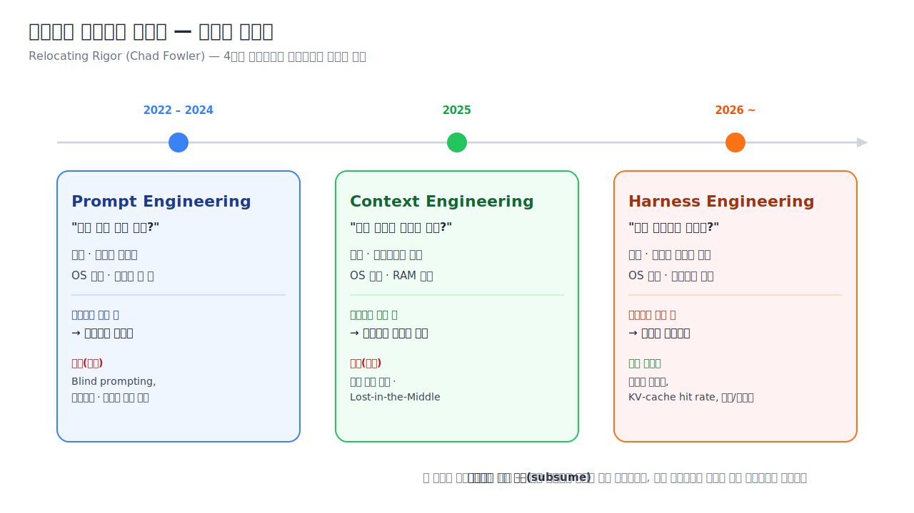
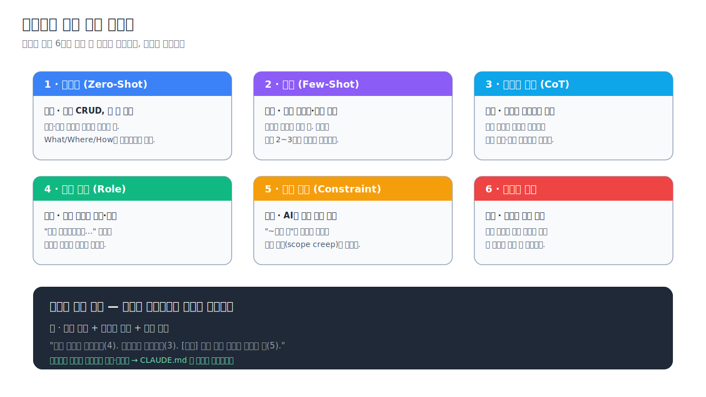
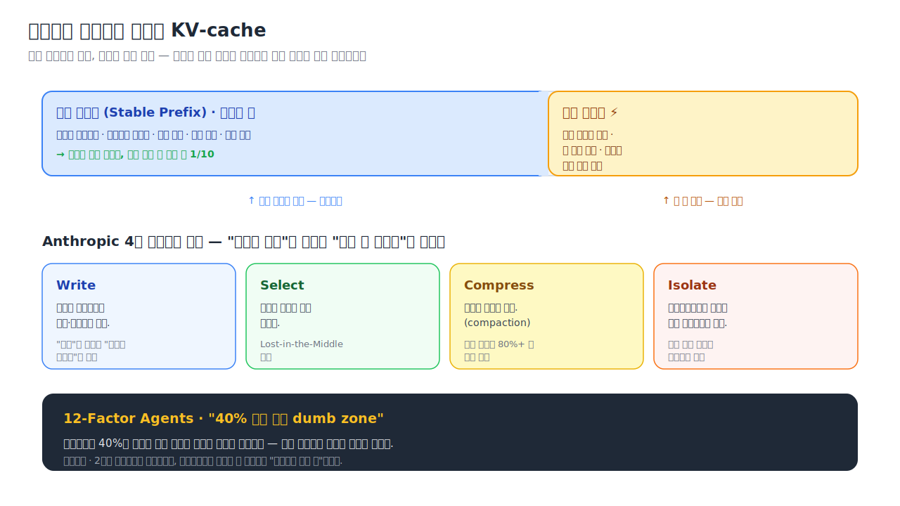
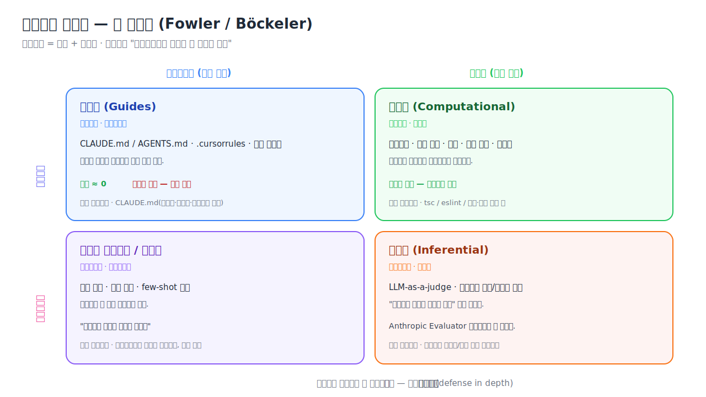
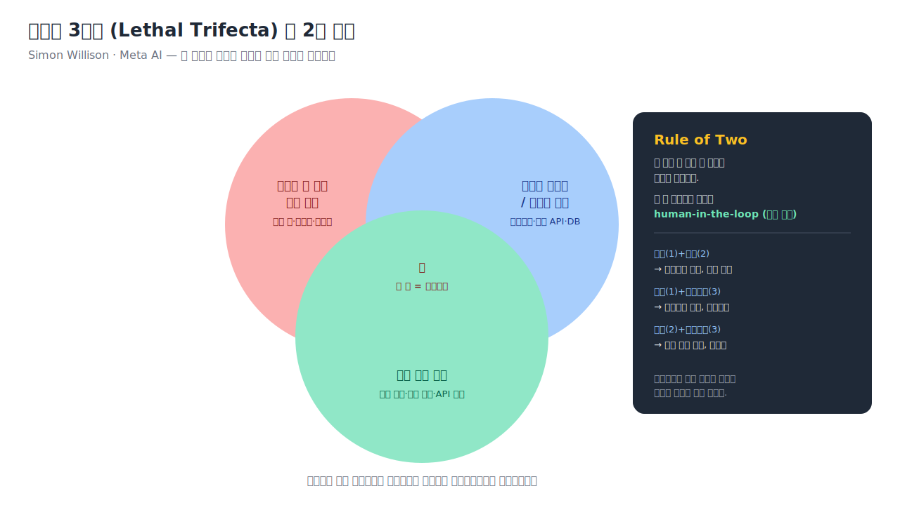
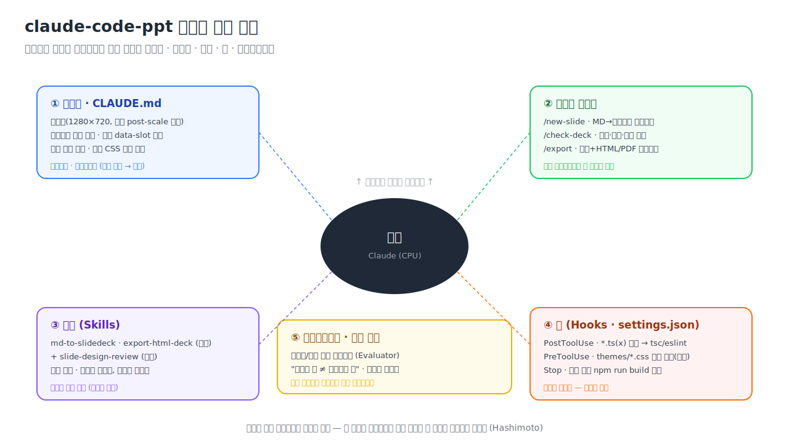

# 프롬프트에서 하네스까지 — AI 협업 엔지니어링 실전 튜토리얼

> **출처 문서**
> - `docs/md/prompt-engineering-guide.md` — 6가지 프롬프팅 기법 (Tika 칸반 보드 예제)
> - `docs/resource/harness/prompt-to-harness.html` — 「엔지니어링의 엄밀함은 사라지지 않는다 — 이동할 뿐이다」 (2026-04, Jonas Kim)
>
> **목적** · 두 문서를 하나의 강의 흐름으로 엮어, **왜** 프롬프트만으로는 부족한지(연대기) → **무엇을** 익혀야 하는지(6대 기법) → **어떻게** 시스템으로 굳히는지(컨텍스트·하네스) → **우리 프로젝트(`claude-code-ppt` 슬라이드 에디터)에 실제로 무엇을 새로 만들지**까지 이어지는 튜토리얼.
>
> **표기 약속**
> - `[[이미지]]` — 강사가 직접 스크린샷/사진을 넣어야 하는 자리. 캡션 제안을 함께 적어둠.
> - `` — 이 문서와 함께 생성된 도식. 그대로 사용.
> - 코드·설정·커밋 메시지는 영문, 설명은 한국어.

---

## 0. 이 강의의 지도

이 강의는 한 문장으로 요약된다 — **엔지니어링의 엄밀함은 사라지지 않는다, 이동할 뿐이다.** (Chad Fowler, *Relocating Rigor*)

2022년부터 2026년까지 AI 개발 패러다임은 세 번 바뀌었다. 프롬프트 → 컨텍스트 → 하네스. 매 전환의 진짜 동인은 "이전 패러다임이 약속한 것을 지키지 못했기 때문"이다. 이 강의는 서베이가 아니라 **부검 보고서**에 가깝다 — 각 시대가 왜 실패했는지를 추적하고, 그 교훈을 우리 프로젝트의 하네스로 구현한다.



| 단계 | 강의 내용 | 산출물 |
|---|---|---|
| Part 1 | 왜 프롬프트만으로는 부족했나 (연대기) | 개념 이해 |
| Part 2 | 프롬프트 엔지니어링 6대 기법 | 즉시 쓰는 프롬프트 |
| Part 3 | 컨텍스트 엔지니어링 | CLAUDE.md / 컨텍스트 설계 |
| Part 4 | 하네스 엔지니어링 | 네 사분면 + 보안 |
| **Part 5** | **우리 프로젝트에 하네스 구축** | **커맨드·스킬·훅·서브에이전트** |

> [[이미지]] — *강의 인트로 슬라이드용. 강사 본인 또는 강의 타이틀 화면 캡처를 넣어 시작 분위기를 잡으면 좋다.*

---

## Part 1. 왜 프롬프트만으로는 부족했나 — 4년의 부검

### 1.1 프롬프트 엔지니어링의 시대 (2022–2024)

2022년 11월 ChatGPT가 공개되자 개발자의 질문이 바뀌었다. "이걸로 뭘 만들지?"가 아니라 **"이것에게 어떻게 말해야 하지?"** 였다. Andrej Karpathy는 이를 *Software 3.0* — 자연어 지시문 자체가 프로그램이 되는 패러다임 — 이라 명명했고, "가장 핫한 새 프로그래밍 언어는 영어"라는 말로 시대를 요약했다.

학계도 같은 시기에 "어떻게 말해야 모델이 더 잘 추론하는가"에 답을 쏟아냈다.

- **Chain-of-Thought (Wei et al., 2022)** — "단계별로 생각하라"는 한 줄로 GSM8K 정확도가 17.9% → 58.1%로 도약.
- **ReAct (Yao et al., 2022)** — 생각(Thought)과 행동(Action)을 번갈아 수행. 오늘날 모든 AI 에이전트의 원형.
- **Andrew Ng의 4대 에이전틱 패턴 (2024)** — Reflection · Tool Use · Planning · Multi-Agent. "모델을 안 바꾸고 감싸는 패턴만 바꿔도 성능이 도약한다"는 발견은 곧 "모델 바깥의 시스템이 중요하다"는 힌트였다.

### 1.2 프롬프트의 벽 — 사인(死因)

그러나 프로덕션에 넣자 벽에 부딪혔다. 어느 팀이 3주간 프롬프트를 다듬었다. "기존 코드를 재사용하라"고 아무리 써놔도, **그 유틸리티 파일이 컨텍스트 윈도우에 없으면 에이전트는 그 존재 자체를 모른다.** 프롬프트는 완벽했지만 에이전트가 *볼 수 있는 정보*가 불완전했다.

Mitchell Hashimoto는 이런 시행착오 의존 방식을 **"Blind Prompting"** 이라 불렀다. 솔직히 대부분의 팀이 하던 게 이것이었다 — 수정하고, 눈으로 확인하고, "이번엔 괜찮은 것 같다." 소프트웨어 엔지니어링이라기보다 연금술이었다.

> **프롬프트 시대의 사인** · 엄밀함이 있어야 할 곳은 프롬프트 텍스트가 아니라, 프롬프트가 소비하는 **컨텍스트 전체**였다.

### 1.3 바이브 코딩의 숙취

2025년 초 Karpathy의 트윗에서 *vibe coding* 이라는 이름이 붙었다 — "diff도 거의 안 본다. 코드가 읽을 수 있는 수준을 넘어 자라났다." 영어로 말하면 코드가 나오니 코드를 이해할 필요가 없다는, 프롬프트 엔지니어링의 논리적 극한이었다.

그리고 숙취가 왔다. 3개월 전 AI로 빠르게 만든 MVP에 고객이 들어오고 버그가 쌓이는데 — **아무도 그 코드를 이해하지 못한다.** AI 생성 코드의 주요 이슈는 1.7배, 보안 취약점 비율은 45%(Veracode 2025).

Simon Willison이 정곡을 찔렀다 — *"LLM이 모든 코드를 작성했더라도, 당신이 리뷰하고 테스트했다면 그건 vibe coding이 아니다."* 핵심은 **누가 코드를 썼는가가 아니라, 엄밀함이 어디에 있는가**였다.

> [[이미지]] — *"바이브 코딩 숙취"를 보여주는 밈/일러스트, 혹은 실제로 읽기 어려운 AI 생성 코드 스크린샷. 청중의 공감을 끌어내는 자리.*

---

## Part 2. 프롬프트 엔지니어링 6대 기법

연대기가 보여주듯 프롬프트는 죽지 않았다 — **승진**했다(더 큰 시스템의 서브모듈로). 좋은 하네스도 결국 좋은 프롬프트를 요구하므로, 6대 기법은 모든 것의 토대다.



> 아래 예제는 원문의 **Tika 칸반 보드**(Next.js + Drizzle ORM + @dnd-kit) 예제를 그대로 사용한다. Part 5에서 동일한 기법을 **우리 슬라이드 에디터**에 다시 적용한다.

### 2.1 제로샷 (Zero-Shot)

예시 없이 지시문만으로 요청. **단순·명확한 작업**에 쓴다. 효과의 조건은 지시가 **What/Where/How**를 구체적으로 담는 것.

```text
tickets 테이블에서 status가 'DONE'이 아니고
due_date가 오늘 이전인 티켓을 조회하는
Drizzle ORM 쿼리를 작성해줘.
```

> 한계 · 프로젝트 고유의 컨벤션·응답 구조는 "관례"가 아니라 "약속"이다. 이건 퓨샷이 필요하다.

### 2.2 퓨샷 (Few-Shot)

원하는 입출력 패턴을 **2~3개** 보여주고 그대로 따르게 한다. 코드 스타일·에러 응답·테스트 형식 통일에 강하다. 핵심은 **예시의 일관성**.

```text
다음 패턴으로 나머지 API 에러 핸들러를 만들어줘.

[예시 1 - 404] return NextResponse.json({ error: '티켓을 찾을 수 없습니다.' }, { status: 404 });
[예시 2 - 400] return NextResponse.json({ error: '유효하지 않은 입력입니다.', details: parsed.error.flatten() }, { status: 400 });

이 패턴을 따라: 서버 오류(500), 중복 제목(409)
```

> **퓨샷과 CLAUDE.md** · 매번 예시를 붙이는 건 비효율. 프로젝트 전반 패턴이면 CLAUDE.md에 한 번 정리해두면 세션마다 자동 로드된다. 퓨샷은 일회성, CLAUDE.md는 영구. 둘은 보완 관계다.

### 2.3 생각의 사슬 (Chain-of-Thought)

최종 답 대신 **중간 추론을 단계로** 전개시킨다. 여러 조건이 얽힌 비즈니스 로직에서 조건 누락·엣지 케이스를 막는다.

```text
티켓의 드래그앤드롭 상태 변경 로직을 구현해야 해. 단계별로 생각해줘.

1단계: source status ↔ destination status 비교
2단계: 상태별 자동 필드 규칙
   - BACKLOG→TODO: startedAt=now()  / TODO→BACKLOG: startedAt=null
   - 어떤 칼럼→DONE: completedAt=now() / DONE→어떤 칼럼: completedAt=null
3단계: position 재계산 (앞뒤 카드 중간값, 간격 1 이하면 1024 간격 재정렬)
4단계: 낙관적 업데이트  5단계: 실패 시 롤백

각 단계 로직을 먼저 설명하고, 그 다음 코드를 작성해줘.
```

> **CoT vs Plan 모드** · CoT가 *프롬프트 수준*에서 추론을 유도한다면, Claude Code의 Plan 모드(`Shift+Tab`)는 *도구 수준*에서 "계획 → 승인 → 실행"을 강제한다. 복잡한 로직은 둘을 결합한다.

> [[이미지]] — *Claude Code Plan 모드 실제 화면 캡처. CoT 프롬프트를 넣고 Plan 모드가 계획을 보여주는 순간을 담으면 설명이 명확해진다.*

### 2.4 역할 부여 (Role Prompting)

특정 전문가 역할을 부여해 응답 범위를 좁힌다. 역할은 **구체적일수록** 좋다("개발자" < "5년 차 시니어 프론트엔드 개발자").

```text
너는 보안 엔지니어야. Tika 앱의 API 엔드포인트를 검토해줘.
현재는 인증 없는 단일 사용자 앱이야.
- 입력값 검증 충분한가 (SQL Injection, XSS)
- 에러 응답에서 내부 정보 노출 여부
- 멀티 사용자 확장 시 미리 대비할 점
```

> 주의 · 역할에 과몰입하면 MVP 단계에 불필요한 조치를 권한다. **프로젝트 맥락(MVP·단일 사용자)을 함께** 전달하라.

### 2.5 제약 조건 (Constraint)

**하지 말아야 할 것**을 명시한다. AI의 가장 흔한 문제 "요청하지 않은 것까지 해버리기"의 직접 해법. 특히 **부정형**이 중요하다.

```text
PATCH /api/tickets/:id 엔드포인트를 수정해줘.
[수정] Zod 스키마에 dueDate 검증 추가 (오늘 이후만)
[제약 조건]
- title, description, priority, dueDate만 수정 가능
- status, startedAt, completedAt은 이 엔드포인트로 수정 불가
- route.ts 파일만 수정. 다른 파일·기존 테스트는 건드리지 마
```

> `[제약 조건]` 같은 명확한 레이블을 쓰면 AI가 더 잘 인식한다. 켄트 벡의 "요청한 것만 구현, 합리적으로 보이는 추가 기능 금지" 원칙의 프롬프트 버전.

### 2.6 단계적 분해 (Step-by-Step Decomposition)

큰 작업을 **여러 번의 프롬프트**에 걸쳐 한 단계씩. 각 단계는 **독립적으로 검증 가능**해야 하고 크기가 **균일**해야 한다.

```text
티켓 생성 기능을 단계별로 구현하자. 지금은 1단계만 해줘.
[1단계] Zod 스키마 정의 — CreateTicketInput
→ 검증: 유효/무효 입력 parse 테스트
```
단계마다 검증·커밋하면 3단계에서 문제가 나도 2단계로 되돌릴 수 있다. Claude Code의 `/rewind` 와 결합하면 더 안전하다.

### 2.7 기법의 조합

실무에선 단독이 드물다. 복잡할수록 겹쳐 쓴다.

```text
너는 시니어 백엔드 개발자야.                 ← 역할 부여
Done 칼럼 24시간 자동 숨김 로직. 단계별로 분석해줘.  ← 생각의 사슬
1) 서버/클라 계산 결정 2) 쿼리/앱 레벨 필터 결정 3) 구현
[제약 조건] 기존 GET 응답 구조·엔드포인트 변경 금지, cron 금지(서버리스) ← 제약
```

> **프롬프트도 반복이다.** 결과가 별로면 점검하라 — 모호한가(제로샷 구체화) / 말로 설명 중인가(퓨샷) / 조건이 복잡한가(CoT) / 엉뚱한가(제약) / 너무 큰가(분해).

---

## Part 3. 컨텍스트 엔지니어링 — 엄밀함의 첫 번째 이동

2025년 6월, Shopify CEO Tobi Lütke의 트윗 하나로 업계 어휘가 바뀌었다 — *"프롬프트 엔지니어링보다 컨텍스트 엔지니어링이 핵심 역량을 더 잘 설명한다."* 질문이 **"어떤 말을 해야 하나"에서 "어떤 정보를 넣어야 하나"** 로 이동했다.

### 3.1 LLM-as-OS — 프롬프트의 진짜 위치

Karpathy의 비유 · LLM은 커널, **컨텍스트 윈도우는 RAM**, RAG/벡터 DB는 파일 시스템, Tool Call은 시스템 호출. 프롬프트는 OS에 입력하는 **명령어 한 줄**일 뿐이다. `ls`를 아무리 정교하게 써도, 필요한 파일이 마운트되지 않았으면 소용없다.

### 3.2 Write / Select / Compress / Isolate

컨텍스트 엔지니어링은 "정보를 많이 넣어라"가 아니다 — 그건 *context stuffing*이다. 핵심은 **신호 대 잡음비**.



- **Write** · 시스템 프롬프트를 명확·구조화해 작성. "무엇"이 아니라 "어떻게 구조화".
- **Select** · 필요한 문서만 골라 넣어 *Lost-in-the-Middle*(긴 컨텍스트 중간 정보 정확도 급락)을 방지.
- **Compress** · 오래된 대화를 요약(compaction). 정보 보존율 80%+ 로 토큰 절감.
- **Isolate** · 서브에이전트에 위임해 메인 컨텍스트를 보호. 최소 권한 원칙의 컨텍스트 버전.

### 3.3 KV-cache — 프로덕션의 진짜 메트릭

Manus 팀은 에이전트 프레임워크를 **네 번** 갈아엎고서야 깨달았다 — 진짜 병목은 프롬프트도 아키텍처도 아닌 **컨텍스트 관리**였다. 그들이 "가장 중요한 단일 메트릭"이라 부른 건 **KV-cache hit rate**.

이전 요청과 **접두어가 동일**하면 그 부분은 재계산 없이 캐시를 쓴다(Claude Sonnet 기준 캐시 히트 시 비용 약 1/10). 그래서 안정 접두어를 앞에 둔다. **접두어 토큰 하나만 바뀌어도 이후 캐시가 전부 무효화**되기 때문이다.

> 아이러니 · 2년간 프롬프트를 다듬었는데, 프로덕션에서 중요한 건 프롬프트를 **건드리지 않는 것**이었다. 프롬프트의 "품질"보다 "안정성".

### 3.4 에이전틱 인프라 한눈에

| 구성요소 | 한 줄 정의 | 컨텍스트 관점 |
|---|---|---|
| **MCP** | LLM↔도구 연결의 USB 표준 (Anthropic 2024.11) | 도구 결과 형식이 예측 가능 → 컨텍스트 안정화 |
| **스킬(Skills)** | 도구 여러 개를 묶은 재사용 능력 단위 | 지연 로딩 — 목록만 접두어, 본문은 필요시 |
| **서브에이전트** | 메인이 위임하는 하위 에이전트 | "Isolate"의 구현체 |
| **메모리** | 세션을 넘는 외부 기억(CLAUDE.md·벡터 DB) | LLM의 "전향성 기억상실증" 치료 |

### 3.5 컨텍스트의 벽 — 두 번째 사인

컨텍스트 엔지니어링도 벽에 부딪혔다.
1. **단일 턴의 한계** · 대부분 기법이 "이번 호출에 무엇을 넣나"에 집중. 하지만 에이전트는 수십 턴의 루프다. 컨텍스트를 완벽히 구성해도 **그 루프 자체가 잘못 설계**됐다면?
2. **에러 복구의 부재** · 도구 실패·환각·비용 폭주를 다루는 메커니즘은 컨텍스트 바깥에 있다.
3. **보안** · "무엇을 넣을까"는 다루지만 "무엇을 **못 하게** 할까"는 다루지 않는다.

> **컨텍스트 시대의 사인** · 컨텍스트는 필요조건이었지 충분조건이 아니었다. 엄밀함이 또 이동해야 했다.

---

## Part 4. 하네스 엔지니어링 — 시스템이 답이다

2026년 2월, Hashimoto의 결론이 시대를 열었다 —

> **에이전트가 실수할 때마다, 그 실수가 구조적으로 다시 발생할 수 없도록 시스템을 변경한다.**

프롬프트를 고치는 게 아니다. 에이전트를 둘러싼 **시스템(규칙·도구·제약·피드백 루프)**을 바꾼다. Fowler/Böckeler의 공식 · **에이전트 = 모델 + 하네스.** 하네스는 "에이전트에서 모델을 뺀 나머지 전부". 모델이 CPU라면 하네스는 운영체제다.

### 4.1 하네스의 네 사분면



| | 피드포워드 (사전 유도) | 피드백 (사후 교정) |
|---|---|---|
| **결정론적** | **가이드** · CLAUDE.md, .cursorrules | **연산적** · 컴파일러, 린터, 타입 체커 |
| **비결정론적** | **시스템 프롬프트** · 역할·행동 제약 | **추론적** · LLM-as-a-judge, 의미론적 리뷰 |

- **가이드** — 비용 ≈ 0, 그러나 강제성 없음(무시 가능).
- **연산적** — 가이드를 무시해도 기계적으로 잡는다. 통과해야 진행.
- **시스템 프롬프트** — 규칙으로 못 잡는 뉘앙스("확실하지 않으면 확인을 구하라").
- **추론적** — "컴파일은 되지만 의미가 틀린" 것을 다른 LLM이 잡는다.

프로덕션 하네스는 이 넷을 **레이어링**한다(방어의 깊이).

### 4.2 실전 세 사례

- **Anthropic 3-에이전트** · 핵심 발견 — *에이전트는 자기 작업을 정확히 평가할 수 없다*(학생이 자기 시험 채점 금지). 그래서 **Planner / Generator / Evaluator**로 분리. Evaluator는 Playwright E2E로 채점하고 미달이면 되돌려보낸다. 단독 실행($9, 20분) 대비 풀 하네스는 $200, 6시간(22배) — 단순 비용 증가가 아니라 **비용의 위치 이동**(사후 수정 → 사전 검증).
- **OpenAI Codex** · 5개월간 엔지니어가 **수동 코드 0줄**, 생성 100만 줄, PR 1,500개. 그들이 한 일 — ① 저장소 지식의 시스템화("보이지 않는 지식은 존재하지 않는 것과 같다") ② 커스텀 린터로 **기계적 강제성** ③ 점진적 공개("1,000페이지 매뉴얼이 아니라 지도를 줘라").
- **Ralph 패턴** · 매 이터레이션마다 **클린 컨텍스트**로 새로 시작, 상태는 git·`progress.txt`·`prd.json`에 둔다. 에이전트의 기억은 컨텍스트 윈도우가 아니라 **파일 시스템**에 있다.

> 공통 결론 · **실수가 나면 에이전트를 탓하지 않고, 하네스를 개선한다.**

### 4.3 보안 — Lethal Trifecta와 2의 규칙



에이전트가 ① 신뢰할 수 없는 입력 ② 민감 데이터 접근 ③ 상태 변경 — 셋을 동시에 가지면 보안 사고는 필연이다(Willison). Meta의 **Rule of Two** · 최대 두 가지만 동시에 허용하고, 셋 다 필요하면 **반드시 사람 승인**을 거친다.

### 4.4 하네스는 "뜯어낼 수 있어야" 한다 (Rippable)

모델이 발전하면 하네스의 "smart" 로직 일부는 불필요해진다. Claude 5.0이 나오면 4.x용 에러 복구 로직 절반이 쓸모없어질 수 있다. 하네스 설계의 기술은 "무엇을 만드나"만큼 **"무엇을 쉽게 제거할 수 있게 만드나"**에 달려 있다. 과도한 엔지니어링은 다음 모델 업데이트의 발목을 잡는다.

---

## Part 5. 우리 프로젝트에 하네스 구축하기 (실습)

이제 이론을 `claude-code-ppt` — 브라우저 슬라이드 에디터(Vite + React + TS, 1280×720 씬 모델) — 에 적용한다. 목표는 **"실수가 구조적으로 재발하지 못하게"** 만드는 다섯 가지 하네스 요소를 새로 구성하는 것이다.



> **현재 상태(확인됨)** · 가이드(`CLAUDE.md`)와 스킬 2개(`md-to-slidedeck`, `export-html-deck`)는 이미 있다. 커맨드 디렉터리·훅 설정(`settings.json`)·검수 서브에이전트는 **아직 없다.** 아래는 새로 만들 것들이다.

### 5.1 이 프로젝트가 반복적으로 겪는 실수 (= 하네스가 막아야 할 것)

하네스는 추상적으로 만들지 않는다. **실제로 반복되는 실수**에서 역으로 설계한다.

| 반복 실수 | 막을 사분면 | 새로 만들 하네스 |
|---|---|---|
| Overlay 좌표를 post-scale 픽셀로 저장 (1280×720 위반) | 연산적 | 좌표 검증 훅/스크립트 |
| 샘플 CSS(`themes/*.css`)를 Tailwind로 "개선"해 디자인 깨짐 | 가이드+연산적 | PreToolUse 차단 훅 |
| 허용되지 않은 `data-slot` 이름 도입 → 파서가 무시 | 연산적 | 슬롯 검증 |
| 타입 깨진 채로 다음 작업 진행 | 연산적 | PostToolUse tsc 훅 |
| 슬라이드가 렌더는 되지만 시각적으로 깨짐(겹침·잘림) | 추론적 | 디자인 검수 서브에이전트 |

### 5.2 ① 가이드 보강 — `CLAUDE.md` (결정론적 피드포워드)

`CLAUDE.md`에는 좌표계·레이어드 편집·슬롯명이 이미 잘 정리돼 있다. 여기에 **부정형 제약(Part 2.5)**을 명시 블록으로 추가해 강제성을 높인다.

```markdown
## 변경 범위 규칙 (Constraints)
- 요청한 파일만 수정한다. 관련 파일을 "함께 개선"하지 않는다.
- `src/canvas/themes/*.css` 는 샘플 원본이다. **절대 수정·Tailwind화 금지.**
- Overlay x/y/w/h 는 항상 1280×720 소스 좌표로 저장한다. post-scale 픽셀 금지.
- `data-slot` 값은 다음 목록에서만 사용한다:
  title, subtitle, label, caption, body, bullets, table, code, quote,
  link-list, number, step, page-num
- 새 npm 패키지 설치는 사전 승인 필요. `any` 타입 금지.
```

> 가이드는 비용 0이지만 **무시 가능**하다. 그래서 5.5의 훅(연산적)으로 받쳐야 한다 — 방어의 깊이.

### 5.3 ② 슬래시 커맨드 — 반복 워크플로우 고정

`.claude/commands/` 디렉터리를 만들고(현재 없음) 자주 하는 워크플로우를 한 단어로 고정한다.

**`.claude/commands/check-deck.md`** — 좌표·슬롯·파싱·타입을 한 번에 검증(연산적 게이트):

```markdown
---
description: 슬라이드 덱의 무결성 검증 (좌표·슬롯·파싱·타입)
---
다음을 순서대로 실행하고 결과를 표로 보고해줘. 하나라도 실패하면 멈추고 원인을 알려줘.

1. `npm run typecheck` — 타입 오류 0 확인
2. `src/importer/parsePresentation.ts` 로 docs/html/presentation 샘플이 파싱되는지 확인
3. 모든 Overlay x/y/w/h 값이 0~1280 / 0~720 범위인지 스캔 (post-scale 픽셀 의심값 보고)
4. 사용된 data-slot 값이 CLAUDE.md 허용 목록 안에 있는지 확인

[제약] 코드를 수정하지 마. 검증과 보고만 해.
```

**`.claude/commands/new-slide.md`** — MD 한 조각에서 슬라이드 스캐폴드(기존 `md-to-slidedeck` 스킬 호출):

```markdown
---
description: 입력 MD에서 새 슬라이드를 스캐폴드한다
argument-hint: <슬라이드 제목 또는 MD 경로>
---
$ARGUMENTS 를 입력으로, md-to-slidedeck 스킬의 SlidePlan → HTML 파이프라인을 사용해
1280×720 에디터 호환 슬라이드를 생성해줘. 템플릿은 presentation 을 기본으로 한다.
[제약] 기존 슬라이드 HTML/CSS를 변경하지 마. 새 슬라이드만 추가한다.
```

> [[이미지]] — *`.claude/commands/` 디렉터리 구조와 `/check-deck` 를 실행한 Claude Code 터미널 결과 캡처. 커맨드가 실제로 동작하는 증거 화면.*

### 5.4 ③ 스킬 — 검수 능력 추가

기존 두 스킬에 더해 **`slide-design-review`** 스킬을 추가한다(추론적 사분면의 진입점). 스킬은 **지연 로딩**되므로(목록만 접두어에 상주) 토큰을 낭비하지 않는다.

```
.claude/skills/slide-design-review/SKILL.md
```
```markdown
---
name: slide-design-review
description: 렌더된 슬라이드의 시각적 품질을 검수한다. 텍스트 잘림·요소 겹침·여백·
  대비·1280×720 경계 이탈을 점검. "슬라이드 검수해줘", "디자인 리뷰", export 직전 사용.
---
# 슬라이드 디자인 검수
1. 대상 슬라이드를 1280×720으로 렌더(또는 html-to-image로 PNG 캡처)한다.
2. 다음 기준으로 채점한다(각 0~5): 텍스트 잘림 없음 / 요소 겹침 없음 /
   안전 여백 준수 / 색 대비 / 캔버스 경계 이탈 없음.
3. 4점 미만 항목은 구체적 수정 지시(요소·좌표 단위)와 함께 보고한다.
```

### 5.5 ④ 훅 — 기계적 강제성 (연산적 피드백)

가장 강력한 사분면. `.claude/settings.json`에 추가한다. 가이드에 적은 규칙을 **기계가 강제**하게 만드는 핵심이다.

> ⚠️ 2025년 이후 포맷 — 각 항목은 `hook`(단수)이 아니라 `hooks`(복수 배열)다.

```json
{
  "hooks": {
    "PostToolUse": [
      {
        "matcher": "Edit|Write",
        "hooks": [
          {
            "type": "command",
            "command": "if echo \"$CLAUDE_FILE_PATHS\" | grep -qE '\\.tsx?$'; then npm run typecheck; fi"
          }
        ]
      }
    ],
    "PreToolUse": [
      {
        "matcher": "Edit|Write",
        "hooks": [
          {
            "type": "command",
            "command": "if echo \"$CLAUDE_FILE_PATHS\" | grep -q 'src/canvas/themes/'; then echo 'BLOCKED: 샘플 CSS(themes/*.css)는 보존 대상입니다. 수정 금지.' >&2; exit 2; fi"
          }
        ]
      }
    ],
    "Stop": [
      {
        "hooks": [
          { "type": "command", "command": "npm run build" }
        ]
      }
    ]
  }
}
```

세 훅이 각각 막는 것:
- **PostToolUse(tsc)** · `.ts/.tsx` 편집 직후 타입 체크 — 타입 깨진 채 다음으로 못 넘어간다.
- **PreToolUse(차단)** · `themes/*.css` 편집을 `exit 2`로 **차단**(Part 4.3 가드레일의 작은 버전).
- **Stop(build)** · 세션 종료 시 프로덕션 빌드로 최종 검증.

> 정확한 환경변수명·반환코드 시맨틱은 버전에 따라 바뀐다. 적용 전 `docs/md/claude_hook_guide.md`와 현재 Claude Code 버전 문서를 확인할 것.

> [[이미지]] — *PreToolUse 차단 훅이 실제로 `themes/*.css` 편집을 막고 BLOCKED 메시지를 띄우는 순간의 캡처. "기계적 강제성"을 시각적으로 증명하는 핵심 슬라이드.*

### 5.6 ⑤ 서브에이전트 — "만드는 놈 ≠ 채점하는 놈"

Anthropic 3-에이전트의 교훈을 작은 규모로 적용한다. 슬라이드를 **생성하는** 세션과, 그 결과를 **검수하는** 서브에이전트를 분리한다(Isolate + 추론적 피드백).

```text
# 메인 세션이 슬라이드를 만든 뒤, 별도 서브에이전트에게 위임:
이 슬라이드(파일 경로)를 slide-design-review 스킬로 검수해줘.
컨텍스트는 해당 슬라이드 HTML과 brewnet-dark.css 만 전달한다.   ← Isolate
기준 미달이면 수정 지시를 돌려줘. 직접 고치지는 마.            ← 평가자는 채점만
```

검수자가 채점만 하고 수정은 생성자가 하게 하면, "자기 시험 자기 채점"의 함정을 피한다.

### 5.7 정리 — 우리 프로젝트 하네스 체크리스트

| 요소 | 위치 | 사분면 | 상태 |
|---|---|---|---|
| 변경 범위·좌표·슬롯 규칙 | `CLAUDE.md` | 가이드 | 기존 → **보강** |
| `/check-deck`, `/new-slide` | `.claude/commands/` | 연산적 게이트 | **신규** |
| `slide-design-review` | `.claude/skills/` | 추론적 | **신규** |
| tsc / theme 차단 / build 훅 | `.claude/settings.json` | 연산적·가드레일 | **신규** |
| 디자인 검수 서브에이전트 | 위임 패턴 | 추론·격리 | **신규** |

> 적용 순서 권장 · **① CLAUDE.md 보강 → ② 훅(가장 효과 큼) → ③ check-deck 커맨드 → ④ 검수 스킬/서브에이전트.** 한 번에 다 만들지 말고, *실수가 한 번 재발할 때마다 하나씩* 추가하는 것이 하네스의 정신이다.

---

## 마무리 — 엄밀함의 다음 정류장

세 시대를 가로로 읽으면 각 시대의 한계가, 대각선으로 읽으면 핵심 패턴이 보인다 — **각 시대는 이전을 대체하지 않고 포함한다.** 하네스 안에 컨텍스트가, 그 안에 프롬프트가 있다. "프롬프트 엔지니어링은 죽었다"는 틀렸다. **죽은 게 아니라 승진했다.**

엄밀함은 또 이동할 것이다 — Guardian Agent(감시), 평가 엔지니어링(*behavior beats benchmarks*), 지식 엔진(코드 그래프·커밋 히스토리·메모리 결합)으로. 질문은 "엄밀함이 이동하는가"가 아니라 **"우리가 이번엔 그 이동을 얼마나 빨리 알아차리는가"**다.

> Chad Fowler · *엄밀함은 사라지지 않고, 피드백과 현실에 더 가까운 곳으로 이동한다. 코드를 쓰는 사람에서 컨텍스트를 큐레이션하는 사람으로, 다시 에이전트가 작동하는 환경을 설계하는 사람으로. 역할이 바뀐 게 아니라 추상화 수준이 올라간 것이다.*

---

### 참고 — 핵심 출처

- Mitchell Hashimoto, *My AI Adoption Journey* (2026.02)
- Martin Fowler / Birgitta Böckeler, *Harness Engineering* (2026.02)
- Anthropic, *Building Effective Agents* (2024.12) · *Effective Context Engineering* (2025.09) · *Harness Design for Long-Running Application Development* (2026.03)
- OpenAI, *Harness Engineering: Leveraging Codex in an Agent-First World* (2026.02)
- Simon Willison, *The Lethal Trifecta* (2025.06) · Meta AI, *Agents Rule of Two* (2025)
- Manus, *Context Engineering: Lessons from Building Manus* (2025) · HumanLayer, *12-Factor Agents* (2025)
- Wei et al., *Chain-of-Thought* (2022) · Yao et al., *ReAct* (2022) · Andrew Ng, *4 Agentic Design Patterns* (2024.03)
- 원문 종합 · Jonas Kim, 「엔지니어링의 엄밀함은 사라지지 않는다 — 이동할 뿐이다」 (2026.04, `docs/resource/harness/prompt-to-harness.html`)
