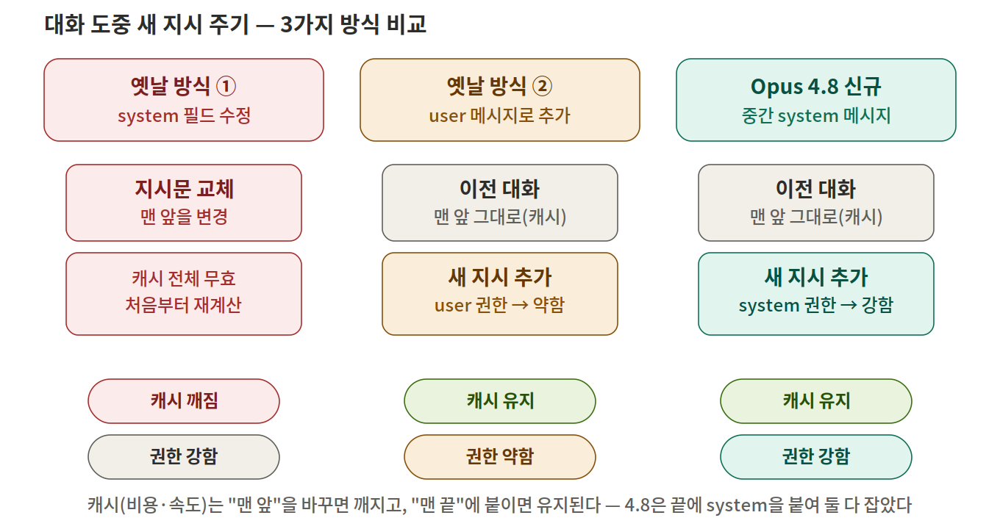

# Claude Opus 4.8 — 신규 기능 · 사용법 · 특징 정리

> 출처: Anthropic 공식 발표(2026-05-28) 및 공식 개발자 문서. 본문 모든 링크는 연결 확인 완료.

---

## 한눈에 보는 핵심 (결론)

| 항목 | 내용 |
|---|---|
| **모델명 / API ID** | Claude Opus 4.8 / `claude-opus-4-8` |
| **출시일** | 2026년 5월 28일 |
| **가격(일반)** | 입력 $5 / 출력 $25 (per 1M tokens) — 4.7과 동일 |
| **가격(Fast mode)** | 입력 $10 / 출력 $50, 속도 2.5배 (이전 모델 대비 3배 저렴) |
| **컨텍스트** | 1M 토큰이 **기본값** (beta 헤더·장문 프리미엄 없음) |
| **프롬프트 캐시 최소 길이** | **1,024 토큰** (4.7은 4,096 → 더 짧은 프롬프트도 캐싱 가능) |

**가장 중요한 변화 4가지**
1. **Effort(노력 강도) 컨트롤** — 5단계(`low`/`medium`/`high`/`xhigh`/`max`)로 토큰·품질·속도를 직접 조절. 기본값 `high`.
2. **Dynamic Workflows** — Claude Code에서 수십~수백 개 서브에이전트를 병렬 실행 후 자체 검증 (research preview).
3. **Mid-conversation system messages** — 대화 중간에 `system` 메시지를 끼워 넣어도 **프롬프트 캐시가 깨지지 않음**(= 캐시 히트 유지). 베타 헤더 불필요.
4. **정직성(honesty) 강화** — 자기가 작성한 코드의 결함을 그냥 넘기는 경우가 4.7 대비 약 **4배 감소**.

---

## 1. Effort 컨트롤 (노력 강도 조절)

같은 모델에서 **추론에 쓰는 토큰량을 다이얼처럼 조절**하는 기능. 모델을 바꾸지 않고 품질↔속도/비용을 절충합니다.

### 5단계 가이드 (Anthropic 공식 권장)

| 단계 | 언제 쓰나 |
|---|---|
| `low` | 단순 분류, 빠른 조회, 고볼륨 작업 (속도·비용 우선) |
| `medium` | 균형형. high만큼 토큰을 쓰지 않으면서 무난한 성능 |
| `high` (기본) | 복잡한 추론·분석·어려운 코딩. 품질 우선 |
| `xhigh` | 고난도 코딩 / 장시간 에이전트 작업 (반복 도구 호출·심층 탐색) |
| `max` | 정말 까다로운 작업에만. 토큰 소모 큼 |

> ⚠️ 4.7 대비 단계별 토큰 배분이 **재조정**됨: `medium`은 사고량↑, `high`는 약간↓, `xhigh`는 대폭↑. 4.7 기준으로 튜닝했다면 동일 단계에서 재측정 필요.

### 사용법

**(1) claude.ai / Cowork** — 모델 선택기 옆 컨트롤에서 선택. 모든 플랜 제공.

**(2) Claude Code** — 슬래시 명령:
```bash
/effort xhigh   # 실제 코딩 세션·에이전트 작업 (Anthropic 권장)
/effort high    # 빠른 수정·질문 (기본값)
/effort max     # 매우 어려운 작업 전용
```

**(3) API** — `output_config.effort` 파라미터 (베타 헤더 불필요):
```python
import anthropic

client = anthropic.Anthropic()

response = client.messages.create(
    model="claude-opus-4-8",
    max_tokens=4096,
    thinking={"type": "adaptive"},      # 필요할 때만 추론 (adaptive thinking)
    output_config={"effort": "xhigh"},  # 노력 강도 다이얼
    messages=[{"role": "user", "content": "이 모듈을 리팩터링해줘."}],
)
print(response.content[0].text)
```

> **활용 팁 (실전 예시)**: API 고볼륨 배치 작업은 `low`/`medium`에서 시작해 자체 평가셋(eval)으로 품질을 확인한 뒤 올리고, 코딩/에이전트는 처음부터 `xhigh`로 고정하는 것이 비용 대비 효율적입니다.

---

## 2. Dynamic Workflows (Claude Code, research preview)

한 번의 패스로 처리하기 힘든 대형 작업(전체 코드베이스 버그 헌트, 수백 파일 마이그레이션, 보안 감사 등)을 위해 **Claude가 직접 오케스트레이션 스크립트를 작성**하고, **수십~수백 개의 서브에이전트를 병렬 실행**한 뒤 **결과를 자체 검증**해서 하나의 답으로 합쳐 줍니다.

- 작업이 중단돼도 진행 상황이 저장되어 이어서 재개됨.
- 첫 실행 시 무엇을 돌릴지 보여주고 확인을 요청함. (토큰 소모가 일반 세션보다 훨씬 큼 → 작은 작업부터 시작 권장)

### 사용법
**auto 모드를 켠 상태**에서 둘 중 하나:
1. `"Create a workflow"`처럼 워크플로우 생성을 직접 요청
2. effort 메뉴에서 **`ultracode`** 설정 켜기 → effort를 `xhigh`로 올리고, 워크플로우 사용 여부를 Claude가 자동 판단

### 제공 범위
- Claude Code CLI / Desktop / VS Code 확장
- 플랜: **Max·Team 기본 ON**, **Enterprise는 기본 OFF**(관리자가 설정에서 활성화)
- API, Amazon Bedrock, Vertex AI, Microsoft Foundry

> **활용 예시**: 레거시 코드베이스 전체에 대한 dead code 탐지·정리, 프레임워크/언어 포팅(예: 공식 사례로 Bun을 Zig→Rust로 약 75만 줄 포팅, 테스트 99.8% 통과), "두 번 검증이 필요한 고위험 작업"(적대적 에이전트가 결과를 반박 시도) 등에 적합.

---

## 3. Mid-conversation System Messages (캐시 히트 유지)

장시간 실행되는 에이전트에서 **중간에 지시를 바꾸면** 보통 프롬프트 캐시가 무효화되어 비용이 급증합니다. Opus 4.8은 `messages` 배열의 **첫 위치가 아닌 곳에 `role: "system"` 메시지**를 넣을 수 있고, 이는 **앞쪽 캐시 프리픽스를 깨지 않으므로 캐시 히트가 유지**됩니다. 베타 헤더 불필요.

### 한 줄로 이해하기 (비유)

AI에게 긴 대본을 처음부터 읽어준다고 상상하세요.

- **프롬프트 캐시 = "책갈피"**. AI가 책갈피까지는 이미 외워둬서, 같은 내용을 다시 줄 때 **처음부터 안 읽고 책갈피부터** 시작합니다 → 빠르고 저렴.
- 규칙: 책갈피는 **앞쪽부터 외운 것**이라 **앞부분을 바꾸면 책갈피가 무효** → 처음부터 다시 외워야 함(느리고 비쌈).

대화 도중 "이제부터 이렇게 해줘" 같은 **새 지시**를 줄 때, 예전에는 두 방법뿐이었고 둘 다 단점이 있었습니다. Opus 4.8이 둘의 장점만 합친 **세 번째 길**을 새로 열었습니다.

### 예전 방식 vs Opus 4.8 비교



| | 방법 | 캐시(비용·속도) | 권한(지시의 무게) | 한 줄 요약 |
|---|---|---|---|---|
| **옛날 ①** | 맨 앞 `system` 지시문을 **수정** | ❌ 무효 → 처음부터 재계산 | ✅ 강함(시스템 권위) | 권위는 있지만 **느리고 비쌈** |
| **옛날 ②** | 새 지시를 **사용자(user) 말처럼** 끝에 추가 | ✅ 유지(캐시 히트) | ⚠️ 약함(사용자 발언 취급) | 싸지만 **지시가 무시되기 쉬움** |
| **Opus 4.8** | 끝에 **`system` 메시지**로 추가 | ✅ 유지(캐시 히트) | ✅ 강함(시스템 권위) | **둘의 장점만** 가져옴 |

> 강의용 비유: *감독이 배우에게 중간에 새 지시를 내릴 때, 예전엔 (가) 대본을 처음부터 다시 인쇄하거나 (나) 옆 사람이 슬쩍 귓속말하는 척하거나 둘 중 하나였는데, 이제는 (다) 감독이 직접 메모를 맨 뒤에 붙이면 끝 — 대본(캐시)은 그대로고 지시 권위는 감독급.*

### 사용 규칙

- 권한·토큰 예산·환경 컨텍스트를 에이전트 실행 중에 갱신할 때 유용.
- 중간 `system` 메시지는 **user 메시지 바로 뒤**(또는 server tool use로 끝나는 assistant 뒤)에 와야 하고, 배열의 마지막이거나 뒤에 assistant 턴이 따라와야 함 → **실무에서는 "최신 user 턴 뒤, 배열 맨 끝"에 붙이면 됨**.
- 최상위 `system` 필드는 "첫 턴부터 적용할 지시"에, 중간 `system` 메시지는 "도중에 생기는 지시"에 사용.

### 코드 비교 (문법 검증 완료)

**옛날 ① — 비쌌던 방식 (앞을 수정 → 캐시 무효):**
```python
# 매 턴마다 system을 새로 구성 → 캐시 프리픽스가 바뀌어 전부 재계산
response = client.messages.create(
    model="claude-opus-4-8",
    max_tokens=1024,
    system="너는 백엔드 엔지니어다. (지금부터: src/auth/ 만 수정)",  # ← 여기가 바뀜
    messages=[...긴 대화 기록...],
)
```

**Opus 4.8 신규 — 끝에 system 메시지 추가 (캐시 유지 + 권한 강함):**
```python
response = client.messages.create(
    model="claude-opus-4-8",
    max_tokens=1024,
    system="너는 백엔드 엔지니어다.",          # 1턴부터 적용 (캐시됨, 안 건드림)
    messages=[
        {"role": "user", "content": "auth 서비스 마이그레이션 시작해줘."},
        {"role": "assistant", "content": "네, user 모델부터 시작합니다..."},
        {"role": "user", "content": "계속 진행해."},
        # ↓ 도중에 생긴 지시를 '끝에' system으로 추가 → 앞쪽 캐시는 그대로 읽힘(캐시 히트 유지)
        {"role": "system", "content": "지금부터는 src/auth/ 아래 파일만 수정해."},
    ],
)
```

> **주의**: 캐시는 **opt-in**입니다. `cache_control` 설정이 없으면 아무것도 캐싱되지 않고 매 요청마다 전체 입력 비용을 냅니다. 또한 대화가 최소 캐시 길이(Opus 4.8 = 1,024 토큰)를 넘어야 실제 캐시 항목이 생깁니다.

---

## 4. 그 외 API 변경점

- **Adaptive thinking**: `thinking={"type": "adaptive"}` — 턴마다 필요할 때만 추론을 켜서 낭비 사고 토큰을 줄임.
- **Refusal categories**: 요청 거절 시 `stop_details`에 거절 카테고리를 반환 → 앱에서 거절 유형별 후속 처리 분기 가능. 베타 헤더 불필요.
- **Fast mode (API, research preview)**: `speed: "fast"` 설정 시 동일 모델에서 출력 토큰 처리량 최대 2.5배 (프리미엄 가격).
- **Prefill 미지원**: Opus 4.8/4.7/4.6, Sonnet 4.6, Mythos Preview는 assistant 응답 prefill 미지원(요청 시 400 에러).
- **마이그레이션**: 모델명을 `claude-opus-4-7` → `claude-opus-4-8`로 변경. 컨텍스트 윈도우용 beta 헤더 제거(1M이 기본). effort 단계 재평가 권장.

---

## 공식 출처 (연결 확인 완료)

- 발표 블로그: https://www.anthropic.com/news/claude-opus-4-8
- Dynamic Workflows: https://claude.com/blog/introducing-dynamic-workflows-in-claude-code
- What's new in Opus 4.8: https://platform.claude.com/docs/en/about-claude/models/whats-new-claude-4-8
- Effort 문서: https://platform.claude.com/docs/en/build-with-claude/effort
- Mid-conversation system messages: https://platform.claude.com/docs/en/build-with-claude/mid-conversation-system-messages
- Prompt caching: https://platform.claude.com/docs/en/build-with-claude/prompt-caching
- 마이그레이션 가이드: https://platform.claude.com/docs/en/about-claude/models/migration-guide
- 워크플로우 문서: https://code.claude.com/docs/en/workflows
- System Card: https://www.anthropic.com/claude-opus-4-8-system-card
- 릴리스 노트(앱): https://support.claude.com/en/articles/12138966-release-notes
