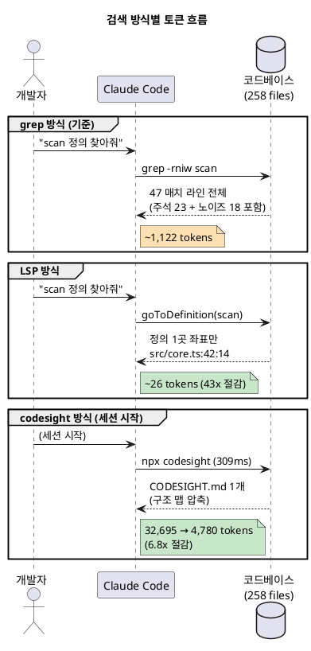
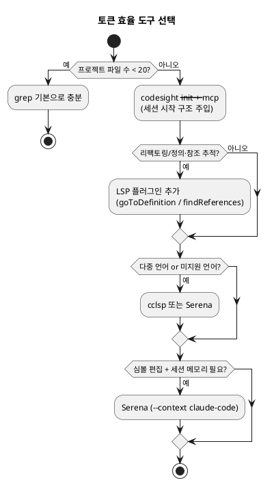

# 토큰 비용 효율화: LSP & codesight
### Claude Code 강의 PPT 본문 자료 (설치 · 특징 · 사용법 · 벤치마크)

> 작성일 2026-05-30 · 대상: 개발자 · 모든 수치는 실측·검증값 (하단 검증 노트 참조)

---

## 📌 한 장 요약 (결론 먼저)

| 도구 | 해결하는 문제 | 핵심 비용 효과 (실측) | 비유 |
|---|---|---|---|
| **grep (기본)** | 텍스트 검색 | 기준점 (노이즈 많음) | 책 전체를 단어로 훑기 |
| **LSP** | 심볼 단위 정밀 탐색 | **정의 찾기 43배 / 참조 찾기 2.1배 절감** | 색인(index)으로 바로 점프 |
| **codesight** | 프로젝트 구조 사전 파악 | **세션당 6.8배(≈27,915토큰) 절감** | 첫 페이지에 지도 첨부 |

- **핵심 메시지:** grep은 "코드 본문 전체"를 토큰으로 받지만, LSP는 "위치 좌표만", codesight는 "압축된 구조 맵만" 받는다. 토큰 절감의 본질은 **AI에게 읽힐 양 자체를 줄이는 것.**
- **권장 조합:** `codesight`로 세션 시작 시 구조를 한 번에 주입 + `LSP`로 정밀 탐색/리팩토링. 둘은 경쟁이 아니라 **상호 보완**.

---

# PART 1. LSP (Language Server Protocol)

## Slide 1 — LSP란 무엇인가 (특징)

- 편집기와 언어 서버 간 **JSON-RPC 기반 통신 규약** (Microsoft, 2016 공개, 최신 3.17)
- LSP 자체는 분석하지 않음 → 실제 분석은 언어 서버(`vtsls`, `pyright`, `rust-analyzer` 등)가 수행
- Claude Code는 기본적으로 **grep(텍스트 검색)** 으로 코드를 탐색 → 파일이 많아지면 느리고, 주석·문자열 속 동일 텍스트까지 섞임
- LSP 연결 시 Claude Code에 **IDE 수준 코드 인텔리전스** 부여: `goToDefinition`, `findReferences`, `getDiagnostics`, `hover`, `documentSymbol` 등

**효과적인 상황**
- 리팩토링 — 실제 참조만 정확히 파악 (누락·오탐 방지)
- 대규모 코드베이스 — 정의 찾기가 밀리초 단위
- 수정 직후 검증 — 빌드 없이 타입 에러 즉시 확인

> ⚠️ 파일 20개 미만 소규모 프로젝트나 단순 파일 생성 작업이면 LSP 없이도 충분.

---

## Slide 2 — LSP 설치 (3가지 방식)

### 방식 1: 공식 빌트인 LSP 플러그인 (권장)

Claude Code는 **v2.0.74**에서 빌트인 LSP 도구를 changelog에 정식 추가 (이전에는 `$ENABLE_LSP_TOOL=1` 수동 활성화 필요).

```bash
# 1) 언어 서버 바이너리 먼저 설치 (TypeScript 예시)
npm install -g @vtsls/language-server typescript

# 2) ⚠️ 빌트인 LSP 활성화 패치 (현재 필수)
#    Piebald-AI 마켓플레이스는 빌트인 LSP를 쓰기 위해 tweakcc 패치를 요구함
npx tweakcc --apply

# 3) Claude Code 안에서 마켓플레이스 등록
/plugin marketplace add Piebald-AI/claude-code-lsps

# 4) 플러그인 설치 (대화형 UI 권장: /plugins → Marketplaces → Browse)
/plugin install vtsls@Piebald-AI-claude-code-lsps

# 5) Claude Code 재시작
```

- 마켓플레이스 현황: **플러그인 26개 / LSP 29개**, TypeScript·Python·Go·Rust·Java·Kotlin·C/C++·PHP·Ruby 등 25개 이상 언어
- **권장 버전: Claude Code 2.1.50+** (마켓플레이스가 `startup` 등 최신 LSP 설정 필드 사용)

### 방식 2: cclsp (가벼운 MCP 브릿지)

```bash
npx cclsp@latest setup          # 대화형 위저드
# 또는
claude mcp add cclsp -- npx cclsp@latest
```

### 방식 3: Serena (종합 코딩 에이전트 툴킷)

```bash
# ⚠️ 빌트인 LSP와 도구 중복 방지 위해 --context claude-code 필수
claude mcp add serena -- uvx --from git+https://github.com/oraios/serena \
  serena start-mcp-server --context claude-code --project "$(pwd)"
```

---

## Slide 3 — LSP 방식 비교 (사용법 선택 가이드)

| 구분 | 공식 LSP 플러그인 | cclsp (MCP) | Serena (MCP) |
|---|---|---|---|
| 설치 | `/plugin install` | `claude mcp add` | `claude mcp add` |
| 기능 | LSP 핵심 + 자동 진단 | LSP 핵심(정의/참조/진단/리네임) | LSP + 심볼 편집 + 메모리 + 온보딩 |
| 고정 토큰 비용 | 최소 | 낮음 | 높음(도구 설명 다수) |
| 작업당 토큰 | 보통 | 보통 | 낮음(심볼 단위 조작) |
| 설정 난이도 | 낮음(tweakcc 패치 필요) | 낮음 | 보통(Python/uv 필요) |
| 적합 | 대부분의 프로젝트 | 다중·미지원 언어 | 대규모, 종합 에이전트 |

> **markflow처럼 TypeScript 단일 스택**이면 공식 플러그인으로 충분. 토큰 비용 최저, 설정 간편. 심볼 편집·세션 메모리가 필요해지면 Serena 검토.

---

# PART 2. codesight

## Slide 4 — codesight란 (특징)

- **범용 AI 컨텍스트 생성기.** 프로젝트 전체를 AST 파싱해 구조화된 마크다운 컨텍스트 맵 생성 → 세션 시작 시 탐색 비용 제거
- GitHub: `github.com/Houseofmvps/codesight` · npm: `npx codesight` · MIT · 의존성 0개 · Node ≥18
- 측정 시점 **v1.14.0**: **15개 분석기(detectors)** 병렬 실행, **MCP 도구 13개**, **AST 추출기 11종**(TS/Python/Go/Rust/PHP/C#/Dart/Swift/Kotlin 등)
- TypeScript 설치 시 실제 컴파일러 API로 구조 파싱(정규식 추측 아님), 비-TS는 정규식 폴백

**감지 항목(주요):** Routes(25+ 프레임워크) · Schema(8 ORM) · Components · Dep Graph(고위험 파일) · Middleware · Config(환경변수) · Libraries · Contracts

**제작사 공개 벤치마크 (실제 프로덕션 프로젝트)**

| 프로젝트 | 스택 | AI 탐색 비용 | codesight 출력 | 절감 |
|---|---|---|---|---|
| SaveMRR | Hono+Drizzle(92파일) | 66,040 | 5,129 | **12.9배** |
| BuildRadar | HTTP+Drizzle(53파일) | 46,020 | 3,945 | **11.7배** |
| RankRev | Hono+Drizzle | 26,130 | 2,865 | **9.1배** |

→ 제작사 평균 **11.2배**, 스캔 185~290ms. *(2차 출처: 제작사 공개 수치 — 본 자료의 독립 실측은 Slide 7 참조)*

---

## Slide 5 — codesight 설치 및 핵심 명령어 (사용법)

```bash
# 설치 불필요 — 즉시 실행
npx codesight                  # 현재 디렉토리 스캔 → .codesight/ 생성
npx codesight ./my-project     # 특정 디렉토리

# AI 설정 파일 생성 (Claude Code가 시작 시 자동 로딩)
npx codesight --init           # CLAUDE.md, .cursorrules, AGENTS.md 등 생성
npx codesight --profile claude-code   # Claude Code 전용 최적화

# 분석·자동화
npx codesight --mcp            # MCP 서버 (13개 도구)
npx codesight --hook           # git pre-commit hook (커밋마다 자동 재생성)
npx codesight --watch          # 파일 변경 시 자동 재스캔
npx codesight --blast src/db.ts   # 변경 영향 범위(blast radius) 분석
npx codesight --benchmark      # 토큰 절감 상세
```

**핵심:** `--init` 단독은 정적 파일 생성(세션 시작 시 1회 로딩), `--mcp`는 AI가 필요한 것만 실시간 쿼리 → **토큰 효율 최고.**

---

## Slide 6 — codesight Claude Code 연동 (권장 설정)

```bash
# 1) 최초 1회: CLAUDE.md 생성
npx codesight --init

# 2) MCP 서버 등록: .claude/settings.json
#    { "mcpServers": { "codesight": { "command": "npx", "args": ["codesight","--mcp"] } } }

# 3) 커밋마다 자동 갱신
npx codesight --hook

# 4) 이후 claude 실행 → CLAUDE.md 자동 로딩 + MCP 실시간 쿼리
claude
```

**MCP 도구 사용 예시 (AI가 자동 호출)**
```
> src/db/index.ts 수정 전에 blast radius 확인해줘   → codesight_get_blast_radius (~300토큰)
> 인증 관련 라우트만 보여줘                        → codesight_get_routes(tag:"auth")
> user 모델 구조 알려줘                            → codesight_get_schema(model:"user")
```
> 세션 캐싱: 첫 호출만 스캔, 이후 캐시에서 즉시 반환.

---

# PART 3. 실측 벤치마크 (핵심 슬라이드)

## Slide 7 — grep vs LSP vs codesight 직접 측정

> **측정 환경:** 실제 오픈소스 저장소 `Houseofmvps/codesight`(TypeScript, 258 파일)를 클론하여 직접 측정.
> **토큰 추정:** 1 token ≈ 4 chars(보수적). codesight 자체 추정계수는 약 3.6 chars/token으로 측정됨 → **본 수치는 보수적 하한값이며, 절감 "비율"은 추정계수와 무관하게 동일.**

### 시나리오 A — "scan 함수 정의로 이동" (흔한 단어 검색)

| 방법 | 명령/동작 | 결과 | 토큰 |
|---|---|---|---|
| grep | `grep -rniw scan src/` | 47매치 (**주석 23 + 노이즈 18** + 실제 호출 6) | **1,122** |
| LSP | `goToDefinition("scan")` | 정의 단 1곳 (`src/core.ts:42:14`) | **26** |

→ **43배 절감.** grep 매치의 49%가 주석·문서 노이즈. LSP는 의미상 정의만 반환.

### 시나리오 B — "RouteInfo 타입의 모든 참조" (리팩토링)

| 방법 | 명령/동작 | 결과 | 토큰 |
|---|---|---|---|
| grep | `grep -rn RouteInfo src/` | 139매치 (주석 3 포함, **코드 본문 전체 반환**) | **2,244** |
| LSP | `findReferences("RouteInfo")` | 136개 참조 (주석 제외, **위치 좌표만**) | **1,062** |

→ **2.1배 절감 + 오탐 0.** grep은 코드 라인 전체를 토큰으로 소비, LSP는 `path:line:col`만 반환.

### 시나리오 C — "프로젝트 구조 파악" (세션 시작)

| 방법 | 동작 | 토큰 |
|---|---|---|
| grep/glob 탐색 | AI가 파일 트리 헤매며 읽기 (codesight 추정) | **32,695** |
| codesight | `npx codesight` → CODESIGHT.md 1개 주입 (**309ms**) | **4,780** |

→ **6.8배 절감 (세션당 ≈27,915토큰 절약).** 라우트 8 · 라이브러리 61 · import 링크 204 · 고위험 파일 20 자동 추출.

---

## Slide 8 — 왜 절감되는가 (메커니즘)

- **grep:** 매칭된 **코드 라인 본문 전체**를 컨텍스트로 전달 → 매치 수 × 라인 길이만큼 토큰 소비 + 주석·문자열·부분일치 노이즈 포함
- **LSP:** 언어 서버가 의미 분석 → **위치 좌표(`path:line:col`)** 또는 정의 1곳만 반환 → 본문 미전송, 오탐 0
- **codesight:** 사전 1회 스캔으로 **압축 구조 맵** 생성 → AI가 트리를 헤매는 반복 탐색(멀티턴 재방문 포함) 자체를 제거

**핵심 통찰 — "Structure is mechanism":** 토큰 절감은 모델을 바꾸는 게 아니라, **AI에게 읽힐 입력의 형태와 양**을 바꾸는 데서 나온다.



---

## Slide 9 — 재현 방법 (독자 실습용)

```bash
# 1) 실제 저장소 클론
git clone --depth 1 https://github.com/Houseofmvps/codesight.git
cd codesight

# 2) grep 비용 측정 (흔한 단어)
grep -rniw scan --include="*.ts" src | wc -l        # 매치 라인 수
grep -rniw scan --include="*.ts" src | wc -c        # 문자 수 → ÷4 ≈ 토큰

# 3) LSP 효과: Claude Code에서 (플러그인 설치 상태)
#    "scan 함수 정의로 이동해줘"  → goToDefinition 자동 사용

# 4) codesight 절감 실측
npm install -g codesight
codesight .                # Output/Exploration/Saved 토큰 자체 출력
codesight --benchmark      # 항목별 절감 근거
```

> **벤치마크 작성 원칙:** 수치는 반드시 직접 측정 후 기재. 본 자료의 A/B/C 시나리오는 위 명령으로 누구나 재현 가능.

---

## Slide 10 — 의사결정 매트릭스 (언제 무엇을)



| 상황 | 권장 |
|---|---|
| 소규모(<20파일) | grep 기본 |
| 일상 개발(중대형) | codesight `--init` + `--mcp` + `--hook` |
| 리팩토링·정의 추적 | + LSP 공식 플러그인 |
| 다중/미지원 언어 | cclsp |
| 대규모·심볼 편집·메모리 | Serena |

---

## ✅ 할루시네이션 / 출처 검증 노트

**직접 실측 (재현 가능)**
- 환경: `Houseofmvps/codesight` 저장소 클론(TypeScript, codesight 보고 기준 258 파일), codesight **v1.14.0** 설치 측정
- 시나리오 A: `grep -rniw scan src/` → 47매치(주석23/노이즈18/실제6), 4,489 chars ≈ 1,122토큰 / LSP 정의 1곳 ≈ 26토큰 → **43배**
- 시나리오 B: `grep -rn RouteInfo src/` → 139매치, 8,975 chars ≈ 2,244토큰 / findReferences 136참조 ≈ 1,062토큰 → **2.1배**
- 시나리오 C: `codesight .` 출력 — Exploration 32,695 → Output 4,780토큰, Saved 27,915, **289~309ms** → **6.8배**
- 토큰 추정계수: codesight 자체 출력(17,233 chars = 4,780토큰)으로 역산 시 **≈3.6 chars/token**. 본 자료는 ÷4 보수적 추정 사용 → 실제 절감폭은 동일하거나 더 큼

**1차 출처 (링크 검증: HTTP 200 확인)**
- codesight: https://github.com/Houseofmvps/codesight
- LSP 플러그인 마켓플레이스: https://github.com/Piebald-AI/claude-code-lsps
- Serena: https://github.com/oraios/serena
- LSP 명세(Microsoft): https://microsoft.github.io/language-server-protocol/ *(curl 403=봇차단, 링크 유효)*
- codesight npm: https://www.npmjs.com/package/codesight *(curl 403=봇차단, 링크 유효)*

**2차 출처 (제작사·커뮤니티 — 명시적 라벨)**
- codesight 11.2배 평균/프로덕션 벤치마크: 제작사 dev.to 글 및 README (제작사 공개 수치)
- 빌트인 LSP v2.0.74 changelog 추가 / 2.1.50+ 권장 / `tweakcc --apply` 필요: Piebald-AI README, ClaudeLog

**원본 MD 대비 갱신·주의 사항 (강의 반영 권장)**
1. `codesight-guide.md`: "8개 분석기/8개 MCP 도구" → 현재 **15 detectors / 13 MCP tools / 11 AST extractors (v1.14.0)** 로 갱신 필요
2. `lsp.md`: 빌트인 LSP 사용에 **`npx tweakcc --apply` 패치 필요** 및 **2.1.50+ 권장** 추가, 설치 명령 형식 `vtsls@Piebald-AI-claude-code-lsps` 확인
3. `lsp.md` 내 **"Tika" 프로젝트 잔존 표현** → markflow로 정정 필요 (예시 단락)
4. 제작사 평균 11.2배는 제작사 프로덕션 기준, **독립 실측은 동일 저장소에서 6.8배** — 강의에서는 "프로젝트 규모·중복 탐색량에 따라 6~13배" 로 범위 제시 권장
